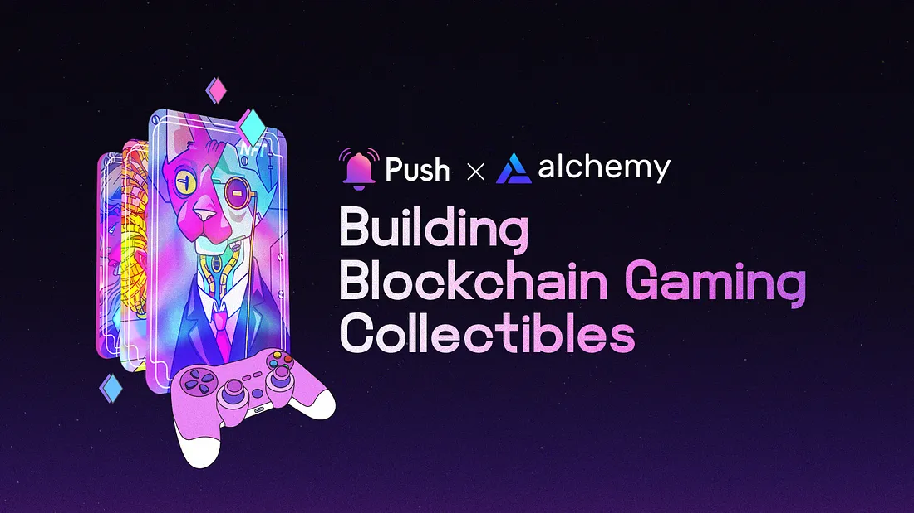

<!--truncate-->

<b>TL;DR:</b> This blog post delves into the world of blockchain-based gaming collectibles and how using Alchemy and Push Protocol can revolutionize the development process. Alchemy provides a powerful infrastructure of nodes and enhanced APIs for managing blockchain interactions, while Push Protocol enables real-time communication within the gaming ecosystem.

By the end of this tutorial, you’ll have learned:

- How Alchemy’s robust infrastructure and enhanced APIs simplifies blockchain interactions for gaming collectibles.
- The benefits of using Push Protocol for real-time communication in gaming ecosystems.
- Development tips and best practices for creating a successful gaming collectibles dApp.
- Examples of integrating Alchemy and Push Protocol in your dApp for efficient and interactive experiences.

<center><b>.   .   .</b></center><br/>

The rise of blockchain technology has opened up new avenues for innovation, extending its reach far beyond the realm of cryptocurrencies. One such area experiencing rapid growth is the world of gaming collectibles.

## The Evolution of Gaming Collectibles and the Impact of Blockchain

Gaming collectibles have long been an integral part of the online gaming experience, offering virtual items that players can collect, trade, and showcase within the gaming ecosystem. With the advent of blockchain technology, a new era of decentralized gaming collectibles has emerged, revolutionizing the way gamers interact with their digital assets. One of the most popular blockchain-based gaming collectibles is CryptoKitties, which took the world by storm with its unique blend of collectible art and gaming elements.

Blockchain-based gaming collectibles bring numerous benefits over their traditional counterparts, including increased transparency, heightened security, and verifiable ownership. These decentralized digital assets are enabled by the immutable nature of blockchain, allowing for the creation and tracking of scarce and valuable collectibles within a trustless environment. The integration of a communication layer like Push Protocol further enriches the user experience, fostering real-time interactions and seamless connectivity between gamers.

In this blog post, we will explore the synergy of Alchemy and Push Protocol, two robust tools that enable developers to create and manage blockchain-based gaming collectibles. We will discuss the advantages offered by these cutting-edge solutions, dive into the development process, and provide examples. Finally, we’ll share valuable tips and best practices for building successful blockchain-based gaming collectibles dApps.

In this blog post, we will explore the synergy of Alchemy and Push Protocol, two robust tools that enable developers to create and manage blockchain-based gaming collectibles. We will discuss the advantages offered by these cutting-edge solutions:

- Push Protocol, for sending real-time in-game transaction notifications and enabling seamless communication in gaming ecosystems.
- Alchemy, for efficiently managing your infrastructure and providing easy access to blockchain data.
- We will dive into the development process, provide examples, and share valuable tips and best practices for building successful blockchain-based gaming collectibles dApps.

## Step-by-Step Guide for Building a Blockchain-Based Gaming Collectibles with Alchemy and Push Protocol

- Designing Smart Contracts.
- Building the User Interface.
- Integrating with Alchemy and Push Protocol

## 1. Designing Smart Contracts

Smart contracts are the backbone of your dApp, defining the rules and logic for your gaming collectibles. To learn more about smart contracts and blockchain development, check out <a href="https://university.alchemy.com/"><b>Alchemy University</b></a>.

You’ll need to create smart contracts for:

- Creating and managing collectibles (e.g., ERC-721 for non-fungible tokens).
- Handling transactions, such as trading and transferring collectibles
- Implementing any game mechanics or rules associated with your collectibles.
- You can write your smart contracts using [Solidity](https://soliditylang.org/), and thoroughly test them with tools like [Truffle](https://trufflesuite.com/) and [Remix](https://remix-project.org/).

Here’s an example of a simple blockchain-based gaming collectibles system using a Solidity smart contract:

```js
pragma solidity ^0.8.0;

import "@openzeppelin/contracts/token/ERC721/ERC721.sol";
import "@openzeppelin/contracts/access/Ownable.sol";

contract GamingCollectibles is ERC721, Ownable {
   uint256 private _tokenIdCounter;

   struct Collectible {
       uint256 tokenId;
       string name;
       uint256 power;
   }

   mapping(uint256 => Collectible) public collectibles;

   event NewCollectibleCreated(uint256 tokenId, string name, uint256 power);

   constructor() ERC721("GamingCollectibles", "GCOL") {}

   function createCollectible(string memory _name, uint256 _power) public onlyOwner {
       uint256 newTokenId = _tokenIdCounter;
       _mint(msg.sender, newTokenId);
       _tokenIdCounter++;

       Collectible memory newCollectible = Collectible({
           tokenId: newTokenId,
           name: _name,
           power: _power
       });

       collectibles[newTokenId] = newCollectible;
       emit NewCollectibleCreated(newTokenId, _name, _power);
   }

   function transferCollectible(address _to, uint256 _tokenId) public {
       require(ownerOf(_tokenId) == msg.sender, "Not the owner of the collectible");
       safeTransferFrom(msg.sender, _to, _tokenId);
   }

   function getCollectibleDetails(uint256 _tokenId) public view returns (Collectible memory) {
       return collectibles[_tokenId];
   }
}
```

This smart contract defines a simple gaming collectibles system with the following features:

- ERC721 standard: The contract inherits from the OpenZeppelin’s ERC721 and Ownable contracts, which provide a standard implementation for non-fungible tokens (NFTs) and ownership management.
- Creating collectibles: The contract owner can create new gaming collectibles by invoking the createCollectible function, providing a name and power for the new collectible. A unique token ID is assigned to each collectible, and a NewCollectibleCreated event is emitted.
- Transferring collectibles: Users can transfer their collectibles to other users by calling the transferCollectible function. The function checks if the sender is the owner of the collectible before transferring it.
- Querying collectible details: The getCollectibleDetails function allows users to query the details of a specific collectible using its token ID.

This is a basic example to demonstrate the concept. In a real-world implementation, you might want to consider adding more sophisticated features, such as a marketplace for trading collectibles, game mechanics that involve the collectibles, or integrating with other platforms for a richer gaming experience.

⚠️ <b>Disclaimer:</b> This example smart contract is for educational purposes only and should not be used in production without a thorough audit and review by experienced developers.

## 2. Building the User Interface

Create an engaging user interface that allows players to interact with your dApp. This includes:

- Viewing their collectibles inventory
- Initiating trades and transfers
- Participating in any game mechanics or activities associated with your collectibles

Popular frontend frameworks, such as [React](https://react.dev/) or [Angular](https://angular.io/), can be used to build your user interface. Integrate [Web3.js](https://web3js.org/#/) or [Ethers.js](https://docs.ethers.org/v5/) libraries to interact with the Ethereum blockchain.

For more advanced gaming experiences, consider using game engines like <a href="https://unity.com/"><b>Unity 3D</b></a>, which supports WebGL export, or <a href="https://www.unrealengine.com/"><b>Unreal Engine</b></a> for AAA-quality graphics. These engines provide more sophisticated tools for building immersive gaming environments and can be integrated with blockchain technologies for managing gaming collectibles.

If you’d really like to test the limits, consider using WebAssembly-based (WASM) approach to build high-performance web3-based games.

## 3. Integrating with Alchemy and Push Protocol

## Alchemy

[Alchemy](https://dashboard.alchemy.com/signup/?a=push-protocol) provides the most powerful set of web3 development tools that help you build and scale your dApp with ease. Follow the [official documentation](https://docs.alchemy.com/) for more details.

Here is a sample workflow to integrate Alchemy:

- Create an Alchemy account and obtain your API key. Check out the [Alchemy Quick Start](https://docs.alchemy.com/docs/alchemy-quickstart-guide) guide to get started.
- Install the [Alchemy SDK](https://www.alchemy.com/sdk) if you’re using Javascript, or learn how to connect directly to the [Alchemy Enhanced APIs](https://docs.alchemy.com/reference/api-overview).
- Replace your Ethereum node URL with your Alchemy API endpoint to leverage Alchemy’s super node capabilities.
- Use Alchemy’s monitoring tools to track your dApp’s performance and usage.

The benefits of using Alchemy include:

- Faster and more reliable Ethereum node infrastructure.
- Access to advanced features, such as transaction debugging and gas price recommendations.
- Integration with popular development tools and libraries, making it easier to build and manage your dApp.

## Push Protocol

Push Protocol can be used to create a real-time messaging system for your dApp, allowing users to receive updates about their collectibles instantly. Follow the [official documentation](https://comms.push.org/docs/ 'Push developer docs') for more details. The official PUSH-SDK packages are also available [here](https://www.npmjs.com/~pushprotocol).

Here is a sample workflow to integrate Push Protocol:

<b>Step 1:</b> Install and configure the Push Protocol SDK in your dApp.

```js
npm install ethers @pushprotocol/restapi @pushprotocol/socket
```

<b>Step 2:</b> Initialize the SDK and create channels for various events related to your gaming collectibles (e.g., new collectibles, trades, and updates).

```js
const { PushClient } = require('@pushprotocol/sdk');

const pushClient = new PushClient('your_push_api_key');
await pushClient.connect();

const collectibleChannel = await pushClient.subscribe('collectibles');
```

<b>Step 3:</b> Implement listeners in your frontend to receive and display real-time updates.

```js
collectibleChannel.on('new_collectible', (data) => {
  console.log('New collectible created:', data);
});

collectibleChannel.on('trade', (data) => {
  console.log('Collectible traded:', data);
});
```

Push Protocol enables novel use cases and can be seamlessly integrated with platforms like MintWorld and Web3Games. This allows your dApp to become part of a larger gaming ecosystem and enhances the overall user experience.

## Additional Resources and Tutorials

Developers seeking more in-depth guidance can refer to the following resources:

- Alchemy documentation: [docs.alchemy.com](https://docs.alchemy.com/)
- Alchemy University: [university.alchemy.com](https://university.alchemy.com/)
- Push Protocol documentation: [push.org/docs](https://comms.push.org/docs/)
- Solidity documentation: [docs.soliditylang.org](https://docs.soliditylang.org/en/latest/)
- Foundry documentation: [book.getfoundry.sh](https://book.getfoundry.sh/)

## Tips to Remember For Building a Successful Blockchain-Based Gaming Collectibles Dapp

Developers may face challenges such as scalability, security, and user adoption when building a gaming collectibles dApp. To overcome these challenges:

- Optimize performance by employing efficient algorithms, caching, and minimizing on-chain operations.
- Utilize Alchemy’s advanced features like transaction debugging and gas price recommendations to optimize your dApp’s performance and user experience.
- Monitor your dApp’s performance and usage with Alchemy’s monitoring tools, and use the insights gained to improve and scale your dApp effectively.
- Seamlessly integrate Push Protocol for real-time messaging and notifications, enhancing the user experience by keeping players informed about new collectibles, trades, and updates.
- Use Push Protocol to create a community around your dApp by enabling communication features like in-app chat, group messaging, or forums for users to discuss and share their collectibles
- Implement robust security measures, such as thorough testing, audits, and best practices for handling private keys and user data.
- Leverage Layer 2 scaling solutions, such as Optimistic Rollups or zk-Rollups, to improve transaction throughput and reduce costs.
- Foster user adoption by creating an engaging user experience, incorporating incentives, and actively promoting your

## Conclusion

Building blockchain-based gaming collectibles dApps with Alchemy and Push Protocol can unlock a new world of possibilities for developers and users alike. By leveraging the benefits of these technologies and following best practices, you can create innovative and engaging dApps that revolutionize the gaming collectibles industry. We encourage you to experiment with the technology and share your experiences with the community. We’d like to thank the Alchemy team for their support and invite readers to reach out if they’d like to learn more about Alchemy and Push Protocol.

<center><b>.   .   .</b></center>

## About Alchemy

[Alchemy](https://alchemy.com/?r=affiliate%3A13611c66-66d2-4fc0-84c2-fc7e0aed7244) provides the leading blockchain development platform powering millions of users for 99% of countries worldwide. Our mission is to provide developers with the fundamental building blocks they need to create the future of technology and lower the barrier to entry for developers to build blockchain applications.

<b><i>Sign up for a <a href="https://alchemy.com/?r=affiliate%3A13611c66-66d2-4fc0-84c2-fc7e0aed7244">free account</a>. Check out our <a href="https://docs.alchemyapi.io/">documentation</a>. For the latest news, follow us on <a href="https://twitter.com/AlchemyPlatform">Twitter</a></i></b>
