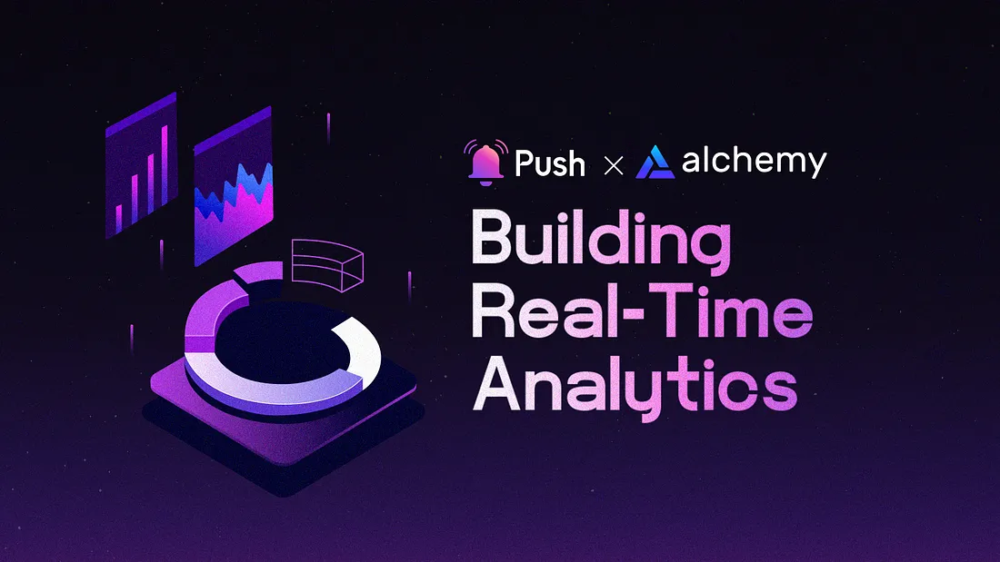

<!--truncate-->

<b>TL;DR:</b> This blog post delves into building a real-time analytics dashboard for blockchain transactions using Alchemy and Push Protocol. Real-time analytics are crucial for monitoring transaction performance, tracking transaction status, and gaining insights into the overall health of a blockchain network.

By the end of this tutorial, you’ll have learned:

- How to fetch blockchain data using Alchemy’s enhanced APIs.
- How to use Push Protocol for real-time communication and event-driven updates.
- Steps to build a real-time analytics dashboard for monitoring blockchain transactions.
- Tips for optimizing your dashboard to improve user experience and provide actionable insights.

<center><b>.   .   .</b></center><br/>

In today’s rapidly evolving digital landscape, real-time analytics have emerged as a key decision-making mechanism across a wide range of industries, including the dynamic world of blockchain. Harnessing the power of real-time analytics empowers developers to extract valuable insights, thereby enhancing performance, efficiency, and user experience.

## The Importance of Real-Time Analytics in Blockchain

Real-time analytics are instrumental in deciphering and managing the complex world of blockchain transactions. They enable users and developers to:

- Closely monitor transaction performance, swiftly identifying and addressing potential bottlenecks.
- Maintain a real-time overview of transaction status helps identify when changes need to be made, enabling timely interventions when required.
- Extract insights into the overall health and usage of the blockchain network, paving the way for optimization and growth

By leveraging real-time analytics, developers are empowered to make informed decisions, refine their dApps, and ultimately enhance the overall performance and user experience.

In this blog post, we will explore building a real-time analytics dashboard in-depth. One that is specifically designed for blockchain transactions, utilizing the formidable capabilities of Alchemy and Push Protocol. We will shed light on the numerous advantages that these sophisticated tools offer and provide a thorough, step-by-step guide of the development process. Lastly, we will share invaluable tips for constructing a successful analytics dashboard and elevating user experience.

## Step-by-Step Guide to Building a Real-Time Analytics Dashboard with Alchemy and Push Protocol

1. Set Up the Backend and Dependencies.
2. Integrate Alchemy and Initialize Push Protocol.
3. Design a Dashboard.
4. Listen to New Blocks and Fetch Transaction Data.
5. Update the Dashboard UI.
6. Receive Real-Time Transaction Updates

## 1. Setting Up the Backend and Dependencies

To build the backend for your real-time analytics dashboard, follow these steps:

- Set up a frontend web application using a framework like React, Vue, or Angular.
- Install and configure the necessary dependencies, including the Alchemy SDK

```js
npm install ethers @alchemy/alchemy-web3

npm install ethers @pushprotocol/restapi @pushprotocol/socket
```

## 2. Integrating the Alchemy SDK & Initializing Push Protocol

Integrate [Alchemy](https://dashboard.alchemy.com/signup/?a=push-protocol) as your Ethereum node provider for faster and more reliable access to the blockchain data. Follow the [official documentation](https://docs.alchemy.com/) for more details.

Here is a sample workflow to integrate Alchemy:

- Create an Alchemy account and obtain your API key.
- Replace your Ethereum node URL with your Alchemy API endpoint

```js
import { ethers } from 'ethers';

const alchemyApiKey = 'your_alchemy_api_key';
const provider = new ethers.providers.AlchemyProvider('mainnet', alchemyApiKey);
```

Now, we can initialize Push Protocol. Follow the [official documentation](https://comms.push.org/docs/) for more details. The official PUSH-SDK packages are also available [here](https://www.npmjs.com/~pushprotocol).

Here is a sample workflow to integrate Push Protocol:

```js
import { PushRestApiClient } from '@pushprotocol/restapi';
import { PushSocketClient } from '@pushprotocol/socket';

const pushRestApiClient = new PushRestApiClient({
  applicationId: 'your_application_id',
  applicationToken: 'your_application_token',
});

const pushSocketClient = new PushSocketClient({
  applicationId: 'your_application_id',
  applicationToken: 'your_application_token',
});
```

## 3. Designing a Dashboard

Design a user-friendly dashboard that provides relevant real-time analytics for blockchain transactions. Consider including:

- A summary of key metrics, such as transaction count, average gas price, and transaction volume.
- A list of recent transactions with relevant details like transaction hash, sender, recipient, and value.
- Interactive charts displaying trends in transaction volume, gas prices, and other metrics over time.
- Filters and search functionality to help users easily navigate the data

Popular frontend frameworks, such as [React](https://react.dev/) or [Angular](https://angular.io/), can be used to build your user interface. Integrate [Web3.js](https://web3js.org/#/) or [Ethers.js](https://docs.ethers.org/v5/) libraries to interact with the Ethereum blockchain.

To quickly spin up a Next.js-based Web3-ready dApp with an integrated components library, check out <a href="https://createweb3dapp.alchemy.com/"><b>Alchemy’s Create Web3 DApp</b></a> tool. This resource is fully open-source and designed to help users get started with building their dApps.

## 4. Listening to New Blocks and Fetching Transaction Data

Create a function that listens to new blocks and fetches transaction data:

```js
const { Alchemy, Network } = require('alchemy-sdk');

const alchemyConfig = {
  apiKey: 'your_alchemy_api_key',
  network: Network.ETH_MAINNET,
};

const alchemy = new Alchemy(alchemyConfig);

async function listenToNewBlocks() {
  alchemy.core.on('block', async (getBlockNumber) => {
    const block = await alchemy.core.getBlockWithTransactions(getBlockNumber);
    const transactions = block.transactions;
    // Process the transactions and update the dashboard
    updateDashboard(transactions);
    // Emit a real-time event through Push Protocol for connected clients
    await pushRestApiClient.emit('transactions', { transactions });
  });
}

listenToNewBlocks(); // Invoke the function when the application starts
```

In this implementation, we import and set up the Alchemy SDK. Then, we modify the <b>listenToNewBlocks()</b> function to use the <b>alchemy.core.onBlock()</b> method to listen for new blocks and <b>alchemy.core.getBlockWithTransactions()</b> method to fetch transaction data.

For more advanced users, you can consider using custom webhooks. Custom webhooks offer several benefits in this scenario, including:

- <b>Flexibility:</b> Gain more control over the logic and triggers for real-time updates, allowing you to create event-driven workflows tailored to your dashboard’s needs.
- <b>Scalability:</b> Utilize serverless architectures like AWS Lambda to handle increasing load and ensure application responsiveness during peak usage.
- <b>Reliability:</b> Improve fault tolerance by implementing redundancies and fallback mechanisms, reducing reliance on third-party services for real-time updates.
- <b>Reduced Latency:</b> Optimize data flow from the blockchain to your application, minimizing latency for a more responsive user experience.

## 5.Updating the Dashboard UI

Create a function to update the dashboard UI with new transaction data:

```js
function updateDashboard(transactions) {
  // Update the dashboard UI with new transaction data
  // This will depend on the frontend framework you're using
}
```

## 6. Receiving Real-Time Transaction Updates

For clients to receive real-time transaction updates, set up a listener for the Push Protocol events:

```js
const transactionsChannel = pushSocketClient.channel('transactions');

transactionsChannel.on('transactions', (data) => {
  const transactions = data.transactions;
  updateDashboard(transactions);
});
```

With this setup, your application will listen to new blocks on the Ethereum blockchain using the Alchemy provider. When a new block is detected, it fetches the transaction data and updates the analytics dashboard. Additionally, it emits a real-time event through the Push Protocol REST API so that connected clients receive updates instantly. Clients listen for these events using the Push Protocol Socket client and update their dashboards accordingly.

Keep in mind that this is a high-level example and is meant to serve as a sample. Depending on your specific requirements, you will need to customize and expand this code to fetch and display additional data or integrate with other services.

## Tips to Remember When Building a Successful Real-Time Analytics Solution

To create a successful real-time analytics dashboard for blockchain transactions using Alchemy and Push Protocol, we suggest keeping these things in mind:

- Focus on providing relevant, actionable insights that users can use to make informed decisions. To do this, harness Alchemy’s robust infrastructure and enhanced APIs to fetch your blockchain data, as well as Push Protocol’s real-time communication capabilities.
- Implement data caching and other performance optimization techniques to minimize latency, taking advantage of Alchemy’s efficient APIs and Push Protocol’s instantaneous updates.
- Regularly update and refine your dashboard based on user feedback and changing market trends, using the insights provided by Alchemy’s monitoring tools and Push Protocol’s user engagement features.
- Integrate your dashboard with other blockchain tools and platforms to provide additional value and context, leveraging the compatibility and versatility of both Alchemy and Push Protocol in the blockchain ecosystem.

## Conclusion

Building a real-time analytics dashboard for blockchain transactions with Alchemy and Push Protocol can provide valuable insights and improve user experience.

By following the steps outlined in this blog post and leveraging the powerful features of these tools, you can create an engaging and informative dashboard that benefits both developers and users alike.

We encourage you to experiment with the technology and share your experiences with the community. Don’t hesitate to reach out if you’d like to learn more about Alchemy and Push Protocol.

<center><b>.   .   .</b></center>

## About Alchemy

[Alchemy](https://alchemy.com/?r=affiliate%3A13611c66-66d2-4fc0-84c2-fc7e0aed7244) provides the leading blockchain development platform powering millions of users for 99% of countries worldwide. Our mission is to provide developers with the fundamental building blocks they need to create the future of technology and lower the barrier to entry for developers to build blockchain applications.

<b><i>Sign up for a <a href="https://alchemy.com/?r=affiliate%3A13611c66-66d2-4fc0-84c2-fc7e0aed7244">free account</a>. Check out our <a href="https://docs.alchemyapi.io/">documentation</a>. For the latest news, follow us on <a href="https://twitter.com/AlchemyPlatform">Twitter</a></i></b>
