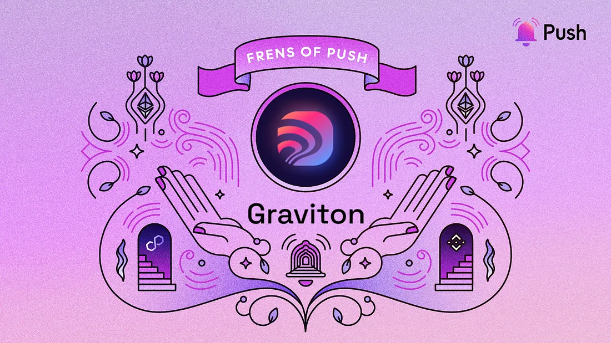

---

slug: enhancing-web3-livestreaming-push-x-graviton
title: Enhancing Web3 Livestreaming | Push x Graviton🧲
authors: [push]
tags: [ Frensofpush, Partnerships, Web3, Blockchain Technology]

---

<!--truncate-->

This week we’re extremely excited to announce our latest Frens of Push, [Graviton](https://graviton.xyz/about)🧲🎉

Graviton provides pathways and tools for creators to grow without limitations imposed by centralized platforms.

With a commitment to empowering artists and creators, Graviton provides web3 tools and infrastructure for creators to leverage to better reach their audience, promote their work, and monetize their creative projects.

By incorporating Push Chat into their Xeenon platform, Graviton is enhancing the way livestream content creators interact with their audiences. This enhancement to Graviton’s user experience is enabling creators to communicate directly with their audience, share updates, and receive valuable feedback. In turn this is helping artists create and build their own communities. Additionally, Graviton is planning to expand capabilities with Push Chat and plans to introduce Group and Video Chat functionalities in the near future.

In this episode of “Frens of Push,” we are thrilled to have [Troy Murray](https://twitter.com/TroyMurs), CEO and co-founder at Graviton, join us for an insightful conversation about his journey in web3 and the groundbreaking solutions they are building for creators. We discuss decentralized communication, facilitated by Chat and Direct Messaging, and the doors it opens in the creator economy.

<b>.   .   .</b>

## 1. Hi Troy, what’s your story? How did you become involved in building in the blockchain space?

I started working in Crypto around 2013 and became active in the Bitcoin community. From there I was interested in Smart Contracts around Ethereum and started to work closely with ConsenSys. I joined one of their spokes, SingularDTV and helped design a DAO for their software. I left that company and co-founded BarnBridge, a DeFi protocol, from there I went and co-founded Graviton a c-corp based in Puerto Rico that builds WEB3 tools, services, and platforms for the Metaverse.

## 2. Tell us about Graviton — what’s it about, and what problem is Graviton solving?

Graviton was founded out of what we felt was the need to create easy to use front ends for every day users to access the metaverse using polished web3 tools, services and platforms. We also wanted to prove our thesis that Protocols and the DAOs that control them are just a part of the tech stack and that you need a company to actually take multiple different protocols and wrap them up in a single platform. This is where Xeenon came from. We use Livepeer protocol for transcoding of videos, LENS protocol for social and PUSH protocol for direct messaging.

## 3. How do developers use Xeenon?

Xenon is for creators and it is a streaming service that looks very much like what most people are used in a streaming service but under the hood the entire tech stack is built on decentralized technology from the transcoding all the way to the o-auth.

## 4. What’s the 2023 plan for Xeenon and its ecosystem?

We plan on growing the creator and fan experience on the platform and funding new ways for creators to monetize their work and also allow the fans to share in their economic flywheel.

## 5. How is Graviton building with Push Chat?

We integrated Push Chat into our Xeenon platform for Direct Messaging and look forward to including Group and Video Chat soon.

## 6. How have you seen Push Chat integration enhance your UX?

The ability of content creators to directly communicate with their fans on the platform is a huge win for us. We plan on adding more features to make the experience more intimate and with the coming updates to the protocol send tips and other things inside the platform through chat.

## 7. What cool use cases do you see Push and Push Chat being used for in the future?

I’m really excited to get group and video chats going on the platform. Long term the way we can use this for community communication is gonna get really interesting.

Thank you :)

<b>.   .   .</b>
 

<i>“Frens of Push” is our weekly content series to spotlight outstanding projects that are building with Push. If you want to be featured, reach out to us and you could be our next Fren in the series.</i>

<b>.   .   .</b>

## About Graviton

Graviton is on a mission to build a decentralized and empowering creator economy. With transparency and sustainability as their core principles, Graviton provides pathways and tools for creators to grow without limitations imposed by centralized platforms. Founded by a team of blockchain veterans and artists, Graviton is committed to creating a world where content creators and patrons have the freedom to reach their full potential.

Find more about Graviton: [Twitter](https://twitter.com/Graviton_XYZ), [Discord](https://discord.com/invite/nfu), [Github](https://github.com/GravitonINC), [Medium](https://medium.com/graviton-xyz)

### About Push Protocol

Push is the communication protocol of web3. Push protocol enables cross-chain notifications and messaging for dapps, wallets, and services tied to wallet addresses in an open, gasless, and platform-agnostic fashion. The open communication layer allows any crypto wallet /frontend to tap into the network and get the communication across.

To keep up-to-date with Push Protocol: [Website](https://push.org/), [Twitter](https://twitter.com/pushprotocol), [Telegram](https://t.me/epnsproject), [Discord](https://discord.gg/pushprotocol), [YouTube](https://www.youtube.com/c/EthereumPushNotificationService), and [Linktree](https://linktr.ee/pushprotocol).