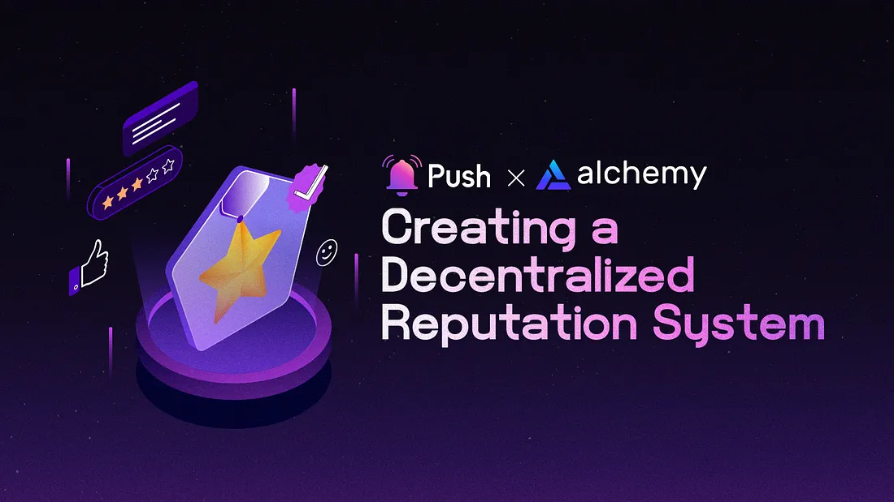

<!--truncate-->

<b>TL;DR:</b> This article outlines the process of creating a decentralized reputation system using Alchemy and Push Protocol. We explore the advantages of these tools, provide a development guide, and discuss utilizing Push Protocol for decentralized messaging.

By the end of this tutorial, you’ll have learned:

- The key components of a decentralized reputation system.
- How to leverage Alchemy for managing blockchain interactions.
- How to utilize Push Protocol for real-time communication and decentralized messaging.
- Tips and best practices for creating a robust and fair reputation system in a decentralized ecosystem.

<center><b>.   .   .</b></center><br/>

The evolution of decentralized applications (dApps) and blockchain technology has underscored the significance of decentralized reputation systems.

In this blog post, we’ll discuss creating a decentralized reputation system using Alchemy and Push Protocol. We will explore the benefits these tools offer and provide a step-by-step guide on the development process. Additionally, we’ll examine how to utilize Push Protocol for decentralized messaging to improve communication and collaboration within your dApp ecosystem.

Finally, we’ll share valuable tips and best practices for designing a successful reputation system that benefits all participants, fostering a vibrant and resilient environment for users, developers, and stakeholders. By grasping the nuances of decentralized reputation systems and leveraging Alchemy and Push Protocol, you’ll be poised to develop an innovative, trustworthy, and impactful solution for the decentralized world.

## Overview of Reputation Systems

Reputation systems are mechanisms designed to assess and quantify the trustworthiness, reliability, or quality of entities, such as users or services within a given network. These mechanisms rely on factors such as past performance, user ratings, reviews, and other relevant data points to establish an individual’s or an organization’s reputation score. This score then serves as a reference for other participants when making decisions, such as choosing a service provider or engaging in a transaction.

Here are some examples of reputation systems commonly used today:

- Amazon Seller Rating: Amazon assigns a rating to each seller based on factors such as shipping time, order accuracy, and customer service. Buyers can use this rating to evaluate a seller’s reputation before making a purchase.
- Airbnb Host Rating: Airbnb uses a rating system to assess the reliability and quality of hosts based on factors such as communication, cleanliness, and accuracy of listing descriptions. This rating can help potential guests decide whether to book a listing or not.
- Uber Driver Rating: Uber’s rating system allows passengers to rate their driver after a trip based on factors such as driving skills, punctuality, and professionalism. These ratings can help future riders decide which driver to select for their next trip.

In each of these examples, the reputation system assigns a score or rating to a participant based on their behavior and interactions within the platform. This score can then be used by other participants to evaluate the trustworthiness, reliability, or quality of the individual or organization.

Unlike traditional centralized reputation system which can be subject to biased or unreliable information due to their inherent limitations, decentralized reputation systems provide a more transparent and equitable approach. These systems play a critical role in empowering users and developers in the decentralized ecosystem by establishing trust and credibility based on the actions, history, and behavior of participants.

## Decentralized Reputation Systems

Just as centralized reputation systems do in web2, decentralized reputation systems allows users to establish trust and credibility within a blockchain-based web3 ecosystem. Decentralized reputation systems can be used in various contexts, such as peer-to-peer marketplaces, decentralized lending platforms, and social networks. The key benefits of decentralized reputation systems include the following:

- Enhanced trust and transparency through the use of blockchain technology.
- Reduced reliance on centralized authorities for reputation management.
- The ability to leverage decentralized messaging for real-time reputation updates and notifications

## Step-by-Step Guide For Building a Decentralized Reputation System with Alchemy and Push Protocol

1. Designing Smart Contracts
2. Building a User Interface
3. Integrating with Alchemy and Push Protocol

## 1. Designing Smart Contracts

To create the foundation for your decentralized reputation system, you’ll need to develop smart contracts that handle:

- User registration and identity management.
- Reputation scoring, based on criteria such as transaction history and user feedback.
- The storage and retrieval of reputation data on the blockchain.

You can write your smart contracts using [Solidity](https://soliditylang.org/), and thoroughly test them with tools like [Truffle](https://trufflesuite.com/) and [Remix](https://remix-project.org/).

Here’s an example of a simple decentralized reputation system using a Solidity smart contract:

```js
pragma solidity ^0.8.0;

contract DecentralizedReputationSystem {
    struct UserProfile {
        address userAddress;
        uint256 reputation;
        string name;
    }

    mapping(address => UserProfile) public userProfiles;
    mapping(address => mapping(address => bool)) public feedbackGiven;

    event NewUserRegistered(address userAddress, string name);
    event FeedbackReceived(address from, address to, uint256 reputationDelta);

    function registerUser(string memory _name) public {
        require(userProfiles[msg.sender].userAddress == address(0), "User already registered");

        UserProfile memory newUserProfile = UserProfile({
            userAddress: msg.sender,
            reputation: 0,
            name: _name
        });

        userProfiles[msg.sender] = newUserProfile;
        emit NewUserRegistered(msg.sender, _name);
    }

    function giveFeedback(address _to, uint256 _reputationDelta) public {
        require(userProfiles[msg.sender].userAddress != address(0), "User not registered");

        require(userProfiles[_to].userAddress != address(0), "Feedback recipient not registered");

        require(!feedbackGiven[msg.sender][_to], "Feedback already given");

        userProfiles[_to].reputation += _reputationDelta;
        feedbackGiven[msg.sender][_to] = true;
        emit FeedbackReceived(msg.sender, _to, _reputationDelta);
    }

    function getUserReputation(address _user) public view returns (uint256) {
        require(userProfiles[_user].userAddress != address(0), "User not registered");
        return userProfiles[_user].reputation;
    }
}
```

This smart contract defines a simple reputation system with the following features:

- User registration: Users can register themselves with a name using the registerUser function. Each user is identified by their Ethereum address.
- User feedback: Registered users can provide feedback to other registered users by invoking the giveFeedback function. This function increases the reputation of the recipient user by the specified amount. Users can only give feedback to another user once.
- User reputation: The getUserReputation function can be called to retrieve the reputation of a registered user.

When applying this to real-world scenarios, it’s essential to consider integrating advanced features like confining feedback to interactions within the system, introducing reputation decay, or establishing dispute resolution mechanisms. Additionally, opting for a more refined token-based system can streamline the tracking and management of reputation scores.

### Integrating Gitcoin Passport for Identity Management

In addition to designing smart contracts for user registration and identity management, integrating Gitcoin Passport can significantly enhance your decentralized reputation system.

Gitcoin Passport is a decentralized identity solution that allows users to create and manage their online identities across multiple dApps. By using Gitcoin Passport, you can take advantage of its built-in features, such as user verification, data portability, and seamless integration with other dApps.

To integrate Gitcoin Passport, follow the [official documentation](https://www.gitcoin.co/passport) and explore resources available in the Gitcoin ecosystem.

## 2. Building a User Interface

Develop a user-friendly interface that allows users to:

- Register and manage their profiles.
- View the reputation scores of other users.
- Provide feedback and rate other users based on their interactions.

Popular frontend frameworks, such as [React](https://react.dev/) or [Angular](https://angular.io/), can be used to build your user interface. Integrate [Web3.js](https://web3js.org/#/) or [Ethers.js](https://docs.ethers.org/v5/) libraries to interact with the Ethereum blockchain.

As you develop the user interface for your decentralized reputation system, integrate Gitcoin Passport to handle user registration and authentication. This will allow users to create and manage their online identities across multiple dApps while utilizing your reputation system.

Ensure your user interface is compatible with Gitcoin Passport by following the <a href="https://gitcoin.co/passport"><b>official documentation</b></a> and integrating the required libraries and components.

## 3. Integrating with Alchemy and Push Protocol

## Alchemy

[Alchemy](https://www.alchemy.com/) provides powerful web3 development tools that help you build and scale your dApp with ease. In the context of a decentralized reputation system, Alchemy can be used to access the Ethereum blockchain data for user profiles, reputation scores, and feedback. Follow the [official documentation](https://docs.alchemy.com/) for more details.

Here is a sample workflow to integrate Alchemy:

<b>Step 1:</b> Create an Alchemy account and obtain your API key.

<b>Step 2:</b> Replace your Ethereum node URL with your Alchemy API endpoint.

```js
import { ethers } from 'ethers';

const alchemyApiKey = 'your_alchemy_api_key';
const provider = new ethers.providers.AlchemyProvider('goerli', alchemyApiKey);
```

<b>Step 3:</b> Use Alchemy’s monitoring tools to track your dApp’s performance and usage.

## Push Protocol

[Push Protocol](https://push.org/) can be used to create a real-time messaging system for your decentralized reputation system, allowing users to receive updates about their reputation scores and feedback instantly. Follow the [official documentation](https://comms.push.org/docs/ 'Push developer docs') for more details. The official PUSH-SDK packages are also available [here](https://www.npmjs.com/~pushprotocol).

Here is a sample workflow to integrate Push Protocol:

Install and configure the necessary dependencies:

```js
npm install ethers @pushprotocol/restapi @pushprotocol/socket
```

Initialize the Push Protocol client in your frontend.

```js
import { Client } from '@pushprotocol/socket';

const pushClient = new Client({
  applicationId: 'your_application_id',
  applicationToken: 'your_application_token',
});
```

Create channels for various reputation-related events, such as new feedback, score updates, and user interactions.

```js
const feedbackChannel = pushClient.channel('feedback');

const scoreUpdatesChannel = pushClient.channel('scoreUpdates');

const userInteractionsChannel = pushClient.channel('userInteractions');
```

Implement listeners in your frontend to receive and display real-time updates.

```js
feedbackChannel.on('newFeedback', (data) => {
  // Handle new feedback data and update the user interface
});

scoreUpdatesChannel.on('scoreUpdate', (data) => {
  // Handle score updates and refresh the user interface
});

userInteractionsChannel.on('userInteraction', (data) => {
  // Handle user interactions and update the user interface accordingly
});
```

By integrating Push Protocol, you can enhance user experience and provide real-time, decentralized messaging for reputation updates and notifications.

## Additional Resources and Tutorials

Developers seeking more in-depth guidance can refer to the following resources:

- Alchemy documentation: https://docs.alchemy.com/Push
- Protocol documentation: https://docs.pushprotocol.io/Solidity
- documentation: https://soliditylang.org/

## Tips to Remember for Building a Successful Decentralized Reputation System

To create a successful decentralized reputation system using Push Protocol and Alchemy:

- Focus on user experience and ensure that the reputation scores and feedback mechanisms are intuitive and easy to use. Leverage Push’s communication tools like instant chat and video chat to provide seamless support and foster user engagement.
- Utilize Alchemy’s infrastructure to enhance the reliability, speed, and performance of your reputation system, ensuring a smooth experience for all users.
- Implement robust security measures, such as thorough testing, audits, and best practices for handling private keys and user data. Alchemy’s suite of developer tools can help streamline this process, while Push Protocol’s end-to-end encryption ensures secure communication channels.
- Foster user adoption by creating an engaging user experience, incorporating incentives, and actively promoting your decentralized reputation system within relevant communities and platforms. Use Push notifications to keep users informed about new features, updates, and events related to the reputation system.
- Integrate the reputation system with other dApps and platforms to maximize interoperability and extend its reach. Alchemy’s APIs can facilitate seamless integration, while Push Protocol can enable cross-platform communication and collaboration.

## Conclusion

By leveraging these technologies, developers can build innovative decentralized applications that foster trust and transparency. We encourage experimentation and collaboration within the community to further advance the decentralized ecosystem.

We thank the Alchemy team for their support and collaboration. If you’d like to learn more about Alchemy, Push Protocol, or decentralized reputation systems, feel free to reach out to their respective communities and explore their documentation and resources.

<center><b>.   .   .</b></center>

## About Alchemy

[Alchemy](https://alchemy.com/?r=affiliate%3A13611c66-66d2-4fc0-84c2-fc7e0aed7244) provides the leading blockchain development platform powering millions of users for 99% of countries worldwide. Our mission is to provide developers with the fundamental building blocks they need to create the future of technology and lower the barrier to entry for developers to build blockchain applications.

<b><i>Sign up for a <a href="https://alchemy.com/?r=affiliate%3A13611c66-66d2-4fc0-84c2-fc7e0aed7244">free account</a>. Check out our <a href="https://docs.alchemyapi.io/">documentation</a>. For the latest news, follow us on <a href="https://twitter.com/AlchemyPlatform">Twitter</a></i></b>.
