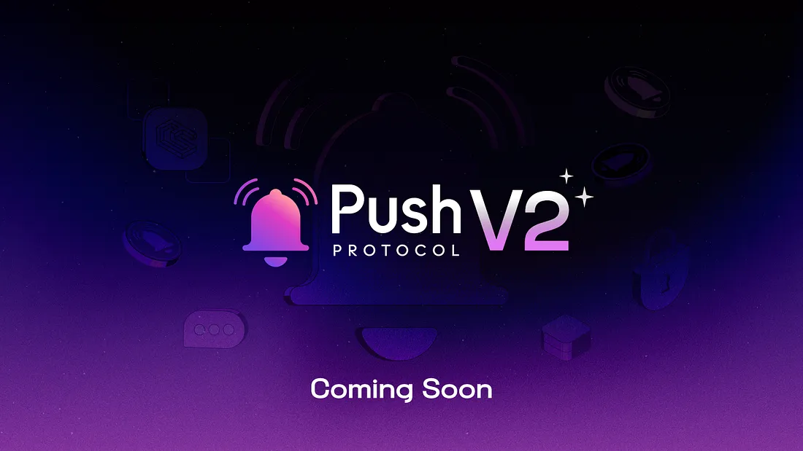

<!--truncate-->

Push Protocol is thrilled to announce the successful completion of the security audit conducted by Chainsafe for our smart contracts version 2. This milestone signifies a significant step forward in ensuring the robustness and reliability of our platform.

## Key Takeaways

1. The two main features introduced in version 2 of our smart contracts are:

   - <b>Push Fee Pool Staking</b>
   - <b>Incentivized Chat Requests</b>

2. With the launch of v2, the protocol aims to not only enhance the utility of the PUSH token but also enable an incentivization mechanism from the protocol level for all its users.

3. $PUSH token holders shall now be able to earn incentives directly from the protocol. $PUSH tokens time based rewards multiplier also comes live. ie: the longer you have held the tokens, the higher your rewards will be.

4. The design of v2 contracts ensures that the incentives for users are directly tied to the protocol. As the protocol expands its boundaries, the incentives for users that can be claimed from the contracts increase. <b><i>This implies that the more the protocol grows, the better the incentives become for users</i></b>.

5. <b>Incentivized Push Chat</b> is a new feature introduced with version 2, that allows users to set a one-time fee for receiving chat requests. With the introduction of this feature, users will not only <b><i>gain enhanced control over incoming chat requests but also embark on a novel avenue for passive earnings</i></b>.

## What’s next?

- Push Protocol v2 tentative launch date is late June, 2023 along with [yield farming v2 for fee pool and Uniswap v2 LP pool](https://snapshot.org/?utm_source=Twitter&utm_medium=Post&utm_campaign=RockstarsOfPushWeek17%2618Post#/pushdao.eth/proposal/0x54092053eff30c3c304e45b575881945192e710bc9b3914bfe1d1eadcda3f114).
- This marks the beginning of [protocol fees](https://comms.push.org/docs/tokenomics/deepdive/$push/#push-fee-pool) incentivizing and rewarding token holders and crypto wallets.
- Push v2 has cleared Chainsafe audit. However, owing to the core and critical features of v2, the team has decided to launch it after 4 weeks.
- This gives team enough time to run white hat contests among major platform(s) to ensure v2 is battle tested.
- Prior to the tentative launch in late June, 2023, there will be an open, incentivized bug bounty program available to the community. More information coming soon.

Time to dive deeper and understand the core features of Push v2 smart contracts and what it enables for web3 communication.

<b>.  .  .</b>

## Push Fee Pool Staking

The most significant feature of core v2 is the Push Fee Pool Staking.

In simple terms, this means PUSH holders can now stake and earn PUSH rewards directly from the core contract itself. As the protocol grows, so do the rewards.

### What’s the Fee Pool?

Before delving into how the Core v2 staking works, let’s take a step back to quickly recap the concept of the Protocol Fee Pool.

Protocol Feel Pool was introduced in the Version 1.5 of Push smart contracts. Fee Pool is a term used to signify small fees charged by the protocol actions like channel creation, channel reactivation, channel detail modification. They don’t affect users and for users, everything is always feeless, with the exception of few features for super users as [outlined here](https://comms.push.org/docs/tokenomics/deepdive/$push/#push-fee-pool).

In other words, for every crucial transaction on the Core contract, it takes a small fee amount and stores it in what we call a <b>Push Fee Pool</b>.

The protocol fee is currently set to be equal to <b>10 PUSH tokens</b>. This value, however, can be changed by the community later using on-chain governance.

<blockquote><i><b>Note:</b> This is not an additional fee that is charged on top of channel creation fees. Instead, the protocol fee is simply deducted from the same amount that a channel creator chooses to stake in the protocol.
For example, if you chose to stake 50 PUSH during channel creation, 10 of those 50 PUSH tokens go into Protocol Fee Pool, while the remaining goes into Channel Pool Funds that are claimable by channel owners anytime they choose to deactivate their channel.*
Read more about Fee Pool and how it operates over here: https://comms.push.org/docs/tokenomics/deepdive/$push/#push-fee-pool.</i></blockquote>

## The Fee Pool Staking

With the introduction of [version 1.5 of the core contract](https://medium.com/push-protocol/introducing-push-protocol-v1-5-80eb39b55424), we laid the foundation for the fee pool and the vision of incentivizing PUSH holders. However, the current version represents a substantial leap towards realizing this vision.

The fundamental concept behind the introduction of the fee pool in v1.5 of our contracts was to establish an incentivization mechanism at the protocol level. This mechanism enables both PUSH token holders and protocol users to directly earn incentives from the protocol itself.

It is worth noting that as the protocol expands its boundaries, the incentives available for users to claim from the contracts also improve. This eventually means that the more the protocol grows, the better the incentives for users. The direct correlation between protocol growth and user incentives creates a mutually beneficial relationship within the ecosystem.

The Version 2 of the Core contracts includes <b>Stake and Claim functionalities that allow $PUSH token holders to stake their tokens in the core contract and earn rewards from the fee pool directly</b>.

### Details about Core V2 Staking

- The staking mechanism in core v2 is technically epoch-based staking. The entire distribution of rewards is split into epochs during which the users can stake and rewards can be accumulated.
- Each epoch is <b>~21 days long or 3 weeks long</b>.
- $PUSH token holders can stake their tokens at any given time in the core v2 contract.
- $PUSH had time weightage built in the token which also goes live with this update. This means that people who have held push longer are rewarded more the longer they stake.
- The total rewards available and claimable in an epoch mainly rely on the protocol’s fee pool, i.e., the amount earned by the protocol itself. The more push tokens accumulated by the protocol during an epoch, the more rewards for the stakers of that specific epoch.
- The total rewards are also [bootstrapped with yield farming for the next 84 weeks](https://medium.com/push-protocol/push-dao-extends-liquidity-rewards-program-26008926b05a) after the protocol goes live.
- The staking algorithm doesn’t impose any lock-in period. This means holders are free to stake or un-stake whenever they wish.
- While no lock-in period is imposed, there is a delay period of at least one epoch before a user can withdraw or harvest. This means that any stake during a current epoch will require the user to at least wait T+1 epoch before they can claim rewards or withdraw their harvest. This is done to ensure bad actors can’t misuse epoch duration for unfair rewards.
- When it comes to harvesting rewards from the contract, users shall be capable of harvesting rewards for all the epochs in which they were staked. <b><i>This basically means the longer a user stakes, the more rewards they should be able to harvest</i></b>.
- An important pointer that must be noted here is users cannot claim their rewards for the current epoch. For instance, if a user stakes at epoch 1 and tries to claim at epoch 6 <b>(which is the current epoch)</b>, they should be able to claim for epochs 1 to 5. This is because epoch 6 is currently active, and the contract doesn’t allow claiming rewards from a current epoch.

## Incentivized Push Chat

While Push Chat has been bridging the communication gap of the entire web3 world, with the launch of our v2 contracts, we are introducing a new concept called <b>Incentivized Push Chat</b>.

A brief glance at the current working mechanism of Push Chat shows us that any valid wallet address <b>(message sender)</b> can send a chat request to any other wallet address <b>(message receiver)</b>.

Any new chat request sent by the sender simply lands under the <b>requests</b> tab of the receiver. And, the receiver can open, accept and respond to any chat request whenever he/she wants.

However, in our continuous efforts to empower Push Chat users, we are enhancing the control they have over incoming chat requests. We believe that users should have the autonomy to determine and implement their own rules for handling these requests effectively.

To facilitate this, we will be introducing different types of settings within Push Chat:

- <b>Open:</b> This setting allows unrestricted chat requests from anyone, giving users the flexibility to engage with a wide range of individuals.
- <b>Blacklisted:</b> By selecting this setting, users have the ability to block incoming chat requests from everyone, ensuring a more private and exclusive chat experience.
- <b>Incentivized Chat Requests:</b> With this setting, users can opt to enable a one-time fee for sending chat requests. This provides an opportunity for users to monetize their chat interactions and add value to each conversation.

<blockquote><i><b>Note:</b> While the incentivized chat feature is being designed and developed to support multi-chain, for this specific version of the protocol, Incentivized Chat shall only support the Ethereum chain. Multi-chain support will be released with the upcoming versions of the protocol.</i></blockquote>

### Deep diving into Incentivized Push Chat.

Incentivized Push Chat introduces an innovative chat setting that empowers users to customize their experience by implementing a one-time fee <b>(in PUSH Tokens)</b> for individuals who wish to send them Push chat requests. By enabling this setting, users can ensure that anyone interested in initiating a push chat request must first deposit the specified fee before sending their message.

This feature grants users greater control over their chat interactions and enables them to monetize their engagement on the platform. In simpler terms, this innovative functionality empowers users to not just manage their chat interactions but also unlock new opportunities for generating income effortlessly. We feel this has great usage in driving creator economy and unleashing a new way for web3 communications to occur.

<blockquote><i><b>Note:</b> Incentivized Chat Request only gives the sender the right to communicate to the receiver under chat request. The receiver still needs to accept the request to enable notifications and chat features. Ie. The receiver can still reject your messages while keeping the fee.</i></blockquote>

### Brief glance at its Working Mechanism

Consider two different users: <b>Message Sender & Message Receiver</b>

### Enabling Incentivized Chat Request

- It all begins with the <b>message receiver</b> selecting the Incentivized Push Chat setting for himself/herself.
- As they opt for these settings, they must select the minimum amount of Push Tokens that any chat request sender must pay to be able to send chat requests to the receiver.

<blockquote><i><b>Note:</b> In alignment with our smart contract’s design, it should be noted that a very nominal portion of this fee, specifically 10 PUSH tokens, is allocated to the Protocol Pool Fee.</i></blockquote>

- Once this setting is enabled, the protocol guarantees that the recipient will only receive a chat request if the sender complies with the requirement of paying the specified amount of PUSH tokens.

### Depositing Required Fee for Sending Chat Requests

- Now it’s time to look from a message sender’s perspective.
- As a sender, you will be shown the minimum amount of PUSH tokens that must be deposited to interact with users with incentivized chat requests enabled.
- Therefore, the first step as a sender is to initiate the required fee payment and send the chat request right after. This boils down to one single function call from the Push Communicator contract, i.e., createIncentivizeChatRequest which handles all of it for the request sender.
- Upon successful completion of this transaction, chat requests will be sent to the recipient, facilitating the establishment of a communication bridge between the two users upon acceptance of the request.

### Multi-Chain Fee Deposits and Bridging

- With Push Protocol’s expansion into multiple chains such as Polygon, BSC, and more, we have meticulously designed this feature to minimize any friction for users across these chains, ensuring a seamless experience beyond just Ethereum.
- Therefore, as mentioned earlier, the creation of incentivized chat requests is incorporated within our communicator contract, which, unlike our core contract, is deployed across multiple EVM chains.
- This essentially means users of any chain that is supported by Push Protocol can create incentivized chat requests from their respective chain itself, without the need to do the same from the Ethereum network.

### Bridging:

- It must be noted that users can create incentivized chat requests from any chain and deposit the push tokens on that chain’s communicator itself.
- However, as per our contract’s design, any incoming fund must be handled and stored in the core contract that lies on Ethereum.
- Therefore, any Push tokens deposited on communicator contracts of other EVM chains (supported by Push Protocol) shall essentially be bridged to the core contract which lies on the Ethereum chain itself.
- In order to ensure the bridging procedure is handled adequately, we will be using the Wormhole interoperability protocol for the cross-chain movement of the tokens.

### Claiming Chat Incentives

- As a final step, the core contract shall allow any user to claim their chat incentives directly from the core v2 contract on the Ethereum network.
- It should be noted that while users from any supported chain can create incentivized chat requests and deposit PUSH tokens, the tokens are essentially bridged and moved to the core contract on the Ethereum network.
- Therefore, it’s extremely easy for the message or request <b>receivers</b> to simply pull out their claimable funds directly from the core contract itself, instead of jumping from one chain to another.

## Why Incentivized Push Chat?

The Incentivized Push Chat feature offers several potential use cases that can benefit users in various ways.

### Creator Economy / Monetization:

- Professionals, Thought leaders, or experts in Web3 or any specific field can utilize the incentivized chat feature to monetize their knowledge and provide personalized advice or consultations through Push chat.
- This can drive the growing web3 creator economy and can enable web3 social to have various features that are currently not present in web2.

### Spam Prevention:

- While Push already has state of the art anti-spam features enabling users to accept chat first before they can be notified and / or have access to features like video calling, etc. Incentivized push requests takes it further for popular wallets who now can have a way to even prioritize their Push chat requests.
- The fee acts as a deterrent for low-quality or irrelevant requests, ensuring that users receive more meaningful and valuable messages.

### Enhanced privacy and exclusivity:

- The one-time fee requirement adds an extra layer of exclusivity and privacy for users. It can deter casual or unwanted interactions, ensuring that users only receive requests from individuals who are genuinely interested and willing to invest in the conversation.
- It can be particularly valuable for influencers or public figures who want to manage their interactions and maintain a more selective and focused engagement with their audience.

<blockquote><b>Note:</b> Version 2 of the Push Core and Communicator smart contracts will be deployed in the next few weeks. All the above-mentioned new features will come into effect post the deployment.</blockquote>
