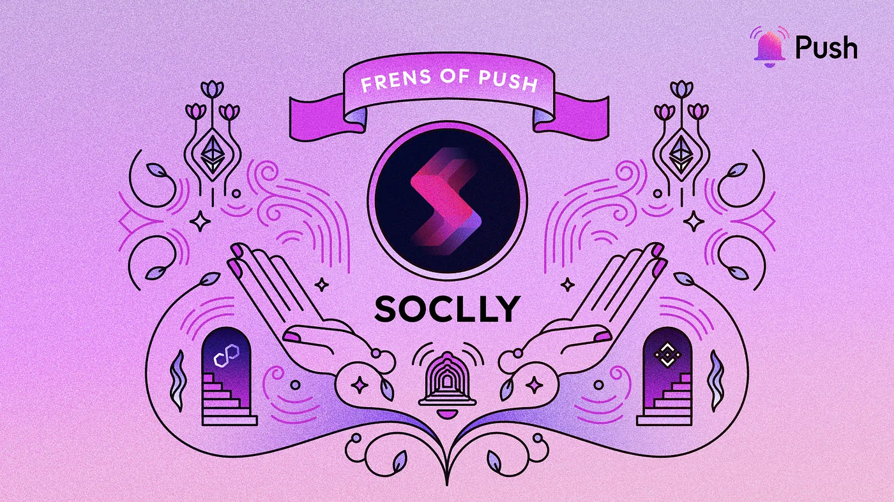

import { SubHeader } from '@site/src/components/SharedStylingV2';

<!--truncate-->

This week we are thrilled to feature an excitingly innovative decentralized social network as our newest Frens of Push, SOCLLY🌿.

SOCLLY is revolutionizing the web3 social networking space by putting power in the hands of creators. With a strong emphasis on collaboration, freedom, and monetization, SOCLLY provides a dynamic platform where creators can thrive and connect with their audience on their own terms.

Now partnering with Push, SOCLLY is taking its user experience to new heights, enhancing its offerings and delivering a seamless experience for creators and users alike. This collaboration empowers SOCLLY to incorporate robust chat functionalities. In turn enabling real-time dialogue and engagement.

But that’s only the beginning. With the foundation set, SOCLLY and Push Chat are set to unleash a wave of future developments that will reshape the way we interact and communicate. It’s time to connect, collaborate, and unleash your creativity like never before in web3.

In conversation with co-founders Prayag and Naresh, we talk about the problem SOCLLY solves, their vision, and the integration of Push Chat. Prayag and Naresh and absolutely thrilled about the future use cases that Push Chat will bring to the platform, calling it a potential game-changer in web3 communication.

### 1. Hi Prayag and Naresh, what’s your story? How did you become involved in building in the blockchain space? What are you working on now?
I am Prayag Singh, one of the co-founders at SOCLLY. My professional journey began in earnest in 2016, post-graduation, when I embraced the role of an automation engineer for two years. In 2018, the intriguing world of blockchain technology came to my attention through Bitcoin, sparking the onset of an exciting new phase in my career.

As I delved into the nuances of the Bitcoin whitepaper, I found myself captivated by the potential and implications of the technology. I was already acquainted with the concept of a peer-to-peer network through Torrent. Still, I hadn’t realized until then the transformative potential of this technology in revolutionizing the financial sector and its aptitude for facilitating global payments.

Fuelled by this newfound understanding and enthusiasm, I actively participated in meetups to enhance my knowledge and understanding of this revolutionary technology. This and my prior professional experience eventually led me to devote myself fully to the web3 domain. In the latter part of 2018, I was fortunate enough to become part of Bloque Labs. I had the unique opportunity to contribute to various products and further my skills here. I was involved in writing smart contracts in Solidity for the Ethereum blockchain and also gained experience with private blockchains like Hyperledger Fabric.

As the year 2021 commenced, my co-founder and I were driven by a desire to address the significant challenges faced by creators and educators in the web3 space, which led to the inception of what we now refer to as the SOCLLY journey. We actively engaged with creators, discussing the obstacles they encountered in establishing meaningful connections with their audiences. Their feedback was invaluable, shaping the creation of our MVP to cater specifically to their needs.

Following a continuous cycle of feedback and refinement, and a dedicated effort spanning a year and a half, SOCLLY finally came to life. Presently, my complete dedication and commitment are focused on the further development and growth of SOCLLY, fuelled by a steadfast belief in its potential to make a positive impact in the web3 space.

My name is Naresh Katta, and I proudly serve as a co-founder of SOCLLY. I bring over nine years of experience in Java and Android development to the table, and in 2017, I enthusiastically embraced the world of blockchain technology. The subsequent five years have seen me sharpening my abilities in crafting Solidity smart contracts and delving deeply into the capabilities of Ethereum.

In 2018, I had the good fortune to join the team at BloqueLabs. There, my responsibilities included the development of backend solutions utilizing Solidity for various blockchain-based products. As the global community confronted the ramifications of the first wave of the COVID pandemic, my co-founders and I were inspired to take action to ease the burdens of creators and educators in the web3 realm.

This inspiration was the fruit of numerous conversations with creators and educators at both virtual and physical meetups, leading us to the concept of SOCLLY. We envisioned a platform that could empower web3-native creators and educators by allowing them to receive payments in stable coins for their offerings, with an uncompromising commitment to privacy and security.

Our team spent one and a half years meticulously crafting SOCLLY, and we eagerly await the opportunity to see its transformative effect on the web3 community.

### 2. Tell us about SOCLLY — what’s it about, and what problem does SOCLLY solve?
SOCLLY is an innovative decentralized social network powered by Lens Protocol which works as a gateway of freedom for creators. SOCLLY allows individuals to monetize their content, time, and skills by becoming creators and sharing their unique perspectives with the world. It is a dynamic platform that fosters collaboration, engagement, and monetization opportunities for creators across various domains. By leveraging the capabilities of blockchain technology, SOCLLY addresses several challenges creators face in traditional social media platforms.

Below are the key features of SOCLLY:

- <b>Decentralized Calendly:</b> This is a peer-to-peer solution for individuals to manage their schedule and ensure more productive meetings.
- <b>Portable Reputation:</b> SOCLLY uses an on-chain ratings system that allows users to cultivate their reputation within the decentralized landscape, making it reliable and credible.
- <b>Charity Reimagined:</b> SOCLLY has a web3 charity feature that leverages decentralized technology for transparent and interconnected philanthropy.
- <b>On-chain Availability:</b> This feature, combined with decentralized calendly, enhances productivity by managing schedules efficiently.
- <b>Become a Creator:</b> SOCLLY allows individuals to share their passions, such as art, music, film, writing, and more, connecting with like-minded individuals and building a community on this decentralized social network.
- <b>Monetize your Time & Skills:</b> SOCLLY’s Creator Program allows individuals to monetize their time and skills by becoming creators and sharing their unique perspectives with the world​.
- <b>Earning Opportunities</b>: SOCLLY offers a way to generate earnings in the world of cryptocurrencies, allowing users to use their expertise and time to earn in stable digital assets​1​.

SOCLLY aspires to transform the social media paradigm by equipping creators with a decentralized platform that fosters enriched collaborative possibilities, ensures transactional security and transparency, and engenders deeper levels of community interaction and engagement.

### 3. How do developers use SOCLLY?
SOCLLY is a decentralized social network powered by Lens Protocol, meaning developers require a lens handle to access the platform(as a user). We don’t have an SDK yet. However, we plan to introduce an SDK for developers in the future. This SDK will enable developers to leverage the SOCLLY platform and its existing ecosystem to build user experiences.

In line with the methodology utilized in Push, developers would have an opportunity to utilize the provided SDK to craft personalized applications and interfaces, thereby harnessing the array of capabilities and features presented by SOCLLY. Such SDK integration paves the way for developers to augment the user experience, incorporate novel functionalities, and contribute to the ever-expanding ecosystem of SOCLLY.

SOCLLY aims to stimulate innovation, collaboration, and the inception of various applications within its decentralized social network by equipping developers with the SDK. The SDK is an instrumental tool enabling developers to leverage SOCLLY’s resources and infrastructure while infusing their unique ingenuity and creative flair into the platform.

As SOCLLY propels forward, incorporating the SDK will empower developers to adopt an instrumental role in shaping the platform’s future, thus further enhancing the experiences of its user base.

### 4. What’s the 2023 plan for SOCLLY its ecosystem?
Looking ahead to 2023, SOCLLY has an ambitious plan to develop its ecosystem further. Building upon the success of Push Chat, SOCLLY aims to extend its services to different Ethereum-based chains, enabling users to engage with the platform across multiple blockchain networks seamlessly. This expansion will offer a broader user base and increased accessibility to the unique features and opportunities provided by SOCLLY.

In line with this vision, SOCLLY has already commenced work on an exciting new feature called Paid Tweets, also known as Paid Promotions. The introduction of this feature is anticipated in the coming weeks, which will grant creators and users on SOCLLY the capability to amplify their content via sponsored tweets. By capitalizing on this feature, creators can bolster their prominence and outreach within the SOCLLY ecosystem, thus fostering an environment ripe for expansion and interaction.

Moreover, SOCLLY is currently incorporating Push Spaces, a cooperative space under active development on the Push end. Integrating Push Spaces into SOCLLY will equip users with a dedicated arena to interact, exchange thoughts, and cooperate on various initiatives. This feature is designed to cultivate community and promote substantial interactions among SOCLLY users, stimulating collaboration and creativity within the ecosystem.

SOCLLY is poised to enhance the user experience, expand its offerings, and create a vibrant ecosystem for creators and users alike through these strategic initiatives. The team at SOCLLY is committed to delivering these new features, ensuring that SOCLLY remains at the forefront of decentralized social networking and continues to provide valuable opportunities and services to its community.

### 5. How is SOCLLY building with Push Chat?
SOCLLY is diligently incorporating Push Chat into its platform to augment its offerings and ensure a seamless experience for creators and users. This partnership enables the integration of robust chat functionalities within the SOCLLY ecosystem.

Using Push Chat’s features, SOCLLY facilitates real-time dialogues for creators and users, promoting superior engagement and collaboration. This integration streamlines communication between creators and their audiences, enriching the user experience.

Furthermore, the amalgamation with Push Chat empowers SOCLLY to access the expansive ecosystem and user network of Push. It broadens platform creators’ scope and potential viewership, allowing them to engage with an extensive community of similar interests.

Overall, the alliance between SOCLLY and Push Chat merges the respective strengths of the two platforms, thereby crafting a compelling and engaging experience for creators and users. The integration of Push Chat’s conversation functionalities serves to streamline communication, encourage cooperation, and foster a vibrant community within SOCLLY’s decentralized social network.

### 6. How have you seen Push Chat integration enhance your UX?
The integration of Push Chat into our platform has significantly enriched the user experience, offering a streamlined and accessible communication conduit with creators, thereby promoting direct and efficient exchanges. Our partnership with Push Chat emphasizes our commitment to continually enhancing user experience, as demonstrated by the positive user engagement and satisfaction from newly added features such as Reply and React.

Looking forward, we anticipate future Push Chat developments with enthusiasm. Our team is proactively pursuing adding more features to uplift the user experience further. Through the continuous evolution of Push Chat, we aspire to cultivate an increasingly dynamic and interactive ecosystem for our users.

### 7. What cool use cases do you see Push and Push Chat being used for in the future?
Push Chat presents a promising future with diverse potential use cases, primarily emerging as an alternative to traditional messaging platforms like WhatsApp for web3 users. It promises a secure and decentralized communication channel that encourages direct and transparent interactions among creators and communities within the web3 ecosystem. As it continues to evolve and add new features, we foresee the emergence of innovative use cases, further enabling users to harness the power of decentralized communication. In essence, Push Chat holds the potential to redefine communication for web3 users, offering a superior, privacy-centric, and decentralized alternative to mainstream messaging platforms.

### 8. What haven’t we asked you about that you wish we had?
SOCLLY prioritizes user feedback and actively invites community engagement to shape our development roadmap. We offer multiple avenues for users to voice their ideas and concerns. Moreover, we are committed to fostering sustainability and social impact. It includes incorporating sustainable practices in our operations and seeking partnerships that support philanthropic initiatives. Our long-term plan features user-empowered contributions to social impact through the platform. We aim to cultivate a community-led ecosystem that drives significant and enduring impact.

<i>
“Frens of Push” is our weekly content series to spotlight outstanding projects that are building with Push. If you want to be featured, reach out to us and you could be our next Fren in the series.
</i>

## About SOCLLY
SOCLLY is a decentralized social network with a creator-centric apporach. With a strong focus on democratizing access to finance and revolutionizing digital interactions, SOCLLY offers a gateway of freedom for creators and educators to monetize their time and skills.

Find more about SOCLLY: [Website](https://www.soclly.com/), [Twitter](https://twitter.com/socllyhq), [Discord](https://discord.com/invite/eUM646fTua), [LinkedIn](https://www.linkedin.com/in/soclly-hq-264304215/), [Facebook](https://www.facebook.com/SocllyHQ)

### About Push Protocol

Push is the communication protocol of web3. Push protocol enables cross-chain notifications and messaging for dapps, wallets, and services tied to wallet addresses in an open, gasless, and platform-agnostic fashion. The open communication layer allows any crypto wallet /frontend to tap into the network and get the communication across.

To keep up-to-date with Push Protocol: [Website](https://push.org/), [Twitter](https://twitter.com/pushprotocol), [Telegram](https://t.me/epnsproject), [Discord](https://discord.gg/pushprotocol), [YouTube](https://www.youtube.com/c/EthereumPushNotificationService), and [Linktree](https://linktr.ee/pushprotocol).

