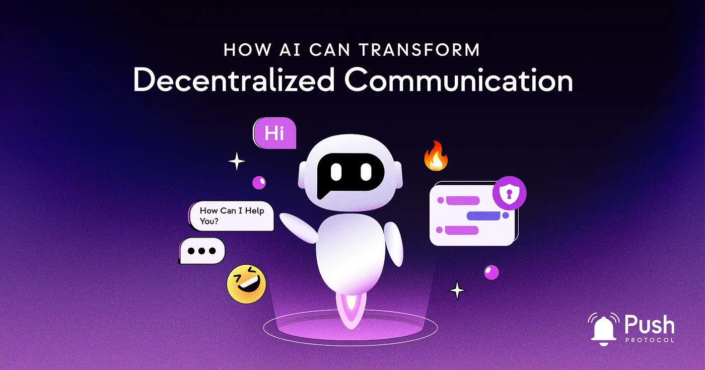

import { SubHeader } from '@site/src/components/SharedStylingV2';

<!--truncate-->

As the world of web3 continues to evolve, Push Protocol is playing a critical role in revolutionizing decentralized communication. Our web3-native chat and video chat capabilities, agnostic to any platform, have opened the door to seamless communication in the decentralized world. But what happens when we combine the power of Push Protocol with Artificial Intelligence (AI)?

In this blog post, we will explore the limitless possibilities that arise when Push Protocol converges with AI. Whether you’re a user or developer, get ready to unlock a new realm of possibilities in decentralized communication.

## Scratching the Surface of AI and Decentralized Communication
The convergence of Push Protocol and AI is just the beginning of the potential innovations in decentralized communication. From AI-powered autonomous agents to decentralized AI networks, we’re just scratching the surface of what’s possible when Push Protocol and AI converge. Let’s explore some of the ways AI can enhance decentralized communication beyond the examples we’ve already covered.

## Real-time Decision Making and Personalized User Experience
Integrating AI into Push Protocol makes real-time decision-making possible as AI algorithms can analyze data, draw insights, and make recommendations based on the latest information available. This convergence can lead to personalized user experiences, where AI can learn from user behavior and preferences and tailor the communication experience accordingly.

<b><b>Example:</b></b> In a decentralized metaverse, AI could analyze user behavior and preferences to curate a personalized experience, such as suggesting content and activities that align with the user’s interests and social graph.

## Automated Moderation and Enhanced Security:
Integrating AI with Push Protocol can also result in automated moderation for chat platforms. AI-powered algorithms can analyze conversations and detect inappropriate content, spam, or malicious activity, ensuring a safe environment for users. Furthermore, AI can enhance security by identifying and responding to real-time threats, such as unauthorized access or phishing attempts.

<b>Example:</b> An AI-powered moderation bot could be employed in a chat system built on the Push Protocol. This bot could analyze ongoing discussions in real-time, automatically flagging or removing harmful or inappropriate content, thereby ensuring a secure and respectful environment for users. The decentralization of the Push Protocol combined with AI-enhanced security adds an extra layer of trustworthiness to the system.

## AI-powered Chatbots and Virtual Assistants:
With the convergence of Push Protocol and AI, the development of AI-powered autonomous agents has become a reality. These intelligent agents can perform complex tasks and make decisions on behalf of users. By leveraging the decentralized nature of Push Protocol, these agents can operate across various platforms and ecosystems, providing a seamless user experience.

<b>Example:</b> In a decentralized communication system using the Push Protocol, an AI-powered chatbot could be created to aid users. For instance, this bot could be programmed to schedule meetings, provide real-time updates, or answer frequently asked questions, thereby making communication and collaboration easier and more efficient. This convergence of AI and the Push Protocol could transform how we interact within decentralized platforms and not just on top of them.

## Empowering Decentralized AI Networks:
As AI continues to evolve, decentralized AI networks are becoming more relevant. Push Protocol can facilitate communication and coordination among these decentralized networks, enabling AI agents to collaborate, share information, and learn from each other. This convergence will produce more robust and efficient AI models, benefiting various industries and applications.

<b>Example:</b> In a decentralized project management system powered by the Push Protocol, multiple AI agents could be utilized for different tasks. One AI could manage scheduling and deadlines, another could oversee task allocation based on team members’ skills and current workload, while another could provide real-time performance analytics. These AI agents could share data, via Push, and adapt based on the insights gathered, constantly optimizing project operations.

## Push Protocol: Pioneering the AI-Integrated Decentralized Future
Push Protocol is at the forefront of applying artificial intelligence models, thanks to its state-of-the-art decentralized communication technology. As a leading player in the Web3 space, Push Protocol is uniquely positioned to drive the integration of AI into decentralized communication platforms and bring the power of AI to the blockchain.

By leveraging our cutting-edge technology and extensive experience in the realm of decentralized communication, Push Protocol is pioneering the way for seamless AI integration. As a leader in this space, Push Protocol aims to set new standards and best practices for incorporating AI into the decentralized ecosystem, ensuring that the convergence of AI and blockchain technology is optimized for user needs, privacy, and security.

Push Protocol is committed to exploring and advancing the AI-integrated future of decentralized communication. By staying at the forefront of technological advancements in the AI and blockchain space, Push Protocol is well-equipped to lead the industry and its users into a new era of innovation and opportunity.

## PushChatAI: An On-Chain Communication Revolution via Push Protocol
<b>PushChatAI</b>, powered by AI technologies similar to those found in ChatGPT, represents a new frontier in on-chain communication. Integrated into the Push Protocol, it will help to revolutionize communication and AI-powered applications in the decentralized world.

Integrating PushChatAI within the Push Protocol has multiple potential benefits:

<b>Decentralized Intelligent Communication:</b> PushChatAI enables decentralized, peer-to-peer communication by leveraging the benefits of AI for chat functionalities.

<b>AI-Powered Insights:</b> With the incorporation of AI, PushChatAI can provide intelligent, context-aware responses, improving the quality of communication and enabling a wide range of AI-powered applications, such as moderation, content discovery, and personalized assistance.

<b>Cross-Platform Availability:</b> Since PushChatAI is integrated within the Push Protocol, it can potentially be implemented across various blockchain-based platforms and ecosystems. This means that the intelligent chat functionalities of PushChatAI can be available in a wide range of decentralized applications, contributing to a unified and enhanced communication experience across multiple platforms.

<b>Enhanced User Experience:</b> PushChatAI greatly improves the user experience by providing intelligent suggestions, contextual search results, and automated assistance. This makes communication more efficient and enjoyable for users, fostering better collaboration and community engagement.

## Technical Aspects of PushChatAI On-Chain
Incorporating PushChatAI on-chain involves a series of technical challenges, including storage, computation, and consensus mechanisms. Addressing these challenges requires innovative solutions that optimize resources and maintain the decentralized nature of the blockchain:

1. <b>Storage:</b> Storing AI models and data on-chain can be resource-intensive. Solutions such as decentralized storage networks like IPFS (InterPlanetary File System) or Filecoin can help manage large-scale storage needs while maintaining decentralization.
2. <b>Computation:</b> Executing AI algorithms on-chain can be computationally expensive. Layer 2 solutions and off-chain computation technologies, such as zk-SNARKs (Zero-Knowledge Succinct Non-Interactive Argument of Knowledge), can help minimize the computational load on the main chain while maintaining data integrity.
3. <b>Consensus Mechanisms:</b> AI algorithms may require frequent updates, which can be challenging to implement in a decentralized environment. Implementing AI governance models and token-based voting systems can help ensure that AI updates are agreed upon by the community and that the AI evolves in a decentralized manner.
## Implications of PushChatAI On-Chain
Integrating PushChatAI on-chain has several implications that can transform the way we interact with AI and communicate in a decentralized environment:

1. <b>Data Privacy:</b> Storing and processing AI data on-chain allows users to maintain control over their data. Since blockchain technology is designed to be secure and tamper-proof, this integration ensures that user data remains private and secure.
2. <b>Decentralized AI Services:</b> On-chain AI models, such as PushChatAI, can be used to power decentralized AI services. By leveraging the capabilities of AI and the security of blockchain technology, these services can provide a seamless and secure user experience in the Web3 ecosystem.
3. <b>AI-Powered Communication:</b> With PushChatAI on-chain, AI can be seamlessly integrated into decentralized communication platforms, enhancing user experience and enabling real-time decision-making, personalized content, and automated moderation.
4. <b>AI Governance:</b> Integrating PushChatAI on-chain allows for decentralized governance of AI models. Token holders and stakeholders can participate in the decision-making process regarding AI updates and improvements, ensuring the AI remains aligned with the community’s values and needs.
5. <b>AI Monetization:</b> The on-chain integration of PushChatAI enables the creation of token-based AI services and business models. Developers and content creators can monetize their AI models, opening up new revenue streams and incentivizing further innovation in the space.
## The Future of PushChatAI and Decentralized Communication
As we move forward in the world of Web3, the integration of PushChatAI on-chain promises to revolutionize the way we communicate and interact with AI in the decentralized environment. The technical challenges of integrating PushChatAI on-chain must be addressed to ensure the full potential of this convergence is realized. By overcoming these challenges and embracing the opportunities created by on-chain AI, we can unlock a new era of decentralized communication, rich with innovation and powered by AI.

## Conclusion
The fusion of Push Protocol and Artificial Intelligence holds the key to unlocking a new realm of possibilities in decentralized communication. From real-time decision-making and personalized user experiences to AI-powered chatbots and decentralized AI networks, the synergies between these technologies will propel the Web3 ecosystem and humanity to new heights. As we explore this exciting frontier, we must remain committed to best practices and ensure this convergence is optimized for user needs and experience.

As the world of Web3 continues to evolve, the convergence of Push Protocol and AI will undoubtedly lead to new possibilities and innovations. We’re excited to continue exploring this frontier and sharing our insights and findings. By keeping up with the latest developments in this space, you’ll be well-positioned to leverage these technologies and stay ahead of the curve. Stay tuned for future blog posts and updates as we delve deeper into the potential of Push Protocol and AI.

What do you think about the convergence of Push Protocol and AI? Are you excited about the possibilities, or do you have concerns? Share your thoughts and questions in the comments below!

### About Push Protocol

Push is the communication protocol of web3. Push protocol enables cross-chain notifications and messaging for dapps, wallets, and services tied to wallet addresses in an open, gasless, and platform-agnostic fashion. The open communication layer allows any crypto wallet /frontend to tap into the network and get the communication across.

To keep up-to-date with Push Protocol: [Website](https://push.org/), [Twitter](https://twitter.com/pushprotocol), [Telegram](https://t.me/epnsproject), [Discord](https://discord.gg/pushprotocol), [YouTube](https://www.youtube.com/c/EthereumPushNotificationService), and [Linktree](https://linktr.ee/pushprotocol).