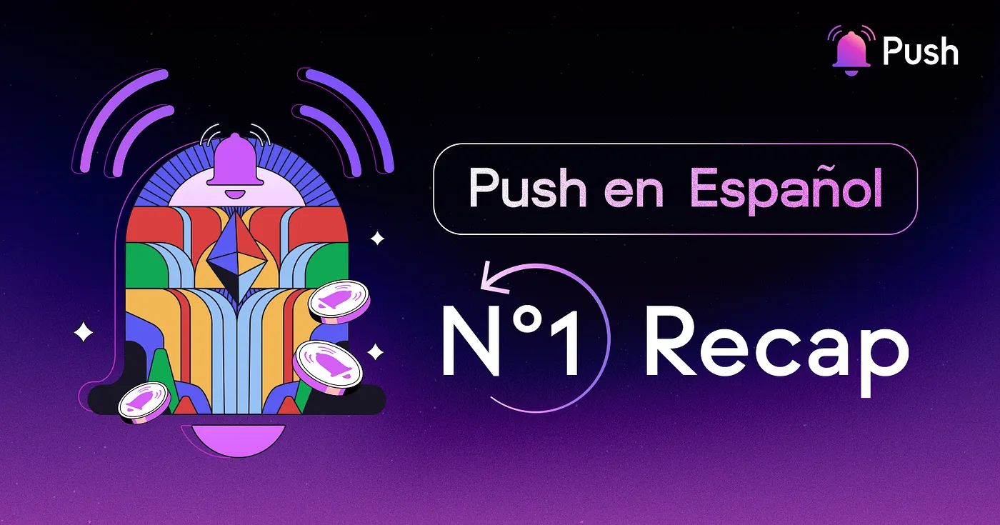

import { SubHeader } from '@site/src/components/SharedStylingV2';

<!--truncate-->

A medida que el ecosistema avanza es importante democratizar los esfuerzos de los proyectos a nivel global para garantizar que todas las regiones tengan acceso y la oportunidad de desarrollar con la tecnología.

Estos últimos años, Latinoamérica ha demostrado ser una de las regiones con mayor adopción crypto. No es coincidencia que el año pasado hayamos tenido el evento más importante de Ethereum, Devcon VI, en Colombia y que la mirada de los proyectos y protocolos extranjeros hayan desarrollado un foco especial en el talento de la región.

## Como inició todo
El primer programa de embajadores de marca de Push Protocol se desarrolló a través de Diffie, el proyecto de Ángela Ocando y grantee de Push. Este consiste en la selección y colaboración estratégica de 13 cripto entusiastas que impulsan el reconocimiento del protocolo mientras aprenden, suman a su portafolio y construyen el camino hacia su primer trabajo en Web3.

Así empezó a construirse el camino hacia una fuerte comunidad en español. Como parte de nuestros esfuerzos dedicados a esta comunidad, realizamos nuestro primer evento en este idioma y utilizamos redes sociales especializadas con contenido hecho por los mismos embajadores para toda la comunidad latina.

## Sobre la Community Call
En la primera Community Call moderada por Ángela Ocando, Daniela Marotazo y José Piña, se unieron más de 50 cripto-entusiastas para conocer los incentivos de Push Earn como el programa de embajadores, Trivia Night, Push Missions, Push Rockstars y Push Grants.

1. <b>Programa Push Latam Ambassador:</b> La iniciativa que busca inspirar talentos para potenciar un producto en la comunidad y abrir oportunidades en Web3.
2. <b>Trivia Night:</b> Un evento realizado todos los miércoles en Discord, en el que puedes poner a prueba tus conocimientos sobre cultura cripto o desarrollo web y ganar premios mientras amplías tus conocimientos.
3. <b><a href='https://www.notion.so/pushprotocol/Push-Missions-693291d804cf4b2180a992dd40fc5a0e'>Push Missions</a></b> Estas misiones te ofrecen tareas para completar dentro del ecosistema de Push, lo que te permite obtener recompensas y aumentar tu experiencia en el proceso. Las misiones tienen temáticas variadas para talento tech y no-tech. Estas pueden ir desde diseño de stickers hasta ser host de workshops.
4. <b><a href='https://www.notion.so/pushprotocol/Push-Missions-693291d804cf4b2180a992dd40fc5a0e'>Push Rockstars</a></b> Este programa de Push DAO consiste en reconocer semanalmente las mejores contribuciones (hilos de Twitter, workshops, videos, blogs, etc) y nominarlas en Snapshot para que la comunidad pueda elegir su favorita. El ganador se lleva un NFT especial y 900 $Push tokens.
5. <b><a href='https://www.notion.so/pushprotocol/Push-Grants-Program-8c9f7934f7e5418faf96e7a5bdcaac4a?pvs=4'>Push Grants</a></b> Push Grants es un programa de subvenciones creado para apoyar a aquellos que quieren construir en el ecosistema de Push. Este programa incluye tres tipos de subvenciones: Rapid Grants, Push Grants y Push Community Grants, cuyos fondos tienen un tope de 2k, 20k y +20k USD respectivamente.

## El futuro de Push En Español
Este es un gran año para Latam no solo con las oportunidades generales del ecosistema pero con Push Protocol ya que nos encontramos muy emocionados de poder conectar con las comunidades y crear los medios en los que todos puedan participar, aprender y ganar con nuestros programas.

Para más contenido sobre Push en tu idioma no olvides seguir [@PushEnEspanol](https://linktr.ee/pushenespanol) en todas las redes.

### About Push Protocol

Push is the communication protocol of web3. Push protocol enables cross-chain notifications and messaging for dapps, wallets, and services tied to wallet addresses in an open, gasless, and platform-agnostic fashion. The open communication layer allows any crypto wallet /frontend to tap into the network and get the communication across.

To keep up-to-date with Push Protocol: [Website](https://push.org/), [Twitter](https://twitter.com/pushprotocol), [Telegram](https://t.me/epnsproject), [Discord](https://discord.gg/pushprotocol), [YouTube](https://www.youtube.com/c/EthereumPushNotificationService), and [Linktree](https://linktr.ee/pushprotocol).