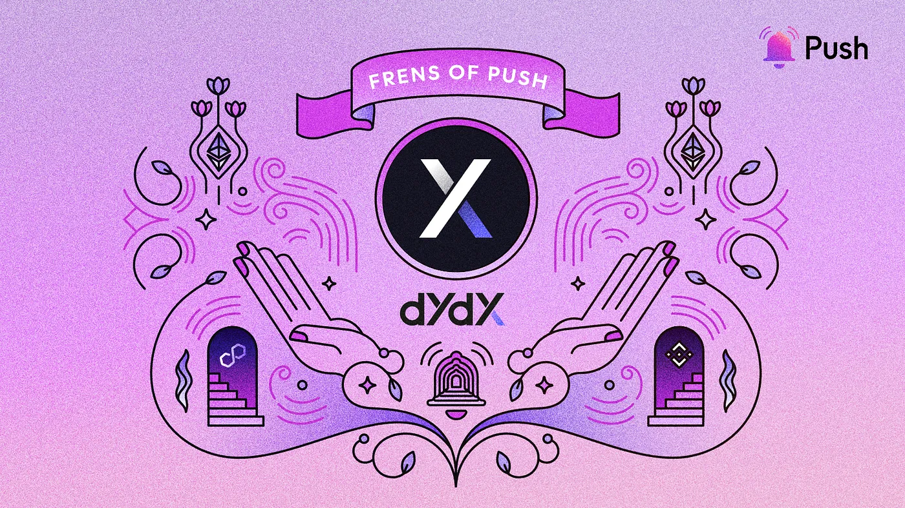

import { SubHeader } from '@site/src/components/SharedStylingV2';

<!--truncate-->

Introducing this week’s Frens of Push: [dYdX](https://dydx.exchange/), leading perpetuals decentralized exchange that’s revolutionizing the world of crypto trading.

In the world of decentralized finance, dYdX is a prominent DEX that offers a unique trading experience. Built on the Ethereum layer 2 system StarkWare, dYdX leverages zero-knowledge proofs to provide enhanced security, decentralization, and privacy to its users.

At its core, dYdX is designed for trading perpetuals, which unlike traditional futures or options, do not have expiration dates. This allows traders to speculate on the future value of an underlying asset indefinitely. This unique offering has attracted both institutional and retail traders, making dYdX one of the most popular exchanges in the market.

The collaboration between dYdX and Push is a game-changer in the DeFi industry, empowering traders worldwide with powerful, transparent, and fair financial products. dYdX’s mission to democratize access to financial opportunity aligns perfectly with Push’s commitment to fostering transparency and communication. Together, dYdX and Push are working together to enhance accessibility and pave the way for a more inclusive and equitable financial future.

In this edition of “Frens of Push,” we had the privilege of interviewing Cliffton Lee, Governance and SEA Lead at dYdX. Join us as we delve into the inner workings of dYdX, learn how they’re using Push’s communication layer, and gain insights into the vision and goals that drive this innovative DeFi platform.

### 1. Hi Cliffton, what’s your story? How did you become involved in building in the blockchain space? What are you working on now?
My name is Cliffton, and I work on all things Governance and Growth for the SEA region at the dYdX Foundation. I first got into crypto in 2017 when I purchased some BTC and ETH on Coinbase as an experiment, and it was only in 2020 that I went deep down the web3 rabbithole and deeply appreciated the importance of decentralized technologies, and how cryptography could enable that. I was drawn into Ethereum’s roadmap, scalability strategies via rollups, and this was how I got involved with dYdX.

### 2. Tell us about dYdX — what’s it about, and what problem does dYdX solve?
dYdX is the leading decentralized crypto perpetuals trading exchange. dYdX’s mission is to democratize access to financial opportunity. Few have access to advanced tools and products in the financial system, and dYdX believes in empowering more traders, in more places, with powerful, transparent, and fair financial products.

While trading on dYdX, traders enjoy the security, privacy and decentralization benefits.
dYdX is currently built on top of StarkEx, a layer 2 zero knowledge rollup to Ethereum, and there is works ongoing to build the next version of dYdX v4. dYdX v4 will be fully decentralized end to end, and will be a layer 1 Proof-of-Stake blockchain built using the Cosmos SDK.

### 3. How do developers use dYdX?
Developer documentation: https://dydxprotocol.github.io/v3-teacher/#terms-of-service-and-privacy-policy

These docs describe the v3 API for the dYdX decentralized perpetual contracts exchange. The exchange runs on an L2 (layer-2) blockchain system, and operates independently of previous dYdX protocols and systems, including the v1 and v2 APIs.

Like the previous iteration of dYdX perpetuals, the exchange uses a centralized order book, but remains non-custodial, and settles trades and liquidations in a trustless manner.

### 4. What’s the 2023 plan for dYdX and its ecosystem?
The main goal is to ship dYdX v4, and to enable the progressive decentralization of the protocol via governance.

### 5. How is dYdX using Push’s web3 communication layer?
dYdX users currently use Push to get notified of governance updates. Currently, dYdX stakeholders can subscribe to receive notifications when:

- A DRC is created
- The voting process for DRC begins
- A DIP is created
- The voting for the DIP is activated
- The DIP is queued
- The DIP is implemented

### 6. How would you describe your experience using Push? What benefits have you seen?
Great! Community members have reached out mentioning that Push has been helpful in keeping them notified of what’s happening on the governance front. We’ve seen better engagement rates and higher vote participation.

### 7. What cool use cases do you see Push being used for in the future?
With dYdX moving to the Cosmos ecosystem, we’re hoping that Push can be compatible with the Cosmos SDK to continue this notification functionality.

## About dYdX
dYdX is a DEX on Ethereum providing a transparent and secure financial ecosystem for crypto trading. With a focus on empowering traders, dYdX provides advanced trading features such as margin trading and perpetual swaps. The platform utilizes a traditional orderbook + matching model for trading and has emerged as one of the most popular DEXes in the market.

Learn all about dYdX: [Website](https://dydx.exchange/), [Twitter](https://twitter.com/dydx), [Discord](https://discord.com/invite/Tuze6tY), [YouTube](https://www.youtube.com/c/dYdXprotocol), [Reddit](https://www.reddit.com/r/dydxprotocol/), [github](https://github.com/dydxprotocol)

### About Push Protocol

Push is the communication protocol of web3. Push protocol enables cross-chain notifications and messaging for dapps, wallets, and services tied to wallet addresses in an open, gasless, and platform-agnostic fashion. The open communication layer allows any crypto wallet /frontend to tap into the network and get the communication across.

To keep up-to-date with Push Protocol: [Website](https://push.org/), [Twitter](https://twitter.com/pushprotocol), [Telegram](https://t.me/epnsproject), [Discord](https://discord.gg/pushprotocol), [YouTube](https://www.youtube.com/c/EthereumPushNotificationService), and [Linktree](https://linktr.ee/pushprotocol).