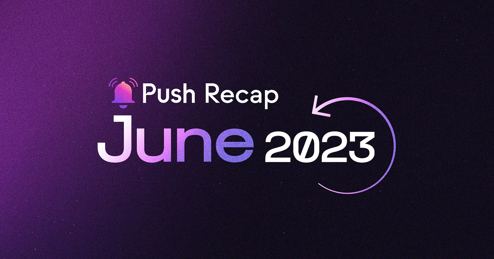

<!--truncate-->

What a month it’s been at Push! From groundbreaking features to new partnerships, we’ve been on an exciting journey this June making major strides towards our mission of decentralizing communication in web3. We couldn’t be more thrilled to share the highlights with you.

The spotlight of the month was undoubtedly the long-awaited [release of Push NFT Chat](https://x.com/PushChain/status/1666491248436297728?s=20). With this new feature, we’ve opened up a universe of possibilities for the 1.5 million+ NFT wallets and collections including Azuki, BAYC, and CryptoPunks. Instant, secure, and immersive chats tied to your unique NFT assets are here. With its triple encryption and intuitive UX, Push NFT Chat is set to empower web3 native NFT-to-NFT and dApp-to-NFT communication like never before. Read all about it [here](https://medium.com/push-protocol/introducing-push-nft-chat-chats-and-comms-tied-to-your-nfts-done-right-98717c04438d). Also don’t forget to check out the [demo](https://x.com/PushChain/status/1666859600161779733?s=20) and begin building!

Our development progress didn’t stop there. Get ready to dive in!

## Development

- We’ve successfully completed the [Push Protocol v2 smart contract audit by Chainsafe](https://x.com/PushChain/status/1663910676513816578?s=20), furthering the $PUSH token utility and enabling new incentivization mechanisms for users. Be on the lookout for Push v2 soon.
- We’ve been addressing bugs and optimizing Push Video and Push Group Chat.
- Smart contract documentation of v2 functions is currently under progress.
- The final QA of Push Video on mobile has been initiated. The new version of the app will be rolled out once the QA is completed.
- The initial set-up for using Foundry in the Push Smart contracts repo is now completed.

## Frens of Push

Collaborations and partnerships are at the heart of our journey at Push. In June, we had the privilege of joining forces with exceptional projects, all united by the vision of advancing the web3 ecosystem. Let’s take a look at all our new frenships:

- The official [Aragon Channel](https://x.com/PushChain/status/1663576587122384897?s=20) went live. The leading platform for DAO creation and management is now using Push to enhance governance and participation in all Aragon-based DAOs.
- Want to be a web3 developer? We launched a mini-course in collaboration with [LearnWeb3](https://x.com/PushChain/status/1666824629485473792?s=20) that is all about empowering devs and fostering a stronger web3 developer community. Stay tuned for more details!
- We’re extremely proud to announce our partnership with leading futures [DEX SynFutures](https://x.com/PushChain/status/1669327886522937344?s=20). Users can expect important updates and announcements via notifications powered by Push.
- Calling all hackers! Bigger bounties than ever before are waiting for you in Push’s collaborative [Bug Bounty Program](https://x.com/PushChain/status/1671521942195646465) with ImmuneFi. Time to sharpen your hacking tools! Find all the details here.
- We’re unlocking the power of decentralized governance with our newest fren [ElementDAO](https://x.com/PushChain/status/1671879753840873480). Users, get ready to be better informed and participate actively in shaping the future of ElementFi!

## Featured

We are delighted to highlight the recognition that Push has garnered this last month. Push team members were invited to prominent platforms and helped contribute to several discussions surrounding web3 innovation.

- Our Head of Ecosystem, Pranshu, took the stage at the esteemed [Google Cloud Web3 Conclave](https://x.com/PushChain/status/1663482897490116610?s=20), where he delivered a talk on ‘Pushing the Boundaries of Web3 UX.’
- Additionally, our founder Harsh was honored to be featured as a guest on the latest episodes of [Cryptonews](https://x.com/PushChain/status/1666067423173267457?s=20) and [Breaking Chains Crypto](https://x.com/PushChain/status/1665705030849122304?s=20) podcasts to discuss the future of tokenization.

## Push DAO and Community

On the community front, we have some exciting updates to highlight the involvement and collaborative spirit within our community.

Firstly, we are thrilled to unveil our [Push Progressive Decentralization Roadmap](https://x.com/PushChain/status/1664316051201441811?s=20) with new opportunities to bring community ownership to Push via PushDAO. The next phase of Push governance is here, making it easier than ever before for the Push community to get involved and contribute to the future of web3 communication. Read all about it [here](https://medium.com/push-protocol/push-dao-progressive-decentralization-the-next-phase-of-push-governance-1cce258dceba).

We are excited to announce that both community calls and DAO governance calls have started weekly. These calls provide opportunities for community members to participate in shaping the direction of Push DAO. Don’t miss out on your chance to contribute!

We were also delighted to witness a remarkable turnout during the [Push En Español](https://x.com/PushChain/status/1669770430494769158?s=20) Discord call, where our Spanish-speaking community members came together to discuss all things Push.

Lastly, the ETH Global HackFS was a huge success with 55 awesome teams developing using Push Chat, Notification and Push Video. A huge congratulations to the [23 winning teams](https://x.com/PushChain/status/1673370078660939776) that grabbed Push bounties for their incredible Push integrations. We couldn’t be happier to support these brilliant minds!

As we bid farewell to another eventful month at Push, we want to thank you all for being a part of our journey. Stay tuned for more exciting developments on the horizon as we continue in our mission to revolutionize decentralized communication. See you next time!
