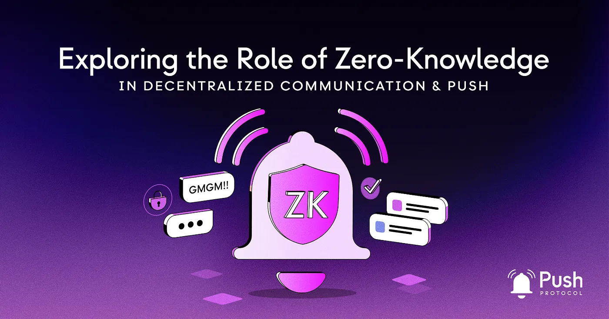

import { SubHeader } from '@site/src/components/SharedStylingV2';

<!--truncate-->

<blockquote>
<i>
💡 TL;DR

This article discusses the possible integration of Zero-Knowledge Rollups (ZKR) into Push Protocol, illustrating how this innovative union provides a pathway for enhanced privacy, scalability, and efficiency in decentralized communication. We will explore the following.

<b>Intro to ZK:</b> Zero-Knowledge (ZK) technology enhances privacy and scalability in decentralized communication, such as the Push Protocol.

<b>Integration & Evolution in Push:</b> ZK Rollups (ZKR) integration reduces latency and boosts throughput in the Push Protocol. As ZK tech advances, further protocol enhancements are anticipated.

<b>Real-World Impact:</b> ZKR-Push fusion improves DeFi transactions, IoT data sharing, and voting systems, thereby bolstering security and efficiency across the decentralized ecosystem.
</i>
</blockquote>

The world of decentralized systems is undergoing a significant evolution, triggered by the imperative quest for privacy and scalability solutions. The technology under our microscope today is zero-knowledge technology, the inherent strengths of which, developers are tirelessly examining for possible integration into Push Protocol.

In the ensuing sections, we will navigate through the intricacies of these technologies, the potential of their union, the challenges on the horizon, and their practical use cases. By shedding light on the role of zero-knowledge tech in decentralized communication, we aim to foster an environment conducive to novel breakthroughs in decentralized coordination and collaboration. We hope to stimulate the intellectual curiosity of developers and community members, spurring them to contribute actively to the governance and progressive development of Push Protocol.

## Zero-Knowledge Proofs and Rollups: Enhancing Scalability
### An Exploration into Zero-Knowledge Proofs: zk-SNARKs and zk-STARKs
Zero-knowledge proofs (ZKP) function as cryptographic keys, enabling one entity to convince another of their knowledge without giving away the details. The two leading constructions of ZKP, zk-SNARKs and zk-STARKs, present varying trade-offs when it comes to proof size, verification speed, and computational requisites.

### The Mechanism of Rollups: A Second-Layer Scaling Panacea
Rollups, a potent second-layer solution, compress multiple transactions or operations off-chain into a single proof that then finds a place in the underlying blockchain. This strategy significantly reduces the load on-chain and enhances speed and throughput. Zero-knowledge rollups amalgamate the strengths of ZKP with scalability optimization, all while maintaining a high standard of privacy and security.

## How Might ZKRs be used in Push Protocol?
Incorporating zero-knowledge rollups into the Push Protocol can bring about a wide range of benefits. In the following section, we’re going to look at how different features of ZKR can power Push Protocol. At the same time, we want to inspire our community to think about the future design of the underlying protocol that enables decentralized communication for web3. We also hope to encourage proposals that could shape the next stage of the protocol’s development.

### Minimized On-Chain Data Footprint and Latency
Incorporating zero-knowledge rollups facilitates the compression of multiple messages or transactions into a single proof. This mechanism minimizes on-chain data footprint and latency, allowing quicker message delivery and a surge in throughput.

### High Throughput Coupled with Uncompromised Security
Zero-knowledge rollups help maintain privacy and security, despite increased throughput. The off-chain bundling of messages retains their integrity and confidentiality, aiding developers in designing high-performance applications without compromising user privacy.

### Full-proof Confidentiality in Messaging
The integration of zk-SNARKs or zk-STARKs in the Push Protocol allows developers to ensure absolute confidentiality in messages. This encryption extends to the content, sender, and receiver information. These ZKPs ensure privacy-preserving authentication and message verification without revealing sensitive details.

### Seamless Communication Across Multiple Blockchains
The inclusion of zero-knowledge proofs into Push Protocol could catalyze cross-chain interoperability. This integration would enhance the overall utility of the protocol, promote a more interconnected and efficient decentralized ecosystem, and create new opportunities for dApps and zkdApps.

As we stand today, the integration of zero-knowledge rollups into the Push Protocol is already ripe with potential, opening up a wealth of applications and enhancements. However, as we cast our gaze towards the horizon, the maturing landscape of zero-knowledge technology promises even more exciting opportunities for exploration and improvement within Push.

## Future Developments & Experimentation
The evolutionary journey of zero-knowledge technology opens up avenues to explore new applications and improvements within Push Protocol. Recursive proofs, proof aggregation, and efficient proof generation are among the intriguing areas of ongoing research and experimentation.

<b>Recursive proofs:</b> Recursive proofs can enhance the efficiency of Push Protocol by reducing the computational and storage requirements. This approach can also offer innovative methods to perform specific actions based on message data.

<b>Proof aggregation:</b> Proof aggregation can significantly reduce the on-chain data footprint, thereby improving scalability and lowering associated costs.

<b>Efficient proof generation:</b> Research and development to improve proof generation algorithms could pave the way for faster, more scalable communication in Push Protocol while preserving privacy.

## Push & ZK in Action: Unveiling the Benefits of Integrating ZKR into Push
Integrating Zero-Knowledge Rollups (ZKR) into Push Protocol offers diverse benefits in real-world applications. This section highlights key use cases where this integration significantly impacts the world of decentralized communication.

### Decentralized finance and privacy-preserving transactions
The marriage of zero-knowledge tech and Push Protocol can create a foundation for privacy-preserving messages in DeFi applications. Furthermore, this integration facilitates secure, real-time communication between participants in DeFi ecosystems, enhancing user experience and trust.

### IoT networks and data sharing
In the vast world of IoT networks, zero-knowledge techniques integrated with Push Protocol can ensure data privacy and security. It can also foster real-time communication and collaboration between devices.

### Voting systems and governance
The synergy of zero-knowledge tech and Push Protocol can design secure, transparent, and privacy-preserving voting systems that shield voter identities and avert tampering.

## Conclusion
Integrating zero-knowledge tech into Push Protocol equips developers with a robust toolkit for designing privacy-centric, scalable, and efficient messaging solutions. By comprehending the technical dimensions and carefully evaluating challenges and trade-offs, they can harness the power of these pioneering technologies, heralding a new era in decentralized communication and collaboration.

### About Push Protocol

Push is the communication protocol of web3. Push protocol enables cross-chain notifications and messaging for dapps, wallets, and services tied to wallet addresses in an open, gasless, and platform-agnostic fashion. The open communication layer allows any crypto wallet /frontend to tap into the network and get the communication across.

To keep up-to-date with Push Protocol: [Website](https://push.org/), [Twitter](https://twitter.com/pushprotocol), [Telegram](https://t.me/epnsproject), [Discord](https://discord.gg/pushprotocol), [YouTube](https://www.youtube.com/c/EthereumPushNotificationService), and [Linktree](https://linktr.ee/pushprotocol).
