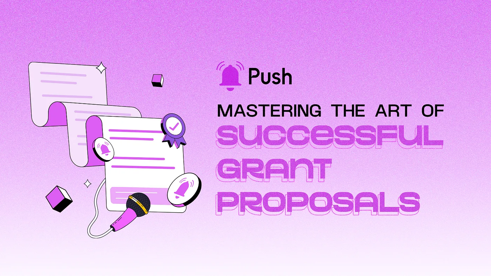

import { SubHeader } from '@site/src/components/SharedStylingV2';

<!--truncate-->

When it comes to project growth, seeking external assistance is crucial. In the web3 landscape, grants have emerged as a valuable form of funding, but navigating the intricacies of grant applications can be challenging.

Fortunately, we’ve gathered expert insights from “The Art of Successful Grant Proposals” Twitter space from Push Protocol in which Azeem Khan, Carlos Melgar and Ben West shared these insights and offered valuable tips to enhance your grant proposal game and increase your chances of securing funding for your project.

### 1. Showcase Your Portfolio: Demonstrate Your Track Record
One common pitfall in grant applications is neglecting to highlight your past achievements. Whether in Web 2 or Web 3 projects, the individuals behind the project are essential considerations for grant providers and voters. They seek assurance of your abilities and commitment. Therefore, ensure that your application showcases your portfolio as a testament to your expertise and success.

### 2. Research Grant Providers: Understand Their Values
Not all grants are the same, and each program has its unique criteria and philosophy. Some employ quadratic funding, while others have reward programs or committee evaluations. To increase your chances of success, conduct thorough research on the grant provider and align your project with their values and goals. This alignment will position your proposal as a perfect fit for their ecosystem.

### 3. Craft an Engaging and Concise Application: Stand Out from the Crowd
In a sea of grant applications, capturing attention is paramount. Craft your proposal in an attractive and concise manner that stands out from the rest. Employ a creative writing style that effectively communicates your project’s value proposition. Break free from conventional approaches to leave a lasting impression on evaluators. By presenting a well-crafted and succinct application, you enhance your chances of being remembered.

### 4. Embrace Community Engagement: Harness the Power of Collaboration
Community support is a vital factor in Web 3 grant applications. Engage and onboard your community, making them active participants in the process. Utilize platforms like Discord, Twitter, and Telegram to foster a sense of belonging. Moreover, extend your involvement beyond your own project and actively contribute to other initiatives. Building connections and collaborating with fellow creators can amplify your project’s visibility and strengthen your chances of success.

### 5. Develop a Comprehensive Strategy: Mobilize Your Efforts
Effective grant applications require more than just assembling a team and writing a proposal. You need a comprehensive strategy to mobilize your efforts and fortify your proposals. Develop a robust marketing plan that aligns all aspects of your project, creating a compelling narrative that garners support and credibility. Leverage your community’s backing, refine your messaging, and present a cohesive and persuasive case.

To become proficient in creating grant proposals that succeed in the Web 3 era, it is important to take into account several critical factors. These include highlighting your portfolio, ensuring that your values align with those of the grant providers, creating a compelling application, engaging with the community, and developing a comprehensive strategy.

By following these best practices, you can significantly improve your chances of securing the funding your project deserves. Armed with these expert insights, you will be well-equipped to navigate the grant application process with confidence and propel your project toward success in the ecosystem.

### About Push Protocol

Push is the communication protocol of web3. Push protocol enables cross-chain notifications and messaging for dapps, wallets, and services tied to wallet addresses in an open, gasless, and platform-agnostic fashion. The open communication layer allows any crypto wallet /frontend to tap into the network and get the communication across.

To keep up-to-date with Push Protocol: [Website](https://push.org/), [Twitter](https://twitter.com/pushprotocol), [Telegram](https://t.me/epnsproject), [Discord](https://discord.gg/pushprotocol), [YouTube](https://www.youtube.com/c/EthereumPushNotificationService), and [Linktree](https://linktr.ee/pushprotocol).