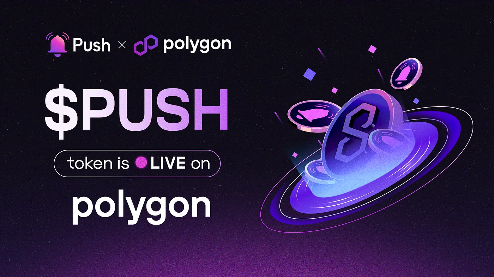
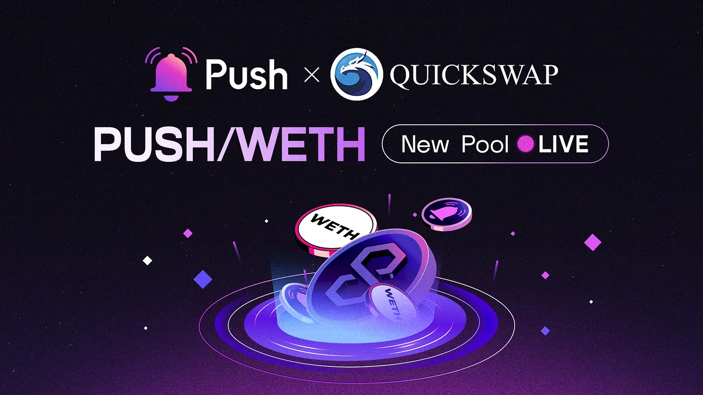

import { SubHeader } from '@site/src/components/SharedStylingV2';

<!--truncate-->

<SubHeader>
    New composability, accessibility, and utility for the $PUSH token.
</SubHeader>

Today we are excited to announce the launch of the $PUSH token on Polygon!

Following the successful launch of Push Protocol onto Polygon mainnet last year, we are now carrying over that multi-chain functionality and composability to our $PUSH token.

In combination with the newfound utility Pushv2 introduced to the $PUSH token (via incentivized chats and fee pool staking) — we’re now enhancing the $PUSH token’s utility even further by bringing the $PUSH token to Polygon.

We’re extremely excited to be introducing a new set of benefits to our users and to the utility of the $PUSH token.

Let’s dive in.

## Double the utility following the launch of Pushv2
Pushv2 introduced incentivized chats and fee pool staking, two exciting new ways that our community can earn fees, play a more active role as a stakeholder in the Push ecosystem, and get involved. This was designed to introduce a new wave of utility to the $PUSH token.

Now with our $PUSH token launch on Polygon, we’re extending that utility even further.

## New composability, new accessibility, new utility
For the wide range of dApps and protocols already building on top of Push in the Polygon ecosystem, the introduction of $PUSH to Polygon will foster an even greater innovation arena for builders to come up with new projects, ideas, and utility potential.

Additionally, the Polygon network offers incredibly fast and cheap transactions, which makes it an ideal environment to run Push DAO operations.

We’re extremely excited to be seeing the accessibility, usability, and composability of the $PUSH token grow!

## Now live on QuickSwap!

In addition to the introduction of the $PUSH token to the Polygon ecosystem, we are also pleased to announce the listing of the $PUSH token on [QuickSwap!](https://quickswap.exchange/#/)

QuickSwap is the second largest Polygon-native decentralized exchange. It’s a layer-2 solution based on an AMM model that enables users to trade any ERC-20 assets with low gas fees.

As one of the most prominent DEXs on Polygon, QuickSwap is completely aligned with our mission of facilitating cross-chain communication. We look forward to introducing the $PUSH token to a new set of QuickSwap and Polygon users!

Liquidity will be managed by Gamma AMM and you can stake your LP tokens to earn more rewards directly on [Gamma’s farm](https://quickswap.exchange/#/farm).

✨✨✨👉[Provide $PUSH/WETH Liquidity here](https://quickswap.exchange/#/pools?currency0=0x58001cC1A9E17A20935079aB40B1B8f4Fc19EFd1&currency1=0x7ceB23fD6bC0adD59E62ac25578270cFf1b9f619) 👈✨✨✨

### Let’s go!
We are confident that launching on Polygon will help further our goals and bring our vision of decentralized communication to life. We look forward to sharing more exciting news related to our token launch in the coming days — so stay tuned.

Thank you for your support and happy trading!

### About Push Protocol

Push is the communication protocol of web3. Push protocol enables cross-chain notifications and messaging for dapps, wallets, and services tied to wallet addresses in an open, gasless, and platform-agnostic fashion. The open communication layer allows any crypto wallet /frontend to tap into the network and get the communication across.

To keep up-to-date with Push Protocol: [Website](https://push.org/), [Twitter](https://twitter.com/pushprotocol), [Telegram](https://t.me/epnsproject), [Discord](https://discord.gg/pushprotocol), [YouTube](https://www.youtube.com/c/EthereumPushNotificationService), and [Linktree](https://linktr.ee/pushprotocol).