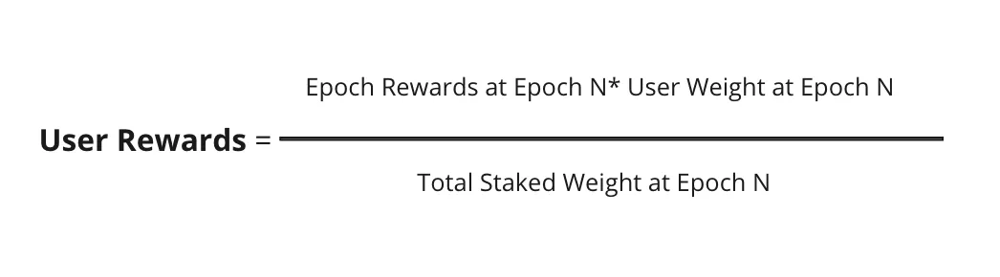

import { SubHeader } from '@site/src/components/SharedStylingV2';

<!--truncate-->

<SubHeader>
    2 new liquidity reward pools to earn $PUSH from.
</SubHeader>

Push Liquidity Rewards Program v1 ended a few weeks ago and v2 is now HERE🎉

With v2 comes a whole new set of liquidity rewards that provide robust incentives for all liquidity providers and token holders.

Most notably, $PUSH token holders now have the ability to stake directly in the Core v2 contract’s staking feature to earn rewards directly from our Core contract via the Push Fee Pool. This means stakers will now have the opportunity to earn incentives as the protocol continues to flourish.

Begin staking 👉 https://app.push.org/yieldv2

## Brief Glance at Push Liquidity Rewards Program v2
1. <b>The v2 liquidity rewards program provides two options for participation:</b> UNI-v2 LP Token Staking: Similar to v1 incentive program, this procedure allows users to stake their UNI-v2 LP tokens in our staking contract and earn $PUSH tokens as a reward.
2. <b>Push Fee Pool Staking:</b> The second procedure is the new staking feature of the Push Core V2 smart contract that allows users to directly stake in the core contract itself and earn rewardsx in $PUSH Tokens.

The Push Fee Pool collects $PUSH tokens in fees for Push Notifications, Channel-related actions, and Chat. These fees are hence distributed to all stakers in the Core v2 smart contract. Put most simply, these rewards are directly linked to the protocol’s growth. As the protocol grows with more channels, so do the fees and hence incentives that Push Fee Pool stakers can receive.

## Important Details About the new Incentive Program
1. All rewards will be distributed in $PUSH tokens.
2. A total of <b>3,414,700 $PUSH</b> is allocated towards this reward program.
3. Epoch Duration: Each epoch will be <b>21 days</b> long in the new rewards program. This is for both staking programs <b>UNI-v2 Staking and Protocol Fee Pool Staking.</b>.
4. Staking will only be available through the official Push dApp [Incentives — Yield Farming page](https://app.push.org/yieldv2).
While these are the high-level details related to Push Liquidity Rewards Program v2, let’s now dive in to get a complete understanding of the two different types of staking mechanisms.

## Push Fee Pool Staking Details
1. The staking mechanism in core v2 is epoch-based staking. That is, the entire distribution of rewards is split into epochs during which users can stake and rewards can be accumulated.

2. <b>Epoch Duration</b>: Each epoch is <b>~21 days or 3 weeks long.</b>

3. <b>Total Rewards Allocated: 1,323,100 PUSH + Core V2 Protocol Fees</b>

<blockquote>
    <i>
    <b>Note:</b> The Push Fee Pool consists of two $PUSH token sources. The first source is from the collection of fees *that the protocol earns from channel specific actions like channel creation (as previously mentioned). The second source is from a manual release of 1,323,100 $PUSH tokens for every epoch. As such, staking in the Push Fee Pool entitles you to earn rewards from both these sources simultaneously
    </i>
</blockquote>

4. <b>Staking $PUSH tokens</b>:

- $PUSH token holders can stake their tokens at any given time in the Core v2 contract.
- $PUSH has time weightage built in. This means people who have held $PUSH longer are rewarded more the longer they stake.

5. Unstaking $PUSH Tokens

- The staking algorithm of Core contract <b>doesn’t impose any lock-in period.</b> This means holders are free to stake or un-stake whenever they wish.
- While no lock-in period is imposed, there is a delay period of at least one epoch before a user can withdraw or harvest. This means that any stake during a current epoch will require the user to at least wait T+1 epoch before they can claim rewards or withdraw their harvest. This is done to ensure bad actors can’t misuse epoch duration for unfair rewards.

6. <b>Reward Harvesting</b>

- The total rewards available and claimable in an epoch rely on the protocol’s fee pool, i.e. the amount of $PUSH earned by the protocol itself. The more $PUSH tokens accumulated by the protocol during an epoch, the more rewards for the stakers of that specific epoch.
- When it comes to harvesting rewards from the contract, users harvest rewards for all the epochs in which they were staked. <b><i>
This basically means the longer a user stakes, the more rewards they should be able to harvest.
</i></b>
- Mentioned below is the formula used to calculate the rewards of any staker in a given epoch (N) 👇

<blockquote>
    <i>
    <b>Note:</b> An important detail here is users cannot claim rewards for the current epoch. For instance, if a user stakes at epoch 1 and tries to claim at epoch 6 (which is the current epoch), that user will only be able to claim for epochs 1 to 5. This is because epoch 6 is currently active, and the contract doesn’t allow claiming rewards from a current epoch.
    </i>
</blockquote>

## UNI-v2 LP Token Staking Details
1. The UNI-V2 LP staking is exactly the same to the previous staking program. That is, $PUSH token holders earn incentives for providing liquidity on Uniswap.

2. <b>Total Rewards Allocated: 1,743,000 $PUSH tokens</b>

3. <b>Epoch Duration</b>: Each epoch is <b>~21 days long or 3 weeks long.</b>

4. <b>Staking UNI-V2 Tokens</b>

- In order to stake in this program, users will first need to provide liquidity for PUSH on Uniswap.
- This can be done by visiting the [PUSH/ETH Uniswap Pool](https://app.uniswap.org/#/swap?inputCurrency=0xf418588522d5dd018b425e472991e52ebbeeeeee) and adding liquidity. Once added, users will be given Uniswap-V2 LP tokens which can then be staked on the UNI-V2 LP staking pool on the [Push dApp](https://app.push.org/yieldv2), to begin earning rewards.
5. <b>Withdrawing UNI-V2 Tokens</b>

- Users can withdraw their their UNI-V2 LP tokens from the [Push dApp staking portal](https://app.push.org/yieldv2) at any time.
6. Reward Harvesting

- Liquidity providers can harvest rewards for their staked amount by simply clicking onto the <b> Claim Rewards</b> button on the [Push Dapp Yield Farming V2 page.](https://app.push.org/yieldv2)
- Allocated rewards will decrease for each sequential epoch.
- Rewards will be distributed at the end of each epoch (21 days), to be shared in % proportion to a user’s contribution to the pool.
- Earlier participants in the staking program will earn higher rewards.
7. Mentioned below is the formula used to calculate the rewards for a given liquidity provider in the UNI-V2 LP Staking mechanism 👇

### Migration from previous staking program
If you were part of the previous $PUSH staking program, it is recommended you simply migrate your previously staked tokens into the new staking pools.

We’ve made every effort to make this as simplified of a process as possible. The Push dApp will provide a <b>One-Click Migration</b> button for all stakers which will allow you to easily migrate all of your previous stakes to the new staking pools without any complications.

<blockquote>
    <i>
    <b>Note:</b> A complete guide on the new Yield Farming V2 user interface navigation will be released in the next couple of days. This will include every imperative step of how to stake, unstake, harvest rewards, and migrate for any of the given pools, using the UI itself.
    </i>
</blockquote>

Happy staking 👉https://app.push.org/yieldv2

### About Push Protocol

Push is the communication protocol of web3. Push protocol enables cross-chain notifications and messaging for dapps, wallets, and services tied to wallet addresses in an open, gasless, and platform-agnostic fashion. The open communication layer allows any crypto wallet /frontend to tap into the network and get the communication across.

To keep up-to-date with Push Protocol: [Website](https://push.org/), [Twitter](https://twitter.com/pushprotocol), [Telegram](https://t.me/epnsproject), [Discord](https://discord.gg/pushprotocol), [YouTube](https://www.youtube.com/c/EthereumPushNotificationService), and [Linktree](https://linktr.ee/pushprotocol).