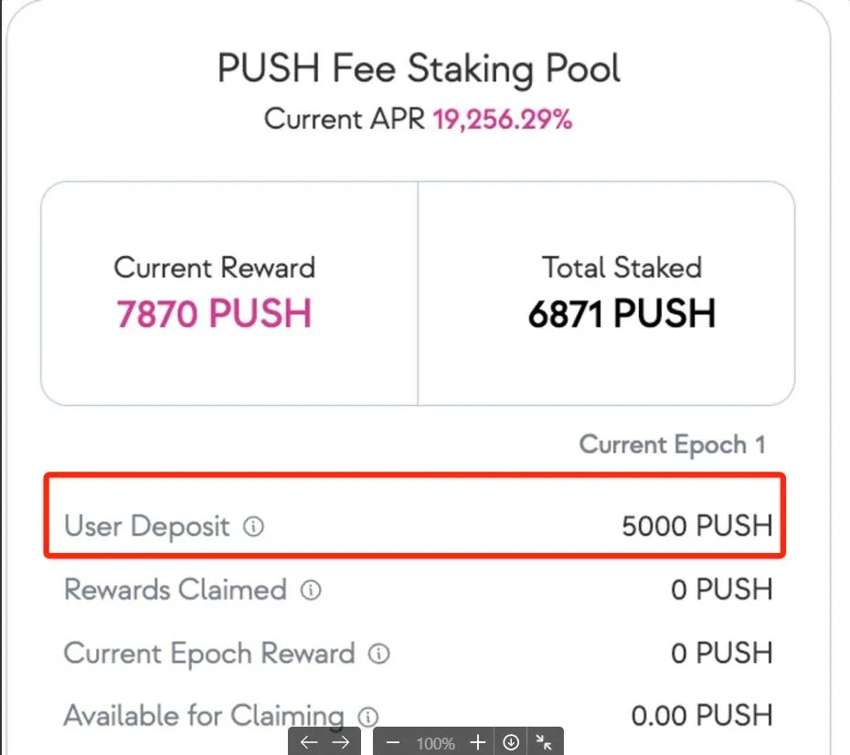
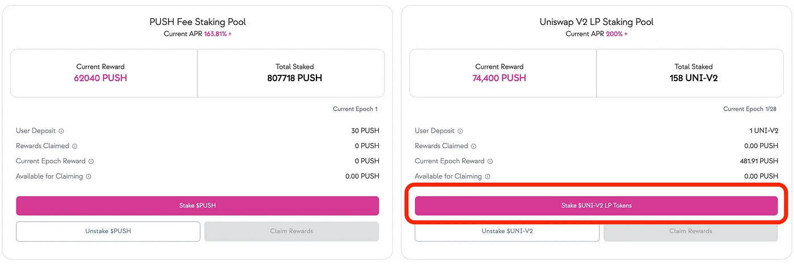
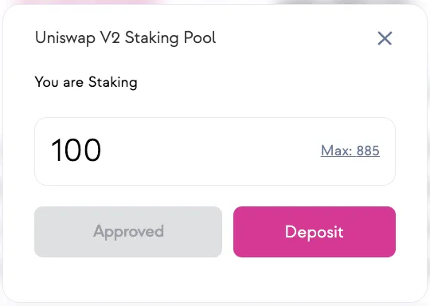

<i>
    A walkthrough on how to stake, harvest, and migrate your $PUSH tokens.
</i>

<!--truncate-->

We recently released an [article](https://push-protocol.medium.com/new-push-yield-farming-rewards-full-details-4a9ff473226d) extensively discussing the details of our new staking programs of the Push V2 Rewards Program including…

1. <b>UNI-V2 LP Token Staking</b>: Similar to v1 incentive program, this procedure allows users to stake their UNI-V2 LP tokens in our staking contract and earn $PUSH tokens as a reward.
2. <b>Push Fee Pool Staking</b>: The second procedure is the new staking feature of the Push Core V2 smart contract that allows users to directly stake in the core contract itself and earn rewards in $PUSH Tokens generated from the Fee Pool.

In this article, we will now walk you through the specific steps for both the UNI-V2 LP pool and the Push Fee Staking pool:

- <i>How to Stake and Unstake Tokens</i>
- <i>How to Harvest your rewards</i>
- How to Migrate your tokens (from the Old Staking pools to the New V2 Rewards Program, with just one click)

For each of these steps, we will first talk about the 🔴 <b>Push Fee Staking Pool</b> and then the 🟣 <b>UNI-V2 LP Token Staking Pool</b>

## How to Stake & Unstake Tokens
### 🔴 PUSH Fee Staking Pool
### Staking $PUSH Tokens
Push Fee Staking Pool allows you to stake your PUSH tokens directly in the [Push Core contract](https://etherscan.io/address/0x66329Fdd4042928BfCAB60b179e1538D56eeeeeE) itself.

<iframe width="100%" height="510" src="https://www.youtube.com/embed/eRm-tp6SLVg" title="Push V2 Fee Staking Pool Tutorial | $PUSH" frameborder="0" allow="accelerometer; autoplay; clipboard-write; encrypted-media; gyroscope; picture-in-picture; web-share" allowfullscreen></iframe>

Follow the simple steps below to Stake to Push Fee Staking Pool:

1. Go to Yield Farming v2 Page on PUSH Dapp 👉 https://app.push.org/yieldv2
2. Go to the left-hand part of the UI that displays the <b>PUSH Fee Staking Pool</b>.
3. Click on the <b>Stake PUSH</b> button
4. Once you click on stake, you will be prompted to enter the PUSH token amount you wish to stake. 👇

5. Then, simply click on <b>Approve PUSH</b> button to approve the transfer of your tokens.

6. Once completed, you should have the option to click on the <b>Deposit</b> button right away.

7. After successful execution of your transaction, you should see the right staked amount in the UI.

### Unstaking $PUSH Tokens
1. Simply click on the <b>Unstake PUSH</b> button to unstake from the staking pool.
2. After successful execution of your transaction, your tokens should be unstaked from the contract and transferred back to your wallet.

<b>Important considerations for the unstaking procedure in Push Fee Staking Pool:</b>

- The pool <b>doesn’t impose any lock-in period</b>. This means holders are free to stake or un-stake whenever they wish.
- While no lock-in period is imposed, <b>there is a delay period of at least one epoch before a user can withdraw or harvest</b>. This means that any stake (within the current epoch) will require the user to wait T+1 epoch before they can claim rewards or withdraw their harvest. 1 epoch is 21 days long.
Unstaking tokens in this pool will automatically harvest and transfer any pending reward tokens to your wallet as well.
🟣 UNI-V2 LP Staking Pool
The UNI-V2 LP staking pool allows you to stake your LP tokens and earn yields for the same.

<blockquote>
<i>
    <b>Note:</b> In order to participate in this pool, providing liquidity to the PUSH/ETH Uniswap pool is the first step. To do that, simply:
</i>
</blockquote>

<iframe width="100%" height="510" src="https://www.youtube.com/embed/lqMuOlOGP0s" title="Push Uniswap V2 LP Staking Pool | $PUSH" frameborder="0" allow="accelerometer; autoplay; clipboard-write; encrypted-media; gyroscope; picture-in-picture; web-share" allowfullscreen></iframe>

1. Go to the [PUSH/ETH V2 pool on Uniswap](https://app.uniswap.org/#/add/v2/ETH/0xf418588522d5dd018b425E472991E52EBBeEEEEE)  (Remember to navigate to Uniswap V2 pool and not V3 pool).
2. Add liquidity into the pool with both $PUSH and $ETH.
3. Once added, you should receive UNI-V2 LP tokens in your wallet.
4. You are now ready to stake to these LP tokens into for Push V2 reward program.
### Staking UNI-V2 LP tokens
1. Go to Yield Farming v2 Page on PUSH Dapp 👉 https://app.push.org/yieldv2
2. Go to the right-hand part of the UI that displays <b>Uniswap v2 LP Staking Pool.</b>
3. Click on the <b>Stake $UNI-V2 LP Tokens</b> button

4. Enter the amount of LP tokens to be staked, and click on <b>Approve Uni-V2</b>

5. Once approved, simply click on the <b>Deposit</b> button.

6. After successful execution of your transaction, you should the right staked amount in the UI.

### Unstaking UNI-V2 LP Tokens
1. Click on <b>Unstake UNI-V2</b> button.
2. This will trigger a metamask Pop-UP. Once confirmed you should simply be able to unstake your LP tokens from the pool.

## How to Claim Rewards
Claiming rewards for both the pools is fairly similar.

1. Go to the respective pool on [Push Dapp Yield Farming V2 page](https://app.push.org/yieldv2).
2. Click on the <b>Claim Rewards</b> button of the PUSH Fee Staking Pool or UNI-V2 Staking Pool.
3. Confirm the transaction and rewards will be transferred to your wallet.

However, there are a couple of considerations to keep in mind related when harvesting rewards.

### 🔴 Harvesting in PUSH Fee Staking Pool
The very first claim reward procedure for this pool shall include two transactions:

- 1st Transaction is <b>to Set Holder Delegation for the Push Core Contract address.</b>
- 2nd transaction is to trigger the <b>primary harvest function of the Push core contract</b> to release the rewards.

<b>What exactly is Setting Holder Delegation?</b>

- The $PUSH token has a time-weightage feature within itself which allows the contract to calculate the holder weight of a $PUSH token holder based on how long he/she has been holding the token.
- During the harvest, the core contract is designed to be capable of updating the holder weight of the caller to the latest block.
- Therefore, this <b>set holder delegation</b>transaction approves the main Push Core contract to be capable of updating holder weight whenever needed.
- It should be noted that this permission can be revoked anytime by the user.

<blockquote>
<i>
    <b>Note:</b> The setting holder delegation is a one-time process and only takes place during the very first instance of claiming rewards.
</i>
</blockquote>

### 🟣 Harvesting in UNI-V2 LP Staking Pool
- The steps for harvesting in UNI-V2 LP Staking Pool are identical to that of harvesting in the PUSH Fee Staking Pool
- Go to the UNI-V2 LP Pool on [Push Dapp Yield Farming V2 page](https://app.push.org/yieldv2).
- Click on the Claim Rewards button of the UNI-V2 Staking Pool.
- Confirm the transaction and rewards will be transferred to your wallet.

## How to migrate from the old staking pool to the new pool?
If you’re an early holder of $PUSH, chances are you’ve staked in the first rewards program.

If that’s the case for you, the migration feature is specifically designed to provide you with a smooth and easy procedure to shift from the old staking pool to the new v2 staking pool.

<iframe width="100%" height="510" src="https://www.youtube.com/embed/a3QDLsT0VRM" title="Push Migration Guide | $PUSH" frameborder="0" allow="accelerometer; autoplay; clipboard-write; encrypted-media; gyroscope; picture-in-picture; web-share" allowfullscreen></iframe>

Migration from old to new pools requires 3 simple transactions:

1. <b>Unstaking from old contracts:</b> This transaction withdraws your staked tokens from the old contracts.
2. <b>Approval of tokens:</b> This ensures you approve the new staking pool contracts.
3. <b>Staking into new pool:</b> The final transaction ensures a successful deposit of your tokens to the new staking pools.

In order to perform the migration procedure, please follow the steps below:

1. Go to Yield Farming v2 Page on PUSH Dapp 👉 https://app.push.org/yieldv2
2. Go to the <b>Yield Farming V1 (Deprecated)</b> section.

### 🔴 For Push Staking Pool Migration
1. Simply go to the Push Staking Pool section
2. Click on <b>Migrate to PUSH Fee Pool</b> button
3. After the above-mentioned 3 transactions, your staked tokens will be migrated from the previous $PUSH Token staking contract to the new $PUSH Fee Staking Pool <b><i>(which essentially is the main Push Core contract itself).</i></b>
### 🟣 For UNI V2 Staking Pool
1. The procedure remains the same as mentioned above.
2. However, in this migration, your tokens will be staked in the new UNI-V2 Staking Pool.

<blockquote>
<i>
<b>Note:</b> Unstaking tokens from old staking contracts doesn’t ensure the claiming of pending rewards. Make sure you claim pending rewards (if any) from old staking pools after the migration is completed.

In order to claim any available pending reward from your previous pools, you can click on the Claim Rewards button of that respective pool in the Yield Farming V1 section.
</i>
</blockquote>

### About Push Protocol

Push is the communication protocol of web3. Push protocol enables cross-chain notifications and messaging for dapps, wallets, and services tied to wallet addresses in an open, gasless, and platform-agnostic fashion. The open communication layer allows any crypto wallet /frontend to tap into the network and get the communication across.

To keep up-to-date with Push Protocol: [Website](https://push.org/), [Twitter](https://twitter.com/pushprotocol), [Telegram](https://t.me/epnsproject), [Discord](https://discord.gg/pushprotocol), [YouTube](https://www.youtube.com/c/EthereumPushNotificationService), and [Linktree](https://linktr.ee/pushprotocol).