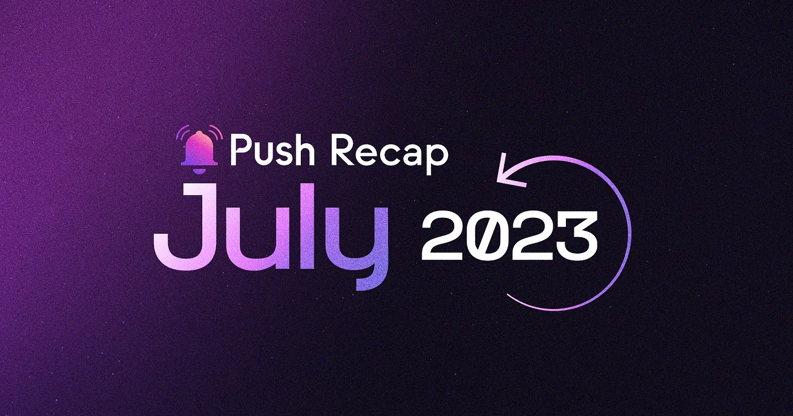

<!--truncate-->

July has been nothing short of extraordinary! We made some groundbreaking developments that have taken Push to new heights. Let’s dive into the major achievements that have shaped our journey this month.

## Development⚒️

Most notably, we’re thrilled to [unveil Push V2!](https://medium.com/push-protocol/push-v2-is-live-new-rewards-utility-functionality-4d591284209d)

This update introduces exciting new features including brand [new yield farming rewards via Push Fee Pool Staking](https://medium.com/push-protocol/new-push-yield-farming-rewards-full-details-4a9ff473226d), Incentivized Chat functionality, [all-new Push Spaces](https://push-protocol.medium.com/push-spaces-is-live-decentralized-audio-and-video-streaming-is-here-bc77deed16ca) and Customized Profiles. All these features aim at empowering users, rewarding participation, creating a circular economy to democratize web3 communication and expand the horizons of dApp UX possibilities. We’re excited for the future!

Another major highlight of July was the [launch of $PUSH token on Polygon and Quickswap](https://push-protocol.medium.com/push-is-live-on-polygon-quickswap-b683ef0f71d8), providing multi-chain accessibility, usability, and composability. This launch, coupled with the Push v2 launch, unlocks new utility for $PUSH, creating endless possibilities for developers within the Polygon ecosystem.

Following the successful launch of $PUSH on Polygon, we launched the [$PUSH-USDC lending & borrowing pool on Timeswap](https://push-protocol.medium.com/pushing-ahead-in-time-push-x-timeswap-6a94edaffc03), enabling users to borrow $PUSH at a fixed interest rate and lend $PUSH to earn a fixed interest rate. All enriched by Timeswap’s non-liquidatable loans & adjustable APR features.

There’s more! We continue to elevate the Push experience as we [unveiled Push Spaces](https://medium.com/push-protocol/push-spaces-is-live-decentralized-audio-and-video-streaming-is-here-bc77deed16ca), a decentralized, incentivized, community-based streaming solution for the future of online communication. With Push Spaces, we’re continuing to build out the decentralized communication space by providing the web3 with better UX, privacy, and censorship-resistant communication solutions.

## Frens of Push💜

July was brimming with exciting partnerships, forging a stronger web3 communication ecosystem for Push and our frens. We’re excited to have new members in the fam:

1. Our collaboration with [DataverseOS](https://x.com/PushChain/status/1678455797867585564) allows web3 data infrastructure developers to leverage the power of decentralized Push communication tools.
2. The partnership with [Linea](https://x.com/PushChain/status/1678746417018413058) enables UX enhancements for builders using their zkEVM rollup.
3. We are thrilled to power web3 messaging and notifications on [ReviseNFT’s LensBird](https://x.com/PushChain/status/1679083431022723072), a decentralized social gaming platform.
4. We teamed up with [Idential](https://twitter.com/identialxyz/status/1674792960632975365?s=20) to provide users with real-time notifications to stay updated on new attestations.
5. We’re excited to integrate Push Notifications for [Lif3 Wallet](https://x.com/PushChain/status/1680245839636176897) users, delivering real-time alerts based on individual configurations.

## Featured In📰

We had the privilege of being featured and participating in various esteemed events and platforms:

1. [EthCC was incredible](https://x.com/PushChain/status/1686053348619829256). We were delighted to be part of several awesome discussions and events. We always enjoy making new frens and meeting old ones. Here’s what we got up to:

- Our CEO and co-founder, Harsh, took the stage at EthCC with his insights on “[How Improving the Crypto UX Can Drive Mass Adoption.](https://x.com/PushChain/status/1681695398191325184)”
- Harsh also joined in various discussions during EthCC, including topics like “[Pushing the Boundaries of Web3 UX](https://x.com/PushChain/status/1679845888854831105)” at Infracon hosted by Biconomy, Particle Network, and Transak, and “[Unleashing the Crypto AI Nexus”](https://x.com/PushChain/status/1681240353750253569) with IOSG Ventures.
- Our co-founder, Richa, joined a panel of experts to talk about “[The Power of Unstoppable Marketplace and Building a Community with Branded TLDS](https://x.com/PushChain/status/1680238517006336006)” hosted by Unstoppable Domains.

2. We were honored to be featured on [Polygon’s MerokuStore](https://x.com/PushChain/status/1681988469873168384) “dApp-sdk” as their trusted messaging partner with other EthCC partners like Transak, Biconomy, and DappLooker.

3. Push was featured at [Encode Club’s Hacker House](https://x.com/PushChain/status/1679181327340273695) as a Zero to dApp partner, shedding light on the significance of web3 messaging, notification, and video apps.

4. Harsh was featured in [Quickswap’s Mega Twitter Space](https://x.com/PushChain/status/1681768659214106627) event, “All Roads Lead to Polygon,” alongside other prominent Polygon frens, discussing the exciting “Wild West of web3 Marketing.”

## Community and Governance🤝

Our community continues to thrive with a multitude of exciting engagements.

We hosted two engaging Twitter Spaces. The first session, “[The Art of Successful Grant Proposals](https://x.com/PushChain/status/1681664158582939648)” featured industry experts sharing invaluable insights on securing grants for web3 projects. Our second session, “[How to Create a Sticky web3 Gaming UX,](https://x.com/PushChain/status/1680980161137704961)” delved into the realm of web3 gaming, where experts shared their secrets on crafting immersive user experiences in web3 gaming.

To further empower the next generation of web3 developers, we launched the [Back2School Push Grant Program](https://x.com/PushChain/status/1679818451945136128). This program is focused on student-led web3 community projects at universities, with the aim to foster learning, collaboration, and education on cutting-edge web3 development.

In addition, we introduced 2 [brand new Push missions](https://x.com/PushChain/status/1680472360313577472), offering our community members a chance to contribute to the ecosystem while earning $PUSH tokens.

What’s more? The [Push India tour](https://x.com/PushChain/status/1682737259282325511) is on the horizon, providing a platform for web3 enthusiasts from all across India to connect, engage, and collaborate. We look forward to seeing you all!

Lastly, we congratulate the [16 incredible winning teams](https://x.com/PushChain/status/1684189869478760448) who built using Push at the ETHGlobal Paris Hackathon. Their innovative projects showcased the power and potential of decentralized communication in various domains.

As we bid farewell to July, we are inspired by the progress we’ve made and the extraordinary community support.

Thank you for being a part of the Push journey. Stay tuned for more updates and exciting developments!
