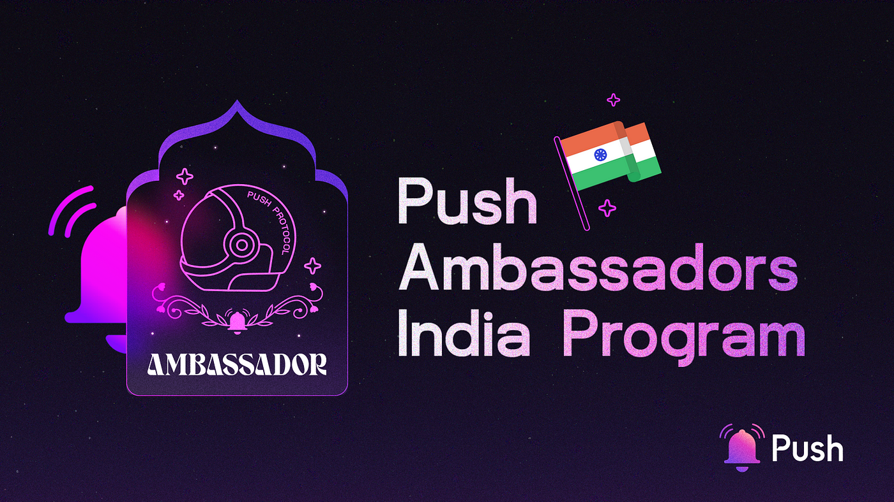

import { SubHeader } from '@site/src/components/SharedStylingV2';

<!--truncate-->

<SubHeader>
We’re looking for new ambassadors in India to join us!
</SubHeader>

Following the recent success of our Push Ambassador Program in LATAM, we are thrilled to be expanding our Ambassador Program to India!

The Push Ambassador India Program is an exciting expansion of our community initiative designed to grow our presence and foster a dynamic community of web3 enthusiasts across India. We couldn’t be more excited to be embarking on this new chapter and inviting new web3 ambassadors into the Push fam.

## Looking for New Ambassadors!
Leading the charge with the Push Ambassador India Program, our vision is to establish a vibrant network of ambassadors who will serve as the face of Push Protocol within India. As such, your role as a Push Ambassador is to:

- Organise workshops and webinars related to blockchain, cryptocurrencies, and Push Protocol’s technology.
- Grow and nurture a vibrant community of crypto-enthusiasts on campus.
- Utilise social media platforms to share educational content, news, and updates about Push Protocol.
- Strategize and execute marketing campaigns to promote Push Protocol’s initiatives on campus.
- Act as a mentor for new ambassadors joining the program in subsequent years.

We are looking for web3 enthusiasts interested in becoming a top contributor for Push Protocol to join us as part of the first phase of expansion in India.

## Requirements — who can apply?
We’re all about diversity and embracing different talents. With that, there are only a few requirements you need:

- Need to be an Indian citizen
- Must be passionate and interested in web3
- Knowledge of coding/developing in web3 is a plus, but not a requirement! We are looking for all kinds of web3 enthusiasts!
- Strong communication skills
- Active presence on social media
- Love the color purple
- Think the 🔔emoji is beautiful

If this sounds like you or someone you know — apply!

## What are the steps to become a Push Ambassador in India?
### Step 1: Application
Applying is simple — fill out the form below to submit your application.

https://zv9atndluia.typeform.com/PushIndia

Make sure to review the requirements stated above to give yourself the best chance of being selected!

### Step 2: Interviews
If you’re shortlisted, get ready for a friendly chat with members from our team. We’ll dive deeper into your interests and experiences to get to know you better.

### Step 3: Party time
Congratulations on making it! As a selected ambassador, you’ll be invited to an onboarding session with the Push DAO community lead who will be by your side to ensure you’re supported every step of the way.

We’ll provide you with training so you’re in the know-how, and we’re here to back you with all the additional support you need to help you best shine in your new ambassador role.

## Benefits of Joining the Push Fam!
Becoming a Push Ambassador entitles you to a host of benefits including:

- <b>Experience</b>: Work alongside leading web3 cofounders, devs and leaders who will always be there to share insights and knowledge with you.
- <b>Network</b>: As a representative of Push you’ll not only get to network with the internal team, but you’ll also get to know other Push partners, collaborators, and ambassadors.
- <b>Rewards</b>: Ambassadors get access to financial rewards as well as perks like exclusive Push swag.
- <b>Autonomy</b>: This opportunity lets you make the most of your ambitions while having strong autonomy. You’ll be supplied with the resources you need to pursue a particular web3 interest you have and fulfill whatever productive outlet you want to pursue.

## Submit Your Application by 26th August!
Application Link 👉https://zv9atndluia.typeform.com/PushIndia

The Push Ambassador India Program is all about representatives who can elevate brand awareness, foster collaborations, and cultivate a steady user base.

For those who make it through the program, exciting doors could open. You’ll get valuable experience from working with web3’s leading communication layer and our partners, as well as an opportunity to drive your own initiatives within the web3 space.

If you’re fueled by a passion for web3 and decentralized communication, apply now!

### About Push Protocol

Push is the communication protocol of web3. Push protocol enables cross-chain notifications and messaging for dapps, wallets, and services tied to wallet addresses in an open, gasless, and platform-agnostic fashion. The open communication layer allows any crypto wallet /frontend to tap into the network and get the communication across.

To keep up-to-date with Push Protocol: [Website](https://push.org/), [Twitter](https://twitter.com/pushprotocol), [Telegram](https://t.me/epnsproject), [Discord](https://discord.gg/pushprotocol), [YouTube](https://www.youtube.com/c/EthereumPushNotificationService), and [Linktree](https://linktr.ee/pushprotocol).