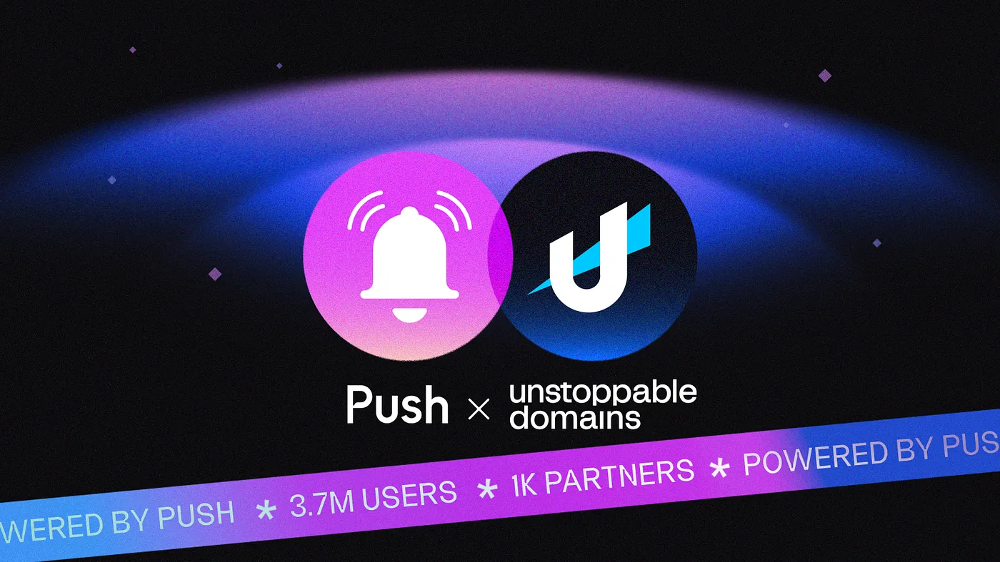

import { SubHeader } from '@site/src/components/SharedStylingV2';

<!--truncate-->

<SubHeader>Welcoming B2U messaging partners Polygon, Blockchain.com and MetaRides</SubHeader>

Push Protocol is thrilled to announce our groundbreaking partnership with [Unstoppable Domains](https://unstoppabledomains.com/) to enable business-to-user (B2U) messaging through [Unstoppable Messaging!](https://unstoppabledomains.com/blog/categories/announcements/article/unstoppable-messaging) For businesses, brands, and web3 projects interested in interacting with their community and delivering a better user experience, messaging just got a lot more accessible.

Unstoppable Domains is the leading platform for acquiring, owning, and holding web3 domains. With more than 3.7 million domains registered, 1000 integrations, and 10 top-level domains, Unstoppable Domains is redefining new ways for brands to interact with their users.

Integrations are already live on [Polygon](https://polygon.technology/), [Blockchain.com](http://blockchain.com/), and [MetaRides](https://metarides.io/) with many more business integrations to follow!

We’re excited to be at the forefront of this game-changing user experience and even more excited for the development possibilities to come.

## TL;DR — What’s Happening

Recently, Unstoppable Domains announced [Unstoppable Messaging](https://unstoppabledomains.com/blog/categories/announcements/article/unstoppable-messaging), web3-native, domain-based messaging (.polygon, .eth, .crypto, etc.). Push Protocol is partnering with Unstoppable Domains to power “business-to-user” (B2U) messaging on Unstoppable Messaging. B2U messaging will allow any business owning a domain to message their domain-owing customers and partners natively on web3.

Want more information? Let’s break it down in more detail. 🔔

## Unstoppable Communication for Web3 Businesses

Unstoppable Domains is on a mission to create a user-owned, web3-native digital identity for every individual on the planet. Your unstoppable domain becomes your web3 identity by allowing you to:

- Use one domain to verify your digital presence across dApps
- Seamlessly log in to applications, games, and metaverses
- Simplify payments by replacing lengthy crypto wallet addresses
- Manage and track data you share across web3…and so much more.

To date, Unstoppable Domains has predominantly serviced individual web3 users. With today’s announcement, Push Protocol now enables Unstoppable Domains to enhance the functionality of their domain names to service web3 businesses as well.

## B2U Messaging: An Engagement Game-changer

In web3, community is everything. But how do you build, foster, and grow a community? Interaction. The aim of B2U is to help businesses and organizations better interact with their users. For businesses, this creates a more engaged and meaningful user experience, which in turn results in users wanting to be part of and remain active in the community.

B2U messaging is accessible on Unstoppable Domains through both the Partner Dashboard and ud.me profile. Here’s how to get started:

### UD.ME Profile Page:

- Send messages directly from your ud.me profile page to users
- Send messages to badge holders (limited message segmentation)

### Partner Dashboard:

Send B2U messages with enhanced segmentation options via the Partner Dashboard

### Possibilities With B2U Messaging

B2U messaging provides a medium for web3 projects to better engage their communities such as carefully segmenting their audience or connecting with new members of their community. Use cases for web3 projects include:

- Informing your community about upcoming events or project updates
- Establishing a direct communication channel with your community (think customer support)
- Sending timely notifications for critical events like liquidation alerts, updates on governance proposals, gaming notifications, and much more
- Targeted and personalized communication for specific segments of your audience

In essence, B2U messaging empowers direct, decentralized, and private communication with your audience. This can dramatically enhance your user-experience and hence community engagement.

<blockquote>
  “We’re thrilled to partner with Push on messaging and add utility to Web3
  domains. Together, we’re building a seamless solution to help domain owners
  build community and foster their identity on Web3. We can’t wait to put
  messaging in the hands of our community and power a new wave of Web3
  communication.” — Sandy Carter, COO and Head of Business Development,
  Unstoppable Domains
</blockquote>

## Integrating Unstoppable Domains is Easier Than Ever

Integrating login support for Unstoppable takes as little time as 30 minutes to set up. Additionally, you get to provide your users with a host of benefits including:

- <b>Resolution + Reverse Resolution</b>: Giving users the chance to replace
  lengthy, complex wallet addresses with an easy-to-remember domain name within
  your dApp.
- <b>Universal Login</b>: Enabling users to effortlessly navigate your dApp with
  a domain they use across web3.
- <b>Partner API</b>: Enable the registration and management of .polygon domains
  within your app to begin earning a share of revenue.

To begin building and integrating Unstoppable Domains 👉 start here.

## .polygon Domains Now on Sale!

As if the introduction of B2U messaging weren’t exciting enough, Unstoppable Domains has a special treat in store — a $2 .polygon domain sale! This means all Tier 8 domains will now be available only at $2.

Stay tuned for more details on this opportunity.

This partnership between Push Protocol and Unstoppable Domains isn’t just about communication, it’s about revolutionizing how businesses operate and making web3 more accessible and user-friendly. Join us on this unstoppable journey into the future of web3, where communication knows no bounds, and digital identity is truly in your hands.

### About Push Protocol

Push is the communication protocol of web3. Push protocol enables cross-chain notifications and messaging for dapps, wallets, and services tied to wallet addresses in an open, gasless, and platform-agnostic fashion. The open communication layer allows any crypto wallet /frontend to tap into the network and get the communication across.

To keep up-to-date with Push Protocol: [Website](https://push.org/), [Twitter](https://twitter.com/pushprotocol), [Telegram](https://t.me/epnsproject), [Discord](https://discord.gg/pushprotocol), [YouTube](https://www.youtube.com/c/EthereumPushNotificationService), and [Linktree](https://linktr.ee/pushprotocol).
