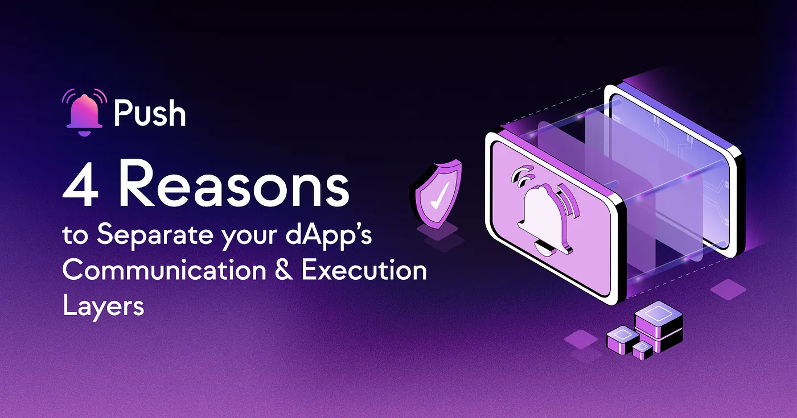

import { SubHeader } from '@site/src/components/SharedStylingV2';

<!--truncate-->

Within web3, decentralized systems reign supreme and the concept of modularity is a key component of innovation. The essence of modularity lies in its ability to intricately craft decentralized applications (dApps) with a sophisticated and intellectually elevated approach.

In this blog post, we embark on an exploration of modularity in web3, unearthing its profound implications and far-reaching influence. By effectively separating the communication and execution layers, modularity empowers developers to construct dApps that boast adaptability, scalability, and interconnectivity.

With a focus on the Push Protocol, we delve into its embodiment of modularity and how it revolutionizes the interaction between dApps and the execution layer. Prepare to uncover the intricacies and potential of modularity within web3 as we navigate the path toward a more refined and intellectually stimulating decentralized ecosystem.

## The 4 Reasons Behind Separate Communication and Execution Layers
When considering the architecture of web3, it is essential to recognize the distinct roles of communication and execution. Here are the key considerations:

- <b>Scalability:</b> Combining the communication and execution layers can hinder scalability by placing additional strain on the blockchain, leading to slower transaction processing and congestion.
- <b>Flexibility:</b> Maintaining a separate communication layer allows for the implementation of various messaging protocols and storage solutions. This flexibility empowers developers to design dApps that align with their specific needs and enhances the overall functionality of the system.
- <b>Security:</b> An independent communication layer helps ensure data privacy and integrity. By implementing robust encryption mechanisms and access controls, messages and notifications remain accessible only to intended recipients, mitigating the risk of unauthorized access and data breaches.
- <b>Data Availability:</b> With the increasing amount of data generated by dApps, managing data availability becomes challenging. By separating communication and execution, developers can implement scalable data storage and retrieval mechanisms, ensuring data remains accessible and available when needed.
By recognizing the importance of separating the communication and execution layers, developers can build a scalable, flexible, and secure web3 ecosystem capable of meeting the demands of decentralized applications.

## Revitalizing Blockchain Development: Unveiling the Power of Modularity
The development journey of blockchain technology has traversed diverse paths, initially overlooking the significance of system and service design principles that form the bedrock of the broader technology landscape. However, as the industry has evolved, the importance of modularity has resurfaced, necessitating projects to embrace a more granular and modular approach to their architecture. This shift aligns with prevailing trends in modern technology, where modular components, layered architecture, and microservices have become essential for creating scalable and adaptable systems.

A prime illustration of the benefits of modularity in the web3 realm can be found in the Push Protocol, a decentralized communication system. By seamlessly integrating the Push Protocol into decentralized applications (dApps), real-time updates and decentralized notifications can be facilitated. This modular solution empowers dApps to enhance their efficiency and usability without compromising the scalability and security of the execution layer.

## The 3 Key Advantages of Modular Design:
- <b>Improved Scalability:</b> Modular components can be developed, tested, and deployed independently, making it easier to scale individual components as needed without affecting the entire system.
- <b>Enhanced Flexibility:</b> Modularity allows for the seamless integration and replacement of components, facilitating rapid iteration and adaptation to new requirements.
- <b>Simplified Maintenance:</b> Modular systems are easier to maintain and troubleshoot, as issues can be isolated and resolved without affecting the entire system.

## Push Protocol: A Testament to the Benefits of Modularity
Push Protocol stands as a testament to the transformative power of modularity in the web3 landscape. By leveraging modular design principles, Push Protocol enhances the efficiency, scalability, and usability of decentralized applications (dApps) without compromising the integrity of the execution layer. Let us delve deeper into the key features of Push Protocol’s modular design and its seamless interaction with the execution layer.

## Key Features of Push Protocol’s Modular Design:
- <b>Separation of Communication and Execution:</b> Push Protocol adopts a clear separation between the communication and execution layers. This deliberate distinction empowers developers to optimize the performance, security, and functionality of each layer independently. By decoupling communication from execution, Push Protocol enables fine-grained control and customization of both layers, leading to enhanced efficiency and adaptability.
- <b>Interoperability:</b> Push Protocol’s modular design fosters interoperability by seamlessly integrating with various blockchains. This cross-chain compatibility enhances the connectedness and robustness of the web3 ecosystem. By embracing Push Protocol, dApps can transcend blockchain boundaries and establish a more interconnected and cohesive decentralized environment.
- <b>Off-chain Communication:</b> Push Protocol incorporates off-chain communication mechanisms, which alleviates the load on the execution layer and contributes to network performance and scalability. By enabling efficient off-chain communication, Push Protocol empowers dApps to leverage real-time messaging, notifications, and analytics without burdening the blockchain. This approach ensures smooth and responsive user experiences while maintaining the scalability and security of the execution layer.

Through its modular design, Push Protocol sets a compelling example for blockchain projects, encouraging them to embrace modularity in their system and service designs. By adopting similar principles, blockchain projects can unlock numerous advantages and elevate the overall performance and flexibility of their systems.

## Facilitating Modularity with Push Protocol
Push Protocol provides a conducive environment for blockchain projects to embrace modular design principles. By incorporating Push Protocol into their architectures, projects can unlock the full potential of modularity. Let’s explore how Push Protocol facilitates and encourages modularity, along with key considerations for system architectures:

- <b>Component Breakdown:</b> Push Protocol encourages breaking down complex systems into smaller, manageable components. This approach empowers independent development, scalability, and optimization of individual components while maintaining a cohesive overall system.
- <b>Layered Architecture:</b> Push Protocol supports the adoption of a layered architecture, allowing projects to optimize individual layers without being constrained by the requirements of other layers. This modular structure enhances flexibility, adaptability, and maintainability, enabling projects to evolve and scale more effectively.
- <b>Leveraging Microservices:</b> Push Protocol emphasizes the adoption of microservices, enabling projects to rapidly iterate and adapt to new requirements. By encapsulating specific functionalities within discrete microservices, projects gain greater flexibility, resilience, and efficient resource utilization.

## Conclusion
Embracing modularity in blockchain development is crucial for fostering innovation, scalability, and flexibility in web3. Push Protocol serves as a compelling example of the advantages that a modular approach can bring to decentralized systems.

By leveraging modularity, projects can enhance functionality, scalability, and user experience. Adopting modular design principles enables independent development, scalability, and optimization of components while maintaining system cohesiveness. Modularity also empowers blockchain developers to adapt to changing requirements, integrate with diverse systems, and of course, reap the benefits of web3’s communication layer.

### About Push Protocol

Push is the communication protocol of web3. Push protocol enables cross-chain notifications and messaging for dapps, wallets, and services tied to wallet addresses in an open, gasless, and platform-agnostic fashion. The open communication layer allows any crypto wallet /frontend to tap into the network and get the communication across.

To keep up-to-date with Push Protocol: [Website](https://push.org/), [Twitter](https://twitter.com/pushprotocol), [Telegram](https://t.me/epnsproject), [Discord](https://discord.gg/pushprotocol), [YouTube](https://www.youtube.com/c/EthereumPushNotificationService), and [Linktree](https://linktr.ee/pushprotocol).