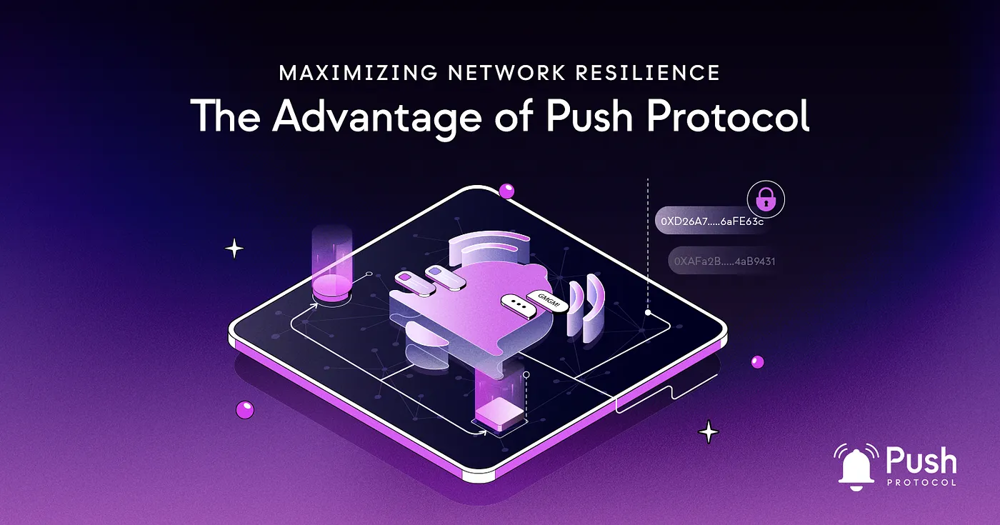

<!--truncate-->

In communication networks, liveness signifies the network’s ability to maintain operations and remain responsive to incoming traffic. Because traditional communication networks possess central points of failure, the entire network is at risk of collapse. This can lead to numerous issues, including disruptions to essential services and communication channels. For example, an outage by a primary IT provider could render an entire network unusable for an extended period.

In contrast, distributed and peer-to-peer (P2P) networks present an alternative model of liveness. These networks rely on nodes to operate effectively, eliminating a single point of failure that could compromise the entire system. This design makes distributed networks highly resilient in the face of significant disruptions.

Nevertheless, liveness can still pose challenges even within distributed and P2P networks. If nodes fail or go offline, communication channels might be disrupted, despite the entire network remaining operational. This is where Push protocol comes into play.

## Unmatched Liveness and Resilience

Push Protocol ensures uninterrupted and resilient communication, even in the face of disruptions. With its distributed and peer-to-peer (P2P) principles, the network remains operational and highly resilient, eliminating the risk of a single point of failure. Redundant nodes, intelligent routing algorithms, and failover mechanisms guarantee liveness, making Push Protocol highly reliable and resilient against disruptions.

## Liveness and Unstoppable Communication

Unlike traditional communication networks that are susceptible to disruptions and censorship, Push Protocol enables unstoppable communication. Nodes can directly communicate with each other without relying on centralized intermediaries. Communication channels established with Push Protocol are sovereign network constructs, ensuring their continued operation and allowing users to stay connected and informed, irrespective of external challenges.

## Immutable Addresses for Uncompromised Communication

Push Protocol enhances the security and resilience of communication channels through the use of immutable addresses. These addresses cannot be deleted or censored, providing an additional layer of protection against tampering or interference. Users can freely and securely communicate with each other as long as they have access to their addresses and the network remains operational.

## Specialized Excellence in Communication

Push Protocol distinguishes itself as a specialized communication layer, dedicating its expertise to perfecting communication functionality. By focusing on being the best in this critical component, Push Protocol empowers other networks and applications within the web3 ecosystem. Through seamless message exchange and notifications across networks, stakeholders can react promptly, maintain network stability, and enhance their overall user experience.

## Unparalleled Support for Network Liveness

Push Protocol’s powerful communication function plays a pivotal role in ensuring the liveness and unstoppable nature of other networks and applications within the web3 ecosystem. By seamlessly exchanging messages and notifications, Push Protocol enables stakeholders to stay informed about critical updates, such as network status, while empowering them to trigger specific functions based on the communication it provides. This ensures that networks and applications remain live, responsive, and resilient, even in the face of challenges. With Push Protocol as the backbone of communication, stakeholders can confidently build and operate decentralized systems that thrive in a dynamic and interconnected web3 landscape.

### Conclusion

As a specialized communication layer, Push Protocol excels in its core function, providing a dependable system for users and developers. Its emphasis on effective communication supports the liveness and resilience of networks within the web3 ecosystem. Seamlessly exchanging messages, notifications, and prompts enhances network stability and user engagement. Push Protocol propels the web3 ecosystem towards a decentralized future with unwavering innovation.
