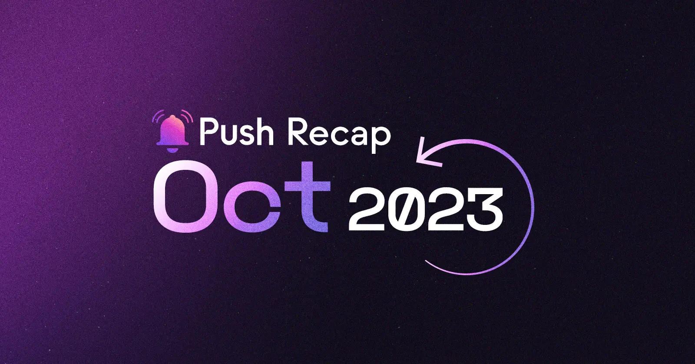

<!--truncate-->

Welcome to another thrilling month at Push!

October has been a month of incredible development, thought-provoking discussions, and community expansion. With so many exciting updates to get through, we're eager to share the highlights of this month in our recap. Let’s get to it.

## Development

We've been hard at work enhancing the Push UX for builders. Our [Push Docs](https://comms.push.org/docs/) have received a major revamp making it easier than ever to build with Push. Some of the exciting new features include:

- Unified API for notifications & chat
- Live playground & code examples
- Object-based APIs
- Integration time reduced to less than 5 minutes

And that's not all! We're thrilled to announce that a new notification settings feature is in the works. Stay tuned for more details on this exciting development!

### Featured and Weekly Reads

Our co-founder Harsh Rajat took the stage at the [Digital Currency Summit 2023](https://x.com/PushChain/status/1707802423559909594), delving into the world of web3 and crypto, sharing insights and expertise.

Richa contributed an insightful article to [Beincrypto](https://x.com/PushChain/status/1716859930165076216), titled "What Is a Blockchain-Agnostic Protocol?" Richa discussed the concept of blockchain agnosticism and how Push embodies these principles. Read the article in full [here](https://beincrypto.com/learn/blockchain-agnostic-protocol/).

We also partook in a fascinating discussion on [web3 and gaming in Dubai](https://x.com/PushChain/status/1717077918923493726), hosted by Cypher Capital, featuring industry leaders like Aavegotchi, Biconomy, Capx, and Farcana.

If you're looking to expand your knowledge, be sure to check out our article on "[Maximizing Network Resilience: The Advantage of Push Protocol.](https://x.com/PushChain/status/1712514575550001513)" This piece delves into the challenges of disruptions in communication networks and how Push overcomes them. Read it here.

### Community and Governance

We're excited to have sponsored two incredible hackathons this month. At [ETHOnline](https://x.com/PushChain/status/1709553967091621991), we offered $5,000 in prizes for builders who harnessed Push's communication tools to create innovative projects. Additionally, we sponsored the [Unfold '23 Hackathon](https://x.com/PushChain/status/1713902616135012554), providing $5,000 in bounties for builders who are developing with Push notifications and chat.

In light of the tremendous success of our Push Ambassador Program in India, we're excited to announce that we're expanding our [Ambassador Program to Africa](https://x.com/PushChain/status/1715027587758444993). We look forward to welcoming new ambassadors from across Africa into the Push family.

### BRB India

Our BRB India journey continued with enthusiasm as we covered [Ahmedabad](https://x.com/PushChain/status/1709204039026520180), [Mumbai](https://x.com/PushChain/status/1711381153020534923), [Bhopal](https://x.com/PushChain/status/1714674275825680532), [Jaipur](https://x.com/PushChain/status/1716453178722464251), and [Delhi](https://x.com/PushChain/status/1719038663735103601) on our dev tour.

Additionally, we initiated [online workshops](https://x.com/PushChain/status/1714642630083060101) to guide you through the protocols and coding challenges behind our $55k in bounties. This is your chance to dive into web3 and build with the biggest names. Check out our [workshop schedule](https://push.org/brb/).

As we wrap up this month at Push, we're grateful for your support and enthusiasm. Let's keep building towards decentralized communication and improving the web3 UX. Until next month!
