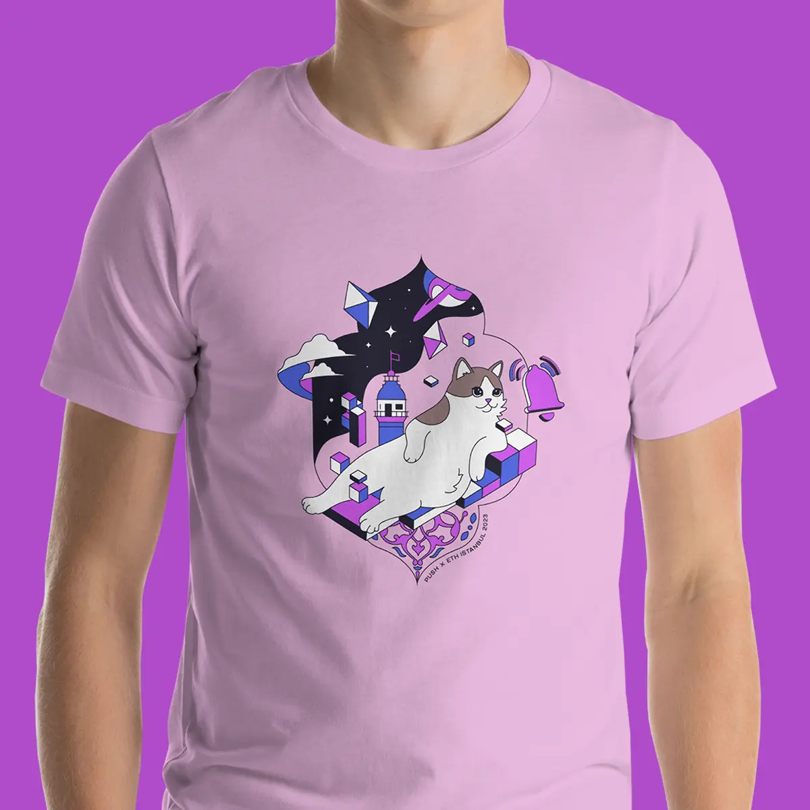

<!--truncate-->

TLDR;

- Push is sponsoring the ETHGlobal Istanbul hackathon
- There are 4 prizes for 13 winners available. Total of $10k.
- We’re hosting a workshop on Friday, Nov. 17 to do a live demo
- All bounty details are included here in this article as well as here on [ETHGlobal page](https://ethglobal.com/events/istanbul/prizes/push-protocol)

Hackers of ETHGlobal Istanbul, get ready, we’re coming!

With Istanbul becoming the epicenter of web3 and blockchain innovation this November, we couldn't be more excited to be a part of it.

Bounties, dev support, free swag, workshops, and a chance to meet the Push team IRL – for builders at the ETHGlobal Istanbul Hackathon, we can’t wait to meet and see what you create.

Here’s everything you need to know with regards to ETHGlobal Istanbul x Push.

### Enhance your dApp w/ web3-native Notifications and Chat and win $10k in Push Bounties 💰

We are happy to be sponsoring the ETHGlobal Istanbul hackathon with $10k bounties across 4 different prizes for a total of 13 winners.

Each prize is different with regards to both the type of Push Communication tools you need to build with, as well as the type of dApp you’re building.

Here's the breakdown:

#### 1. 🏆 Merhaba Push Protocol ⸺ $1,500

We started with “GM GM!” and we’re here with “Merhaba!”.

This bounty is dedicated to the best use of Push Protocol in social-based dApps. It's about leveraging Push Notifications for important alerts and/or using our all-new [Notification Settings](https://push.org/blog/introducing-notification-settings/) to customize notifications. We also want to highlight the potential integration of conditional gating (messaging that can only be accessible by holding a specific NFT, token, or activity history).

Here are a few ideas

- <b>SocialImpactHub</b>: A DApp dedicated to social activists, where users can receive notifications about upcoming rallies or events.
- <b>EcoAlert</b>: An environmental initiative platform where users can chat about sustainable practices
- <b>CommunityCare</b>: A local community DApp where neighbors can communicate in real time, set up events, and receive notifications about local emergencies or activities.
- <b>PushForChange</b>: A fundraising platform that sends out notifications about new charitable campaigns. Users can chat with charity organizers and use conditional gating to access exclusive fundraising events based on their donation history.

"Merhaba Push Protocol" seeks to acknowledge the innovative spirit of developers who merge social initiatives with technology, making a meaningful impact in the world using Push Protocol.

#### 2. 🏆 Turkish Ice Cream - Creative Bounty ⸺ $2,000

Just as getting a Turkish ice cream can bring a few surprises, with this bounty we’re looking for the most ingenious solutions built using the Push Protocol. Challenge the norms and serve up your most creative implementations.

Simply build with Push Notifications, Chat, or Video in any capacity. Best and most creative use case all around wins.

#### 3. 🏆 Push Chat Conditional Gating Integration for DApps ⸺ $1,500

Showcase the potential of Push by integrating its Conditional Gating feature into your dApps. This feature allows you to create dynamic and sophisticated permissions for your user community by setting unique conditions for joining or communicating in specific group chats.

Your task? Integrate the Push Chat conditional gating feature in your dApp, utilizing at least two of the following use cases:

- Token-gated group
- NFT-gated group
- Multi-chain conditions
- Sending message conditions
- Non-web3 conditions using Guild
- Game theories by combining multiple conditions
- Ensure smooth UX/UI and seamless user verification based on the set rules

For more information regarding Conditional Gating and Rules for Group Chats, checkout our documentation here 👉https://comms.push.org/docs/chat/build/conditional-rules-for-group/

#### 4. 🏆 Cappadocia Hot Air Balloon ⸺ $5,000

This is a Pool Bounty prize which will be given to top 10 implementations, priority will be given to those who integrate the following Push Notification/Chat features:

- [Channel settings](https://comms.push.org/docs/notifications/build/create-channel-settings/)
- [Conditional gating](https://comms.push.org/docs/chat/build/conditional-rules-for-group/)
- [Stream notifications](https://comms.push.org/docs/notifications/build/stream-notifications/)

### Everything You Need – Covered in the Push Workshop 🛠️

We're hosting a workshop at ETH Global Istanbul open to all developers to learn how to build using Push’s communication tools titled: How to build native Web3 Messaging & Notifications Apps with Push Protocol.

📅Friday, November 17 – 3:40pm  
🗺️Workshop Room 1

This will be a great chance for you to see a live demo of how to build with Push tools and also a great chance to meet our devs and ask for advice on your project.

With that, we look forward to meeting all of you and can’t wait to see what you build. Be sure to swing by our booth as well to grab your exclusive Push merch. Let’s turn Istanbul pink! 🩷

You can always check out this information and other resource links directly on the ETH Global Istanbul page here 👉 https://ethglobal.com/events/istanbul/prizes#push-protocol

Your Push documentation hub for building is here 👉https://push.org/docs/

And of course 24/7 dev support can always be found here 👉https://discord.com/invite/pushprotocol

Let us know if you have any issues, questions, or need help building. We’re always here to help!

Happy hacking!
