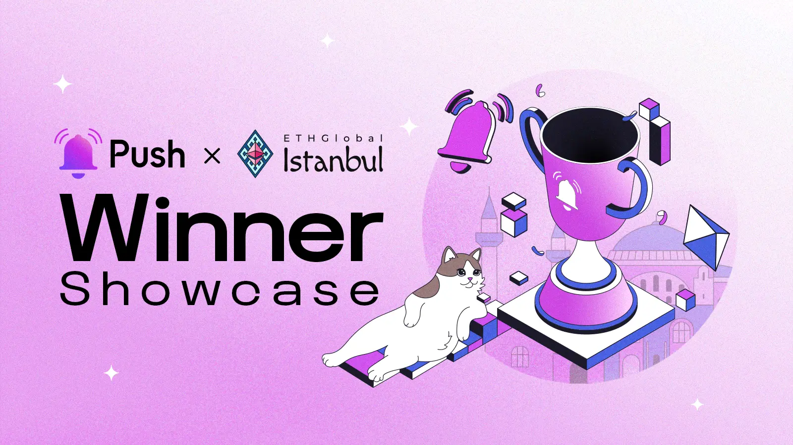

<!--truncate-->

Hackers of ETHGlobal Istanbul, your creativity has shone brightly!

As the echoes of November's web3 and blockchain innovation fade in Istanbul, we are thrilled to have witnessed such extraordinary talent. From innovative bounties to inspiring workshops, the ETHGlobal Istanbul Hackathon was a testament to the ingenuity of the web3 community.

Brimming with groundbreaking ideas, our builders went above and beyond, making it a truly memorable event. Now, we proudly announce the winners who have set new standards in the Push Protocol challenge.

Reflecting on the success of ETHGlobal Istanbul x Push, we're excited to share the remarkable achievements of our winners.

### Pushing Boundaries in Web3 Innovation — Meet the Winners of ETHGlobal Istanbul's Push Protocol Challenge

As the vibrant city of Istanbul buzzed with the energy of blockchain enthusiasts and innovators this November, ETHGlobal Istanbul emerged as a beacon of creativity in the web3 universe. This event was not just a hackathon; it was a celebration of groundbreaking ideas and pioneering spirits. With a mix of bounties, hands-on workshops, and invaluable networking opportunities, the stage was set for developers to showcase their prowess in leveraging the Push Protocol – a cornerstone in web3 communication.

#### 1. 🏆 Merhaba Push Protocol-$2,000 (Winner: Rely) 

Rely emerged as a leader in integrating Push Protocol into social-based dApps. This project exemplified the use of Push for critical notifications in a social context. By incorporating notification settings, Rely enhanced user experience, allowing for customized alerts. The addition of chat functionality with conditional gating stood out as a testament to Rely’s innovative use of Push Protocol, making it a deserving winner of the “Merhaba Push Protocol” bounty.

Project Link: [Rely on ETHGlobal](https://ethglobal.com/showcase/rely-oygqg)

#### 2. 🏆 Turkish Ice Cream — Creative Bounty-$2,500 (Winner: Pixel) 

Pixel captured the essence of creativity, akin to the delightful experience of Turkish ice cream. This project pushed the boundaries of conventional use, implementing Push Protocol in a unique and ingenious way. Pixel’s approach highlighted the versatility of Push, demonstrating that innovation in web3 can be as surprising and delightful as the dance of getting Turkish ice cream.

Project Link: [Pixel on ETHGlobal](https://ethglobal.com/showcase/pixel-rr36q)

#### 3. 🏆 Push Chat Conditional Gating Integration for DApps-$2,500 (Winner: zkmap) 

zkmap showcased the potential of Push by masterfully integrating its Conditional Gating feature into their dapp. The project successfully implemented dynamic permissions, utilizing token-gated groups, NFT-gated groups, and multi-chain conditions. This innovative approach to messaging and community engagement in dApps highlighted the sophisticated capabilities of Push Protocol’s conditional gating.

Project Link: [zkmap on ETHGlobal](https://ethglobal.com/showcase/zkmap-n2z06)

#### 4. 🏆 Cappadocia Hot air Balloon-$3,000 (Winners: Pulse and GenieAI) 

Two teams, Pulse and GenieAI, received recognition in this category. Both teams demonstrated exceptional integration of Push Protocol, emphasizing channel settings, conditional gating, and stream notifications. Their implementations illustrated the practical and innovative uses of Push in enhancing user experience in dApps.

Project Links: [Pulse on ETHGlobal](https://ethglobal.com/showcase/pulse) | [GenieAI on ETHGlobal](https://ethglobal.com/showcase/genieai-feo3a)

### Conclusion 

ETHGlobal Istanbul has been a remarkable journey, where innovation met opportunity in the web3 space. This event wasn't just about competition; it was a canvas for the brightest minds to demonstrate the versatility of Push Protocol in transforming communication.

The spectrum of projects, from social initiatives to creative marvels, truly elevated the standard. Showcasing diverse applications of Push Protocol, these developers proved that in the realm of web3, the only limit is imagination. Their achievements highlight the boundless potential of Push Protocol, shaping the future of decentralized communication.