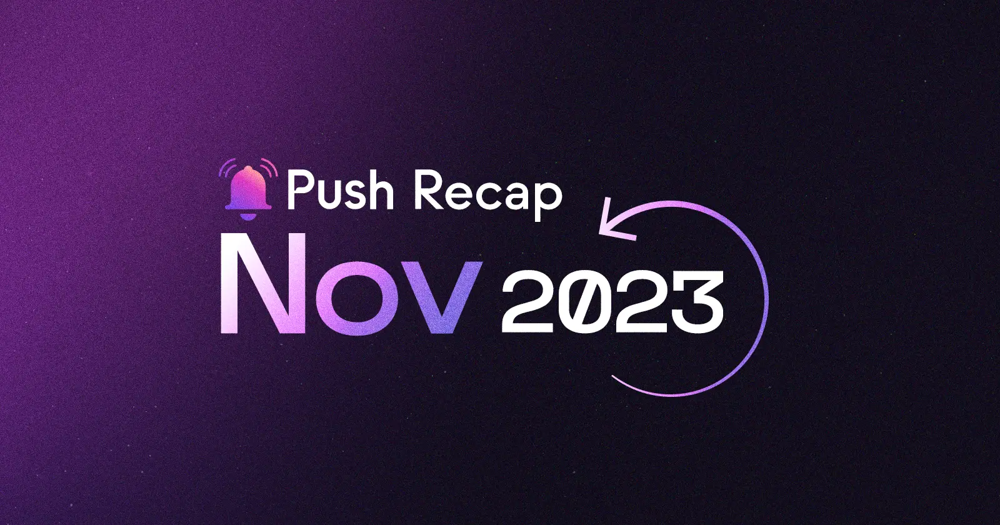

<!--truncate-->

Welcome to last month’s developments and new product releases from the month of November! From groundbreaking developments to new frenships, making notable appearances, and celebrating our community – it's been a month of milestones. Read on to know all that we’ve been up to this month:

### Development

Our [Notification Settings](https://push.org/blog/introducing-notification-settings/) feature has arrived, offering both channel owners and subscribers new customization options. Channel owners can now create unlimited notification categories to better segment notifications, while subscribers can select the kinds of notifications they want to opt-in for.

We also rolled out the [Conditional Gating feature for Group Chats](https://comms.push.org/docs/chat/build/conditional-rules-for-group/). Using predefined conditions such as holding a certain NFT, token, or activity history, you can enable and restrict which wallets can and can’t access a given activity/channel. Dive into our comprehensive [thread](https://x.com/PushChain/status/1724470355031429628) to discover how this functionality works.

### Frens of Push

In the spirit of collaboration, Push joined forces with some amazing partners in November:

1. [Verso Wallet](https://x.com/PushChain/status/1722977421459083590): Opt-in to any Push channel directly within your Verso Wallet, the all-in-one multi-chain mobile wallet.
2. [Percs](https://x.com/PushChain/status/1725171889432113221): We’re powering wallet-to-wallet messaging on Percs, fostering effective web3 campaigns, and building engaging communities for numerous brands.
3. [Hela Network](https://x.com/PushChain/status/1729135038468612290): We've joined forces with the pioneers of modularity, Hela Network – the first modular Layer 1 blockchain.
4. [StationX](https://twitter.com/stationxnetwork/status/1729417323134566452): StationX is bringing automated workflows to communities. With Push integrations, users can get notified instantly about transactions, new members, and more, enhancing the community experience.
5. Lastly, we unveiled our [Social SWITCH](https://x.com/PushChain/status/1725912714067816717) collaboration – the gateway to the realm of web3 social platforms within the Polygon ecosystem. In collaboration with Polygon, we are dedicated to recognizing and celebrating artists, creators, and developers in the web3 space.

### Featured and Weekly Reads

November showcased Push in the spotlight:

1. Dive into [EthGlobal Guides](https://x.com/PushChain/status/1720113957950652739) for a quick crash course on mastering web3 communication. Elevate your dApp’s UX with Push communication tools effortlessly.
2. We proudly stand among the leading web3 protocols for top crypto projects by the number of [GitHub](https://x.com/PushChain/status/1727353533991973059) commits.
3. Reflecting on our journey since the sold-out Push IDO on Polkastarter, encapsulated in a recent [tweet](https://twitter.com/polkastarter/status/1729147857280667710) by them.
4. Alongside the incredible [Google Cloud](https://x.com/PushChain/status/1721509677588967820) team, we’re making it easier to supercharge your dapp’s UX using Push Notifications. Check out our all-new [Google Cloud Self-paced Labs](https://www.cloudskillsboost.google/focuses/68185?parent=catalog).

### Community and Governance

[ETH Global Istanbul](https://push.org/blog/push-ethglobal-istanbul/) was incredible, with 45+ projects building using Push's communication tools. [Winners](https://x.com/PushChain/status/1726638450668146688) took away big Push bounties. What’s more? We turned Istanbul a bit more pink with our Push merch!

And that's not all. We've launched the ["Push Developer Spotlight"](https://x.com/PushChain/status/1729867047377711293) series, chatting with awesome devs on Discord. [Join](https://discord.com/invite/pushprotocol?utm_source=Shivam&utm_medium=Discord+Event&utm_campaign=Developer+Spotlight) the fun and get to know the minds shaping the future of web3.

### BRB India

Our journey through BRB India has been nothing short of extraordinary. In November, we continued our BRB online workshops, delving into the learning behind the $50k+ BRB India bounty pool. Our frens [Chainsafe](https://x.com/PushChain/status/1719759737317630121), [Filecoin](https://x.com/PushChain/status/1720423002070761500), [The Graph](https://x.com/PushChain/status/1721906106686165010), [Shardeum](https://x.com/PushChain/status/1724434230011129919), [Biconomy](https://x.com/PushChain/status/1724827096802025688), [Aragon](https://x.com/PushChain/status/1727306607997124786), and [Polygon](https://x.com/PushChain/status/1727712899471208673) joined us in delivering some amazing sessions.
The magic of our dev tour continued with [Lucknow](https://x.com/PushChain/status/1729541913651666980). Thanks to the dedication of volunteers, attendees, and speakers, Lucknow became a hotspot of innovation and learning.

Now, as we reach the climax of our dev tour, all roads lead to [Bangalore](https://x.com/PushChain/status/1721903040062738875). Brace yourselves for the grand finale – [Builders & Founders Day](https://x.com/PushChain/status/1730583025715413470). Co-hosted with Filecoin, this promises to be an epic celebration, featuring an incredible lineup of speakers. [Join us](https://lu.ma/brb-bengaluru) for an evening of networking, learning, and fun, uniting with some of web3’s brightest minds and founders.

As we wrap up an amazing month, we want to thank all of you for being part of our journey. We look forward to more collaborations, innovations, and shared successes. Until next time!
