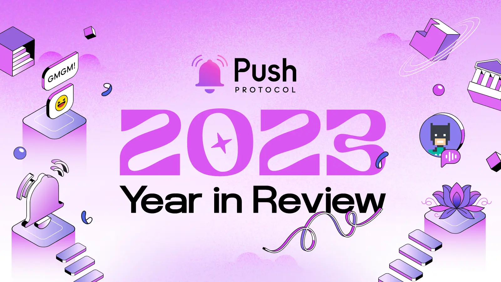
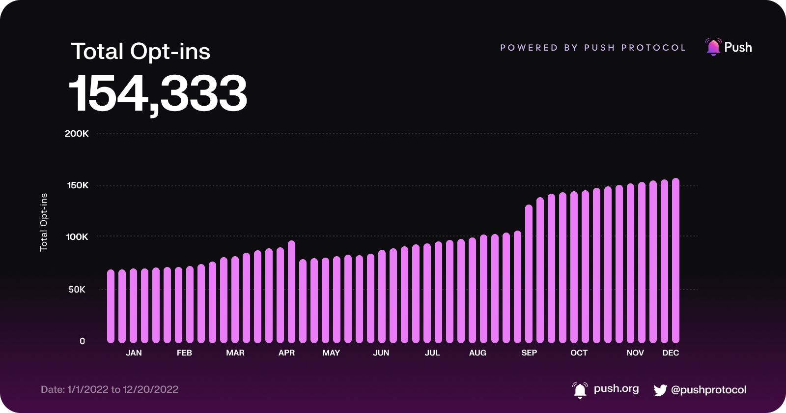
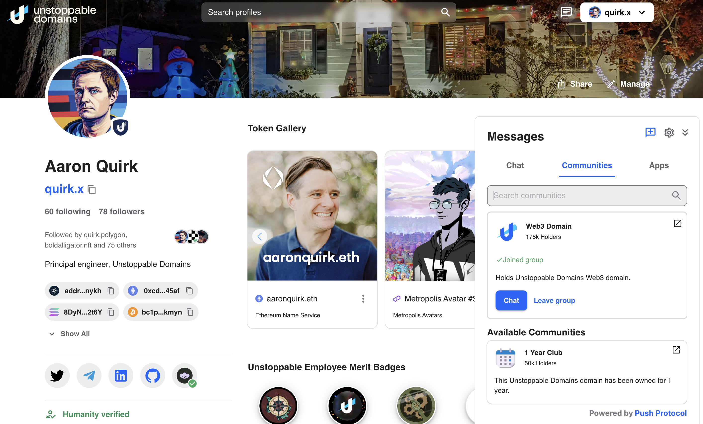

<!--truncate-->

We had an exciting year at Push! It's time to recap what we achieved, impact it made and where we are headed next!

2023 was amazing for Push as we launched the products and features we've been working on to provide a full web3 communication stack for developers, businesses and users. Let's dive into the details of what all we achieved in 2023.

import ReactPlayer from "react-player";
import { ABlock } from "@site/src/css/SharedStyling";

## Push by Numbers

Push has grown tremendously in 2023, we saw an increase in notifications sent (+50 Million YTD) and subscribers (154k). Our ecosystem expanded as more protocols started using Push to send notifications / chat to their users across chains. Push is now live on 5 chains including Ethereum, Polygon zKEVM, PoS, Arbitrum and BNB.



## Highlights

### Unified Push SDK

Push launched a unified SDK for web3 developers to send [**notifications**](https://comms.push.org/docs/notifications 'Explore Push Notifications Protocol') or [**chats**](https://comms.push.org/docs/chat 'Explore Push Chat Protocol') to their users with unification of the SDK, with **video** and **spaces** support coming soon!

This enabled Push API class that is common for all suite of products by Push enabling developers to use Push products with ease. It also paved the way for Push to heavily abstract away the complexities of web3 communication and provide a seamless experience to developers.

<ABlock href="https://comms.push.org/docs/" title="Developer documentation hub">Learn all about the Unified Push SDK from Push Documentation Hub</ABlock>

### Push x MetaMask Snap

Push started with the vision of enabling seamless communication for web3, launching Snaps for 30 Million users of MetaMask was a big step towards that vision as it allows users to have their communication delivered to them right on their MetaMask wallet.

We are excited to share that web3 notifications sent by protocols using Push are now delivered to users on MetaMask. If you are a web3 builder, then re-engagement is a big problem for you which get's solved by implementing [web3 notifications with Push now!](https://comms.push.org/docs/ 'Explore Push Docs')

<ReactPlayer
  controls
  width="100%"
  url="https://www.youtube.com/watch?v=LjPxKoYLiGs"
/>

<ABlock href="/blog/bringing-push-to-meta-mask-snaps/" title="Tutorial on how to get started with Push x Metamask snap">Get started with Push x Metamask snap</ABlock>

### Push x Unstoppable

Our partner [Unstoppable Domains](https://unstoppabledomains.com/ 'Push x Unstoppable') launched notifications and group chats for their 3.8 Million users using Push making Push Unstoppable :). Their mobile app also uses Push to send notifications to their users.



What's more, UD have open sourced their code for the community to use and contribute to. Check the repo out [here](https://github.com/unstoppabledomains/domain-profiles/tree/main/packages/ui-components/src/components/Chat 'Push x Unstoppable Repo') / [staging demo](https://staging.ud.me/examples/unstoppable-messaging).

<ABlock href="/blog/business-to-user-messaging-push-protocol-x-unstoppable-domains/" title="Business to User messaging via Unstoppable x Push">Business to User messaging via Unstoppable x Push</ABlock>

### Gated + Group Chats

Push launched gated chats for web3 protocols to enable them to create gated communities for their users. This enables protocols / DAOs / NFTs to create a community of their users and engage with them based on the gamification of their choice.

For example: You can gate a group chat for users who hold a certain NFT or have a certain amount of tokens in their wallet or you can gate sending messages in a group chat based on the amount of tokens a user holds. Even custom logic of your choice or web2 logic can be used to gate a group chat paving new token utility use cases for your protocol.

<ABlock href="https://comms.push.org/docs/chat/build/conditional-rules-for-group/" title="Dev docs explaining how to condional gate a group">Developer guide to conditional gating groups</ABlock>

### Hyper-scalable Groups

Push launched hyper-scalable groups allowing upto 5k users for private and 25k users for public groups. This enables protocols to create large communities of their users and engage with them in a seamless manner. This is a big deal! Web2 chat apps like Whatsapp or Signal are only able to support upto 1k users!

For the first time, Web3 messaging is coming at par with and beating most Web2 messaging apps in terms of scalability but with the added benefit of being immutable, permissionless and containing web3 native functionalities.

<ABlock href="/blog/hyper-scalable-group-chats/" title="Article about hyper scalable group chat of Push">Benchmark article on hyperscalable group chats</ABlock>

### Frontend Components

Push launched frontend components for web3 developers to easily integrate Push products into their web3 dapps. Enough talk, let's see it in action

```jsx live customPropMinimized = 'true'
// DO NOT FORGET TO IMPORT LIBRARIES
// NOT NEEDED HERE SINCE PLAYGROUND IMPORTS INTERNALLY
import { ChatUIProvider, ChatView } from @pushprotocol/uiweb;

function App(props) {
  return (
    <>
      <h2>
        Live chat with pushai.eth, connect your wallet and chat to get sassy
        response from PushAI.eth
      </h2>
      <div style={{ height: '50vh', margin: '20px auto' }}>
        <ChatUIProvider>
          <ChatView
            chatId='0x99A08ac6254dcf7ccc37CeC662aeba8eFA666666'
            limit={10}
            isConnected={true}
            onVerificationFail={() => setShowFaucet(true)}
            verificationFailModalPosition={MODAL_POSITION_TYPE.RELATIVE}
          />
        </ChatUIProvider>
      </div>
    </>
  );
}
```

<ABlock href="https://comms.push.org/docs/chat/ui-components/integrate-push-chat/" title="Developer docs on how to integrate Push Chat">Developer docs showing how to integrate Push Chat in 2 LOCs</ABlock>

### Notification Settings

Notifications for web3 are synonymous with Push. Our partners wanted to have a way to enable their users to control their notification settings on what they exactly wanted. Notifications settings is the answer to that, allowing users to control their notification settings on a granular level.

<ABlock href="/blog/introducing-notification-settings/" title="Article explaining notification settings for Push Protocol and how to enable it">Notification settings and why it's a game changer!</ABlock>

### Push Spaces

Push Spaces enable several users to have audio call like experience with each other, all from the comfort of your web3 wallet! It borrows scalability and gated functionality from Push Chat protol enabling new and creative ways by which all of Web3 can interact with each other.

<ReactPlayer
  controls
  width="100%"
  url="https://www.youtube.com/watch?v=QK6wx1wJ66A"
/>

<ABlock href="/blog/push-spaces-is-live-decentralized-audio-and-video-streaming-is-here/" title="Introduction to Push Spaces">Learn more about Push Spaces!</ABlock>

### Push Video

Push vision is to become the de-facto communication stack for web3. Real time communication like Video and Spaces was something we always planned as the next primitive to build on top of Push, as per the [whitepaper 1.0](https://whitepaper.push.org/protocol-specs-section/future-features-research 'Whitepaper talking about Push Video').

The team delivered on this promise as well but with some added benefites! Since it's built on top of the composable standard of Push Chat and Notification protocol, it benefits from their architecture, utilizing notifications for having a facetime call like interface and group chat for enabling gated calls.

<ABlock href="/blog/push-launches-wallet-to-wallet-video-chat/" title="Introduction to Wallet to Wallet video calls">Dive into Push Video and what it enables for web3 communication!</ABlock>

### Push Protocol V2 (& Push Fee Pool!)

Push Protocol V2 introduced the ability to do incentivized chat along with establishing the fee pool for Push Protocol. Fee pool is a mechanism by which Push Protocol ensures that all players in the ecosystem are incentivized to grow the ecosystem and are rewarded for their efforts.

Yield farming V2 is also enabled by Push Protocol V2, allowing users to earn rewards + fees earned by the network. V2 enables this fee pool to be split among all [**_`$PUSH`_**](https://coinmarketcap.com/currencies/epns/ '$PUSH at Coinmarketcap.com') based on the amount of token staked and the duration from which they have held onto the tokens.

<ABlock href="/blog/new-push-yield-farming-rewards-full-details/" title="Push Yield Farming V2">Push Yield Farming V2 and how it's calculated</ABlock>

### Push NFT Chat

Push also launched NFT Chat, enabling for the first time to have chat and other forms of communication tied to NFTs. This unlocks a whole new world of possibilities for NFTs where Web3 Socials or any NFT can have communication tied to it which seamlessly can be moved from one wallet to another.

<ABlock href="/blog/a-technical-deep-dive-5-simple-steps-to-get-started-with-push-nft-chat/" title="Article about Push NFT Chat">Technical deepdive on how to get started with Push NFT Chat</ABlock>

### Push Delivery Nodes

Push released delivery nodes, enabling crypto wallets to run and listen to communications (encrypted) coming from Push Network for wallet addresses.

This enabled wallets to show notifications, chats, etc to their users apart from providing cool ways to bridge notifications from web3 wallets to mobile apps!

<ABlock href="/blog/understanding-delivery-nodes/" title="Article about Push Delivery Nodes">Read about Push Delivery Nodes and how they work</ABlock>

### Live Roadmap

Push launched a live roadmap for the community which is a massive step up from medium posts as it's a live roadmap which is updated in real time. This enables the community to see what's being worked on and what's up next.

_`Psst`_ - If you want a sneak peak in 2024 already, then check out the link below 👇

<ABlock href="https://comms.push.org/docs/roadmap" title="Push Protocol Live Roadmap">Check out the live roadmap for Push Protocol</ABlock>

### Docs 2.0

Push launched docs 2.0, making it easier for developers to get started with Push Protocol. We also launched playground, live examples and several tutorials to enable frictionless integration of Push Protocol. Try it out, in 4 minutes or less is the our mantra for docs 2.0!

<ABlock href="https://comms.push.org/docs" title="Push Protocol Documentation Hub 2.0">Check out Push Documentation Hub 2.0</ABlock>

### Continued Adoption

Push continued it's journey of adoption with several protocols integrating and using Push Protocol for their communication needs. Some of the notable ones are Unstoppable, ShapeShift, Arbitrum, Bankless, Decentraland and more!

We also launched on a number of chains including Arbitrum, Polygon zkEVM, BNB, Polygon PoS apart from Ethereum.

Push also saw wallets adoption with wallets like Metamask (via Push Snap), Unstoppable, Verso, Liv3, Shapeshift started using Push Protocol enabling communication to be delivered to users right on their wallets!

<ABlock href="/frens" title="Push Ecosystem aka Frens of Push">Checkout Push Ecosystem aka Frens of Push</ABlock>

### Honorable Mentions

There are a number of other things that we did in 2023, some of the notable ones are

- Billion Reasons to Build [(BRB)](https://yourstory.com/the-decrypting-story/push-protocol-india-tour-polygon-ethereum-web3-bounties 'Dev tour'), a pan India Dev Tour with 12 top global web3 protocols (Ethereum, Polygon, Filecoin, TheGraph, etc) to onboard +4,500 developers to web3
- Launched Push Ambassador India, Africa and Latam
- Launched several SDKs for different languages (Swift, Flutter, Android, etc)
- Participated in major hackathons (+1,300 devs onboarded with +500 projects built) and conferences including ETHGlobal, Devcon, ETHCC, ETHDenver..
- Media features including [Coindesk](https://www.coindesk.com/tech/2023/02/15/crypto-wallet-messaging-application-push-protocol-expands-to-bnb-chain/ 'Web3 Messaging'), [The Defiant](https://www.youtube.com/watch?v=UItJz0mLfMA&t=25s 'The Defiant Podcast'), [Bankless](https://youtu.be/MzZdSInJGzM?si=9nUEiGCTnlszcbOH 'Bankless Podcast')
- Launched Push DAO Phase 1

Before looking at what's ahead this coming year, we want to take a moment to thank the entire Push team, all our partners, investors and the builders. 2023 was an amazing year for Push and we are excited to share what we have planned for 2024! Stay tuned. With loads of love :heart: from Push team!
