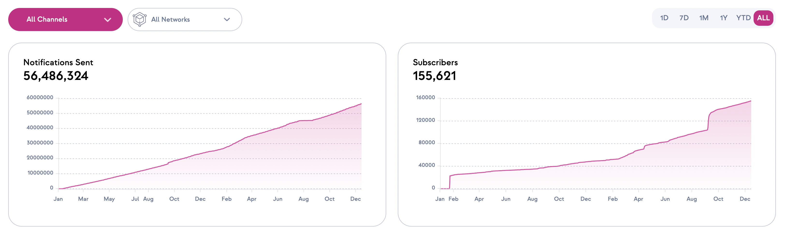
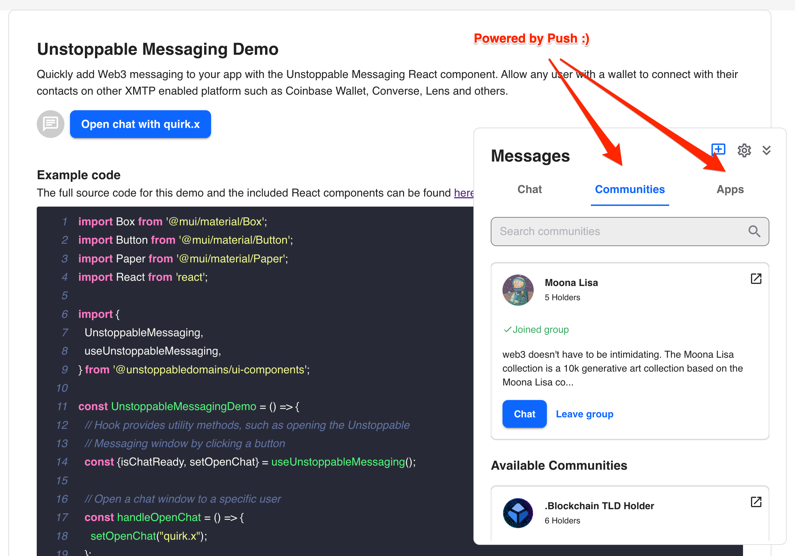

<!--truncate-->

We had an exciting year at Push. It's time to share what all we achieved, what impact it makes and where we are headed next! 

2023 was amazing for Push as it launched all the web3 products it had been working on to provide a web3 communication stack for developers, businesses and users. Let's dive into the details of what all we achieved in 2023.

import ReactPlayer from "react-player";
import { ABlock } from "@site/src/css/SharedStyling";

## Push by Numbers
Push has grown tremendously in 2023, We saw notifications sent, channels and subscribers being doubled / tripled! Our ecosystem expanded as more protocols started using Push to send notifications / chat to their users.



## Highlights
### Unified Push SDK

Push launched a unified SDK for web3 developers to send [**notifications**](/docs/notifications "Explore Push Notifications Protocol") or [**chats**](/docs/chat "Explore Push Chat Protocol") to their users with unification of the SDK, with **video** and **spaces** support coming soon! 

This enabled Push API class that is common for all suite of products by Push enabling developers to use Push products with ease. It also paved the way for Push to heavily abstract away the complexities of web3 communication and provide a seamless experience to developers.

<ABlock href="/docs/" title="Developer documentation hub">Learn all about the Unified Push SDK from Push Documentation Hub</ABlock>


### Push x Metamask Snap

Push started with the vision of enabling seamless communication for web3, Launching snap on Metamask was a big step towards that vision as it allows users to have their communication delivered to them right on their metamask wallet. 

We are excited to share that web3 notifications sent by protocols using Push are now delivered to users on Metamask. If you are a web3 builder, then re-engagement is a big problem for you which get's solved by implementing [web3 notifications with Push now!](/docs "Explore Push Docs")

<ReactPlayer
  controls
  width="100%"
  url="https://www.youtube.com/watch?v=LjPxKoYLiGs"
/>

<ABlock href="/blog/bringing-push-to-meta-mask-snaps/" title="Tutorial on how to get started with Push x Metamask snap">Get started with Push x Metamask snap</ABlock>


### Push x Unstoppable
Our partner [Unstoppable Domains](https://unstoppabledomains.com/ "Push x Unstoppable") launched notifications and group chats for their users using Push making Push Unstoppable :). Their mobile app also uses Push to send notifications to their users.



What's more, they have open sourced their code for the community to use and contribute to. Check the repo out [here](https://github.com/unstoppabledomains/domain-profiles/tree/main/packages/ui-components/src/components/Chat "Push x Unstoppable Repo") / [staging demo](https://staging.ud.me/examples/unstoppable-messaging).

<ABlock href="/blog/business-to-user-messaging-push-protocol-x-unstoppable-domains/" title="Business to User messaging via Unstoppable x Push">Business to User messaging via Unstoppable x Push</ABlock>


### Gated + Group Chats

Push launched gated chats for web3 protocols to enable them to create gated communities for their users. This enables protocols / DAOs / NFTs to create a community of their users and engage with them based on the gamification of their choice. 

For example: You can gate a group chat for users who hold a certain NFT or have a certain amount of tokens in their wallet or you can gate sending messages in a group chat based on the amount of tokens a user holds. Even custom logic of your choice or web2 logic can be used to gate a group chat paving new token utility use cases for your protocol.

<ABlock href="/docs/chat/build/conditional-rules-for-group/" title="Dev docs explaining how to condional gate a group">Developer guide to conditional gating groups</ABlock>


### Hyper-scalable Groups

Push launched hyper-scalable groups allowing upto 5k users for private and 25k users for public groups. This enables protocols to create large communities of their users and engage with them in a seamless manner. This is a big deal! Web2 chat apps like Whatsapp or Signal are only able to support upto 1k users! 

For the first time, Web3 messaging is coming at par with and beating most Web2 messaging apps in terms of scalability but with the added benefit of being immutable, permissionless and containing web3 native functionalities.

<ABlock href="/blog/hyper-scalable-group-chats/" title="Article about hyper scalable group chat of Push">Benchmark article on hyperscalable group chats</ABlock>


### Frontend Components

Push launched frontend components for web3 developers to easily integrate Push products into their web3 dapps. Enough talk, let's see it in action -

```jsx live
customPropMinimized="true"
// DO NOT FORGET TO IMPORT LIBRARIES
// NOT NEEDED HERE SINCE PLAYGROUND IMPORTS INTERNALLY
// import { ChatUIProvider, ChatView } from @pushprotocol/uiweb;
function App(props) {
  return (
    <>
      <h2>
        Live chat with pushai.eth, connect your wallet and chat to get sassy
        response from PushAI.eth
      </h2>
      <div style={{ height: "75vh", margin: "20px auto" }}>
        <ChatUIProvider>
          <ChatView
            chatId="0x99A08ac6254dcf7ccc37CeC662aeba8eFA666666"
            limit={10}
            isConnected={true}
            onVerificationFail={() => setShowFaucet(true)}
            verificationFailModalPosition={MODAL_POSITION_TYPE.RELATIVE}
          />
        </ChatUIProvider>
      </div>
    </>
  );
}
```

<ABlock href="/docs/chat/ui-components/integrate-push-chat/" title="Developer docs on how to integrate Push Chat">Developer docs showing how to integrate Push Chat in 2 LOCs</ABlock>


### Notification Settings
Notifications for web3 are synonymous with Push. Our partners wanted to have a way to enable their users to control their notification settings on what they exactly wanted. Notifications settings is the answer to that, allowing users to control their notification settings on a granular level.

<ABlock href="/blog/introducing-notification-settings/" title="Article explaining notification settings for Push Protocol and how to enable it">Notification settings and why it's a game changer!</ABlock>


### Push Video
Push vision is to become the de-facto communication stack for web3. Real Time Communication like Video and Spaces was something we always planned as the next primitive to build on top of Push, as per the [whitepaper 1.0](https://whitepaper.push.org/protocol-specs-section/future-features-research "Whitepaper talking about Push Video"). 

The team delivered on this promise as well but with some added benefites! Since it's built on top of the composable standard of Push Chat and Notification protocol. It benefits from their architecture as well, utilizing notifications for having a facetime call like interface and group chat for enabling gated calls.

<ABlock href="/blog/push-launches-wallet-to-wallet-video-chat/" title="Introduction to Wallet to Wallet video calls">Learn more about Push Video and what it enables for web3 communication!</ABlock>


### Push Spaces
Next up was of course Spaces! Spaces are a way to enable several users to have audio call like experience with each other. It borrows scalability from Push Chat along with the gated functionality enabling a new way by which all of Web3 can interact with each other.

<ReactPlayer
  controls
  width="100%"
  url="https://www.youtube.com/watch?v=QK6wx1wJ66A"
/>


### Push Protocol V2 (& Push Fee Pool!)

### Push NFT Chat

### Push Nodes (Decentralized Notifications)

### Delivery Nodes

### Notification launch on BNB Chain (+ Polygon, Ethereum)

### Docs 2.0

### Continued Adoption


### Honorable Mentions
- BRB, Push Ambassador Latam, Push Ambassador India, Push Ambassador Africa, Push DAO Phase 2, Several Frens of Push, Hackathons to funnel in feedback, flutter sdk