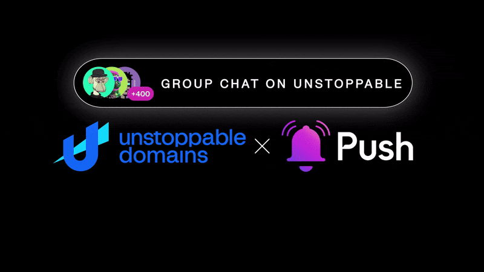

<!--truncate-->

Today, we're thrilled to announce an exciting new chapter in our partnership with Unstoppable Domains (UD): the launch of 'Group Chat' on the UD messaging platform! 🎉

Last year, UD and Push Protocol announced [business-to-user messaging](https://medium.com/push-protocol/business-to-user-messaging-push-protocol-x-unstoppable-domains-6bef7e262f7d#:~:text=Push%20Protocol%20is%20partnering%20with,and%20partners%20natively%20on%20web3.) on the UD messaging platform — the result of a longstanding product relationship between the two companies that began [back in 2021](https://push.org/blog/epns-partners-with-unstoppable-domains/). Today, the launch of the token-gated Group Chat on the UD messaging platform is another step towards decentralized, open, censorship-resistant communication for the future of the web. At launch, UD Group messaging will go live with <b>400+ Groups, for 3.8M+ UD users</b>.

### Group Chat: A Shift in Decentralized Communication

Currently, UD’s messaging interface [Unstoppable Messaging](https://unstoppabledomains.com/blog/categories/announcements/article/messaging-launch) allows any web3 user to message addresses belonging to a .eth, .x, .crypto domain, .polygon along with many other domains. However, Unstoppable Messaging has been limited to just one-to-one and one-to-many messaging. As such, we’ve been working with Unstoppable Domains to enable a robust, token-gated system through badges, allowing anyone with a [badge](https://support.unstoppabledomains.com/support/solutions/articles/48001215751-badges) to join a Group Chat and start a conversation.

By blending UD’s expertise in web3 domain services with Push Protocol’s market-leading decentralized messaging technology, we’re excited to release this all-new feature to the web3 community.

<blockquote>
    <i>
    “Our partnership with Unstoppable is not merely about changing the way teams communicate; it's about revolutionizing it. 'Group Chat' embodies our dedication to empowering organizations with cutting-edge communication technology." 
    </i>
    <b>— Harsh Rajat, Founder at Push Protocol</b>
</blockquote>

### What Are Token Gated Group Chats

Token-gated Group Chats are exactly what their name implies, Group Chats that require you to hold a specific token (NFT or crypto-asset) to either access any given group, or message within it. Token-gating your Group Chats is a surefire way of controlling who can enter your chats and who can message within them. As the admin of your Group Chat, you can set and adjust permissions whenever you like.

For businesses, organizations, and teams, it’s a fantastic way to ensure your communication channels remain private and secure by giving you total control over who enters and participates in the communication channel.

You can learn more about [Token-Gated/Conditional Group Chats here](https://comms.push.org/docs/chat/build/conditional-rules-for-group/).

### Getting Started With UD Group Chat

Getting started with Push Protocol x Unstoppable Domains Group Chat is simple — you either need to join an existing Group Chat or create your own.

Every Group Chat is associated with a ‘[badge](https://support.unstoppabledomains.com/support/solutions/articles/48001215751-badges)’ and hence token-gated based on badge ownership.

At launch, every UD badge that exists will have its own Group Chat (currently 400+ Group Chats are live). If you’re a holder of those badges, you’ll be eligible to join those groups.

- To join a Group Chat for a badge you own:

1. Go to Unstoppable Messaging from your [ud.me](https://ud.me/) Profile ([Learn More](https://support.unstoppabledomains.com/support/solutions/articles/48001244742-unstoppable-messaging)).
2. Select the <b>Groups</b> tab.
   

3. Find the community you would like to begin chatting with and select <b>Join group chat</b>.
   
4. You’re done! You will be able to join the text-based chat going forward.

- To create a new Group Chat with Sponsored Badges:

1. [Create a Sponsored Badge](https://unstoppabledomains.com/badge/activate) by entering the <b>URL to your NFT collection</b>
2. Distribute your NFT to your community or team members
3. That’s it! Your group can now enter the chat via the <b>Groups</b> tab on their Unstoppable Messaging widget.

<i>Unstoppable Group Chat is currently available on desktop, with mobile coming soon. </i>

### Join the Era of Unstoppable Communities and Team Groups!

Like all communication that’s powered by Push Protocol, Unstoppable Group Chat is censorship resistant and private. For friends, DAOs, companies, and organizations, that means secure and private team communication channels.

If you’re interested in boosting your community engagement with Group chat, get [started here](https://comms.push.org/docs/chat/build/conditional-rules-for-group/).
