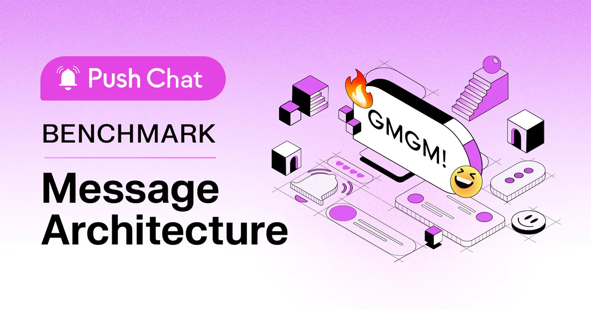

<!--truncate-->

Push Chat has revolutionized web3 messaging, providing a seamless experience for user-to-user, user-to-dApp, and group conversations. Essentially, Push Chat bridges the gap between messaging in web3 and web2, offering a hassle-free transition. One pivotal enhancement we've diligently pursued within Push Chat involves reconfiguring the architecture for storing and retrieving messages, resulting in significantly faster performance.

Whether you're engaging in public group chats, participating in private discussions, or accessing token-gated communities, Push Group Chat simplifies and secures connections. Now, Push is elevating its scalability and drastically improving message transmission speeds.

### Understanding Push Chat Message Architecture

#### V1 Architecture

In the earlier iteration of Push Chat, messages were managed within a linked list structure. This architecture employed references where each message pointed to the previous one, creating a sequential chain of messages. However, this design encountered some significant hurdles.

One notable issue arose from the concurrent arrival of messages, as the linked list format struggled to handle the concurrent processing of incoming messages. This concurrency bottleneck often resulted in performance degradation and dropping of messages by Push nodes, undermining the real-time nature of Push Chat.

Moreover, the process of retrieving messages from this linked list structure posed its own set of challenges. Since Push nodes primarily stored references to the latest message, retrieving older messages required traversing the entire linked list sequentially. This approach led to slow query speeds, as resolving previous messages necessitated the resolution of the current message first.

#### V2 Architecture

In the latest iteration, Push Chat has undergone a significant architectural transformation, one of the most notable changes in v2 is the abandonment of the linked list paradigm, where each message no longer references the previous one.

By eliminating the requirement for messages to reference the previous one, v2 architecture significantly simplifies message processing, enabling Push nodes to handle concurrent messages more efficiently. This architectural shift has alleviated the concurrency bottleneck that plagued the earlier version, enhancing the scalability and responsiveness of Push Chat.

Furthermore, in v2, Push nodes now cache every message instead of solely storing references to the latest message hash. This strategic enhancement plays a pivotal role in optimizing message retrieval speeds. By caching every message, Push nodes can swiftly access and deliver messages upon request, mitigating the latency issues associated with sequential message resolution.

It's worth noting that despite these architectural changes, the fundamental immutable layer of Push Chat remains rooted in IPFS. Every message, whether in v1 or v2, continues to be backed up by a client-signed and verifiable verification proof. This cryptographic mechanism ensures the integrity and authenticity of messages, safeguarding them against tampering or unauthorized alterations.

### Push Chat Benchmarks: Letting The Numbers Speak For Unprecedented Scale And Security

> Note:: It's important to acknowledge that the benchmarking of v2 architecture was conducted on a development server, while the benchmarking of v1 architecture took place on a production server. It's worth highlighting that the production server possesses 16 times more CPU power than the development server, potentially providing an unfair advantage to v1 architecture. Additionally, it's crucial to recognize that the traffic volume on the production server is substantially higher compared to the development environment. These discrepancies in server specifications and traffic levels should be considered when interpreting the benchmark results.

#### List Paginated User Chats

Fn Breakdown

1. Fetch lists of chat of a account with latest threadhash ( Page Limit = 10 ) - `A`
2. Fetch latest message for every chat - `B`
3. Decrypt the latest message if its encrypted - Ignored for this benchmark

<table>
<tr>
   <th colspan="2">V1 Message Architecture</th>
</tr>
<tr>
    <th>
    Call Type
    </th>
    <th>
    Time Taken ( ms )
    </th>
</tr>
<tr>
    <td>A</td>
    <td>825</td>
</tr>
<tr>
    <td>B - 1</td>
    <td>712</td>
</tr>
<tr>
    <td>B - 2</td>
    <td>718</td>
</tr>
<tr>
    <td>B - 3</td>
    <td>728</td>
</tr>
<tr>
    <td>B - 4</td>
    <td>734</td>
</tr>
<tr>
    <td>B - 5</td>
    <td>693</td>
</tr>
<tr>
    <td>B - 6</td>
    <td>694</td>
</tr>
<tr>
    <td>B - 7</td>
    <td>673</td>
</tr>
<tr>
    <td>B - 8</td>
    <td>716</td>
</tr>
<tr>
    <td>B - 9</td>
    <td>768</td>
</tr>
<tr>
    <td>B - 10</td>
    <td>713</td>
</tr>
</table>

<table>
<tr>
   <th colspan="2">V2 Message Architecture</th>
</tr>
<tr>
    <th>
    Call Type
    </th>
    <th>
    Time Taken ( ms )
    </th>
</tr>
<tr>
    <td>A</td>
    <td>696</td>
</tr>
<tr>
    <td>B - 1</td>
    <td>386</td>
</tr>
<tr>
    <td>B - 2</td>
    <td>447</td>
</tr>
<tr>
    <td>B - 3</td>
    <td>433</td>
</tr>
<tr>
    <td>B - 4</td>
    <td>509</td>
</tr>
<tr>
    <td>B - 5</td>
    <td>410</td>
</tr>
<tr>
    <td>B - 6</td>
    <td>431</td>
</tr>
<tr>
    <td>B - 7</td>
    <td>399</td>
</tr>
<tr>
    <td>B - 8</td>
    <td>359</td>
</tr>
<tr>
    <td>B - 9</td>
    <td>441</td>
</tr>
<tr>
    <td>B - 10</td>
    <td>410</td>
</tr>
</table>

#### List Latest Chat Message

Fn Breakdown

1. Fetch latest message reference - `A`
2. Fetch latest message for that reference - `B`
3. Decrypt the latest message if its encrypted - Ignored for this benchmark

   

   <table>
   <tr>
      <th colspan="2">V1 Message Architecture</th>
   </tr>
   <tr>
      <th colspan="2">Chat with 10 Messages</th>
   </tr>
   <tr>
      <th>
      Call Type
      </th>
      <th>
      Time Taken ( ms )
      </th>
   </tr>
   <tr>
      <td>A</td>
      <td>787</td>
   </tr>
   <tr>
      <td>B</td>
      <td>1403</td>
   </tr>
   </table>
   

   

      <table>
      <tr>
         <th colspan="2">V2 Message Architecture</th>
      </tr>
      <tr>
         <th colspan="2">Chat with 10 Messages</th>
      </tr>
      <tr>
         <th>
         Call Type
         </th>
         <th>
         Time Taken ( ms )
         </th>
      </tr>
      <tr>
         <td>A</td>
         <td>325</td>
      </tr>
      <tr>
         <td>B</td>
         <td>673</td>
      </tr>
      </table>
   

   

      <table>
      <tr>
         <th colspan="2">V1 Message Architecture</th>
      </tr>
      <tr>
         <th colspan="2">Chat with 50 Messages</th>
      </tr>
      <tr>
         <th>
         Call Type
         </th>
         <th>
         Time Taken ( ms )
         </th>
      </tr>
      <tr>
         <td>A</td>
         <td>744</td>
      </tr>
      <tr>
         <td>B</td>
         <td>1381</td>
      </tr>
      </table>
   

   

      <table>
      <tr>
         <th colspan="2">V2 Message Architecture</th>
      </tr>
      <tr>
         <th colspan="2">Chat with 50 Messages</th>
      </tr>
      <tr>
         <th>
         Call Type
         </th>
         <th>
         Time Taken ( ms )
         </th>
      </tr>
      <tr>
         <td>A</td>
         <td>399</td>
      </tr>
      <tr>
         <td>B</td>
         <td>718</td>
      </tr>
      </table>
   

   

   <table>
   <tr>
      <th colspan="2">V1 Message Architecture</th>
   </tr>
   <tr>
      <th colspan="2">Chat with 100 Messages</th>
   </tr>
   <tr>
      <th>
      Call Type
      </th>
      <th>
      Time Taken ( ms )
      </th>
   </tr>
   <tr>
      <td>A</td>
      <td>693</td>
   </tr>
   <tr>
      <td>B</td>
      <td>1524</td>
   </tr>
   </table>
   

   

<table>
<tr>
   <th colspan="2">V2 Message Architecture</th>
</tr>
<tr>
   <th colspan="2">Chat with 100 Messages</th>
</tr>
<tr>
    <th>
    Call Type
    </th>
    <th>
    Time Taken ( ms )
    </th>
</tr>
<tr>
    <td>A</td>
    <td>348</td>
</tr>
<tr>
    <td>B</td>
    <td>716</td>
</tr>
</table>

   

      <table>
      <tr>
         <th colspan="2">V1 Message Architecture</th>
      </tr>
      <tr>
         <th colspan="2">Chat with 250 Messages</th>
      </tr>
      <tr>
         <th>
         Call Type
         </th>
         <th>
         Time Taken ( ms )
         </th>
      </tr>
      <tr>
         <td>A</td>
         <td>679</td>
      </tr>
      <tr>
         <td>B</td>
         <td>1462</td>
      </tr>
      </table>
   

   

   <table>
   <tr>
      <th colspan="2">V2 Message Architecture</th>
   </tr>
   <tr>
      <th colspan="2">Chat with 250 Messages</th>
   </tr>
   <tr>
      <th>
      Call Type
      </th>
      <th>
      Time Taken ( ms )
      </th>
   </tr>
   <tr>
      <td>A</td>
      <td>312</td>
   </tr>
   <tr>
      <td>B</td>
      <td>700</td>
   </tr>
   </table>
   

#### List Historical Chat Message

Fn Breakdown

1. Fetch messages frm a given message reference ( Page Limit = 10 ) - `A`
2. Decrypt the latest message if its encrypted - Ignored for this benchmark

<table>
<tr>
   <th colspan="2">V1 Message Architecture</th>
</tr>
<tr>
   <th colspan="2">Chat with 10 Messages</th>
</tr>
<tr>
    <th>
    Call Type
    </th>
    <th>
    Time Taken ( ms )
    </th>
</tr>
<tr>
    <td>A</td>
    <td>1616</td>
</tr>
</table>

<table>
<tr>
   <th colspan="2">V2 Message Architecture</th>
</tr>
<tr>
   <th colspan="2">Chat with 10 Messages</th>
</tr>
<tr>
    <th>
    Call Type
    </th>
    <th>
    Time Taken ( ms )
    </th>
</tr>
<tr>
    <td>A</td>
    <td>991</td>
</tr>
</table>

<table>
<tr>
   <th colspan="2">V1 Message Architecture</th>
</tr>
<tr>
   <th colspan="2">Chat with 50 Messages</th>
</tr>
<tr>
    <th>
    Call Type
    </th>
    <th>
    Time Taken ( ms )
    </th>
</tr>
<tr>
    <td>A</td>
    <td>2414</td>
</tr>
</table>

<table>
<tr>
   <th colspan="2">V2 Message Architecture</th>
</tr>
<tr>
   <th colspan="2">Chat with 50 Messages</th>
</tr>
<tr>
    <th>
    Call Type
    </th>
    <th>
    Time Taken ( ms )
    </th>
</tr>
<tr>
    <td>A</td>
    <td>1060</td>
</tr>
</table>

<table>
<tr>
   <th colspan="2">V1 Message Architecture</th>
</tr>
<tr>
   <th colspan="2">Chat with 100 Messages</th>
</tr>
<tr>
    <th>
    Call Type
    </th>
    <th>
    Time Taken ( ms )
    </th>
</tr>
<tr>
    <td>A</td>
    <td>2440</td>
</tr>
</table>

<table>
<tr>
   <th colspan="2">V2 Message Architecture</th>
</tr>
<tr>
   <th colspan="2">Chat with 100 Messages</th>
</tr>
<tr>
    <th>
    Call Type
    </th>
    <th>
    Time Taken ( ms )
    </th>
</tr>
<tr>
    <td>A</td>
    <td>1020</td>
</tr>
</table>

<table>
<tr>
   <th colspan="2">V1 Message Architecture</th>
</tr>
<tr>
   <th colspan="2">Chat with 100 Messages</th>
</tr>
<tr>
    <th>
    Call Type
    </th>
    <th>
    Time Taken ( ms )
    </th>
</tr>
<tr>
    <td>A</td>
    <td>2360</td>
</tr>
</table>

<table>
<tr>
   <th colspan="2">V2 Message Architecture</th>
</tr>
<tr>
   <th colspan="2">Chat with 250 Messages</th>
</tr>
<tr>
    <th>
    Call Type
    </th>
    <th>
    Time Taken ( ms )
    </th>
</tr>
<tr>
    <td>A</td>
    <td>965</td>
</tr>
</table>

#### Send Message

Fn Breakdown

1. Fetch receiver’s details - Ignored for this benchmark
2. Encrypt message - Ignored for this benchmark
3. POST Call to Push Nodes - `A`

<table>
<tr>
   <th colspan="2">V1 Message Architecture</th>
</tr>
<tr>
    <th>
    Call Type
    </th>
    <th>
    Time Taken ( ms )
    </th>
</tr>
<tr>
    <td>A - Avg of 10 Msg</td>
    <td>854</td>
</tr>
<tr>
    <td>A - Avg of 50 Msg</td>
    <td>841</td>
</tr>
<tr>
    <td>A - Avg of 100 Msg</td>
    <td>820</td>
</tr>
</table>

<table>
<tr>
   <th colspan="2">V2 Message Architecture</th>
</tr>
<tr>
    <th>
    Call Type
    </th>
    <th>
    Time Taken ( ms )
    </th>
</tr>
<tr>
    <td>A - Avg of 10 Msg</td>
    <td>823</td>
</tr>
<tr>
    <td>A - Avg of 50 Msg</td>
    <td>856</td>
</tr>
<tr>
    <td>A - Avg of 100 Msg</td>
    <td>832</td>
</tr>
</table>

