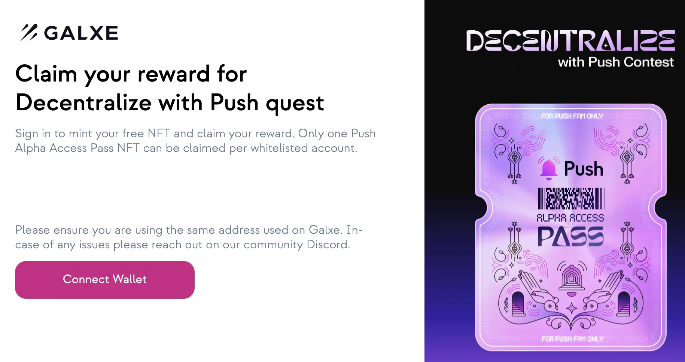

<!--truncate-->

Calling all Push Protocol enthusiasts! The wait is over! You can now claim your exclusive Push Alpha Access NFT. This NFT grants you access to a range of exciting benefits within the Push ecosystem, so don't miss out!

### What is a Push Alpha AccessNFT?

The Push Alpha AccessNFT is a special non-fungible token (NFT) that serves as your key to the future of Push Protocol. Owning this NFT grants you access to:

- <b>Access Exclusive Community</b>: Join the vibrant Push Alpha Community, connect with kindred spirits, and contribute to shaping the future.
- <b>Prepare for Potential Airdrops and Prizes</b>: Stay ahead of the curve and position yourself with a chance to win enticing rewards as Push unveils its forthcoming features.

### How to Claim Your Push Alpha Access NFT

Claiming your Push Alpha AccessNFT is a simple process. Here's what you need to do:
1. Head over to the Push Protocol Galxe claim page: https://app.push.org/
2. Connect your crypto wallet associated with your Galxe account.
3. Follow the on-screen instructions to complete the claim process.
