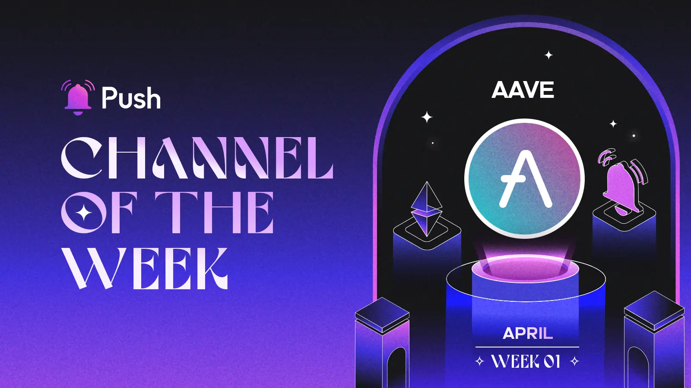
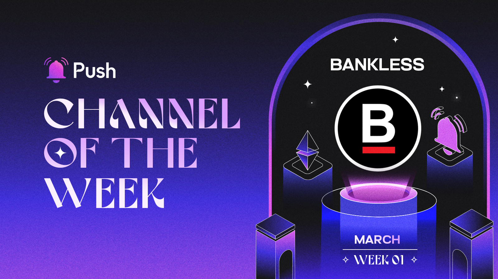
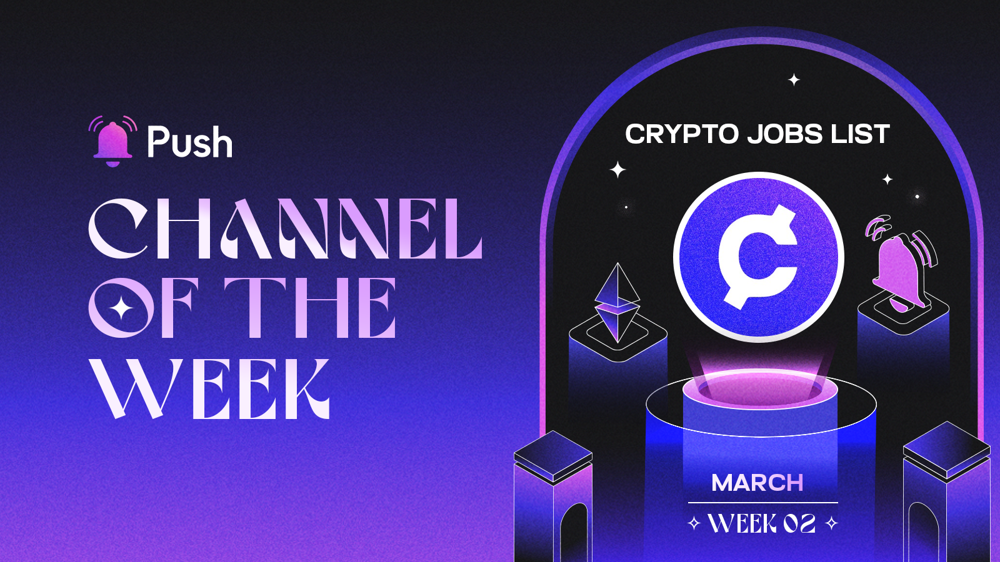

<!--truncate-->
Push Fam, It's time to recognize some of the most impactful channels trusted by our subscribers globally. With that, we're thrilled to announce - **Push Channel of the Week!🏆**.

With more than **175,000** active subscribers and **70 Million** notifications delivered, the Push Channel of the Week initiative is designed to acknowledge the trust users place in our diverse range of channels by spotlighting the most active, engaging, impactful, and consistent channel.

Every week, the Push team meticulously evaluates over **500+** channels to identify one that stands out the most.
The initiative also honors our partner channels for their dedication to consistently delivering valuable, real-time notifications to users ensuring a smooth on-chain communication experience.

**Time to unveil our winner channels for May!**

## Winners For Month - May 🏆

## Week 1: ETH Tracker
### Push x Bankless: Serving regular ETH Price updates to your wallet address with Push Notifications🔔.

### What is ETH Tracker?

The ETH Tracker channel monitors precise price movements of ETH and sends periodic push notifications straight to the subscriber’s wallet address so that you’re in a constant loop with the market!

### What kinds of notifications does the ETH Tracker power?

The channel powers periodic ETH price update notifications which include :

- ETH Price data.💲
- Hourly, Daily and Monthly ETH Price Action shift in **%**.📈📉

You can even customize your notification preferences by adjusting the ranges 🎚 for:

- ETH price range Threshold in **%**
- Price alert notification frequency⚡

### How to opt-in to the ETH Tracker Channel?

To opt-in to the ETH Tracker channel, simply visit the [ETH Tracker Profile Page](https://app.push.org/channels/0xDBc5936E4daaE94F415C39D284f6a69c4d553F2F?utm_source=google&utm_medium=blog&utm_campaign=channel_of_week), click on “**Opt-In**”,
Sign the transaction ( Gasless 🚫⛽) and that’s it. 
You are all set!

## Week 2: Rekt
### Push x Rekt: Get the latest Dark News Updates in the Web3 Space curated by Rekt, straight to your wallet using Push Notifications.🔔.

### What is Rekt?

[Rekt](https://rekt.news/) is a Dark DeFi journalism platform that digs down into every dark web3 news and provides non biased-to the point-investigative articles and content pieces to make web3 users aware of the other half!

### What notifications does the Rekt channel power?

The Rekt channel neds regular notification alerts whenever a Rekt exclusive content is published.

- The notifications are delivered straight to your wallet! 
- No social identifier like email is required!
- All that, with no cost and gasless! ⛽️🚫

### How to Opt-In to the Rekt Channel?

Opting in to Rekt or an other channel is fairly easy!
Simply navigate to the [Rekt Channel Profile Page](https://app.push.org/channels/0x57cD6665e725232123F5250328E35Db6ABf6d80C?utm_source=google&utm_medium=blog&utm_campaign=channel_of_week) on Push DApp and click opt-in and receive immediate alerts from Rekt straight to your wallet address!

**Its time to push forward into April!**

## Winners For Month - April 🏆

## Week 1: Aave
### Push x Aave: Get timely updates related to your loan health ⏰ and more, delivered straight to your wallet!

### What is Aave?

[Aave](https://aave.com/) is a decentralized non-custodial liquidity market protocol where users can participate as suppliers by providing liquidity to the market to earn a passive income, or as borrowers, by borrowing assets in a collateralized fashion.

### What kinds of notifications does the Aave channel power?

The Push Aave channel helps you receive crucial updates on your active loans as well as on the supply, and borrowing APYs for various tokens.

The channel provides a special feature ✨that enables you to customize your notification preferences by setting ranges 🎚 for:
- **Loan Health Factor** ⚖: Choose your desired health factor range to stay informed against liquidation risks.
- **Token Supply Rate Alerts** 🌊: Choose your minimum supply APY threshold in **%** and receive instant notifications when a token lies within the set range.
- **Token Borrow Rate Alerts**⏰: Choose your minimum borrow APY threshold in **%** and receive instant notifications when a token lies within the set range.

### How to opt-in to the Aave Channel?

To opt-in to the Aave channel at no cost (with no gas fees!), you can simply visit the [Aave channel profile page](https://app.push.org/channels/0xAA940b3501176af328423d975C350d0d1BaAae50?utm_source=google&utm_medium=blog&utm_campaign=channel_of_week), click on opt-in and receive immediate on-chain updates directly linked to your chosen wallet address.

## Week 2: BTC Tracker
### Push x BTC Tracker: Get the latest Bitcoin price updates delivered to your wallet address with Push!

### What is BTC Tracker

The BTC Tracker channel monitors precise price movements of Bitcoin and sends periodic push notifications straight to the subscriber’s wallet address so that you’re in a constant loop with the market!

### What kinds of notifications does the BTC Tracker power?

The channel powers periodic BTC price update notifications which include :

- BTC Price data.💲
- Hourly, Daily and Monthly BTC Price Action shift in **%**.📈📉

You can even customize your notification preferences by adjusting the ranges 🎚 for:

- BTC price range Threshold in **%**
- Price alert notification frequency⚡

### How to opt-in to the BTC Tracker Channel?

To opt-in to the BTC Tracker channel, simply visit the [BTC Tracker Profile Page](https://app.push.org/channels/0x03EAAAa48ea78d1E66eA3458364d553AD981871E?utm_source=google&utm_medium=blog&utm_campaign=channel_of_week), click on “**Opt-In**”,
Sign the transaction ( Gasless 🚫⛽) and that’s it. 
You are all set!

## Week 3: ENS
### Push x ENS: Domain expiry alerts delivered straight to your wallet address with Push!

### What is ENS?

[ENS (Ethereum Name Service)](https://ens.domains/) is a decentralized domain naming system built on top of the Ethereum blockchain. It works similarly to the Domain Name System (DNS) we use for traditional websites on the internet, but instead of translating domain names (like [https://app.push.org/channels](https://app.push.org/channels)) to IP addresses, ENS translates human-readable names (like alice.eth) into respective Ethereum addresses.

### What kinds of notifications does the ENS channel power?

On subscribing to the ENS channel with the address that has your actively registered ENS domain, the ENS channel monitors your ENS domain’s expiry dates and starts sending push notifications up to 7 days in advance, before your domain expires.

And the best part, opting-in to the ENS channel is completely FREE and GASLESS!🚫⛽

### How to opt-in to the ENS Channel?

To opt-in to the ENS Channel, visit the [ENS Channel profile page](https://app.push.org/channels/0x983110309620D911731Ac0932219af06091b6744?utm_source=google&utm_medium=blog&utm_campaign=channel_of_week), click on **opt-in** and receive domain expiry updates directly linked to your chosen wallet address.

## Week 4: Coindesk
### Push x Coindesk: Latest and trusted crypto news delivered straight to your wallet address with Push!

### What is Coindesk?

[Coindesk](https://www.coindesk.com/) is a leading source for insightful crypto and web3 news and keeps you informed on the latest market trends, policy updates, and tech advancements in the web3verse 🪐.

### What kinds of notifications does the Coindesk channel power?

The Coindesk Channel sends latest web3 and crypto news alerts to your on-chain inbox (i.e your wallet address!)
Without having the need to give away any of your web2 social identifier like email id.

And the best part, opting-in to the Coindesk channel is that its completely FREE and GASLESS🚫⛽, just like all the other channels!

### How to opt-in to the Coindesk Channel?

To opt-in to the Coindesk Channel, visit the [Coindesk Channel profile page](https://app.push.org/channels/0xe56f1D3EDFFF1f25855aEF744caFE7991c224FFF?utm_source=google&utm_medium=blog&utm_campaign=channel_of_week), click on **opt-in** and receive latet updates to your chosen wallet address.

## Week 5: Cryptocurrency Jobs
### Push x Coindesk: Receive latest web3 job opening alerts straight to your wallet address with Push Notifications!

### What is Cryptocurrency Jobs?

[Cryptocurrency Jobs](https://cryptocurrencyjobs.co/) is one of the largest job boards for crypto and web3 jobs💼.

### What kinds of notifications does the Cryptocurrency Jobs power?

On opt-ing in to the Cryptocurrency Jobs channel, you'll start receiving notifications 🔔 for all the latest job postings, in the areas of:
- Development 🛠️
- Marketing 📣
- Design 🎨
- BD 🤝
- Finance 📈
- & so many more ♾….

### How to opt-in to the Cryptocurrency Jobs Channel?

Opting in to the Cryptocurrency Jobs channel is simply a two click gasless process!
Simply navigate to the [Cryptocurrency Jobs Channel Profile](https://app.push.org/channels/0xde3e447E125FA2391DC9BCbfA0B821424422FEAF?utm_source=google&utm_medium=blog&utm_campaign=channel_of_week). Click **opt-in** - Sign the gass-less message and that's it!
You are all set to get the best web3 job✅.

**Time to unveil our winner channels for March**!

## Winners For Month - March 🏆

## Week 1: Bankless
### Push x Bankless: Serving the latest Bankless content updates to your wallet address with Push Notifications🔔.

### What is Bankless?

[Bankless](https://www.bankless.com/dashboard) is your gateway to the exciting world of Web3. Bankless is a global community of explorers, learning and sharing everything they discover about crypto through insightful articles, daily newsletter updates, and a knowledge-packed podcast featuring the brightest minds in space with over 200k + subscribers on [YouTube](https://www.youtube.com/@Bankless).

### What notifications does the Bankless channel power?

The Bankless Channel on Push DApp helps you keep informed on:

- **Latest Bankless podcasts🎧**
- **Blogs and Article Alerts📰**
- **And product announcements📢**

### How to Opt-In to the Bankless Channel?

You can opt-in to Bankless for free (with no gas fees!) from the [Bankless Channel profile page](https://app.push.org/channels/0x4E15B14B9950A04370E36f2Ec05546ED5867ADeF?utm_source=google&utm_medium=blog&utm_campaign=channel_of_week)
 and receive immediate on-chain updates directly linked to your chosen wallet address.

## Week 2: Crypto Jobs List
### Push x Crypto Jobs List: Get the latest web3 job💼 notifications to your wallet address with Push!

### What is Crypto Job List?

[Crypto Jobs List](https://cryptojobslist.com/) is a dedicated web3 talent and job portal connecting web3’s brilliant minds to brilliant projects spread across the globe.

The portal not only lists technical jobs for developers, architects, and security engineers but also community, growth, and business professionals like growth hackers, marketing managers, community mods, and even meme officers!

### How to Opt-In to the Crypto Job List Channel?

You can opt-in to the  Crypto Job List for free (with no gas fees!) from the [Crypto Job List channel profile page](https://app.push.org/channels/0x30a1627fDdc0dBB7dD00b881D25A45B443f294bB?utm_source=google&utm_medium=blog&utm_campaign=channel_of_week) and receive immediate on-chain updates directly linked to your chosen wallet address.

## Week 3: ETH Gas Price Tracker
### Push x ETH Gas Price Tracker: Latest Gas Price⛽ updates delivered straight to your wallet!

### What is the ETH Gas Price Tracker?

The ETH Gas Price Tracker meticulously monitors the highs and lows of [Ethereum](https://ethereum.org/en/) gas prices and sends periodic push notifications signaling the current gas trend straight to the user's wallet address.

### What kinds of notifications does ETH Gas Price Tracker power?

ETH Gas Price Tracker monitors Ethereum's Gas price movements and keeps you informed when :

- Ethereum gas prices are off the roof📈
- Prices settled to normal👀
- and when prices are lowest than ever!!😁

### How to Opt-In to the ETH Gas Price Tracker Channel?

You can opt-in to the ETH Gas Price Tracker at no cost (with no gas fees!) from the [ETH Gas Price Tracker Profile Page](https://app.push.org/channels/0x2B8ffb4460550Dbe8Ec1cEA9C1B61322dB56B082?utm_source=google&utm_medium=blog&utm_campaign=channel_of_week) and receive immediate on-chain updates directly linked to your chosen wallet address.

This winds up the winner’s list for March.

Stay tuned for the next winner! 👀
Let us know about your favorite channel on [Push Protocol Discord](https://discord.com/invite/pushprotocol)
