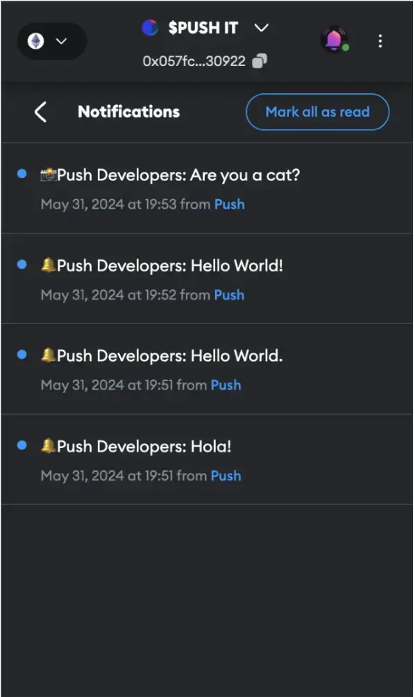

import { Image } from '@site/src/css/SharedStyling';

<!--truncate-->

In the ever-evolving landscape of Web3, as protocols become more innovative and mature, the need for web3 wallets to act as a bridge for onboarding typical Internet (web2) users into web3 with minimal friction is advancing rapidly. 

Amidst these technical advancements, communication remains a paramount factor in driving this transformation. 

Today, Push Protocol is at the forefront, enabling wallets to enhance their functionality and better serve their users by becoming a **'Super App’**.

## Challenges
According to [DApp Radar](https://dappradar.com/blog/state-of-the-dapp-industry-q1-2024), Q1 2024 saw a remarkable surge in daily active wallet users (dUAW), reaching an average of **7 million** daily active wallets—a **77%** increase compared to the previous year.

The numbers clearly show that the entry into web3 starts from a wallet. With more than 120 wallet apps, the sheer innovation in onboarding the next Billion users into web3 is surreal.

Although wallets are expanding their utility from simply being a medium of secure storage and a facilitator of transactions to now, becoming a *‘Super Hub’* for NFT, DeFi, and app browsing activities, they still lack the ability to consistently relay updates and alerts between the user and the accessed protocol while maintaining a constant, symbiotic and duplex communication relationship.

In addition, multi-chain wallets serve as a single entry point for users to interact with applications across a variety of supported chains with ease. However, there is no standardized way for these apps to communicate back with users through the same entrance point i.e. your wallet.

## Solution

**Push helps us solve these challenges.**

With the help of an open - decentralized and secure network supported across multiple chains, Push facilitates any wallet, DApp, service or smart contract to tap into the network and fetch notifications with ease.

With the motive of forming a universal communication layer of web3, Push Protocol is expanding its support to multiple chains including **Ethereum, Polygon, BSC, Arbitrum, Polygon zkEVM, Cyber and Fuse**.

To date, Push has sent over **80 Million Notifications** across **230k+ subscribers**.

### Journey from Wallet to a Super App Wallet from our Partners: ###

Lets take a thorough look at how our partner wallets are adopting Push to become a Super App.

<!-- Interoperable Communications Image -->

1. Unstoppable Lite Wallet
2. Push Metamask Snap
3. Shapeshift Governance Wallet
4. Verso Wallet

### 1.Unstoppable Domains Lite Wallet

Unstoppable Domain Wallets are cryptocurrency addresses used to store users’ web3 domains in addition to tokens and digital collectables.
An Unstoppable Wallet with a valid domain acts as a web3 social identifier for enabling domain-to-domain in-app messaging!

**Push x UD: Empowering wallet-to-wallet messaging with ease!**

<!-- unstoppable lite wallet screen shot -->
<!--  -->
<Image src={require('./image3.webp').default} alt="Unstoppable Domains Lite Wallet" width="353" height="100%" />

Push is proud to enable the next frontier of inter-domain communication by powering notifications and messaging support for over **3.58 million** UD users across more than **300 group chats**.

**What type of users primarily use Unstoppable Lite Wallet?**

The primary user of Unstoppable Lite Wallet are people with domains. The self-custody wallet is designed specifically for domainers, so they can manage and interact with their domains directly from the wallet in addition to traditional crypto tokens. This is a use case that has not been addressed by other wallets.

**How does Unstopppable Lite Wallet ensure smooth UX and Communication?**

Many of the Unstopppable Lite Wallet users are new to web3, so an intuitive and easy to use experience are essential. Inline education and clear messages help new users understand what can be a difficult learning curve.

**How does Push fit into the overall strategic goals of Unstoppable Lite Wallet?**

Messaging is built directly into Unstoppable Lite Wallet. Push Protocol enables token gated group chat. Messaging is built directly into Unstoppable Lite Wallet.

As Push Protocol enables wallet to wallet token gated group chatting, depending on domains and badges, users have access to various conditionally gated group chats where they can engage with others.

**Overcoming seed phrase scares using MPC**

The unstoppable lite wallet features advanced multi-party computation (MPC) technology provided by Fireblocks to improve safety for the self-custody wallet. Users are able to manage their wallet using an email address and password, instead of worrying about seed phrases. There is also a way to recover the wallet if the user forgets their password, adding another layer of safety.

### 2.Metamask Snap

MetaMask Snaps are independent feature plugins developed by third-party developers to enhance wallet experiences in areas such as communication, interoperability, security, account management, and more, for various web3 protocols and applications.

The Push MetaMask Snap allows users to receive real-time notification alerts from their favourite Web3 applications directly within their MetaMask wallet.

**Push X Metamask: Unlocking a Super App experience**

<!-- metamsk snap screenshot -->
<!--  -->
<Image src={require('./image2.webp').default} alt="Push Metamask Snap" width="353" height="100%" />

Metamask being a widely popular wallet and often the first choice for many new web3 users, was crucial to integrate with Push’s capabilities. The launch of the snap functionality provided an opportunity to offer a communication experience akin to web2 applications.

The [Push Metamask Snap](https://snaps.metamask.io/snap/npm/pushprotocol/snap/?utm_source=google&utm_medium=blog&utm_campaign=case_study_supper_app) was launched in September 2023 and continues to see steady growth with over **1.7k downloads.**

The Push  Snap is positioned at a crucial intersection in a user’s DApp interaction journey through their wallet. 

Instead of frequently visiting a DApp to check the status of domain expiry or loan health indexes, Push Snap eliminates these kinds of unproductive user travels. 

Using Push Snap, every mission-critical alert is delivered directly to the wallet as a Push Notification, providing an experience similar to a typical Web2 mobile app.

### 3.ShapeShift Wallet

[Shapeshift](https://app.shapeshift.com/) is an open-source multi-chain platform, offering various DeFi services. The Shapeshift wallet is a community-governed, private, non-custodial wallet that supports multiple chains and assists users in managing their portfolio and DeFi positions.

**Push x ShapeShift  Wallet : Powering Communication**

<!-- shapeshift wallet screenshot -->
<!--  -->
<Image src={require('./image4.webp').default} alt="Shapeshift Wallet" width="353" height="100%" />

Push powers the communication middleware for enabling Push notifications for product updates, governance updates and token transfers. 

Push powers the necessary middleware and infrastructure for [Wherever](https://www.wherever.im/), a third-party communications service to show notifications in wallet and platform frontend as well as share with the user’s telegram and email.

On a parallel front, As users continue to become mature and conscious about on-chain security, the demand for hardware wallets will be ever-increasing. Push can also be integrated with companion Apps of Hardware Wallets like [KeepKay](https://www.keepkey.com/), ensuring user’s with mission critical application updates independent of any wallet type.

ShapeShift has remained the second most subscribed channel for over a year, with a total subscriber count of more than **28,000** with a growth of more than **306%** as compared to previous year.
<!-- shapeshift subscriber count -->

### 4.Verso Wallet:

[Verso Wallet](https://get-verso.com/) is a non-custodial multi-chain wallet for gaming, NFT,defi, meme coins and cash backs.

Verso bridges Web2 audiences to Web3 by enabling in-wallet crypto purchases using credit cards or bank transfers. Verso also facilitates the purchase of gift cards with crypto and provides crypto reward cashback.

**Push x Verso Wallet : Manage all your notifications in one place**

The Push x Verso integration enables users to search for and opt-into any channel and receive notifications directly into the wallet. Ensuring the fact that the communications across all subscribed channels can be managed and organized easily in one place with ease!

### Push is the missing piece for building the next Super Wallet App🧩:

As Web3 continues to mature, user experience will be the key differentiator for wallets vying to become the go-to **"Super App”**. And Push is determined to onboard a Billion Users to web3 by filling in the void between current and expected communication experiences.

With [Push Nodes](https://push.org/blog/explaining-push-nodes/) launching soon, the Protocol will take its biggest leap in its journey to become a completely decentralized communication layer of web3.
