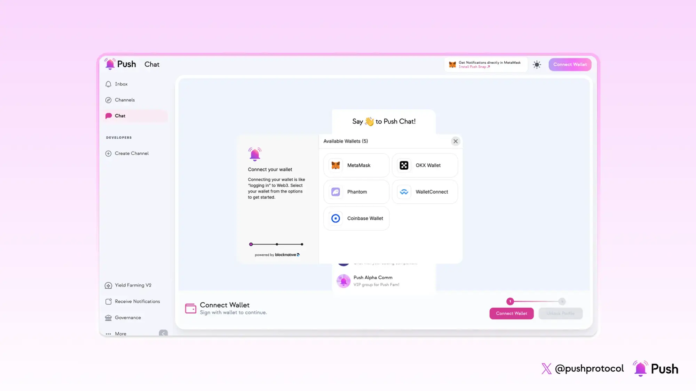

<!--truncate-->

Creating your on-chain community on Push Protocol is fairly easy.

This guide will walk you through the step by step process of creating your own vibrant community on Push Protocol, right from setting up a strong foundation to complete community formation.

To illustrate the journey, lets imagine a community dedicated to a captivating NFT collection known as '**Charcoal Cats🐱**'. In this guide we will show you, how to create a conditionally gated group chat exclusively for these Charcoal Cats admirers.

Building a strong online community takes more than just setting up a group chat. 
Before diving in to the group creation process, let's explore some key considerations to form a solid foundation of your community.

### 1.Define your community's purpose 

Members join and leave the communities, but what remains constant is the community's  purpose.
Find out what common interests will unite your members?  
For Example : The 'Charcoal Cats🐱' community is cult camp of charcoal cat NFT lovers. The access to the chat is restricted to only those wallets who hold 'Charcoal Cats' NFT/s.

### 2.Choose your community type
    
Do you prefer a community which is more welcoming, open & visible to all (i.e Public Group Chats) or rather prefer to form a exclusive community which is only visible to the individuals who are invited, are a part of the community or satisfy the criteria to join it.
    
Push enables both, Public and Private communities with the ability to establish gating conditions for **controlled access**.

With respect to our  example, lets  keep the Charcoal Cats a private community where-in the messages are encrypted and only visible upon successfully joining the group.

### 3.Decide: Open to all OR Conditionally Gated Group Chat

Groupchats that do not impose any pre-requsite condition before joining the group can be termed as **open groupchats**.
For instance, media oriented groupchats can be joined by anyone directly.

**Conditionally Gated Chats**

Group chats that impose one or multiple conditions for users and allows only those users who satisfy these conditions are termed as **conditionally gated chats**.

**Conditions are a series of criterias that can be applied for both, joining the group as well as for chatting in the group.**

### Tailoring Access with "Any" or "All" Settings

Push Protocol gives you further control by letting you define how users meet the set criteria. You can choose between:

- **'Any' setting:** Here, users only need to meet one of the defined criteria to gain access. This allows for a more inclusive approach.
- **'All' setting:** This requires users to satisfy all the defined criteria, creating a more exclusive space.

Push Chat provides the following settings to configure your gated chat group:

<!-- type of communities -->

| Criteria | Description |
| --- | --- |
| ERC20 -Tokens | User needs to hold XX token to join the group |
| ERC721 - NFTs | User needs to hold XX NFT to join the group. |
| Invite  | Both Owners and Admins can invite people to join the group. You can further customize invite privileges by specifying whether both Owner and Admin need to approve invites, or if either of them can do so independently. |
| Guild | Ability to set non-web3 native conditions using [Guild.xyz](https://guild.xyz/) |
| Custom Endpoint | URL provided for custom usecases. |

So, are you ready to build your dream community?  Let's get started!  We'll walk you through the creation process using our example of : the 'Charcoal Cats🐱' NFT Gated community groupchat.

## Time to build our very first group chat

**Step 0 : Visit [Push DApp](https://app.push.org/welcome?utm_source=google&utm_medium=blog&utm_campaign=create_group_chat) and Connect Wallet:**

<!-- step 0 screenshot -->

**Step 1 : Unlock your Profile.**

The first step is to verify and unlock your profile on **[PushChat](https://app.push.org/chat?utm_source=google&utm_medium=blog&utm_campaign=create_group_chat)**.
You can check the “**Remember me**” option for avoiding the profile unlock process everytime.

<!-- step 1 screenshot -->

Selecting 'Remember me' will save your Push Profile keys locally on your device. 

**Step 2: Click on the ‘+’ button to create a new group**

<!--  step 2 screenshot -->

Click on “New Group” to start creating your group

**Step 3: Create Group Chat Profile**

<!-- step 3 screenshot -->

**Step 4: Specify the Joining Conditions (if any)**

Conditions can be levied on Joining the group as well as for chatting in the group.

<!-- step 4 screenshot -->

**Step 5: Add Participants.**

<!-- step 5 screenshot -->

The address that creates the group chat is the '**Group Owner**' and the '**Group Admin**' by default.

The owner can delegate 'admin' role to some other trusted participant of choice.

Initially the owner can choose to add few early known participants and thereafter you can circulate the groupchat link OR joinees can search the chat name in search bar to join the chat.

Finally, click on **Create Group** to get your own customized group chat up and running for free, with no gas fees!

**Fin-al Step : Time to Chat 💬**

This is how you can swiftly create your community with granular customization possibilities within no time for free!

### Start building your community now 👉 [https://app.push.org/chat](https://app.push.org/chat?utm_source=google&utm_medium=blog&utm_campaign=create_group_chat)

Have any queries?
We’ll be super happy to answer them on our [Discord](https://discord.com/invite/pushprotocol)