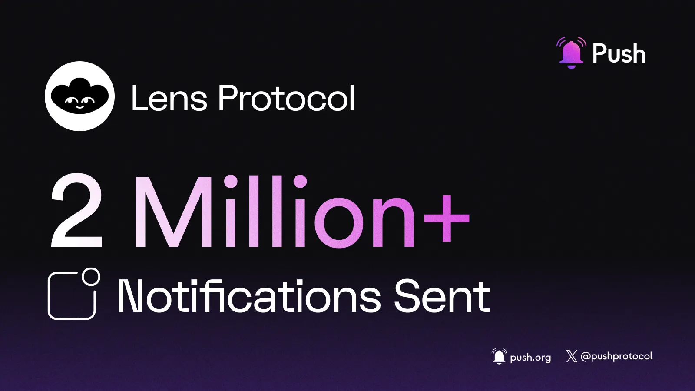

<!--truncate-->

August was a notable month for Push, marked by significant milestones related to user engagement, feature development, and overall community growth. [Push Protocol](https://push.org/) sent over 10.2 Million New Notifications in August, reaching a cumulative [242k subscribers](https://push.network/dashboard), showcasing substantial progress in user engagement, development, and community growth.

Here's a quick recap of all the exciting updates:

We're thrilled to announce that Push has reached a significant milestone: over 100 million notifications sent all-time. This is something that we've dreamed of since we began this journey to empower, enable, and unify web3 with native communication.

As a key step towards achieving our mission of becoming the communication hub for all blockchains, we debuted one of our strongest protocol upgrades - [Pre PIP 3: Cross Chain Requests](https://x.com/PushChain/status/1821607565920497857).

Moreover, the [BTC Tracker](https://app.push.org/channels/0x03EAAAa48ea78d1E66eA3458364d553AD981871E) channel surpassed 10,000 subscribers, after witnessing a massive 160% increase in opt-ins between May-August.

And that’s not all! The [Lens Protocol](https://app.push.org/channels/0xef6426D522CfE5B7Ae5dB05623aB0Ef78023dBe0) channel experienced a significant surge in notifications starting in mid-August, surpassing 2 Million Notifications sent by the end of the month.

### **Product Updates:**

Push Protocol’s [DApp](https://app.push.org/welcome) received several upgrades, including:

- the new channel creation page, send notification page, and channel dashboard being tested and deployed to production.
- the expansion of support to two new chains: Base and Linea.
- the deployment of support for adding a new chain alias to channels.
- the testing of a new reward points program, which is going live soon.
- the addition of new components to Push’s design system.
- the addressing of priority bug fixes.

### **Backend Enhancements:**

- the implementation of a referral system for the Points Program.
- the upgrade of platform scalability by migrating production servers from AWS to GCP.
- the beginning of work on a tool that allows channels to automate notification logic without writing a single line of code.
- the improvement of the response format for our API calls.
- the kickoff of work on a custom delivery node that delivers notifications on different platforms like Discord/Telegram/email.
- the development of a pricing model for channels to leverage the custom delivery node operations.

### **Smart Contracts:**

- The community voted in favor of the [Cross Chain Request](https://gov.push.org/t/pre-pip-3-cross-chain-request-feature-in-push-smart-contracts-v3/1794) (CCR) Feature Proposal, with 100% approval. Community feedback is being integrated into the feature’s development.
- Phase 3 of the Cross Chain Request features development i.e. Security R&D is currently under progress.
- Completed the first implementation of Push Comm smart contracts for a NON-EVM chain, i.e., Starknet.
- The contracts have been developed in the Cairo Smart contract language and have now been tested. The audit for the contract shall be completed in the next 3 weeks.

Additionally, the Chat SDK saw improvements to response structure and priority bug fixes.

### **Partnership Updates:**

Push Protocol continues to expand its ecosystem through new collaborations:

- We're thrilled to be working with [QuickSwap](https://x.com/PushChain/status/1826957066520383638), a leading decentralized exchange (DEX) on Polygon PoS, Polygon zkEVM, and Dogechain to power push notifications when user liquidity goes out of range and when the user stops earning fees.
- [CoinEasy](https://x.com/PushChain/status/1826262728979436009), a Korean web3 education social platform, joined forces with Push to integrate Push Chat for improved user communications and UX.
- [Unstoppable Domains](https://unstoppabledomains.com/), a long-time partner, leveraged Push Protocol for group chat support for [Africa Rare Metaverse](https://x.com/PushChain/status/1819715311253307611), [Farmsent](https://x.com/PushChain/status/1828077913008476232), [Deadfellaz](https://x.com/PushChain/status/1826580811237171237), and [Tetherball](https://x.com/PushChain/status/1825500051621212532).
- [Outposts](https://x.com/PushChain/status/1825543303116554260), a bi-weekly web3 digest platform whitelisted Push Alpha Access Pass NFT holders to its invite-only digest community and earn program points that unlock token rewards.

### **Ecosystem Highlights:**

- We hosted an engineering-focused [X space with Wormhole](https://x.com/PushChain/status/1821875116390613041) on the upcoming CCR feature with [Wormhole](https://wormhole.com/), whose NTT framework is key to Push's chain-agnostic vision.
- Push Protocol founder Harsh Rajat shared his insights on Push Protocol's evolution, the web3 consumer landscape, and upcoming upgrades on the "[Colors of Web3 Entrepreneurship](https://www.youtube.com/watch?v=LQmHFQ7IO18)" podcast.
- In collaboration with [Tally](https://www.tally.xyz/), a governance optimization platform, we held a Twitter space on "[Improving Decentralized Governance with Push and Tally.](https://x.com/PushChain/status/1821441276740346320)”
- Ian, our DAO and Governance lead was invited to speak on the [Hipther Podcast Show](https://www.youtube.com/watch?v=zpqP_b-ch1A) to share his experience working in web3 for almost a decade while also discussing the working mechanisms of Push DAO and the upcoming launch of Push Nodes.
- Ian was also invited to the [Amberdata Podcast](https://blog.amberdata.io/amberdata-podcast-feat-ian-leviness-head-of-grants-at-push-protocol?hss_channel=tw-876969251617112064) to share his unique story, our core mission, & how Push is solving for scaling decentralized communications.
- Push and CoinEasy conducted a joint Twitter space with DAO Lead Ian and Seung Lee, the co-founder of CoinEasy discussing [Simplifying Web3 Journey with Push and CoinEasy](https://x.com/PushChain/status/1826620569053286715).

### **Push Governance and Community Updates:**

- The community passed new guidelines to streamline the performance of our ambassador hubs.
- Push Grants V3 reached 21 applications and continues to grow!
- Our contributor base more than tripled from all-time highs and continues to grow by the day!
- Carla, from the DAO Council, spoke at and judged the buildathon at [Ethereum Uruguay](https://x.com/EthereumUruguay).
- SixtyKeys, another DAO Council member, earned a speaking spot at this year's ETH Safari in September.
- The DAO launched weekly DAO thoughts, sharing practical tips on DAO building, with the end goal of expanding that effort into a podcast and more!
- We knighted our 2nd [Push Chad Discord Role](https://x.com/PushChain/status/1827295975389499604) winner, in lieu of identifying, recognizing, and incentivizing consistent community contributors.

With Push Nodes launching soon, Zaryab, our Smart Contracts Lead, wrote a blog post - “[Randomness in Push Nodes](https://x.com/PushChain/status/1828432624273981586)” to educate our ecosystem and a wider audience on how Push Nodes leverage the principle of randomness to ensure optimal network fairness and censorship resistance.

Our DAO Lead also penned a post [on solutions to the cold start problem](https://push.org/blog/cold-start-solutions-scaling-consumer-crypto/) for web3 apps aiming to be platforms, marking our first foray into editorial content spanning the consumer crypto niche.

Furthermore, we’re excited to introduce a new initiative - “[Write for Push](https://x.com/PushChain/status/1826313152176251142)” enabling anyone in the Push community to contribute to the protocol’s blog repository and help shape its voice. From the outset, this will focus on topics related to the existing Push ecosystem and its products.

With this multi-faceted shift in content and our tech, we’re setting ourselves up to be a true authority on the future of consumer applications at all levels.

Your continued support and enthusiasm fuel our commitment to push the boundaries of technology while building a supportive and diverse Web3 ecosystem.

### **What’s coming up?**

Stay tuned for more updates as we continue to push the boundaries of the Web3 ecosystem and keep your eyes on our [2024 roadmap](https://comms.push.org/docs/roadmap/), for a further glimpse into what's next. Together, let's continue to push the industry forward toward unified applications and a better UX than ever before!
