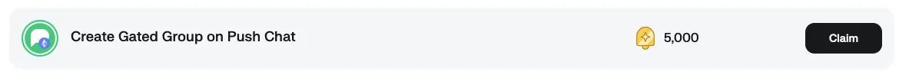

<!--truncate-->

### **What Are Token-Gated Group Chats?**

Token-gated group chats are web3 native communication spaces where access is restricted based on the ownership of specific blockchain assets such as tokens or NFTs (non-fungible tokens). To put it even more simply, users must hold a certain token or NFT in their wallet to be granted entry to these exclusive group chats. This concept leverages the power of the different [ERC token](https://ethereum.org/en/developers/docs/standards/tokens/) standard technologies, offering decentralized and permissionless access control to on-chain communities.

These gated communities are becoming an increasingly popular option across all sorts of web3 groups, including DAOs (Decentralized Autonomous Organizations), NFT collector groups, and on-chain role holders. By tokenizing access, these chats provide a powerful tool for enhancing privacy, fostering trust, and building a strong sense of belonging.

### **How Do Token-Gated Group Chats Work?**

First, token-gated chats depend on the accurate verification of the assets in a user’s blockchain wallet. In the case of Push’s gated chats, Push Protocol authenticates a user's wallet holdings to ensure they possess the required token or NFT to join the chat. The authentication is automatic, eliminating the need for traditional usernames, passwords, or email sign-ups. This process is seamless, privacy-focused, and ensures that only eligible users gain access to the chat or chats involved.

All of it is done in a matter of minutes.

Once authenticated, users can join discussions, receive exclusive content, participate in community governance, and more—making these group chats integral to any on-chain community.

### **Why Do We Need Token-Gated Group Chats?**

The need for token-gated group chats stems from the growing demand for decentralized, transparent, and secure community management tools and workstreams in the web3 space.

Below, we’ve compiled several examples of current and future use cases:

**1. Exclusive Access for DAOs:**

For DAOs, token-gated group chats offer a mechanism to ensure that only voting members or contributors with skin in the game can participate in decision-making discussions. By using governance tokens as the entry key, DAOs can securely manage spaces where they want only a certain threshold of token holders to participate and share opinions.

- **Benefits**: Having tokenized group chata strengthens governance processes by ensuring that only active, vested members are involved in the DAO's core operations, reducing noise and improving engagement quality.
- **Use Case**: DAOs like MakerDAO or Uniswap could create token-gated group chats for core governance contributors or voting members, creating secure spaces for key discussions.

**2. Community Building for NFT Collectors:**

NFT projects are built on the idea of exclusive ownership, and token-gated chats are a natural extension of this exclusivity. By allowing only verified NFT holders into private chat rooms, project creators can cultivate tight-knit communities that feel valued, special, and more closely connected to artists, founders, or whoever else the holders bought the NFT to support.

- **Benefits**: NFT owners get a space where they can engage directly with creators and fellow collectors, access exclusive content, and receive early updates or airdrops.
- **Use Case**: A popular NFT collection like Bored Ape Yacht Club (BAYC) might use a token-gated chat to offer holders access to exclusive discussions about future projects, merchandise drops, or events.

**3. Enhanced Security and Privacy:**

Token-gated group chats inherently provide a higher level of privacy and security compared to traditional centralized platforms. By using cryptographic wallets as authentication, users no longer need to rely on third-party platforms that store personal data. This aligns with the ethos of decentralization and significantly reduces the risks of hacking or data breaches.

- **Benefits**: No usernames or passwords or any storage of any sort of personal documents is required and there is no risk of sensitive personal information being leaked.
- **Use Case**: Communities concerned with privacy, like those focused on anonymous or pseudonymous interactions, can use token-gated chats to ensure secure and private communication.

**4. Direct Monetization of Communities:**

For content creators and influencers, token-gated chats provide a unique opportunity to monetize access to their communities. By selling tokens or NFTs that grant access to their private group chats, they can create an additional revenue stream while giving fans and followers a sense of exclusivity.

- **Benefits**: Fans get special access to behind-the-scenes content, exclusive Q&As, or direct interactions with their favorite creators, while creators benefit from new revenue models.
- **Use Case**: A crypto influencer might create a token-gated chat for subscribers who hold a specific NFT, offering them VIP content and advice.

### **How Hats Protocol Enhances Token-Gated Group Chats**

For DAOs using **Hats Protocol**, the integration of token-gated group chats can significantly streamline their communication processes. Hats Protocol enables the decentralized management of roles and permissions within a DAO, allowing members to be assigned "hats" based on their roles. These hats can also serve as access tokens for group chats, ensuring that only members with the relevant responsibilities can participate in specific discussions.

Here’s how DAOs that use Hats Protocol can benefit from token-gated group chats:

**1. Role-Based Chat Access:**

Hats Protocol allows DAOs to assign roles on-chain, ensuring that only those members who wear specific hats (such as "Treasury Manager" or "Governance Lead") have access to relevant group chats. This integration ensures that discussions stay focused and are only open to those with the proper permissions.

- **Benefits**: Only relevant DAO members can join key discussions, preventing unqualified members from cluttering important communication channels.

**2. Dynamic Access Control:**

As roles (or hats) within a DAO evolve, access to token-gated chats can dynamically adjust. When someone is promoted, or steps down from a role, their access to group chats is automatically updated, ensuring up-to-date permissions.

- **Benefits**: Access to crucial communication channels remains in sync with the current organizational structure without manual updates.

**3. Increased Security and Confidentiality:**

DAOs can maintain security and confidentiality by ensuring that sensitive topics, such as treasury or governance discussions, are restricted to verified role-holders. Hats Protocol makes it easy to manage and track who holds each hat, ensuring secure communication.

- **Benefits**: Only authorized members access sensitive information, reducing the likelihood of leaks or mismanagement.

**4. Streamlined Team Coordination:**

Large DAOs can have multiple teams managing different parts of the organization. Hats Protocol ensures that team members with the relevant roles can communicate within private, token-gated group chats, enhancing collaboration across decentralized teams.

- **Benefits**: Teams can focus on their responsibilities, while DAO leaders can rest assured that only the right people can access certain discussions.

### **The Future of Token-Gated Group Chats**

Token-gated chats are just one example of how Push Protocol is transforming the way we interact online. As the demand for decentralized governance, privacy, and exclusivity grows, token-gated communities will become a staple in the web3 ecosystem.

For DAOs, NFT collectors, on-chain role holders, and content creators alike, token-gated chats provide the tools needed to foster loyalty, increase engagement, and ensure that only the right people are involved in key discussions.

Token-gated group chats are unlocking a future where participation is open and earned, making the web3 ecosystem more exclusive, secure, and rewarding.

**Earn points for Gated Group Chats**

With the [Push Points Program](https://push.org/blog/introducing-the-push-points-program/) in full swing, we have added an extra incentive to new users looking to explore the Token Gated Groups. You can now earn points for setting up your very own gated group chat. So, if you are still on the fence, head over to the [Push App](https://app.push.org/), sign in to activate your profile, and start earning points for your support in growing the Push ecosystem, including 5,000 Push Points for setting up a gated group chat.

