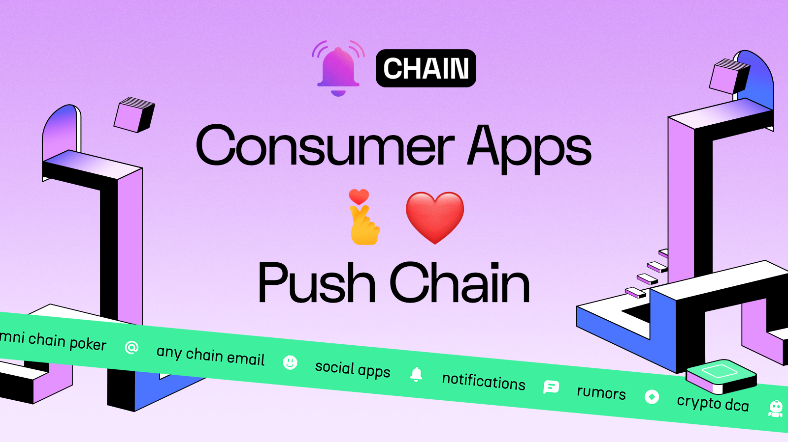
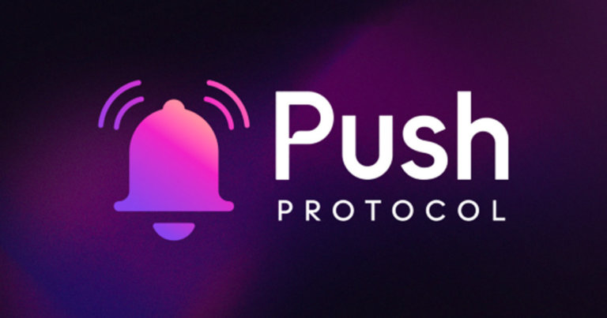

<!--truncate-->

## Introduction

Blockchain technology has transformed the way we interact digitally, but its current ecosystem faces significant challenges in scalability, usability, and accessibility, particularly for consumer-focused applications. Push Chain emerges as a cutting-edge Proof-of-Stake blockchain, purpose-built to bridge fragmented web3 ecosystems and deliver hyper-scalable and user-friendly universal applications. In this article, we delve into the evolution of the Push Chain, its phased development roadmap, and the innovative applications it empowers.

## History of Push Protocol

Push Protocol initially emerged to address a communication gap in web3. By introducing real-time notifications and decentralized chat, Push Protocol became the communication backbone for projects like Uniswap, Lens Protocol, and Snapshot. Over time, Push extended its mission to simplify user and developer experiences (UX and DevX) in web3.

Despite these advances, core web3 limitations remained: scalability, fragmented ecosystems, and a lack of shared execution layers. These challenges inspired the evolution of Push Protocol into **Push Chain**, a shared-state blockchain aimed at solving these systemic issues.

## Meet Push Chain

Push Chain is a next-generation blockchain designed to overcome the limitations of today’s web3 ecosystem by enabling seamless, scalable, and user-friendly applications for both developers and end-users. Unlike traditional blockchains, which often prioritize financial use cases, Push Chain is built to support a wide range of consumer and mixed-use applications, from social platforms to decentralized gaming and beyond.

Push Chain unifies fragmented blockchain ecosystems, allowing transactions and interactions across multiple chains without compromising user experience. By introducing advanced features like wallet and fee abstraction, dynamic sharding, and universal smart contracts, Push Chain ensures developers can focus on building applications. At the same time, users enjoy intuitive, chain-agnostic access.

Push Chain’s mission is to redefine web3 by making it as accessible and seamless as today’s web2 experiences, without sacrificing the core values of blockchain technology—decentralization, security, and transparency. Whether you’re building the next social app, DeFi platform, or gaming experience, Push Chain provides the infrastructure to make it happen.

## Push Chain Roadmap

Push Chain’s development follows a phased approach:

### Phase 1

**Phase 1** focuses on creating an infrastructure tailored for consumer-centric applications, offering true scalability and seamless integration. This phase enables transactions from any chain, a virtual machine, consumer transactions (ordering is not important), fees and wallet abstraction, and email/social login.

### Phase 2

**Phase 2** focuses on establishing seamless interoperability between blockchains, enabling instant cross-chain transactions and the transfer of value and smart contract calls. This phase introduces a solver network designed to enhance user experience by abstracting on-chain complexities. By facilitating hyper-scalable and universal applications, Phase 2 paves the way for scalable apps with improved usability and accessibility for all users.

### Phase 3

**Phase 3** introduces shared state and universal smart contracts, enabling seamless cross-blockchain interactions. By granting Push Chain access to its own and other chains’ data and mapping user wallets with Push ID, developers can build applications that serve users without concern for blockchain specifics. This phase abstracts complexities, allowing users to interact with apps like Uniswap for their features alone in a chain-agnostic manner.

## **Applications That Can Be Built on Push Chain**

Push Chain’s architecture is specifically designed to enable developers to create universal, consumer-friendly applications. These applications span various domains, leveraging the blockchain’s ability to handle both financial and non-financial use cases with ease. Below is an expanded look at the diverse range of applications that can thrive on Push Chain.

### **Social Applications**

Push Chain’s scalability, fee, and wallet abstraction make it ideal for creating decentralized social platforms. These applications can replicate or improve upon popular web2 platforms while leveraging the benefits of blockchain technology:

- **Decentralized Social Media Platforms**: Build the next-generation Reddit, Twitter, or TikTok with censorship resistance and token-based incentives for content creators.
- **Community Spaces**: Enable decentralized group chats, forums, or live audio/video spaces where participants can connect without relying on centralized platforms.
- **Social Rewards Apps**: Create apps where users earn rewards for engagement, such as likes, shares, or creating valuable content.

### **Financial Applications**

While Push Chain isn’t solely focused on DeFi, it supports **financial applications** with universal capabilities:

- **Unified Decentralized Exchanges (DEXs)**: Develop DEXs that allow seamless token trading across multiple blockchains.
- **Cross-Chain Lending and Borrowing**: Create DeFi platforms that connect liquidity from different blockchains, offering users better rates and higher liquidity.
- **Global Payment Systems**: Build payment gateways where users can transact with minimal fees using tokens from any blockchain.

### **Marketplace Applications**

Push Chain’s shared state and universal app capabilities simplify the creation of **marketplaces**:

- **NFT Marketplaces**: Design platforms where NFTs from any blockchain can be traded seamlessly, eliminating the need for bridging solutions.
- **Global E-Commerce**: Build decentralized marketplaces that support cross-chain payments.
- **Tokenized Asset Trading**: Create platforms for trading tokenized assets like real estate, art, or collectibles across multiple blockchain ecosystems.

### **Decentralized Identity and Profiles**

Push Chain’s unified user model makes it a strong foundation for **identity solutions**:

- **Decentralized Profiles**: Enable users to create and manage blockchain-based profiles that integrate their activity across multiple chains.
- **Reputation Systems**: Build decentralized reputation systems where users earn credibility based on their interactions and contributions across multiple blockchains.
- **Credential Verification**: Develop systems for verifying user credentials, such as educational qualifications or employment history, securely on any blockchain.

### **Cross-Chain Analytics and Portfolio Management**

Push Chain’s interoperability and shared state enable powerful **analytics and management tools**:

- **Unified Web3 Portfolios**: Develop apps that allow users to manage and track their token holdings, NFT collections, and DeFi positions across multiple blockchains in one interface.
- **Analytics and Recommendations**: Build analytics platforms that provide insights into user behavior, enabling personalized recommendations or investment advice.
- **Cross-Chain Governance Dashboards**: Aggregate DAO governance activities across chains, providing users with a unified voting and proposal management system.

### **Utility and Productivity Applications**

Push Chain enables **utility applications** that simplify and enhance everyday tasks:

- **Decentralized Email and Messaging**: Build secure, blockchain-based email services where users communicate using their wallet addresses or Push IDs.
- **Web3 Blogging and Content Platforms**: Create decentralized blogging platforms where users can publish, share, and monetize content without relying on centralized hosts.
- **Data Storage and Retrieval**: Build applications for storing user settings, metadata, or application states, enabling decentralized profiles and preferences.

### **Education and Training Platforms**

Push Chain supports **decentralized education platforms** that enhance learning experiences.

- **Credential Management**: Verify and share academic achievements securely on the blockchain.
- **Incentivized Learning Platforms**: Reward users with tokens for completing courses or achieving milestones.
- **Decentralized Knowledge Sharing**: Develop platforms where users can share and monetize expertise in a peer-to-peer manner.

## Conclusion

Push Chain is redefining the future of blockchain by creating a unified, scalable ecosystem that empowers developers and simplifies user experiences. With its innovative features like cross-chain interoperability, shared state, and universal smart contracts, Push Chain enables diverse applications, from decentralized social platforms to global marketplaces, to thrive. By abstracting complexities and focusing on usability, it sets the stage for a seamless, interconnected web3 where applications are accessible to everyone, regardless of technical expertise or blockchain ecosystem.
