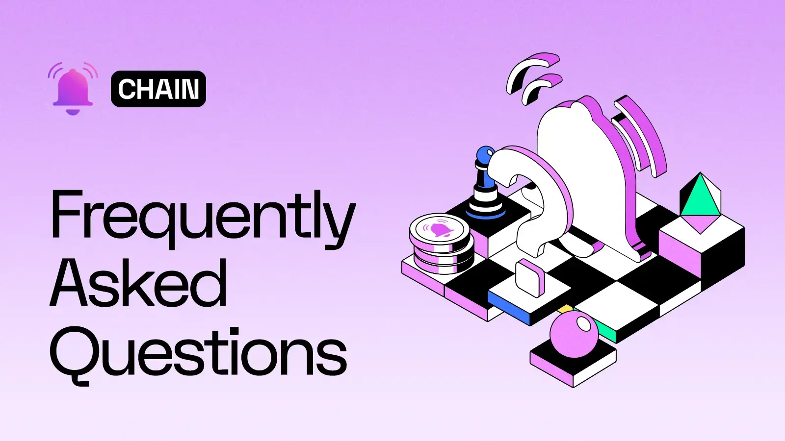

<!--truncate-->

## Frequently Asked Questions

The place to find answers to all the popular questions the community has asked about Push Chain. Crowdsourced from Push Fam 🫶 and curated by the Push team 💪.

## Overview

---

### What is Push Chain?

Push Chain is a shared state blockchain for universal applications. It is designed to allow **transactions from any chain** (ETH, Solana, EVM, non-EVM), has **&lt;1s fast finality** and has **true scalability** (read and write throughput increases as the number of nodes increases).

It introduces some ground breaking innovations such as **consumer txs** (order not important), **parallel validators and dynamic sharding** and **universal smart contracts**. The result is a layer 1 with the ability to become a shared settlement layer for all L1s 🤝 L2s 🤝 L3.

---

### How does Push Chain work?

Push Chain is a sharded, Proof-of-Stake (PoS) blockchain that features different types of nodes—validators, storage nodes, and archival nodes—each optimized for specific roles and responsibilities to ensure high efficiency. This design gives the chain fast finality of less than one second.

In brief, **Validator** nodes handle the role of writing transactions and are able to do so in parallel. **Storage** nodes, which are dynamically sharded, fetch transactions from the network. And **Archival** nodes provide a complete snapshot of the blockchain.

Push Chain also introduces several key innovations in web3. At launch, these include **consumer transactions** (these are txs where order is not critical), **Push ID**, which maps multiple EVM and non-EVM accounts and **wallet and fees abstraction**.

In later phases, Push Chain will introduce **shared state** and **universal smart contracts**. These features will enable smart contracts on Push Chain to access the state of both EVM and non-EVM wallets connected to a single user.

The result is **universal applications** for web3. In this paradigm, instead of being a user of "Uniswap on Ethereum," "Uniswap on Polygon," or "Uniswap on Arbitrum," a person simply becomes a **user of Uniswap**.

These innovations make Push Chain suitable for creating new experiences or cross-deploying existing consumer-centric apps tied to specific blockchains, making them accessible to any web3 user.

---

### Why is Push Chain unique for users?

Push Chain addresses specific gaps in the existing blockchains, such as interoperability, shared app experiences, enabling new app experiences, and scalability. While existing blockchains are robust, they operate in their own eco-system and an aggregator to unite these chains are needed.

Push Chain’s focus is on being a **shared state chain** for universal applications acting as a unifying layer where all chains can come together and use PC as universal hub or do settlement between them.

PC offers a new paradigm of web3 that works from **any chain.** for **any user.** and is suitable for **any app.**

---

### What are the core innovations of Push Chain?

**Any Chain Txs and Blockchain Agnostic Wallet Addresses**

As a shared-state blockchain, Push Chain adopts **CAIP-10 standards** (shoutout to [@pedrouid](https://x.com/pedrouid 'Follow Pedrouid on X'), allowing it to parse the chain, network, and address of each transaction. This ensures true interoperability across multiple blockchain ecosystems.

**Consumer Txs (unordered) and Traditional Txs (ordered)**

Push introduces a new type of transaction that we define as **consumer transactions**.

When you look at consumer apps of web2, you quickly notice that they are made of two components:

1. **Transactions where order is necessary** (e.g., user payments, financial instruments).
2. **Transactions where order is not critical** (e.g., messages, comments or likes on a post, retweets, chats, emails, gameplay, etc.).

These unordered actions dominate consumer apps, but traditional chains don’t provide the right experience for them.

Push Chain introduces **unordered transactions**, where order is not critical. These transactions can be sent to any of the validators running on the network to be processed.

This innovation will have a significant impact on web3, enabling consumer apps that combine financial, mixed-financial, and non-financial transactions with the same scalability and speed seen in web2.

**Parallel Validators & Dynamic Sharding**

Push Chain uses a **node governor smart contract**, which registers all the different types of nodes. This governor contract not only registers nodes but also keeps track of the number of validator, storage, and archival nodes.

- It adjusts the replication factor.
- Assigns address chunks to shards.
- Enables parallel validators to process transactions, allowing the chain to scale linearly with the number of nodes added to the network.

This approach achieves **true scale**.

**Wallet and Fee Abstraction**

**Wallet abstraction** provides a flexible, embeddable wallet experience, tailored to individual user journeys while preserving decentralization. This abstraction simplifies the user experience (UX) for both existing and new web3 users.

**For Existing Web3 Users**

- If you're already using Ethereum, Solana, or another chain, the **Push Chain wallet** allows you to continue using your current setup—no extra hoops.
- Combined with **fee abstraction**, transactions stay native to the source blockchain, making cross-chain use effortless.

**For New Web3 Users (Web2 Normies)**

- Not web3-savvy? No problem. Just log in with an email or social account.
- Under the hood, the wallet uses sharding and passkeys to stay non-custodial but feels as simple and intuitive as web2.

**Shared State and Universal Smart Contracts**

With **Push ID**, the state of a non-Push wallet and multiple wallets across any chain is mapped to a single user. This ensures that the user's state across all blockchains is known.

Combining this capability with **universal smart contracts** unlocks innovations that web3 hasn’t seen before, enabling the era of universal apps.

---

### What problems does Push Chain solve?

- **Fragmentation:** Unifies app experiences across blockchains, bridging EVM and non-EVM ecosystems.
- **Scalability:** Achieves true scaling through dynamic sharding, stateless blocks, and parallel block execution.
- **Interoperability:** Supports transactions from any blockchain, enabling shared app states.
- **Finality:** Near-instant finality (~1-2 seconds), essential for real-time app experiences.
- **User Experience:** Simplifies onboarding and interaction via derived keys and unified user identities (Push ID / DID).
- **Universal Apps:** Enables applications to be built that can be accessed by any user from any chain instantly.

---

### What are the different phases of Push Chain?

Phase 1 lays the groundwork of building universal consumer apps focusing on introducing a scalable, chain agnostic, and unified layer capable of handling any types of consumer apps including financial but also non-financial and mixed-financial apps. The features in this phase include:

- Enabling true scale apps
- Allowing transactions from any chain
- Introducing Consumer transactions (where ordering is not important)
- Push VM for complex on-chain applications
- Fee abstraction
- Wallet abstraction
- Push ID to map multiple EVM and non-EVM wallet to a single identity
- Enabling PoS (Proof of Stake) with dynamic sharding and parallel validators

Phase 2 centers on facilitating seamless interoperability between chains which is a stepping stone in enabling universal smart contracts to usher in universal apps.
This phase introduces a solver network capable of instant cross-chain transactions, both financial and non-financial based. The non-financial distinction is crucial as it enables all payloads to move instantly between Push-connected chains, benefiting consumer applications like:

- Social media
- Marketplaces
- Gaming
- Other consumer-facing use cases

Phase 3 is about introducing shared state and the launch of universal smart contracts, enabling true shared state and universal apps.

---

## Technical

### Why does Push Chain need to be an L1 instead of an L2 chain?

Push Chain is purpose-built to be a shared-state blockchain for universal, on-chain apps. To achieve this in practice, Push Chain functions as a settlement layer (L1) for multiple L1s, L2s, and L3s.

This architecture enables it to accept transactions from any chain, reduce cross-chain friction through gas abstraction, and provide wallet abstraction for seamless onboarding—whether users are web3 veterans or newcomers.

---

### Is Push Chain EVM Compatible?

Push Chain begins as EVM compatible and becomes more and more compatible with further chains as it evolves. Further information can be found in both the Push Chain [whitepaper](https://whitepaper.push.org 'Whitepaper of Push Chain').

---

### Will Push Chain be compatible with both EVM and non-EVM chains?

Yes, Push Chain is designed to support both EVM and non-EVM chains, ensuring maximum interoperability.

---

### Why create a new blockchain when existing ones like Ethereum and Solana already exist?

Push Chain addresses pervasive gaps in the existing blockchains; specifically interoperability, shared app experiences, and scalability. While existing blockchains are robust, they operate in silos and lack the ability to unify state across multiple blockchains. Push Chain’s focus is on being a **shared state chain for universal applications**, offering seamless cross-chain interactions and unparalleled scalability.

---

### What does shared state blockchain mean?

Shared state refers to the present status of onchain data. A shared-state blockchain is one that has read-and-write access to its own state and the state of all other chains it interacts with. A shared state chain is capable of handling data, liquidity, and users from any other chain.

---

### What sets Push Chain apart from other shared state chains?

- **True Scalability:** Parallel execution, dynamic sharding, and stateless blocks.
- **Interoperability:** Seamless integration with EVM and non-EVM chains.
- **User-Centric Design:** Derived keys and Push DID for enhanced user experiences.

---

### How does Push Chain achieve shared state?

The term shared state means that Push Chain not only has read and write access to its own state but also has read-only access to all the other supported chains’ states. This is the final and most imperative phase of Push Chain, and it enables **universal apps** that seamlessly function across multiple chains.

Push Chain achieves shared state by leveraging Push ID, which maps multiple EVM and non-EVM wallets to a single identity. This allows for a single user to have a single state across all chains, enabling true shared state.

The whole vision of universal apps with shared states is achieved through 4 core features:

- **Fee and Wallet Abstraction:**
  With wallet abstraction, Push Chain aims to enable seamless user onboarding without going through the manual and complicated procedure of setting up a web3 wallet.
  With fee abstraction, the chain eliminates the friction of requiring to hold native gas strictly in the wallet in use.

- **Seamless Interoperability:**
  With Phase 2 of its roadmap, the chain aims to establish seamless interoperability between chains to enable cross-chain features in the apps.

  The interoperability will be enabled using a solver network capable of instant cross-chain transactions to ensure better UX. The network will be designed to move not only value but also arbitrary payloads that seamlessly transfer smart contract calls to other chains.

- **Any Chain Transaction:**
  With fee abstraction layer and interoperability, the chain is then able to provide the capability for users and apps on this chain to seamlessly initiate transactions for any chain.

- **Unified VM:**
  A unified VM that enables complex universal smart contract logic that is able to execute cross chain actions.

Combining these 4 main pillars, the chain aims to achieve shared app experiences and unlock a plethora of new cross-chain and universal app use cases in every domain of web3.

---

### What does true scale mean?

True scale is the ability of a protocol's ecosystem to grow at both the infrastructure and user experience levels. Push Chain achieves this by enabling universal applications that users can try without worrying about complex infrastructure decisions.

---

## Token Related

### Will there be a new token associated with Push Chain?

As a new layer 1, Push Chain would have its own native token with tokenomics suited to the functioning, maintenance, and security of a blockchain.

The governance proposal for Push Chain introduces the layer 1 as a potential direction for the Push ecosystem. If approved, Push would then introduce tokenomics for feedback and discussion among the community.

Push Chain would need a new token because an L1 token has a fundamentally different design and purpose than a token designed to incentivize the notifications protocol. A priority for Push Chain tokenomics is to ensure that all Push Protocol $PUSH holders are able to migrate their tokens to the Push Chain native token (ticker TBD).

**Note: Push Chain mainnet is not live, nor is any token related to Push Chain besides Push Protocol [$PUSH](https://coinmarketcap.com/currencies/epns/ '$PUSH on CMC').** Any communication about Push Chain will come directly from the Push company website and X / Twitter handle.

---

## Doubts

### What Happens to Push Notification and Push Chat?

Push Chain is a natural evolution of Push Protocol's vision. Current services of Push Protocol remain a priority, ensuring they continue to improve while benefiting from the new infrastructure.

Today's push notification and chat protocols will benefit significantly from being built on top of Push Chain. A dedicated section of the team will focus on maintaining and enhancing these protocols, ensuring they remain the de-facto standard in their respective domains.

By aligning with Push Chain, notifications and chat sent through the protocols will be processed as transactions on the chain. This integration not only enables these protocols to accrue value but also marks the beginning of a new chapter in their evolution, further enhancing their utility and impact within the web3 ecosystem.

---

### Is this project a distraction from improving current services?

No, read ☝️ [above](#what-happens-to-push-notification-and-push-chat).

---

### Is Push Chain a shift away from Push Protocol's core focus on notifications and chat?

No. Push Chain builds upon Push Protocol’s established foundation. Push Chain represents the **next evolution** of Push Protocol, not a departure.

---

### How will the launch of Push Chain affect existing partnerships and integrations?

Push Chain complements existing partnerships by offering additional capabilities like cross-chain support, faster finality, and scalable solutions. It strengthens collaborations by enabling partners to build and scale universal applications.

---

### How will Push Chain maintain decentralization while scaling?

Dynamic sharding and parallel execution enable scalability without compromising decentralization.

---

### Are there any risks of centralization with Push Chain?

**No.** Push Chain’s architecture emphasizes decentralization:

- Validators, storagea and archivals nodes operate independently and are incentivized and penalized through PoS. The network is designed to be robust and resilient. Our whitepaper has more details on the network design and the decentralization mechanisms used to protect and secure the network, see [whitepaper point 7.1 (Handling Malicious Validators) and 7.2 (Handling Malicious Storage Nodes)](https://whitepaper.push.org/ 'Handling Malicious Validators and Storage Nodes in Push Chain'). Governance and DAO also add a layer of decentralization to the network.

---

## DAO and Grants

### How will the current governance system change when the new token launches and when the migration is completed?

The Push DAO governance system will both evolve and expand as Push Chain launches. This is an expected process, since Push is becoming something more encompassing than the original Push Protocol. Delegates, ambassador programs, subDAOs, and everything else related to the DAO will be upgraded to reflect the key goals of achieving status as the hub for universal applications, run by all of the groups that make them possible.

### How do I get involved with Push Chain Grants?

While we are thrilled with the early interest coming from developers to build universal apps, we are still in the governance phase for ratifying our evolution from Push Protocol to Push Chain and hence do not have a grants program now.

This will change very soon once the community approves of Push Chain! Meanwhile, to frontrun other grantees, please drop us an email at <a href="mailto:team@push.org">team@push.org</a> with the subject line as **Grant MEOW** and your app idea. Or, simply follow [@PushChain](https://x.com/PushChain 'Follow Push Protocol on X') for more updates around the grants program and its release.

---

## Developers, Users and Node Operators

### Is there a migration plan for current applications and users?

The current Push Protocol application will stay fully functional for all its applications, integrations, and users. Eventually, Push Protocol notifications and chat will migrate to Push Chain as one of the first universal applications live on the new layer 1.

At that time, we will help apps and users using Push Protocol to migrate. However, for the time being, no migration plan is required for current applications and users.

---

### Are there incentives for early adopters or node operators on Push Chain?

Validators and relayers will earn staking rewards. Early adopters and existing Push Protocol $PUSH holders will be eligible for a token migration from the original $PUSH to the Push Chain token (ticker TBD).

---

### What benefits does Push Chain offer to developers and users?

- **For Developers:**: A unified platform for cross-chain app development, scalability, and easy onboarding. Push Chain lets developers build applications that can be used by any users on any chain.

**For Users**: Simplified interactions, seamless onboarding with derived keys, and faster transactions with 1-2s finality.

---

### How can developers start building on Push Chain?

Push Chain will offer developer tools, an SDK, and comprehensive documentation. Keep tabs on our site and our main social handles for all related updates. Sign up to our email on [/chain](/chain 'Push Chain Email Signup') to stay up to date with available resources.

### Where can I find more information and stay updated on Push Chain's progress?

The best way to stay on top of Push Chain’s progress is through the official Push channels: website, [Twitter/X](https://x.com/PushChain 'Push Protocol on X'), [Telegram](https://t.me/epnsproject 'Push Protocol on Telegram'), and [Discord](https://discord.gg/pushprotocol 'Push Protocol on Discord').

Always remain cautious of phishing links, websites or any scam links asking you for your crypto. All official communications will go out from our official Push handles.
