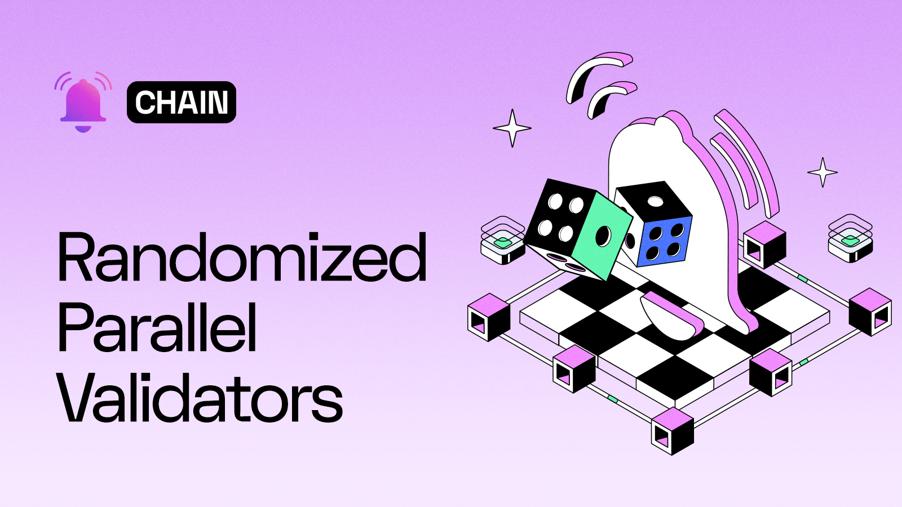

<!--truncate-->

## Introduction

One of the defining aspects of decentralized networks is their lack of a central authority to govern how they operate. Instead, these networks rely on a set of rules and systems to securely communicate and reach consensus on the overall state of the network.

Achieving this is no small task. It involves many essential components that ensure the network remains secure and fair, and among the most critical of these is **randomness**.

At its core, randomness is the absence of patterns or predictability in events. It's what makes a dice roll uncertain, ensures fairness in games, and strengthens the cryptographic algorithms that secure modern systems. In decentralized networks, randomness serves as a cornerstone of security and fairness, helping to prevent bias and manipulation.

In this article, we delve into the importance of randomness in decentralized networks and explore how Push Nodes use randomness to bolster the security of the Push Chain.

## Why do we need Randomness?

To begin with, let’s explore why randomness is so important in decentralized networks.

As mentioned earlier, decentralized networks lack a central authority. Instead, they rely on a distributed group of nodes spread across the globe. These nodes are responsible for performing various actions to ensure the network remains operational.

For the network to stay secure and fair, the selection of nodes for specific tasks must happen in a decentralized and unbiased manner. This is where **randomness** becomes crucial.

In decentralized systems, randomness ensures unpredictability in key processes, such as selecting validators or generating cryptographic keys. This unpredictability is vital to prevent malicious actors from manipulating the system or gaining undue control. For example, in consensus mechanisms like Proof of Stake, the random selection of validators ensures that no single participant can dominate the process, preserving the network's decentralized nature.

Randomness also strengthens the resilience of blockchains by making it harder for attackers to predict or influence outcomes. This unpredictability guards against attacks like **Sybil attacks** (where adversaries create fake identities) or **collusion** (where groups conspire to take control of the network).

Additionally, randomness plays a key role in promoting fairness. It ensures that every participant in the network has an equal chance to contribute and benefit, regardless of their resources or influence.

With this understanding of how crucial randomness is, let’s explore how Push Nodes leverage randomness to enhance the security and fairness of the Push Chain.

## A Glance at Push Nodes

[Push Nodes](https://push.org/blog/explaining-push-nodes/) are a significant step towards the decentralized infrastructure for web3’s leading communication layer, Push Network. This network is designed to facilitate secure and efficient movement of web3 notifications.

The Push Chain comprises different types of nodes such as Validator Nodes, Storage Nodes, and Archival Nodes. A smart contract guards the network to maintain node staking and slashing. This is where the PUSH token is used.

## How Randomness Is Used to Enhance the Security of Push Chain

In this section, we will specifically understand the complete mechanism of how a transaction is submitted onto Push Chain and the role of randomness involved in the process.

In the Push Chain, the role of randomization is incorporated at multiple levels which allows the network to prevent centralization while ensuring that it remains resilient against a variety of attacks.

A crucial security mechanism of the Push Chain is the randomized selection of validators for transaction validation or block production. This mechanism leverages cryptographic randomness to ensure an unpredictable selection of validators & attestants (who verify whether or not a transaction is legit) to enhance the network’s resilience and fairness.

**A brief overview of the process looks something like this:**

- To send a transaction to the network, the SDK/sender must attach a randomly generated token number to the transaction.
- To fetch this token, the SDK can request the same from any validator.
- Once received, the SDK attaches this token to the transaction and sends it to the network.
- The network then uses this random token to cryptographically decide the specific validator to verify the particular transaction for further processing.
- Additionally, the validator also randomly decides the validator set responsible for attesting to the transaction.

## Now, let’s dive deeper into the Randomness of the Push Chain:

The Push SDK selects a random validator (VR1) to generate a special signed (RANDX) hex token.

The generation is performed as follows:

### 1. **Generation of a Random Token:**

The network is designed to ensure that a random token cannot merely be generated by a single validator. Instead, it must be a combined effort as every random token is ideally a collection of digitally signed pieces of random numbers provided by specific validators in the network.

To determine the exact number of such pieces required to form the token, the Validator.sol smart contract defines a parameter called `required_random_number`. This indicates the number of required random peers whose signed values each validator must hold, at a given time. Additionally, the contract also defines an `expiration_time` parameter that defines the expiry time for these tokens which helps ensure that only freshly created tokens can be used for the creation of random tokens.

It should be kept in mind that validators in the network periodically ping their peers to collect and exchange signed random values. The collected value from each validator is a combination of the random value itself and the validator's signature, ensuring it can be verifiable.

```jsx
signedRandomValue = value + validatorSignature;
```

As a result, at any given moment the validators should have a collection of signed random values by their peers, i.e., **`signedRandomValue[].`**

Once a validator has accumulated the necessary signed random values, it can generate the random token. This token is derived from the network's collective randomness using the following formula:

```jsx
RANDX_Token = XOR(sha(signedRandomValue[i]))for all i

```

### 2. **The SDK Requests for a Random Token**

    Next, now let’s understand what happens when the SDK requests for a random token.

    As previously mentioned, before sending any transaction to the network, the SDK requests for a random token that must be attached with the transaction being sent.

    Now, since a random token value has already been generated (as mentioned in step 1), any validator can provide this random token to the SDK.

    The SDK then attaches this random token to the transaction payloads and sends the transaction to the network.

### 3. **Randomized Selection of Validators**

    This random token attached to the transaction plays a crucial role in randomly deciding which validator will process the transaction. With this token, the SDK deciphers the validator ID, to whom it must send the transaction for further processing.

    ```jsx
    validator_id = f( RANDX_TOKEN, contract_defaults)

    //OUTPUT looks like:
    validator_id = v1

    where contractdefault parameters could be:
    a. min required quantity of random numbers,
    b. expiration time,
    c. a minimum number of peers that acknowledge the validator's online status.

    ```

    Upon receiving the transaction, the validator checks the random token in the transaction’s payload and validates it to confirm that it has been correctly assigned the role of handling this transaction.

    In case the validator identifies that it has been wrongly chosen, **_it can reject the transaction._**

    Once the accurate assignment of the validator is confirmed, the validator now creates a similar randomized process for creating a list of validators who must attest to the transaction being processed.

    ```jsx
    vlist = f(RANDX_Token_2nd, contract_defaults);

    // Output looks like this:
    (vlist = V2), V50, V11, V8, V38, V17, V29;
    ```

    This list of validators is also responsible for verifying its **legitimacy.**

## Summary

To summarize, the entire process detailed above adds a security layer with the inclusion of randomization at multiple levels, i.e.:

- **1st Level:** The initial randomization starts with the SDK choosing any random validator to request for a token to be attached to the transaction.
- **2nd Level: A token is generated** using digitally signed pieces of random values from multiple random validators instead of relying on any single actor.
- **3rd Level: A specific validator is randomly selected** to create the token to be attached before the transaction occurs.
- **4th Level:** The final level of randomization determines which specific validator (VR2) will process a transaction and which validator set will act as attestants to verify the transaction.

This multi-level randomness ensures that at every step, the network is secure, and fair, while continuing to operate in a completely decentralized fashion.

---
