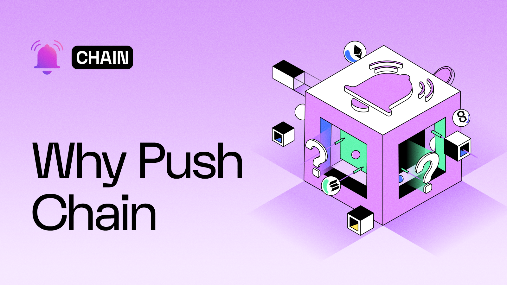
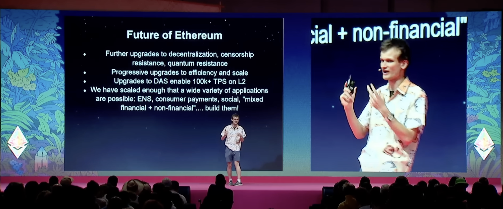

<!--truncate-->

## Introduction

Push Protocol recently announced its [governance proposal](https://gov.push.org/t/introducing-push-chain-a-shared-state-l1-for-universal-apps/1991) of launching Push Chain.

Push Protocol envisions the creation of Push Chain which enables a shared state L1 chain designed to support truly scalable consumer applications and universal applications.

This article explains why Push Chain is needed and why it matters.

We will dive deep into each of the concerns that exist in web3 today and the solutions that Push Chain offers for each one of them.

In order to understand what Push Chain offers, let’s first get a good understanding of the concerns in today’s web3 world that is a blocker for consumer apps and universal/unified applications.

## The Major Concerns in Web3 Today

### Web3 is not well-equipped for building truly scalable consumer-centric adoption

Fundamentally, web3 should be unbiased towards a peculiar industry use case. However, practically, there’s an evident misalignment where today’s web3 infrastructure is more optimized for financial use cases.

Financial apps and consumer-centric apps (_e.g. social, gaming, etc_) inherently have different infrastructure needs:

Finance-specific apps require:

- _A high level of security,_
- _Strict transaction and block ordering,_
- _Prioritization of state accuracy and finality over speed, etc._

On the flip side consumer apps require more flexible models that emphasize:

- _Hyper scalability_
- _Low latency_
- _Simplified UX_
- _Affordability_
- _Support for both ordered and unordered transactions ( a.k.a, consumer transactions, as we call it )_

Web3 ecosystem is heavily skewed towards financial applications. The bias is evident in the rise of projects centered around trading, lending, staking, perps, and similar use cases.

Such finance-centric infrastructure forces consumer apps to make suboptimal compromises impacting their performance and usability.

Even the advent of app-specific chains hasn’t fully resolved these tradeoffs.

For instance, the [**State of Crypto 2024**](https://a16zcrypto.com/posts/article/state-of-crypto-report-2024/) report by a16z highlights how on-chain games running on dedicated rollups are struggling to keep up with the increasing user demand, straining the network and as a result consuming multifolds of M/gas (_mega gas per second_) as compared to Ethereum.

Consumer-centric apps, which could appeal to broader audiences, are still in their infancy compared to the much more mature and sophisticated DeFi sector.

This focus on finance has led to a situation where the average user might view web3 as a playground for traders and investors rather than a tool for everyday life.

The report from a16z also provides another key insight:

**Out of ~617 million global crypto users, only 5-10% (30-60 million) users actively transact!**

Barriers to entry, the dilemma of choosing the right chain, and multiple points of friction in UX could reasonably be attributed as causes of the growing share of dormant users.

Vitalik in his [recent talk at Devcon](https://youtu.be/ei3tDRMjw6k?si=w1kYuzgR0ho-90Eb&t=1775) (timestamp: 29:35) emphasized the need for building both non-financial and mixed financial applications.

### **Fragmentation of chains is a major blocker towards overall web3 UX improvement**

With Vitalik’s conception of the _Rollup-Centric Roadmap, back in 2020,_ Ethereum pivoted towards rollups as their scaling strategy - as **bundling multiple transactions** **into batches** significantly increased **_transaction throughput_** and **_reduced transaction costs._**

This solved Ethereum’s scalability issues effectively and led to an abundance of _L2 and L3 chains._

However, the joyous ride is now hitting some rough bumps.

### UX Fragmentation

_Clutter is the Enemy of Clarity._

With each additional step spent completing an action, including switching between networks, time spent in choosing the right chain, protocol, or wallet, decreases [_Psych_ - a unit of measure for motivation to complete an action.](https://andrewchen.com/psychd-funnel-conversion/)

Here is a quick glance at what a typical web3 user needs to deal with in this multi-chain universe:

- Managing multiple wallets,
- Managing multiple native tokens/assets in their multiple wallets,
- Understanding the nuances of each network,
- Navigating multiple networks to perform simple tasks,
- Interacting with complicated dapp UIs with frequent network switching
- Navigate through inconsistent user interfaces
- Relying on the risky route of cross-chain bridging between chains
- Experiencing difficulty in maintaining a consistent cross-chain identity due to the multi-chain ecosystem
- Dealing with the lack of standardization between networks, protocols, etc
- Dealing with the learning curve of understanding different networks, each with its own set of rules, interfaces, and requirements.

Remember that this is just a glance at the UX problem.

There are undoubtedly more issues for a web3 user daily. The list is even longer when it comes to newbie web3 users.

### User Retention Challenges

Poor UX can directly impact user retention.

Truth be told, it already is impacting user retention.

When users encounter difficulties in navigating the web3 ecosystem, they are less likely to return to it. High-profile dApps that have struggled with user retention due to UX issues serve as cautionary tales for new projects entering the space. Complex interfaces, slow transaction times, and confusing wallet setups have all contributed to a decline in user engagement and adoption.

### **Security and Trust Concerns**

The complexity of managing multiple chains also introduces security risks.

Users must ensure that they are interacting with the correct chain, using the right wallet, and understanding the implications of each transaction. This complexity increases the likelihood of user errors, such as sending assets to the wrong address or falling victim to phishing attacks.

Furthermore, the process of bridging assets between these chains is quite often cumbersome and fraught with risks. Users must rely on various bridging protocols, which not only add to the complexity but also introduce potential security vulnerabilities. For instance, a user willing to move tokens from Ethereum to an L2 solution must navigate multiple steps, including wrapping and unwrapping tokens, which can be a deterrent for new users.

### **Increased Complexity for Builders:**

Each chain often has its own development tools, SDKs, and environments that developers must learn & adapt to, which can be time-consuming and lead to inconsistencies in development practices. Maintaining applications that operate across multiple chains requires managing multiple codebases or conditional code paths. This can lead to significant maintenance overhead, especially when chains update their protocols or APIs.

Each additional chain integrated into an application introduces new potential vulnerabilities. Developers must ensure that the security of cross-chain interactions is robust, as any weakness could lead to exploits or hacks.

Furthermore, developing for a multi-chain ecosystem that still lacks adequate standardization - is costly. It requires more time and resources, as developers need to learn and implement different protocols, test on multiple platforms, and ensure compatibility across the whole environment involved. The additional cost of extensive security audits makes the process of building & maintaining apps even more difficult.

There is no one size fits all solution, nor is there a way to restrict the proliferation of chains.

**_But what if there was a way to unify every fragmented state under one shared state?_**

### **A shared state chain is needed that can enable shared app experiences**

Let’s dive a bit further into the complexities of multi-chain web3 world.

While fragmented UX is definitely a concern, there are more.

There are over 30 Layer 1s, 120 Layer 2s and soon thousands of Layer 3 chains.
Imagine the sheer number of DApps deployed on all of these chains!

Newer chains have led to the rise of siloed environments having limited or zero awareness of each others state - even Ethereum!

The majority of these apps still operate within closed systems. Contracts pertaining to each chain store states in an isolated manner leaving little opportunity for users for a unified experience. Siloed environments in turn add more interop complexities forcing developers to **shift price-sensitive apps** to app-sensitive infrastructure, further affecting the UX and escalating fragmentation.

Here is a quick look at Vitalik and Justin Drake talking about the same issues:

With such an extent of liquidity, state and UX fragmentation, it becomes troublesome for web3 apps/users to seamlessly interact with apps on multiple chains. In fact, in order to move assets or payloads between chains, a user is often exposed to the on-chain intricacies and risks to achieve simple tasks.

For instance, a use with governance token on chain A cannot vote on any proposal of the same protocol on chain B as there is no unified system to support this activity. As a result, every app on a specific chain becomes its own siloed state.

This leads to an issue where there is no unified infra for apps to be built on. And there is a shared app experience for users to just use apps without having to worry about the underlying chains, finality risks, bridging or facing complicated UX.

So far, we have discussed the concerns.

Let’s now understand what is Push Chain and how it helps us resolve these concerns.

## Enter Push Chain

Push Chain is a shared state blockchain for shared app experience.

It is a Proof of Stake (PoS) chain built to allow developers to create scalable and universal apps and act as a shared settlement layer for multiple L1s, L2s and L3s. It is designed to allow transactions from any chain, use fee abstraction to avoid the strict requirement of native gas tokens for multiple chains and provide wallet abstraction for seamless onboarding and signing for any user.

It also introduces a new transaction type which we define as consumer transactions (where ordering is not important) to enable non-financial apps to have the speed and scalability which any consumer app requires. It leverages new mechanisms like parallel block execution and dynamic sharding to enable true scaling, and providing the perfect environment for any consumer app or universal app to thrive in the era of fragmented chains.

Push chain aims to solve some of the critical concerns in web3 today, as previously explained, and it plans to solve them in 3 specific phases. Each of these phases tackle a particular problem and eventually leads us to our core vision of achieving a shared app experience for web3 and enable universal apps with enhanced UX.

Mentioned below are the 3 main phases:

1. **Phase-1:** To enable consumer-centric apps with hyper scalability, fee abstraction, wallet abstraction and any chain transactions.
2. **Phase-2:** To enable seamless interoperability between chains for apps and users.  
   (_An intermediary phase to enable the universal smart contracts and shared state_)
3. **Phase-3:** To enable universal smart contracts and shared state in order to make other chain’s state accessible on Push Chain and unlocking the era of universal apps.

Now, let’s understand each of the above-mentioned concerns and explore how Push Chain aims to resolve them.

1. **The Concerns with Consumer-Specific App**

   So far we have explored why building and using consumer-specific web3 apps is difficult.

   However, let’s now dive deep to first understand what exactly does a consumer-app required and how Push Chain completes those requirements.

   Some of the main requirements of a consumer-centric applications are:

   1. **Simplified User-Onboarding:** Apps required seamless onboarding and intuitive user interface. In simpler terms, this indicates that applications should be so easy to use that the user should never have to learn the intricacies of the underlying technology stack.

      However, its not the case in web3. The intuitiveness ends the moment users are required to _set up a web3 wallet and remember the mnemonics_. This means the very first step a user is required to do for using web3 apps will most likely be the most difficult step in itself.

      Once the user enters the rabbit hole of using a web3 app, they are then required to either _choose a chain, sign a transaction, collect and manage native gas tokens of the respective chain, switch between different chains, bridge tokens, etc._ The list goes on and **_the further you explore, the harder the UX._**

      With Wallet Abstraction, Push Chain aims to enable seamless user onboarding without going through the manual and complicated procedure of setting up a web3 wallet.

      

      Wallet abstraction addresses challenges by removing the need for direct mnemonic management. Instead, Push Chain allows users to authenticate using familiar methods like _social logins, email, or phone numbers._ This system abstracts away the complexity of mnemonic custody by securely managing a master key pair on behalf of the user, while still ensuring they retain ultimate control.

      The Push wallet can dynamically derive blockchain-specific keys from the master key pair, enabling seamless interaction across multiple blockchain networks. By simplifying wallet operations and providing a unified experience, wallet abstraction reduces friction, enhances usability, and makes blockchain technology more accessible without compromising security.

      > _The whitepaper explains the Key Management and technical aspects around keys in greater detail. Check it out here_

   2. **Instant Finality & Scalability:** A consumer-centric app needs to support a large number of users without compromising performance. Additionally, it needs to support instant finality so that users experience a similar speed as in traditional apps.

      Although layer 2 solutions and rollups aim to address scalability, the current state of web3 still struggles to match the speed and efficiency of traditional centralized systems. For a consumer-centric app, any delay in processing or finalizing transactions will lead to a poor user experience.

      **Push Chain** is designed to solve this with its instant finality as well as its support for unordered transactions, a.k.a, consumer transactions.

      A consumer transaction can be defined as the type of transaction that doesn't benefit from the strict ordering as seen in traditional web3 transactions where strict ordering with a nonce is mandatory. These can also be categorized as transfers of consumer data like notifications, emails, blogs, etc that do not require a strict order to be executed.

      Since there is no state change for such transactions, they don’t need to change the merkle root of the network and thus can be called **orderless transactions.**

      Examples of these transactions can be emails sent from one user to another, posting on social media, writing blogs, creating content, defining user settings for an app, defining user meta-data, storing soft state data for gaming among others.

      The chain is designed to facilitate a wide range of consumer transactions, providing a robust and scalable platform for decentralized applications. The transaction model in the Push Chain is tailored to support high-throughput, low-latency operations, ensuring that various applications can interact seamlessly.

      **Since scalability is crucial for any application, phase 1** of the Push Chain roadmap includes the development of new optimization such as **parallel block execution and dynamic sharding** to create the true scaling of web3 apps, enabling read and write capabilities that scale as the number of nodes in the network scales, which provides an infrastructure that can handle the needs of thousands of applications related to speed and scalability.

   3. **Affordability:** A major pain point of using any app is the associated cost. If an app requires a user to spend a high as well as indeterministic cost every time he/she wishes to use the app - the user will most likely never use it.

      Consumers expect low or no fees for transactions within apps, especially non-monetary ones. Gas fees, while necessary to secure the network, are a major barrier to consumer adoption. In web3, transaction fees are often too high for the average consumer; even more so during network congestion. However, solving this has been difficult as there is a always gas fees/network fees associated with any and every action a user might want to take.

      **With Push Chain’s Fee Abstraction feature,** we eliminate this problem to a greater extent.

      Fee Abstraction is a key feature of this chain that eliminates the friction of requiring to hold native gas strictly in the wallet in use.

      Furthermore, a sustainable decentralized network needs to be present in order to ensure the long-term viability of the project. To do this, we propose including a mechanism for having a fee quota.

      A user is able to purchase fees in bulk that can then be used by them, delegated to other users / wallets or can even be paid by web3 applications. The key idea behind locking fees in bulk is to ensure that the transaction coming from whatever blockchain network is not limited by the speed of that particular blockchain’s TPS.

      Additionally, there is a fallback mechanism that does a graceful conversion using swapper contracts which takes the native token of a specific blockchain and swaps it for Push Chain’s fees.

      This ensures that in the event a different chain user doesn’t have enough fees, even then the network is still able to fallback and use that particular blockchain’s native token for the conversion and eventual processing of the transaction. This mechanism ensures that even running out of quota is not a barrier to transaction creation, providing flexibility in payment methods.

2. **The Concerns with Multi-Chain Navigation & Fragmented Ecosystem**

   As previously stated, a core reason behind difficult UX in web3 is the existence of multiple different chains. Each of these chains offers some key feature but eventually leads to a fragmented ecosystem.

   If we observe the space as whole, carefully, it is quite evident that there are two main requirements for apps to navigate such an ecosystem:

   - Fast and reliable movement of value and messages between chains ( _for both apps and users )_
   - A shared state infrastructure that allows building apps that appear to work seamlessly in a unified fashion and give a **shared app experience** to the user - completely eradicating the complexity of navigating multiple chains for using apps.

   If an infrastructure achieves both of these for the apps built on top of it, it can ideally resolve the most difficult UX problem that exists in web3 apps today.

   That’s exactly what Push Chain aims to solve in its Phase 2 and 3.

   **With Phase 2** of its roadmap, the chain aims to establish seamless interoperability between chains to enable cross-chain features in the apps. The interoperability shall be enabled using a solver network capable of instant cross-chain transactions to ensure better UX. The network shall be designed to move not just value but also arbitrary payloads that seamlessly transfer smart contract calls to other chains.

   The main goals of this phase is to:

   - Enable fast and reliable movement of messages/assets between chain
   - Delegate on-chain intricacies and risks from users to solvers ( _specialized on-chain actors )_

   At the point in which both of these goals are accomplished, we will achieve a win for both the users and the apps on top of Push Chain.

   **With Phase 3,** we achieve the shared state L1 chain that is capable of supporting universal apps. Most importantly, this phase establishes one of the key features of Push Chain, i.e., **shared app experiences** (with Shared State).

   Shared state allows Push Chain to access data from its own chain as well as supported external chains. Combining this with Push ID enables universal smart contracts wherein the smart contracts on Push Chain have access to the state of all of the wallets of the user even if those wallets belong to other chain(s). This enables developers to understand the user and build universal smart contracts to fulfill the user’s need irrespective of what chain(s) the user state is on which ushers countless innovations.

   

   The feature opens up the entire web3 userbase to be available for a web3 application enabling shared app experiences no matter from what blockchain the user accesses the application. It also makes Push Chain the shared settlement layer for all other chains (EVM / Non-EVM).

   This enables developers to completely abstract away any learning from the user, creating an era where a user does not use Uniswap “on Ethereum” or Uniswap “on Polygon” or Uniswap “on Arbitrum” — but rather simply **uses Uniswap** for its features.

---

## Conclusion

This article was an extensive guide to understanding the need for Push Chain, what it offers, and how it benefits the overall web3 ecosystem.

It is quite evident how the above-mentioned concerns with web3 today is a major blocker behind the growth of consumer-centric web3 apps.

With Push Chain, we aim to resolve each of these blockers and provide an infrastructure dedicated to building and supporting top-notch web3 apps with hyper scalability, enhanced user onboarding, better UX with wallet and fee abstraction, and a shared state L1 chain designed to build universal apps with shared app experience.

## Next Steps

1. **Check out the [Push Chain Whitepaper](https://whitepaper.push.org?utm_source=pushblog&utm_medium=referral&utm_campaign=pcgov)** for a detailed overview of the vision and the underlying technicalities.
2. Visit the [Push Chain Website](https://push.org/chain?utm_source=pushblog&utm_medium=referral&utm_campaign=pcgov) to find a one-pager explanation of the vision.
3. [Push Chain Devnet](https://scan.push.org/?utm_source=pushblog&utm_medium=referral&utm_campaign=pcgov) is running live on Proof-of-Stake network validators, storage and archival nodes. The network already supports consumer transactions as well.
4. [Push Chain Simulate Tx](https://simulate.push.org?utm_source=pushblog&utm_medium=referral&utm_campaign=pcgov) already provides a way for everyone to send tx from any chain using wallet abstraction.
<!-- 6. Visit the Push Ecosystem Page that provides a list of apps that are already built on top of the Push Chain infra. -->
