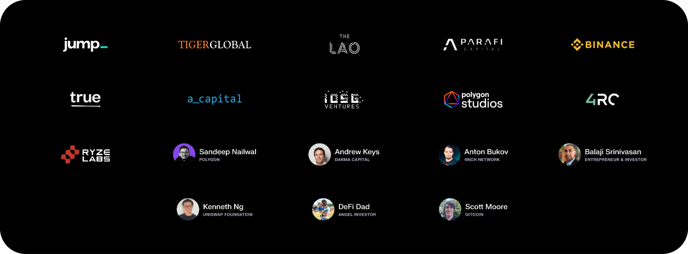

import { ImageText, VideoContainer } from '@site/src/css/SharedStyling';

<!--truncate-->

## **Summary**

Push Protocol has come a long way! We’ve delivered over 140M notifications, built a community of 500K aggregate users, powered notifications for 500+ projects, and are known as the de facto leader in notifications and communications for web3.
We took the biggest and the most ambitious step in its history last week and have launched governance for its evolution to Push Chain, a shared state blockchain for building universal applications. It is a sharded Proof of Stake (PoS) chain built to allow developers to create user-centric app experiences and act as a shared settlement layer for multiple L1s, L2s, L3s.

The journey often matters more than the destination, and we couldn’t agree more. From our beginnings at ETHGlobal 2020, to becoming an EF alumnus, ranking as a top 5 project in Gitcoin Grants, securing funding from leading VCs and angels, inventing the communication stack for web3, and now launching a consumer-centric L1 to unify web3 - each milestone has shaped our path and brought us here. Buckle up, it's time to reminisce!

## The Beginning

### Email to Ethereum Foundation

We started with an idea for Push Protocol and web3. The thesis was that protocols in web3 only interact with wallet addresses and thus it made sense to build a notification and communication system that can inform these wallets.

So the next time your DeFi loan is about to be liquidated, or a governance proposal comes up or your ENS is about to expire or someone comments on your web3 social, you get notified and can re-engage.

<!-- image 1 -->

### Creating MVP at ETHGlobal HackMoney 2020

We were guided by EF to go and build the project out first at ETHGlobal, which is what we did and was the best thing that ever happened for us. We have made friends that are mentors, friends that are our investors, friends that helped us connect to relevant projects and friends that geeked out together on tech.

Excuse the video quality, I still hadn’t learned at this point what good quality cams or lighting could do.

<VideoContainer>
<iframe width="100%" height="100%" style={{ borderRadius: "32px",aspectRatio: '56.25%' }} src="https://www.youtube.com/embed/vvEpB3ddTko" title="#HackMoney Group 1 Judging" frameBorder="0" allow="accelerometer; autoplay; clipboard-write; encrypted-media; gyroscope; picture-in-picture; web-share" referrerpolicy="strict-origin-when-cross-origin" allowfullscreen></iframe>
</VideoContainer>

### Getting help, support and mentorship from EF

We have always said that Ethereum is where innovation has fostered traditionally and that is due to the community and the folks at Ethereum that go way beyond to help you in your journey.

EF has helped us, like countless other projects in guiding through the tranches of web3, especially when you are just getting started.

<!-- image 2 -->

<ImageText>https://blog.ethereum.org/2020/08/19/esp-beyond-grants</ImageText>

### Making it to Top 3 of Gitcoin Grants (Round 7)

One of the best feelings we had was when we participated in Gitcoin Grants and the community came together to fund us out. This was in many ways the first check that we saw after we had started building Push (then EPNS).

There’s serenity in making something that gets loved by the people for whom you are building and is the best feeling that any entrepreneur can have. To us, these 214 contributors is what made everything we had done so far worthwhile!

<!-- image 3 -->

Of course, the cherry on top was when Vitalik covered GR 7 in his [blog](https://vitalik.eth.limo/general/2020/10/18/round7.html), and we among all the other top projects got a place in his blog, if not in his heart 😅.

### Getting into Kernel Genesis Batch

Making it into Kernel was a dream come true. I still remember the joy I felt when we were selected. In our application form, there was a question: <b>What makes you special from any other project?</b> And what we wrote was <b>Every project that we have seen is special in its own ways, so nothing makes us special with respective to them but here’s why we feel we should be selected:</b> Technical and gap in communication, ux, etc

We submitted this but then stressed out on if we were rude or missed the context of the question. Thankfully, Vivek, Sachin and team embraced our web3 vibe wholeheartedly.

<!-- image 4 -->

<ImageText>https://x.com/harshrajat/status/1279398824729952257</ImageText>

This was also the place where we made so many friends that I still reach out to for help now. This was the place where I first dmed Juan Benet, Met Sandeep, Alok (Standard VC), Thomas Klocanas and countless other folks that I look up to.

This in a way completed our journey of getting onboarded to web3 as we were now part of the vibes!

### Making awesome friends along the way!

During this entire journey, we made friends who just wanted to help and the only thing we had to do was ask, or tweet, or dm. This was and still is why Ethereum is always home for us!

<!-- image 5 -->
<!-- image 6 -->
<!-- image 7 -->

<ImageText>https://x.com/owocki/status/1335637426392330241</ImageText>

<ImageText>https://x.com/jason_chen998/status/1695082395505172944</ImageText>

<ImageText>https://x.com/defiprime/status/1346124418192465928</ImageText>

Push Protocol is the “Missing piece of Web3” that is required to bring the UX of Web2 to Web3.

## The start of web3 notifications

### Piloting with OG protocols

The next phase of our journey was to start sending web3 notifications and we had a chicken and egg problem over here. Notifications are useful for wallets to show if popular protocols are sending them but for popular protocols to embrace web3 notifs, wallets need to integrate them 😱.

We took a chance and reached out to some of the best and top protocols in the space back then, hint: they still are the leaders! They were the ones who helped us crack this chicken and egg problem and solidified our conviction on why web3 is the future - it’s because each one of them is trying to expand the boundaries of web3.

<!-- image 8 -->

<ImageText>https://x.com/Uniswap/status/1377374973090689030</ImageText>

### Getting backed by people we adore

The momentum generated by Push till this point helped us get the attention of the best angels and VCs in the space. The success that we got due to the community, builders, web3 OGs coming and helping us together led us to secure our seed (and later series A) with folks that had some of the best mind share and vision for web3.

<!-- image 9 -->

♥️and shoutout to backers of Push Protocol including BalajiS, Sandeep Nailwal, Scott Moore, A.Capital, ParaFi, Binance Labs, Jump, Sino Global and so many more!

### Getting noticed and spreading the word

Push started getting noticed by OGs of web3, we were so humbled by people who we view as mentors and thought leaders writing about us. Push has reached the point where it had a chance to terraform web3, one notif at a time

<!-- image 10 -->

<ImageText>[Why India Should Buy Bitcoin Article by BalajiS](https://balajis.com/p/why-india-should-buy-bitcoin) | [Excited to fund EPNS Tweet](https://x.com/balajis/status/1336367129960931329) | [Unstoppable Domains Launches Gated Groups Article](https://thedefiant.io/news/defi/unstoppable-domains-launches-token-gated-group-chats) | [EPNS Raises 10M at 131M Valuation Article](https://www.coindesk.com/business/2022/04/14/ethereum-push-notification-service-raises-10m-at-131m-valuation)</ImageText>

## Building one of the first consumer app

We now realize that apart from inventing the communication protocol for web3, we also were building one of the first consumer app for it which was non-financial in nature and was driven by the utility it offered to average user than the 10x other financial apps promised (and thus, user was incentivized to learn web3 broken ux).

This realization helped us in paving forward an app that is useful and frictionless for the web3 user and enabled us to identify the features that we wanted as we moved towards decentralizing our notification nodes.

### Building for scalability and speed

We realized very quickly that notification unlike traditional transactions needs to be scalable. It needed an infra that can scale up and maintain speed. To enable this, we built out a solution involving dynamic sharding, ensuring that the solution scales up as more notifications and wallets join in.

### Inventing consumer tx by accident!

While building our notification nodes for write throughput, ie: handling tens of thousands of parallel notifications. We came up with the architecture of having parallel validators, since having order in notifications was not required.

This paved the way for parallel validators where notifications can be sent to any validators which will then form stateless blocks (or unordered blocks). We didn’t know back then but we had unlocked a massive innovation in web3, having txs where ordering is not critical. This later formed the backbone of Push Chain’s speed and linear scalability.

### Building for seamless web3 UX

Another thing that we wanted our notification protocol to have was a seamless onboarding process where the user can just sign in once and then, just like web2, they are not required to sign things again and again. Our Chat Protocol and PGP implementation helped us realize and solve for the most seamless web3 UX. Later on, this learning was transformed into wallet and fee abstraction for Push Chain.

### Building for unification of web3

And finally, we wanted this to be the communication protocol of web3, where notifications and chat can come to Push as a universal hub. Where, protocols from Ethereum, Polygon, Solana, Aptos, or any other EVM or non-EVM are able to come together in a seamless interoperable way.

This is not bridging, as bridging moves funds or assets from one chain to another. But, instead it’s unification or having a universal hub. A place where users from all chains come together. This feature is what was transformed to Push Chain as being the universal hub for all chains, where transactions from any chain are supported, where shared state of all wallets are available, where all L1s, L2s and L3s can come together and use Push as a shared settlement layer.

### Rebranding to become the communication protocol of web3

We started building notifications for web3 under the brand of Ethereum Push Notification Service (EPNS) which made sense when we started since Apple also names their notification service as Apple Push Notification Service (APNS).

But as we dived deep and started building the features for enabling notifications, chat. We quickly became aware that a non-Ethereum developer might be confused by the name EPNS. Thus, we decided to rebrand to Push, we picked this name because:

- We were now placed to become the communication protocol of web3, so <b>Ethereum</b> had to go from <b>Ethereum Push Notification Service</b>.
- We were not doing just notification, but instead had chat among other communication tools so <b>Notification</b> had to go from <b>Push Notification Service.</b>
- And lastly, we were not a service but a decentralized protocol of web3, so <b>Service</b> had to go from <b>Push Service</b>.
- Leading us to rebrand to <b>Push</b>.

<!-- image 11 -->

<ImageText>https://x.com/PushChain/status/1574771582790406144</ImageText>

### Becoming the leading notification protocol for web3

Push notifications protocol came a long way from its humble beginnings to now. Today, we have powered hundreds of millions of notifications sent to web3 users across the globe.

We have been integrated natively in many wallets and protocols including Unstoppable, Shapeshift, Decentraland, Metamask Snap and so many more and have been powering notifications and communication for awesome protocols such as Cowswap, 1inch, dydx, hyperliquid, lens, polygon and various others.

<!-- image 12 -->

<ImageText>https://x.com/hypurr_co/status/1851645401834959098?s=46&t=iq2iJvugwsC0iZ3dI-wFOw</ImageText>

## Enters Push Chain - realization of what we actually built and its impact on web3

### Realization of the end game

During building for our vision of the most perfect consumer app and the decentralized notification protocol and nodes out. We eventually realized that what we have built instead is far more significant and solves for the seamless web3 that we all dream of.

This realization is what turned into our shared state blockchain - Push Chain, which while being an L1, is not just another L1 as it’s built to be used by users of any other chain without them needing to switch or bridge to this chain. It’s the future of web3 built for unification, consumer and universal apps and seamless onboarding.

### Launching Push Chain proposal and Devnet 🚀

This has led us to launching our proposal of Push Chain, which just to recap is a shared state L1 blockchain for shared app experiences. Push Chain enables txs from any chain (Solana, Eth, EVM, or non-EVM) with fast finality of \<1 second and can scale infinitely as nodes increase, supporting tens of thousands of parallel transactions.

- Push Chain introduces groundbreaking features including:
- Ability to do any chain tx
- Introduces a new tx type - Consumer transaction (order not important)
- Provides wallet and fee abstraction for a seamless user experience
- Enables true scale with parallel validators and dynamic sharding
- Able to do \<1 second finality
- Utilizes universal smart contracts - capable of accessing the state of a wallet belonging to a different chain

<!-- image 13 -->

<ImageText>https://x.com/PushChain/status/1867184458631405607</ImageText>

The evolution and the journey has been thrilling and we would love to have you, our biggest asset, the community with us as we launch Push Chain and invite developers to build universal apps!

As is the norm in web3, let’s end the article with saying in its truest sense for the future of Push - We all are just getting started!!!
