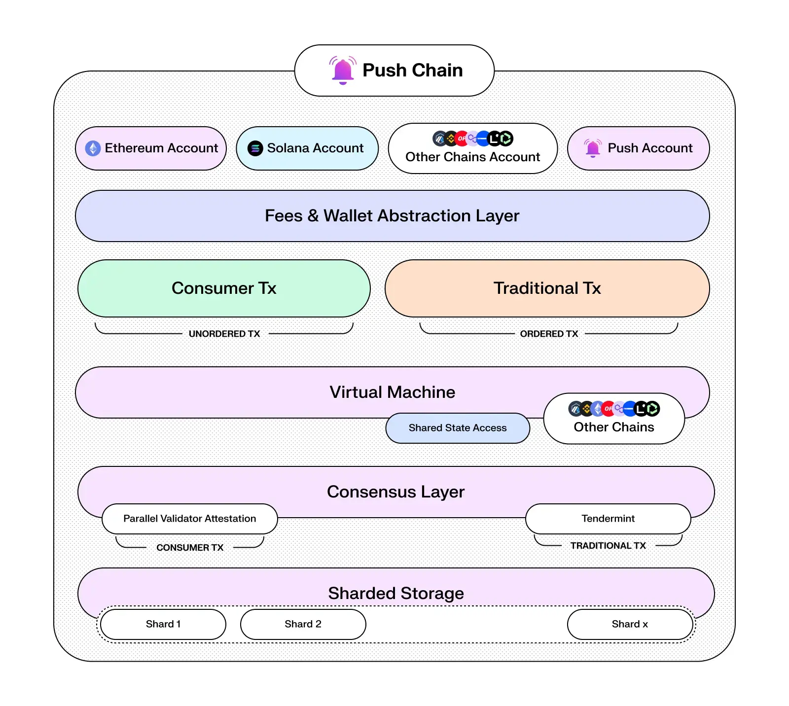
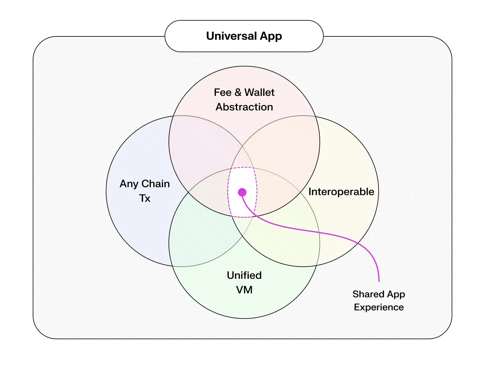

<!--truncate-->

## Introduction

Push recently unveiled its new layer 1 blockchain - Push Chain, a shared state blockchain designed for shared app experiences.

Unlike traditional Layer 1 chains, Push Chain introduces ten key innovations and optimized mechanisms to unify any chain, any user, and any app.

This article will help you understand:

- What innovations Push Chain brings to web3
- How Push Chain enables any user to connect to any app from any chain
- How Push Chain is positioned to onboard the first billion users to web3 (for real!)

### TLDR;

[Push Chain](https://push.org/chain/) is a Proof of Stake shared state blockchain designed to support the development of hyper-scalable, consumer-centric, universal web3 applications by unifying settlement from any L1s, L2s and L3s.

<!-- architecture diagram -->

Key Innovations and Superpowers of Push Chain include:

→ 1. **Blockchain agnostic wallet addresses**

→ 2. **Support Txns from any chain**

→ 3. **Fee Abstraction**

→ 4. **Wallet Abstraction**

→ 5. **Consumer (Unordered) and Traditional (Ordered) Transactions**

→ 6. **True Scale: Sub Second Finality (speed)**

→ 7. **True Scale: Parallel validators (scaling write throughput)**

→ 8. **True Scale: Dynamic Sharding (scaling read throughput)**

→ 9. **Push ID**

→ 10. **Universal Smart Contracts and Shared State**

Let’s take a closer look at each of these innovations and enhancements

## Innovations By Push Chain

### 1. Blockchain agnostic wallet addresses

For Apps to support users from any chain and achieve **universal compatibility** - there must be a way to identify, interpret and transact with addresses incoming from various chains.

As a shared-state blockchain, Push Chain is designed to parse and handle blockchain addresses alongside the specific chains they originate from.

For instance, Push Chain can identify and support Solana, EVM, Cosmos and any other chain’s addresses.
To achieve this, Push Chain fully adopts [CAIP-10](https://github.com/ChainAgnostic/CAIPs/blob/main/CAIPs/caip-10.md) blockchain-agnostic wallet addresses, enabling it to deduce the chain, network, and address associated with each transaction ensuring universal compatibility across multiple blockchain ecosystems.

### 2. Support Txns from any chain

In addition to parsing addresses across various chains, Push Chain supports transactions from any wallet, regardless of the originating chain—be it Ethereum, Solana, or any other network.

Push Chain achieves this by accepting signed payload data and supporting the native signers of individual chains. Validator nodes then verify these signatures → conduct pre-transaction checks (such as fee validation) → and then admit the transactions to the network.

<!-- Here’s a quick demo of an app that lets you send transactions to Push Chain from any chain of your choice.

<video width="640" height="360" controls>
  <source src="./simulate_push_chain.mp4" type="video/mp4" />

</video> -->

To clarify, a user doesn’t have to “bridge” to another chain to use our platform. Instead, the app becomes universal and available to all users of any chain.

Push Chain also introduces a new mechanism called **Push ID** to create a consistent and unified interface for users, no matter which wallet they use.

**_More on Push ID below..._**

### 3. Fee Abstraction

With web3’s progression towards true interoperability, the necessity to hold native tokens for basic interactions creates unnecessary barriers in what should be a borderless ecosystem.

**Push Chain’s Fee Abstraction eliminates these digital borders, ensuring universal accessibility and removing the economic friction of owning native tokens for network fees.**

- **Onchain Swappers**: Fee contracts on every chain convert native tokens to cover fees automatically—no explicit swaps for Push Chain’s tokens are required.

- **Bulk Fee Payments**: Lock and release fees in bulk, then send them to Push Chain directly in the transaction. This removes the bottleneck of waiting on a specific blockchain’s speed.

- **Delegated Fees**: Wallets or web3 apps can cover fees, enabling a web2-like UX where the “website” pays for the user.

These mechanisms bridge web2 paradigms into web3 enabling web2 UX in a web3 world -

- **Pay-for-content models**: Apps like Facebook and Instagram cover user interaction fees.

- **Freemium models**: Apps absorb user costs temporarily, enabling users to later pay in bulk for services after experiencing them for free (e.g., Spotify, Google Drive).

Push Chain makes these models possible, creating a frictionless experience and paving the way for building universal apps with borderless shared experiences.

### 4. Wallet abstraction

At a higher level, there are two user personas in web3:

- **Degens (aka existing web3 users)** - Well accustomed to the fragmented UX, have app & chain specific preferences for every on-chain activity.

- **Normies (aka new web3 users)** - New or casual users unfamiliar with web3 complexities - Struggle with the manual and often complicated process of setting up a wallet.

With the rapid proliferation of L1s, L2s and L3s, the UX gap between Degens and Normies is widening, creating a disproportionate balance in user experiences.

**Push Chain’s Wallet Abstraction diminishes this divide by creating a balanced ground for every web3 user persona.**

Wallet abstraction provides a flexible, **embeddable wallet experience**, tailored to individual user journeys enabling any wallet from any chain to connect, interact and transact with Push Chain.

**Existing Web3 Users?**

Already using Ethereum, Solana, or another chain? Push Wallet lets you continue using your existing setup—no extra hoops. Combined with fee abstraction, transactions stay native to the source blockchain, making cross-chain use effortless.

**New Web3 Users (Web2 Normies)?**

Not web3-savvy? No problem. Just log in with an email or social account. Under the hood, the wallet uses sharding and pass keys to stay non-custodial but feels as simple and intuitive as web2.

**For users logging in via email or social platforms**, Push Chain ensures security and non-custodial functionality through key sharding. The user’s credentials are divided into three encrypted shards stored across the Push Backend (trusted), local storage (encrypted via a passkey), and Push Chain (also encrypted via a passkey). This approach allows key reconstruction only when accessed by the user, providing a secure yet user-friendly experience that bridges the gap between web2 familiarity and web3 security.

### 5. Consumer (Unordered) and Traditional (Ordered) Transactions

Present web3 infra is heavily skewed towards financial apps that require strict ordering of transactions and precise state accuracy.
However consumer apps, on the other hand, are inclined towards more flexible, faster and parallel transaction needs.
Consumer apps are made of two primary elements where:

1. _Order is necessary (user payments, financial instruments) and_
2. _Order is not critical (messages, comments or likes on a post, retweet, chat, email, gameplay, etc.)._

Traditional chains don’t provide the right experience for such use cases forcing consumer apps to make suboptimal compromises impacting their performance and usability.

**_Could there be a way of supporting consumer actions in an unordered, parallel and yet decentralised manner?_**

Absolutely yes! This is where **Push Chain innovates a new transaction type - Consumer Transaction**- which instantly unlocks non-financial, mixed-financial apps for web3 helping consumer apps reach faster PMF.

Managing hyper-scalable apps with thousands of parallel transactions on-chain - is not easy.
Push Chain makes it possible using its new innovation - **True Scale**.

With True Scale, Push Chain's network capacity and its read-write throughput grow organically, as more nodes join its consensus.
This enables parallel execution of thousands of consumer transactions, near-instant finality and quicker information storage and retrieval.

Here’s how the Push Chain achieves true scale.

### 6. True Scale: Sub second finality (speed)

Push Chain splits the nodes into three types - **Validator, Storage and Archival** and enables a node governance smart contract that keeps track of all the nodes that are present in the network.

- **Validator Nodes** - Responsible for validating transactions.

- **Storage Nodes** - Dynamically shard data based on the hash of blockchain-agnostic addresses and store it.

- **Archival Nodes** - Maintain a full snapshot of all transactions on the network.

These role-specific nodes enable parallel validation to be done on any type of consumer transaction ensuring near-instant finality.

**Note:** All txs (write or read) are attested by random validators/storage nodes ensuring that malicious nodes result in slashing.

**Node Registry Smart Contract:** Push Chain employs a registry smart contract to register these nodes, manage dynamic sharding, set replication factors, and enable parallel validators that scale dynamically with the number of nodes in the network. This approach ensures linear scaling, allowing the network to handle increased read and write demands efficiently as it grows.

Because of these different nodes and smart contract setting up parallel validators, the tx sent to the network can land on any of the _‘n’_ number of parallel validators which are then instantly moved to processing (250ms block), this is what enables sub-second finality for Push Chain.

### 7. True Scale: Parallel validators (scaling write throughput)

Push Chain achieves true scaling of write transactions, particularly for consumer transactions, where the consumer txs are packed in unordered blocks (or should we call them **stateless blocks**!? ).

Allowing these transactions to be processed through any active validator node promises near-instant finality, and the write throughput (or TPS) of the chain increases linearly as the number of nodes in the network grows.

### 8. True Scale: Dynamic Sharding (scaling read throughput)

**Push Chain achieves true scaling of reading transactions by implementing dynamic sharding on storage nodes.**

Data chunks within each shard are mapped to blockchain-agnostic addresses and are dynamically redistributed as new storage nodes are added to the network.

In addition, the chain introduces a node governing smart contract onto which each node (regardless of the type) is registered before getting admitted to the network. Since this node-registry smart contract knows the number of nodes in the network, it is able to dynamically shard and assign data chunks and replication factors ensuring the network is fast and becomes faster in retrieving data as new nodes are added.

### 9. Push ID

In a universal chain like Push Chain - One essential element for bringing shared app experiences to users is the ability to track users’ on-chain identity - and not just their wallets.

One user may have multiple wallets, spanning various chains and ecosystems whether EVM or nonEVM.
This led us to create the unified Push ID, giving each user one identity that spans all their wallets, both EVM and non-EVM. Instead of tying interactions strictly to a single wallet, transactions are now accredited to a user’s Push ID.

The Push ID mapping allows for reverse lookups guaranteeing a consistent and unified interface for users, no matter which wallet they use. developers can fetch, index, and understand a user’s full spectrum of interactions across chains, all mapped to one identity.

### 10. Shared State and Universal Smart Contracts

<!-- shared state diagram -->

**Shared State**

With Push ID and Any Chain Tx, we realized that accessing a wallet’s state across different blockchains is a game changer.

One thing that’s missing over here though was the ability to get the individual state of all the wallets which in essence will allow smart contracts to know the entire state of individual wallet(s) that are connected to the user. This feature is what we call a Shared state.

**Shared state allows Push Chain to access data from its own chain as well as supported external chains!**

With shared state, you can read wallet activities like NFTs, DeFi positions, governance participation, and so much more!

**Universal Smart Contracts**

A shared state chain is essential to enable shared app experiences. This chain must have the ability to read the state of wallets across other chains, facilitating universal smart contracts and creating an ecosystem where users from any chain—or even web2—can interact seamlessly. Such a chain would provide shared settlement across both EVM and non-EVM chains, ushering in an era of universal apps and shared experiences.

Using shared state in VM, Push allows developers to write universal smart contracts with which universal app experiences become possible. Users, regardless of their origin—whether from any chain or ecosystem—can effortlessly interact with consumer apps that prioritize user engagement without regard to how or where they enter the system.

Ultimately, **Universal Smart Contracts and the ability to interact with all chains through Push Chain and represent our ultimate goal: Eliminating Web3 friction and delivering the best shared app experience possible.**

## Build Universal Apps!

Universal AI apps, Universal social apps, Unified Prediction markets and many more!
Want to know the countless app innovations that you can make happen because of Push Chain?
Explore our [Innovations that can be built on Push Chain Blog](https://push.org/blog/consumer-apps-that-can-be-built-on-push-chain/)

### Next Steps​👇

- Check out the [Push Chain Whitepaper](https://whitepaper.push.org/?utm_source=pushblog&utm_medium=referral&utm_campaign=pcgov) for a detailed overview of the vision and the underlying technicalities.

- Visit the [Push Chain Website](https://push.org/chain/?utm_source=pushblog&utm_medium=referral&utm_campaign=pcgov) to find a one-pager explanation of the vision.

- [Push Chain Devnet](https://scan.push.org/home?utm_source=pushblog&utm_medium=referral&utm_campaign=pcgov) is running live on Proof-of-Stake network validators, storage and archival nodes. The network already supports consumer transactions as well.

- [Push Chain Simulate Tx](https://simulate.push.org/?utm_source=pushblog&utm_medium=referral&utm_campaign=pcgov) already provides a way for everyone to send tx from any chain using wallet abstraction.
