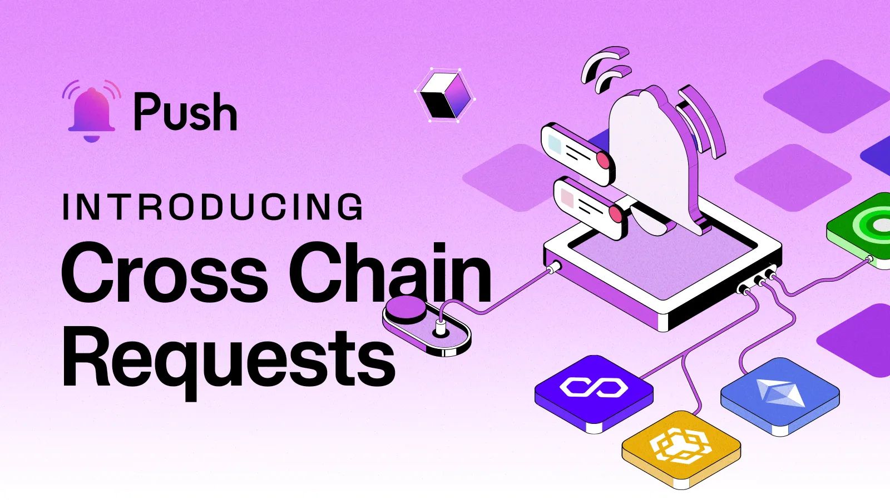

<!--truncate-->

**2024 was a Push-tastic year for Push!**

Marked with super ambitious achievements, incredible growth and everlasting community support!

We crossed multiple milestones with Push Notifications Protocol and unveiled the next - most awaited phase of our evolution: [Push Chain - A shared state blockchain for shared app experiences](https://push.org/chain/).

Special thanks to all our Push Communications Protocol users for supporting our journey and making Push the de-facto communication layer for web3!

Let’s take a quick look at ‘Push Rewind 2024’
_Don't miss the final reel (We have a major alpha reveal!)_

import ReactPlayer from "react-player";
import { ABlock } from "@site/src/css/SharedStyling";

## Push by Numbers

We finally achieved one of our most ambitious goals of sending over **100M** notifications to date!!

As of year-end - Push has sent over **138+ Million notifications to its 300k+ subscribers**.

That’s almost **3x** the number of notifications sent and double the number of [subscribers from last year](https://push.org/blog/push-roadmap-recap-2023/) 😱.

The Push ecosystem has expanded to **500 amazing projects**, including - [QuickSwap](https://app.push.org/channels/0xf198eBCc8dB86F707bAdDdBa236aB5b619c59D3c), [HyperLiquid](https://app.push.org/channels/0xf1A1542Ca902AE861B59bffE77D92E8CD76146f1),[Revoke](https://app.push.org/channels/0x65bB67c2416186aE3107F7c2C6728b272a579e3d), [ethOS](https://x.com/PushChain/status/1859145460939628803) and many more.

## Highlights

### 1. Push Points Program ✨

We kickstarted Phase 1 of [Push Points Program](https://app.push.org/points?utm_source=push_blog&utm_medium=referral&utm_campaign=Push+Points&utm_content=blog_post) - a gamified reputation system, aimed at giving back to our Push Fam, ecosystem communities and devs who have supported Push every step of the way and helped us reach greater heights.

Within three months of its launch, the program distributed millions of points to thousands of users for completing various activities centred around Push Communications Protocol, its ecosystem, and $PUSH staking.

<ABlock href='https://app.push.org/points' title="Push Points Program Link">Push Points Program S1 concludes soon - Explore Now!</ABlock>

<!--  -->

## 2. SDK Support for Ethers V6 and Viem 🛠️

The builder activity with Push Protocol SDKs continues to reach new ATHs!
To better support their journey the Push SDK underwent massive upgrades and optimisations!

We upgraded our Push SDK to support Ethers V6 along with Ethers V5 and viem enabling devs to use our SDK with the latest version of Ethers.

<!-- <aside> 💡
👉 Checkout our upgraded SDK here
</aside> -->

<ABlock href='https://github.com/push-protocol/push-sdk' title="Push Communications Protocol SDK ">Checkout our upgraded SDK here</ABlock>

<!--  -->

## 3. Introduced Cross Chain Requests 🔗

Extending a step towards seamless cross-chain communication and UX, we launched the **Cross Chain Requests** Feature - Where users can interact with Push Communication Protocol smart contracts on the Ethereum blockchain from any other blockchain network, whether it’s EVM or non-EVM. Which enables users to stay on their preferred blockchain while accessing Push Communication Protocol's services, offering enhanced convenience and flexibility.

<ABlock href='https://push.org/blog/cross-chain-requests-pre-pip/' title="Cross Chain Requests ">Click here to learn how we achieve cross-chain requests</ABlock>

## 4. Notification and Channel Categories 🗂️

Exploring over 500+ channels on Push can be a time-consuming adventure.
We launched the channel category feature so that you can better track and find the channel of your choice!

<ABlock href='https://app.push.org/channels?chain=1&category=All' title="Cross Chain Requests ">Explore over 500 channels and 13 channel categories today!</ABlock>

## 5. Added open Frames, Reaction and Reply to Chat 💬

Addressing the growing adoption of Push Chat we added some extra cool features to make your on-chain wallet-to-wallet and group chatting experience more fun!

Starting with adding support for **Farcaster frames**!
With the growing adoption of [Farcaster](https://www.farcaster.xyz/), a popular web3 social app on Base, we’ve integrated support for Farcaster Frames in Push Chat. These frames unlock unique in-chat experiences, from making payments and subscribing to notifications to playing games or building any functionality developers envision.

In addition to frames, we added two of the most wildly used web2 chat features - **Reactions and Reply to Chat features!**

Especially helpful in group and conditionally gated group chats where a user needs to revert to a specific user's conversation.

<ABlock href='https://app.push.org/chat' title="Cross Chain Requests ">Start chatting using your wallets today!</ABlock>

## 6. Push WEB3 App Gets Better!! ⚡️

Push Communications DApp, underwent some super cool upgrades to smoothen as well as fasten users' on-chain communication journey even more!
Starting with:

### User dashboard:

We unveiled a brand-new dashboard for Push Communication Protocol users, designed to provide a quick and intuitive overview of the entire Push Communications ecosystem - all within a single page.

**Subscribed Channels:** View and manage your channel subscriptions effortlessly.

**Trending Notification Channels:** Discover the most popular channels right now.

**Latest Push Chat Recommendations:** Stay updated with chat groups tailored to your interests.

**Analytics Overview:** Get insights into Push Notifications and Staking Fee Pools at a glance.

The dashboard brings everything you need to explore and engage with Push Protocol, making your experience seamless and efficient! 🚀

### Guest Mode + Remember Me

Ensuring an all-around inclusive, smooth and Privacy-packed user onboarding has always been Push’s top priority, this is why we introduced the **'Guest' mode** feature on our dApp, making it easier than ever to explore Push without connecting your wallet!

With the ‘**Remember Me**’ feature Checking the option on our PushChat Login keeps you logged in for days, even after closing your browser.

No more repeated logins and wallet signings - Just a one-click access to your fav chats every time you return!

<ABlock href='https://app.push.org/' title="Push Communications Protocol"> Safeguard your on-chain privacy by trying out these features today!</ABlock>

### Redesigned Channel Dashboard:

With the launch of the channel categories feature, we also revamped our Channel Dashboard - organizing over 500+ channels across 13 categories including Defi, media, DAO and many more.
Users can now filter and explore channels based on specific networks, such as [DeFi channels on Arbitrum](https://app.push.org/channels?chain=1&category=DeFi), [Media channels on Polygon](https://app.push.org/channels?chain=1&category=Media), and beyond—making channel discovery more intuitive and personalized.

<!--  -->

## 7. Push expands into Base, Arbitrum, Fuse, Linea and Cyber Networks 💹

With our quest of making push Communications Protocol the universal layer of communication, supporting any and every chain, this year, we expanded our reach to more chains including **Arbitrum, Fuse and Cyber**!

Push now supports over 9 networks including **Ethereum, Polygon, Polygon Zkevm, BNB, and Fuse.**

[Time to move across the open web with Push!](https://push.org/blog/interoperable-communications-moving-across-an-open-web-with-push/)

<ABlock href='https://app.push.org/channels?chain=1&category=All' title="Networks Supported by Push"> More networks, More new channels → Check them out here</ABlock>

## 8. Analytics Dashboard (and Website Revamp) 📊

Want a glance at Protocol’s LIVE numbers?

Meet the Push Analytics Dashboard - A comprehensive source of real-time data, tracking every aspect of Push Protocol’s services - notifications, subscribers, channel performance and many more!

<ABlock href='https://push.network/dashboard' title="Push Communications Protocol Dashboard"> Checkout Push Communications Protocol’s Analytics here</ABlock>

User activity and footprint on Push’s landing page have been growing immensely, every passing day!

To ensure any unique (new) as well as seasoned web3 user understands the protocol’s mission, features and offerings - we’ve taken our website to the next level! This upgrade spans both Push Communications Protocol and Push Chain.

_If you’ve read so far: a. you’re the best! b. more about Push Chain, in our final section 🏁_

<!--  -->

## 9. Launched Wallet to Email / Telegram Notifications 📧

After tapping into over 300,000 wallets and sending over 100 million notifications we thought - **_how about sending on-chain notifications directly to your email or telegram?_**

This helps Push Communications to reach billions of everyday Email and TG users while paving the way for much smoother onboarding for web2 normies and budding web2 users.

Now, users can receive web3 notifications from over 500 DApps straight to their Telegram or email accounts - no need to connect a wallet or endure various friction points while entering the web3 space. Simply, connect your TG and Email and receive notifs.

It's that easy!

<ABlock href='https://app.push.org/points/activity' title="Push Notifications on Telegram and Email"> Connect your Tg and Email to receive instant alerts!</ABlock>

<!--  -->

## 10. Push Metmamask Snap V2

In 2023, we bought Push Notifications to over 30 million Metamask users -by launching the [Push Metamask Snap](https://app.push.org/?/snap). In 2024, we upgraded the snap to **support chat and snooze notifications features** - to help users manage their notifications at their own pace and other forms of communication as well.

Due to Metamasks limitations for supporting communications across its mobile apps, we introduced in-app chat notifications on Push Mobile App [iOS](https://apps.apple.com/us/app/push-epns/id1528614910) and [Android](https://play.google.com/store/apps/details?id=io.epns.epns&hl=en)

<!--  -->

<ABlock href='https://app.push.org/snap' title="Push Metamask Snap"> Get notified on your Metamask Wallet </ABlock>

<!--  -->

## 11. Incredible Integrations! 🤝

2024 was a year filled with incredible integrations. The Push Ecosystem has expanded to 500+ Projects!

Notable mentions include - [Hyperliquid](https://x.com/PushChain/status/1851625233654153716), [QuickSwap](https://x.com/PushChain/status/1826957066520383638),[Cartesi](https://x.com/PushChain/status/1844008819954970813), [Revoke](https://x.com/PushChain/status/1842198518418612357) and many more.

<ABlock href='https://push.org/frens/' title="Frens Of Push"> Explore the Push Ecosystem here </ABlock>

<!--  -->

## 12. Push DAO soaring to new heights 🔝

Push DAO witnessed extraordinary exposure and participation in 2024.

With hundreds of new participants, over 50 regular contributors, global exposure, quality grantees, and tremendous support from the Push Fam community, we've made exceptional progress.

In June 2024, we launched Push DAO V2 to advance our journey toward progressive decentralization.
This new framework, supported by the DAO Council, streamlines engagement for contributors and builders.

The launch of our **Push Grants Program V3** empowered both, early-stage and established projects building innovative social, gaming, and mobile apps. This initiative has driven impressive results—increasing grant applications tenfold and multiplying our active grantees five times over since the beginning of the year.

Our Push DAO BD SubDAO Program now offers rewards ranging from **$500–$1500** for successful integrations of Push Notifications/Chat with DAOs, DeFi protocols, dApps, and other projects. Through our council and contributors' dedicated efforts, this program has generated over 80 qualified leads for our ecosystem.

Our revamped ambassador programs have reached new heights of influence, establishing a student hub at **Texas Tech University** and forming connections with event organizers across more than four continents.

As we prepare to launch Push Chain, our DAO stands ready to make a significant impact on the ecosystem and beyond. Our core team brings together professionals with cross-industry expertise, while our current and prospective grantees span key industry sectors.
Having achieved extraordinary growth in less than a year, we're positioned for even greater achievements in 2025.

With our coordinated event and marketing strategy for the launch in place, you can expect to see the DAO everywhere next year, driving the chain's progress.

With hundreds of new contributors, global exposures, quality grantees and a lot of love from the Push Fam community!

To continue our journey of Push DAO towards progressive decentralisation we introduced a new DAO framework, [Push DAO V2](https://gov.push.org/t/push-dao-v2-push-dao-council/1631). This framework simplifies the process for contributors and builders to engage with the DAO, with the support of the DAO Council.

<ABlock href='https://gov.push.org/' title="Push Governance Forum"> Explore Push Governance Forum </ABlock>

_And now - time for the special ALPHA!_

<!--  -->

## 13. GM Push Chain!👋

After years of building one of the first consumer apps in web3, one key takeaway we learnt, was the pressing need for a consumer app-centric chain capable of unifying the entire web3 ecosystem under a shared state.

This realization inspired the creation of [Push Chain](https://push.org/chain/) - **a shared-state Layer 1 blockchain that unifies the settlement of all the incredible L1s, L2s, and L3s, enabling any user from any chain to access any app through one unified shared state.**

### Governance

The Push Chain proposal received an overwhelming response at the Push Gov Forum with over 92% acceptance.
The proposal then went on to SnapShot for formal voting - and we’re super stoked to announce that the community heavily participated in showing their voice and [passing the massive majority!](https://snapshot.box/#/s:pushdao.eth/proposal/0xa4a301c9a346356326d59e425245459d9fbde71b02aabc49a4ce191f0504f66a) Indicating a positive alignment with the team’s and the community’s vision.

### Push Chain WhitePaper

If you're curious about Push Chain's philosophical and technical foundations and want to take a detailed look, dive into the [Push Chain Whitepaper](https://whitepaper.push.org/).

The Whitepaper constitutes everything you need to know about Push Chain’s Vision, Mission and all the underlying technical innovations that solve the current hardships in Web3.

### Push Chain LitePaper

Want a quick tour of Push Chain - And learn about the problem it solves, key innovations it brings and the usecases it unlocks - explore the [Push LitePaper](https://push.org/litepaper.pdf)!

<!--  -->

## 14. Launched Push Chain Devnet + Push Scan + Push Chain Website 🌐

### Push Chain Devnet

We launched the **Push Chain Devnet**, offering an exciting sneak peek into transactions confirmed with sub-second finality - all while interacting with the chain in a **chain-and wallet-agnostic** manner. 🫣

### Push Scan

Also, say hello to [Push Scan](https://scan.push.org/home) 👋 - A comprehensive explorer to view and analyze all transactions on the Push Chain.

### Push Website

Alongside, we unveiled the [Push Chain Website](https://push.org/chain/) - your go-to hub for all things Push Chain! Whether you’re looking for insights into its vision, key innovations, ecosystem, or developer tooling, the website acts as your gateway to the **Universe of Universal Apps.**

## 15. Push Nodes are here!

Push fam, we know you were extremely eager for Push Nodes, after its announcement early, this year.

Unlike most of the L1s, Push Chain too is a Proof Of Stake network - but with its own innovative flavour.

Push Chain splits the nodes into three types - Validator, Storage and Archival and enables a node governance smart contract that keeps track of all the nodes that are present in the network.

**Validator nodes** - Responsible for validating transactions;

**Storage nodes** - Dynamically shard data based on the hash of blockchain-agnostic addresses and store it; and

**Archival nodes** - Maintain a full snapshot of all transactions on the network.

Push Chain also introduced **Node Registry Smart Contracts** a key innovation that : - Registers nodes. - Manage dynamic sharding. - Set replication factors. - Enable parallel validators that scale dynamically with the number of nodes in the network and thus achieve **True Scale**!

<ABlock href='https://push.org/blog/innovations-by-push-chain/' title="Push Governance Forum"> Innovations by Push Chain </ABlock>

**Want a trial run and learn more about Push Nodes?**
Checkout Push Nodes GitHub Repos:

👉 [Run Validator Node](https://github.com/push-protocol/push-vnode)

👉 [Run Storage Node](https://github.com/push-protocol/push-snode)

👉 [Run Archival Node](https://github.com/push-protocol/push-anode)

## 15. Launched Push Wallet + Simulate Tx 👝

Push Chain incorporates **Wallet Abstraction to diminish the growing divide in operational level comfort experienced by Existing Web3 users and New users (Web2 normies) by creating a balanced ground for every web3 user persona.**

### Push Wallet

We were thrilled to introduce the [Push Wallet](https://wallet.push.org/)—a secure, user-friendly, and interoperable key management solution designed for the Push unified network.

Push Wallet offers: - A flexible and embeddable wallet experience tailored to individual user journeys. - Web2-style sign-ins. - Seamless connectivity, interaction, and transactions for wallets from any chain.

<ABlock href='https://wallet.push.org/' title="Push Governance Forum"> Try Push Wallet</ABlock>

### Simulate Transactions

To offer an early glimpse into transacting on Push Chain, we launched the Push Simulate Transactions App. This app showcases:

- Consumer (unordered) transactions on Push Devnet.
- Key innovations like PoS consensus, parallel validators, dynamic sharding, and wallet abstraction in action.

<ABlock href='https://simulate.push.org/' title="Simulate Push"> Experience Push Chain with Simulate Transactions</ABlock>

**_There's so much more to reveal and even more to ship! 🚀_**
**_Can't wait for Q1 2025._**

The entire Push Team is equally proud and excited to bring Push Chain to the public!

Push Chain is the future of an all-inclusive web3 - and we’re super humbled and honoured to build it with all of you.

## Honorary mentions 🙌

→ **Hyper Scalable Group Chats** - With new architectural upgrades, [Push Chats](https://app.push.org/chat) have become faster and more scalable. Public group limits have skyrocketed from 1500 to an impressive 25,000 members. Similarly, private groups once capped at 50 members, now support up to 5,000 participants. [Checkout our Push Chat Benchmarks here](https://push.org/blog/benchmarking-push-chat-message/)

→ **Push Group Chats for Guilds** - We [Guild](https://guild.xyz/explorer) gated the group chats. Now, any guild LIVE on Guild.xyz can start a Push-based group chat, bringing us closer to our goal of providing customizable support for all forms of group conversations. [Know, how to create your guild gated chat today!](https://push.org/blog/push-group-chats-for-guilds/)

→ **Billion Reasons to Build (BRB) Bootcamp was back with a bang!** - This time with a [global online edition](https://push.org/blog/billion-reason-to-build-bootcamp-covering-every-dimension-of-the-web3-ecosystem/) with participation from over **21**countries and prizes worth **5,500$**!
The 6-week boot camp inducted over 80 gem students amongst thousands of competing applications. Spanned over 11 sessions, the BRB boot camp was built to - Equip participants with the skills and knowledge needed to thrive in the evolving landscape of blockchain and web3 technologies, as well as essential skills in marketing, design, and startup development.

The boot camp gained a global outreach with over **60,000** impressions and unmeasurable love!

→ **More SDK Upgrades** - We further enhanced the Push SDK by optimizing the code to align with the new design system, added support for **ERC1155 Gated Chat Groups**, launched the **Push SDK Demo React app**, ensured **compatibility with the Base chain**, and integrated **SpaceID’s** package to resolve .arb and .bnb domains.

→ **Say hello to the Push Alpha Community** - We created an exclusive community for long-time Push Supporters and various contest winners - called [Push Alpha Community](https://push.org/blog/how-to-join-the-push-alpha-community/) - The Alpha Access NFT holders gain exclusive access to alpha-only events, campaigns, airdrops, and partner surprises.

→ Launched exclusive [domain-gated group chats](https://push.org/blog/announcing-group-chat-from-push-unstoppable/) for 3.8M+ Unstoppable Domain users

→ Revamped the channel creation process for a more intuitive UX.

→ Made tons of improvements to our Developer Docs to make your building journey with Push Protocol truly _Pushtastic!_ 🚀

→ A plethora of podcast appearances including [Hipther Podcast Show](https://www.youtube.com/watch?v=zpqP_b-ch1A), [Charlie Shrem Podcast](https://www.charlieshrem.com/pushing-crypto-to-the-edge-redefining-communication-and-security-with-ian-leviness-and-pascal-gauth/) and many more.

→ Participated in major hackathons, conferences and sponsored bounties around the globe including, [Eth CC Brussels](https://x.com/PushChain/status/1811046959353880785), Token 2049 Singapore & Dubai, [ETH Bangkok](https://x.com/PushChain/status/1857365249239679134), [Eth Safari](https://x.com/PushChain/status/1846597335859540055), [Invisible Gardens](https://x.com/PushChain/status/1840669685177557334), [Binance Blockchain Week(Dubai)](https://x.com/PushChain/status/1849709744002630131), India Blockchain Week.

→ Kickstarted [Write for Push](https://x.com/PushChain/status/1826313152176251142) initiative - aimed at enabling anyone in the Push community to contribute to the protocol’s blog repository and help shape its voice.

Before looking at what's ahead this coming year, we want to take a moment to thank the entire Push team, all our partners, investors and builders. 2024 was an amazing year for Push and we are excited to share what we have planned for 2025! Stay tuned. With loads of love ❤️ from the Push team!

That’s a wrap!
See you all in 2025 🫡
