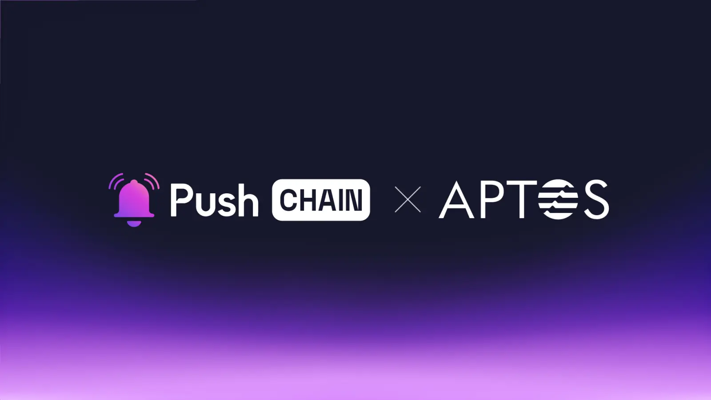

<!--truncate-->

Push Chain is pumped to join forces with Aptos!

This marks a giant leap in Push Chain’s march towards unifying web3 and enabling a shared universal app experience.

Learn what this announcement means for Aptos and Push Chain users, the use cases it unlocks, and how the collaboration benefits the greater Web3 ecosystem.

## What is Aptos?

[Aptos](https://aptosfoundation.org/) is a Layer 1 non-EVM blockchain renowned for its ultra-fast execution, parallel transaction processing, incredibly low gas fees, and serving as the foundation for some of the most popular consumer and financial applications.

With over 38.8 Million active addresses - Aptos is home to some of the most popular DeFi, Gaming and Consumer Apps like Stani, Merkle.trade, Cellana Fi, Chingari, Panora, Pancake Swap and many more.

## What is Push Chain?

Push Chain is a shared state blockchain for universal apps. It is a Proof of Stake (PoS) chain
built to allow developers to create universal apps and act as a shared settlement layer for multiple L1s, L2s, and L3s enabling transactions from any chain - any app and any user.

[Explore more about Push Chain here](https://push.org)

## Bringing Aptos to Push Chain

## **👥 What does this mean for Aptos and Push Chain Users?**

**Interact with any app on any other chain, without leaving Aptos.**

Push Chain empowers Aptos users to seamlessly interact with DApps, services, and protocols across any chain.

Thus eliminating the need for complex wallet setups and bridging, delivering a shared universal experience within the Aptos ecosystem.

For instance, with Push Chain - An Aptos user can trade ERC tokens on Uniswap, Participate in Polygon-based DAOs, create meme coins on Solana - without needing to leave Apto’s ecosystem comfort and learn new wallet systems.

**Enable shared experiences for all EVM and non-EVM Push Chain users on Aptos.**

As a universal settlement layer - Push Chain users belong to multiple L1, L2s and L3s - be it EVM or nonEVMs like Aptos and Solana.

With Push Chain’s native Fee and Wallet abstraction support - users from these wide varieties of chains can explore the rich Aptos Ecosystem and send transactions to any Move-based Apps without navigating multiple networks or managing multiple wallets - with zero or minimal learning curve.

## 👷‍♂️ What does this mean for builders?

**Build _Superfast_ Universal Apps**

Push Chain’s flexible architecture and its ability to allow transactions from any chain with sub-zero finality opens up a plethora of possibilities to build - Consumer, Financial and Mixed Financial Applications.

**Attract Universal Users.**

Aptos apps deployed on Push Chain can seamlessly open their doors to users from other EVM, and non-EVM chains and foster true shared experiences with Push Chain’s key innovations like - Shared State and Universal Smart Contracts.

[Learn more about Push Chain’s Innovations here](https://push.org/blog/innovations-by-push-chain/).

## 🔓 Use case unlock:

While the possibilities of this collaboration are limitless, here’s a quick list that touches on various use cases across various web3 segments that can be practically executed on Aptos with Push Chain.

**Universal Gaming:** - Multiplayer games like roulette, casinos and RPG games on Aptos can utilize Push Chain to bring users across different chains to compete together in a unified manner.

**Universal Prediction Markets:** - Where users from Aptos and other chains can collectively speculate on real-life events. Markets can aggregate liquidity from all chains simultaneously bringing more user traction and better yield opportunities.

**Universal AI Trading Agents:** AI agents can analyse and execute trades across both Move and EVM ecosystems, accessing liquidity from Aptos alongside other DEXs for optimal arbitrage and trading strategies.

**Shared RWAs:** - RWA Apps on Aptos like [Propbase](https://www.propbase.app/) can leverage Push Chain to provide shared state real estate tokenization and achieve unified RWA markets accessible to users from any blockchain.

**Cross Chain - Shared Liquid Staking:** Liquid Staking Apps like [Amnis Finance](https://amnis.finance/) can leverage Push Chain to provide cross-chain liquid staking and achieve unified staking positions across Aptos and other blockchain ecosystems. Users from any chain can stake their native tokens and use their liquid staking derivatives across all supported protocols.

**Shared Sate DEX:** - DEXs like [Cellana Finance](https://cellana.finance/) can leverage Push Chain to provide chain-agnostic Ve(3,3) governance and achieve unified liquidity management across multiple blockchain ecosystems.

**Unified Lending & Borrowing Apps:** Users from any chain can lend and borrow, addressing fragmented liquidity and enabling applications that act as universal liquidity hubs—taking liquidity from one chain and providing it to another.

**Cross-Chain Identity System:** - Leveraging PushID ( A unified user identity by Push Chain that spans every user wallet, both EVM and non-EVM) to build reputation systems that aggregate user activity across Aptos and other chains, creating unified web3 identities.

## 🌌 What does this mean for Web3?

**Unifying experiences by bringing users together.**

Push Chain isn’t here to replace networks or compete with any; instead, it aims to eliminate the fragmented state of Web3 by unifying settlement across all chains under one universal shared state, unlocking a seamless, interconnected Web3 experience.

_As we wrap up, the Push Notifications Protocol has some extra special news with Aptos!_

## 🔔 Push Notifications and Chat to support the Aptos Ecosystem

With our quest to make Push Communications Protocol the universal layer of communication, supporting any and every chain, we’re excited to expand our reach to Aptos!

Aptos users can soon - be able to communicate with each other using their wallets, form group chats and gated communities on Push Chat!

We’re also extending our notification support to Aptos Ecosystem enabling lightning-fast notifications to Aptos users.

## Next Steps

1. Follow [@PushChain on X](https://x.com/PushChain) to get the latest updates about Push Chain
2. Check out the [Push Chain Whitepaper](https://whitepaper.push.org/)\*\* for a detailed overview of the vision and the underlying technicalities.
3. Visit the [Push Chain Website](https://push.org/chain) to find a one-pager explanation of the vision.
4. [Push Chain Devnet](https://scan.push.org/) is running live on Proof-of-Stake network validators, storage and archival nodes. The network already supports consumer transactions as well.
5. [Push Chain Simulate Tx](https://simulate.push.org/) already provides a way for everyone to send tx from any chain using wallet abstraction.
6. For more questions join [Push Discord](https://discord.com/invite/pushprotocol). Our team would be glad to help you!
