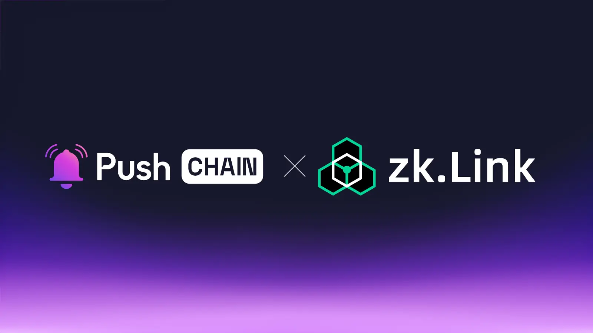

<!--truncate-->

Push Chain is pumped to join forces with zkLink!

A significant step for propelling our mission of enabling any user from any app to interact with any chain!

Learn what this announcement means for zkLink and Push Chain users, the use cases it unlocks, and how the collaboration benefits the greater Web3 ecosystem.

## What is zkLink?

[zkLink](https://zk.link/) is the world’s first ZK-powered Layer 3 solution that aggregates all EVM-compatible networks.

zkLink includes two prudent networks:

**[zkLink Nova](https://zklink.io/)**: A general-purpose Layer 3 rollup designed to resolve liquidity fragmentation across Ethereum Layer 2s by providing a shared aggregated settlement layer.

To date, zkLink Nova boasts over 26 Million Transactions with 1.3 million Unique Addresses, Aggregating over 17 networks!

**[zkLink X](https://zk.link/X)**: A highly customizable and secure application-specific rollup, optimized for trading-focused applications.

## What is Push Chain?

Push Chain is a shared state blockchain for universal apps. It is a Proof of Stake (PoS) chain
built to allow developers to create universal apps and act as a shared settlement layer for multiple L1s, L2s, and L3s enabling transactions from any chain - any app and any user.

[Explore more about Push Chain here](https://push.org)

## Bringing zkLink to Push Chain

## 👥 What does this mean for zkLink and Push Chain Users?

**Interact with any non-evm app, without leaving zkLink**

Push Chain extends the aggregation capabilities of zkLink enabling zkLink users to easily interact with and explore non-evm ecosystems like Solana, Aptos and Cosmos - all without leaving the operational comfort offered by zkLink.

No need to create new wallets, learn and follow complex bridging steps- simply utilize Push Chain to seamlessly interplay between zkLink and the non-evm ecosystem

**Unified Experience**

Since zkLink aggregates Ethereum networks and serves as a unified point of access, users from non-evm space can easily leverage Push Chain to explore and interact with EVM space- abstracting away all the manual complexities traditionally faced by non-EVM users when transacting on EVM chains.

All of the above with the advantage of - instant finality, security and superfast execution.

## 👷‍♂️ What does this mean for builders?

**Build super abstracted - shared settlement apps**

With shared settlement capabilities of Push Chain and zkLink - devs can build apps with powerful chain, fee and wallet abstraction capabilities - allowing transactions from any chain with near-instant finality.

**Build universally compliant consumer and mixed financial apps**

Push Chain introduces a new transaction type: **‘consumer transactions’**, where transaction ordering is not essential.

Why consumer tx?

Two major challenges hinder the scalability of consumer web3 apps:

- **Chain Fragmentation:** User bases are over-diversified across hundreds of chains, impeding user growth, UX and retention.
- **Scalability constraints** Most chains process transactions in a strictly ordered manner, which imposes unnecessary constraints on apps that don’t rely on transaction ordering.

This is where Push Chain’s Consumer Tx feature enables non-financial and consumer applications to operate with lightning-fast speed and hyper-scalability. Push Chain enables these apps to manage millions of users seamlessly across any chain environment.

[Learn more about Push Chain’s Innovations here](https://push.org/blog/innovations-by-push-chain/)

## 🔓 Use case unlock:

**Chain Agnostic AI Agents** - Push Chain’s universal shared state and ZKLink’s [application abstraction](https://blog.zk.link/zklink-research-roadmap-ai-agents-in-application-abstraction-fff297ef4577) pave the way for a new generation of chain-agnostic AI agents. These agents can perform autonomous operations in a borderless manner - unlocking a wide variety of financial, mixed financial, and non-financial use cases.

**Universal Domains** - Applications like [ZNS Connect](https://zns.bio/) can utilize Push IDs- ( A unified user identity by Push Chain that spans every user wallet, both EVM and non-EVM) to expand their domain capabilities with unified analytics, user footprint tracking and universal resolution.

**Unified Liquidity Markets** - EVM-bound liquidity markets like [Lido](https://lido.fi/), [Curve](https://curve.fi/#/ethereum/swap), and [Native](https://native.org/app/credit-pool/) can utilize fee and chain abstraction features of Push Chain to seamlessly allow non-evm Liquidity Providers to effortlessly participate in market-making opportunities within a few clicks with no extra UX overhead.

**Universal Prediction Markets** - Where users from zkLink and other chains can collectively speculate on real-life events. Markets can aggregate liquidity from all chains simultaneously bringing more user traction and better yield opportunities.

## **🌌** What does this mean for Web3?

**Unifying experiences by bringing users together.**

Push Chain isn’t here to replace networks or compete with any; instead, it aims to eliminate the fragmented state of Web3 by unifying settlement across all chains under one universal shared state, unlocking a seamless, interconnected Web3 experience.

## Next Steps

1. Follow [@PushChain](https://x.com/PushChain) on X to get the latest updates about Push Chain
2. Check out the [Push Chain Whitepaper](https://whitepaper.push.org/) for a detailed overview of the vision and the underlying technicalities.
3. Visit the [Push Chain Website](https://push.org/chain) to find a one-pager explanation of the vision.
4. [Push Chain Devnet](https://scan.push.org/?) is running live on Proof-of-Stake network validators, storage and archival nodes. The network already supports consumer transactions as well.
5. [Push Chain Simulate Tx](https://simulate.push.org/) already provides a way for everyone to send tx from any chain using wallet abstraction.
6. For more questions join [Push Discord](https://discord.com/invite/pushprotocol). Our team would be glad to help you!
