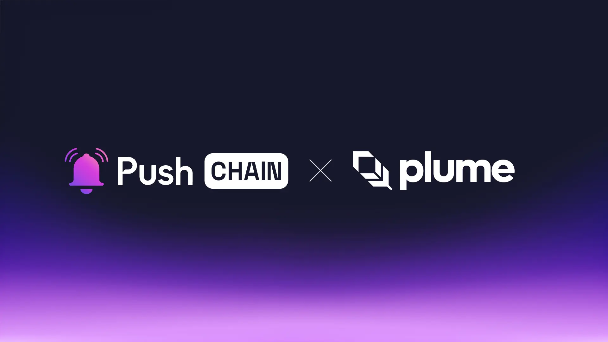

<!--truncate-->

Push Chain is set to revolutionize RWAfi by joining forces with Plume!

Learn what this announcement means for Plume and Push Chain users, the use cases it unlocks, and how the collaboration benefits the greater Web3 ecosystem.

## What is Plume?

[Plume](https://plumenetwork.xyz/) is a purpose-built layer 1 blockchain for tokenized Real World Assets (RWAs).

With an ecosystem of over 180 apps and over 3.75 Million users in its early testnet Plume brings RWAs into the on-chain digital economy.

With built-in AML compliance and a modular full stack architecture, Plume provides a super flexible platform for trading, financing, collateralizng RWAs for enhanced yield and market-making opportunities!

## What is Push Chain?

Push Chain is a shared state blockchain for universal apps. It is a Proof of Stake (PoS) chain
built to allow developers to create universal apps and act as a shared settlement layer for multiple L1s, L2s, and L3s enabling transactions from any chain - any app and any user.

[Explore more about Push Chain here](https://push.org)

## Bringing Plume to Push Chain

## 👥 What does this mean for Plume and Push Chain users?

**Borderless access for maximising yield opportunities**

Plume native users can access RWAfi instruments on any other EVM and non-EVM chains without leaving the operational comfort offered by Plume.

Via Push Chain’s shared settlement layer - Plume ecosystem users can easily lend, borrow and sell RWAs listed on Plume to any user belonging to any chain.
For instance - A Plume native user can trade their tokenized assets with a Solana native user.

**Easily onboard web2 normies**

With Push Chain’s wallet and fee abstraction - everyday internet users (web2 users) can be onboarded to the Plume ecosystem with minimal UX overhead - simply by using their social accounts like Google, Apple, Github, X and Discord.

**Unified Experience**

As a universal settlement layer - Push Chain users belong to multiple L1, L2s and L3s - be it EVM or nonEVMs like Aptos and Solana.

With Push Chain - users from these wide varieties of chains can explore the rich Plume Ecosystem and send transactions to any Plume Apps without navigating multiple networks or managing multiple wallets - with zero or minimal learning curve.

## 👷‍♂️ What does this mean for builders?

**Build universal RWAfi apps**

RWA-compliant apps deployed on Push Chain and Plume can be accessed and used by users belonging to any chain, eliminating chain fragmentation and complex bridging overhead while opening doors to users across all ecosystems.

**Build super scalable and super fast apps**

In addition to Push Chain’s transact from any chain capabilities - Push Chain provides super fast settlement with sub-second finality and theoretically, can be scaled infinitely due to its true scaling engine - that increases the write throughput (or TPS) linearly as the number of nodes grow - achieving **True scale.**

[Learn more about Push Chain’s Innovations here](https://push.org/blog/innovations-by-push-chain/).

## 🔓 Usecase Unlock:

**Unified RWA Vaults**

With Push Chain, RWA Staking aggregators like [Nest](https://nest.credit/) can provide aggregated yield vaults across all blockchain ecosystems. With chain abstraction and Universal Smart Contracts, non-native Plume users can stake in preferred stable coins which can then be settled for platform-specific stables.

**Universal Prediction Markets**

Markets like [Cultured](https://cultured.finance/) can leverage Push Chain to create unified betting markets accessible from any chain, enable cross-chain market making and liquidity, and attract more users while offering better yield opportunities.

**Unified data source**

[Nexus](https://docs.plumenetwork.xyz/plume/nexus-data-highway/overview) (Plume's data highway) can leverage Push Chain to distribute RWA data across all chains, enable universal price discovery and power cross-chain prediction markets

**Shared Lending RWAs**

RWA Apps on Plume like [Osprey](https://osprey.market/) and [MetaStreet](https://metastreet.xyz/) can leverage Push Chain to provide a unified shared state borrow/lending management encompassing all chains - enabling users from any chain to lend and borrow tokenized assets with ease.

## **🌌** What does this mean for Web3?

**Unifying experiences by bringing users together.**

Push Chain isn’t here to replace networks or compete with any; instead, it aims to eliminate the fragmented state of Web3 by unifying settlement across all chains under one universal shared state, unlocking a seamless, interconnected Web3 experience.

_Get ready! RWAfi is set to be accessible to any user from any app on any chain with Push Chain and Plume._

## Next Steps

1. Follow [@PushChain](https://x.com/PushChain) on X to get the latest updates about Push Chain
2. Check out the [Push Chain Whitepaper](https://whitepaper.push.org/)for a detailed overview of the vision and the underlying technicalities.
3. Visit the [Push Chain Website](https://push.org/chain) to find a one-pager explanation of the vision.
4. [Push Chain Devnet](https://scan.push.org/) is running live on Proof-of-Stake network validators, storage and archival nodes. The network already supports consumer transactions as well.
5. [Push Chain Simulate Tx](https://simulate.push.org) already provides a way for everyone to send tx from any chain using wallet abstraction.
6. For more questions join [Push Discord](https://discord.com/invite/pushprotocol). Our team would be glad to help you!
