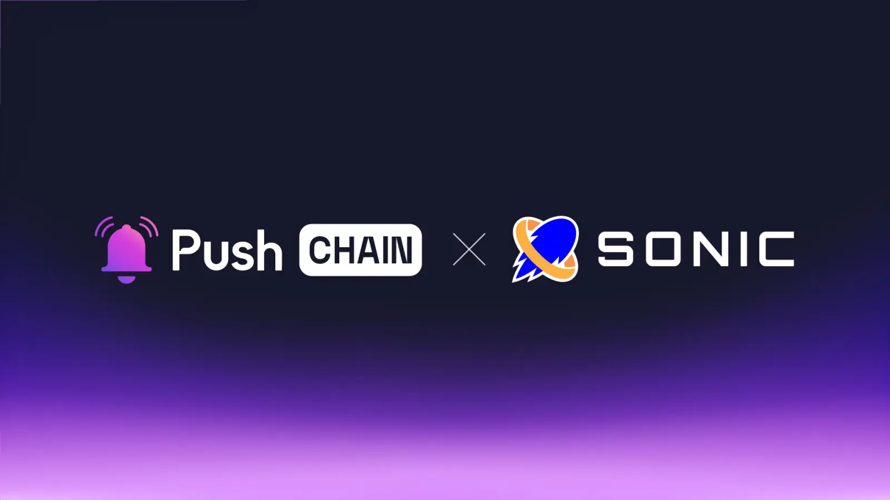

<!--truncate-->

Get Ready, Push Chain is set to transform web3 gaming by joining forces with Sonic!

Learn what this announcement means for Sonic and Push Chain users, the use cases it unlocks, and how the collaboration benefits the greater Web3 - gaming ecosystem.

## What is Sonic?

Built as the first atomic Solana Virtual Machine (SVM) chain, [Sonic](https://www.sonic.game/) is an L2 network specifically designed to enable sovereign game economies on Solana and deliver the fastest on-chain gaming experience among all gaming L1s.

With over 2.5 million active wallets and more than 4 million transactions on its Odyssey testnet, Sonic also excels in easily porting EVM dApps to SVM through its Interpreter Engine.

## What is Push Chain?

Push Chain is a shared state blockchain for universal apps. It is a Proof of Stake (PoS) chain built to allow developers to create universal apps and act as a shared settlement layer for multiple L1s, L2s, and L3s enabling transactions from any chain - any app and any user.

[Explore more about Push Chain here](https://push.org)

## 👥 What does this mean for Sonic and Push Chain users?

**Play on Sonic from any chain**

Push Chain supports transactions from any wallet, regardless of the originating chain—be it Solana, Ethereum, or any other L1s, L2s or L3s.

Players from any chain can play on games powered by Sonic - without setting new wallets or bridging funds!

**Superfast Transaction Finality - from any chain**

**Push Chain powers a new txn type - Consumer Transactions.**
These transactions are un-ordered in nature - specially suited for gaming and consumer usercases. Games deployed on Sonic can leverage consumer txns to execute millions of transactions from any blockchain in parallel- with sub-second finality. 

[Learn more about Push Chain’s Innovations here](https://push.org/blog/innovations-by-push-chain/).

## 👷‍♂️ What does this mean for Builders?

**Build universally accessible web3 games**

Devs can leverage Sonic’s [HyperGrid](https://www.sonic.game/hypergrid) interpreter to port EVM dApps and deploy them on Solana, enabling EVM users to seamlessly settle transactions on Solana.

Push Chain extends this interoperability by allowing dApps deployed on Push Chain and Sonic to be accessed and used by users from any EVM or non-EVM chain, including Aptos, Move, and Cosmos, through its shared settlement layer

**Build super abstracted apps:**

Building universally accessible apps is not easy, neither for the dev - nor for the user.

Push Chain solves this - using **Wallet and Fee Abstraction.**

Wallet abstraction provides a flexible, embeddable wallet experience enabling any wallet from any chain to connect, interact and transact with Push Chain.

Fee abstraction ensures that the user can pay the fees from the chain of their choice.

## Usecase unlock:

**Fully Onchain Games like [FoMoney](https://fomoney.io/)**, deployed on Sonic can leverage Push Chain to provide a universal gaming experience where players can participate using any blockchain wallet. With Push Chain’s Consumer Txns and Stateless Blocks - the game could handle instant moves and reward distributions across chains through parallel processing, while its shared state would enable unified leaderboards and prize pools. 

**Universal AI Trading Agents**

AI agent networks like [Delysium](https://www.delysium.com/) -  can interact and perform operations with other swarms of agents while executing trades across Solana, EVM and other no-EVMs. These agents can perform autonomous operations in a borderless manner - unlocking a wide variety of financial, mixed financial, and non-financial use cases.

**Universal Gaming Economy**

Sonic's gaming ecosystem including AAA games like [RageEffect](https://rageeffect.io/index.html) can leverage Push Chain to provide truly universal gaming experiences where tokens and gaming assets become accessible from any blockchain. Through Push Chain's shared state, players could use their preferred chain's wallet to participate in Sonic's gaming ecosystem.

**Cross-VM Gaming Infrastructure**

By combining Sonic's HyperGrid framework with Push Chain's [Universal Compatibility](https://push.org), games could achieve seamless interaction across EVM, SVM, and other VMs. This would enable gaming assets and achievements to be recognized and traded universally while maintaining Sonic's efficient settlement on Solana and leveraging Push Chain's stateless blocks for instant gaming actions.

## **🌌** What does this mean for Web3?

**Unifying experiences by bringing users together.**

Push Chain isn’t here to replace networks or compete with any; instead, it aims to eliminate the fragmented state of Web3 by unifying settlement across all chains under one universal shared state, unlocking a seamless, interconnected Web3 experience.

## Next Steps

1. Follow [@pushprotocol](https://x.com/pushprotocol) on X to get the latest updates about Push Chain
2. Check out the [Push Chain Whitepaper](https://whitepaper.push.org/?utm_source=pushblog&utm_medium=referral&utm_campaign=pcgov) for a detailed overview of the vision and the underlying technicalities.
3. Visit the [Push Chain Website](https://push.org/chain?utm_source=pushblog&utm_medium=referral&utm_campaign=pcgov) to find a one-pager explanation of the vision.
4. [Push Chain Devnet](https://scan.push.org/?utm_source=pushblog&utm_medium=referral&utm_campaign=pcgov) is running live on Proof-of-Stake network validators, storage and archival nodes. The network already supports consumer transactions as well.
5. [Push Chain Simulate Tx](https://simulate.push.org/?utm_source=pushblog&utm_medium=referral&utm_campaign=pcgov) already provides a way for everyone to send tx from any chain using wallet abstraction.