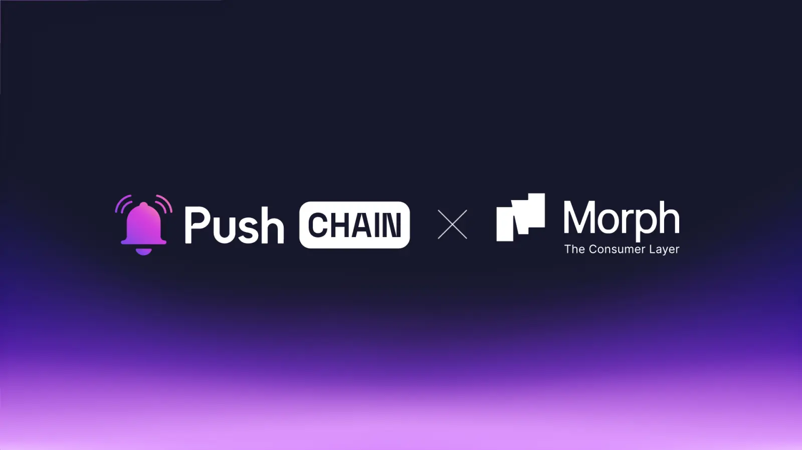

<!--truncate-->

Push Chain is about to facelift the consumer app experience by teaming up with Morph L2!

Learn what this announcement means for Morph and Push Chain users, the use cases it unlocks, and how the collaboration benefits the greater Web3 ecosystem.

## What is Morph?

[Morph](https://www.morphl2.io/) is a consumer app focused Ethereum Layer 2 solution that combines the best of Optimistic and ZK Rollups to provide a secure and super fast consumer experience.

With over 5M txns to date, Morph is rallying towards becoming the global consumer layer for empowering everyday on-chain usage for every internet user.

## What is Push?

Push Chain is a shared state blockchain for universal apps. It is a Proof of Stake (PoS) chain
built to allow developers to create universal apps and act as a shared settlement layer for multiple L1s, L2s, and L3s enabling transactions from any chain - any app and any user.

[Explore more about Push Chain here](https://push.org/chain/)

## Bringing Morph to Push Chain

## 👥 What does this mean for Morph and Push Chain Users?

**Borderless consumer App experience**

Morph users can expand their on-chain usage beyond EVMs into Solana and other nonEVMs without ever leaving Morph’s ecosystem and UX comfort.

**Bring web2 normies to consumer crypto**

With Push Chain’s wallet and fee abstraction - everyday internet users (web2 users) can easily experience Morph’s consumer crypto ecosystem with minimal UX overhead - simply by using their social accounts like Google, Apple, Github, X and Discord.

## 👷‍♂️ What does this mean for builders?

**Build hyper scalable universal consumer apps**

Push Chain empowers developers to build truly universal applications that work seamlessly across all blockchains.

Push unlocks hyper-scalability for consumer and mixed consumer apps that have potential of handling millions of daily users with its innovative '**Consumer Transactions**' feature, enabling stateless and unordered processing of non-value transfers like social interactions, content sharing, and game actions.

[Learn more about Push Chain’s Innovations here](https://push.org/blog/innovations-by-push-chain/).

**Read from any chain using shared settlement**

Push Chain's shared settlement layer provides a powerful foundation for apps on Morph to unlock shaped universal experiences with its ability to read state across any blockchain through its shared settlement layer. This means developers can focus on building engaging user experiences instead of managing complex cross-chain interactions.

## 🔓 Usecase Unlock:

**Universal ZK AI agents**

Privacy centric agentic networks like [Zypher](https://zypher.network/) can leverage Push Chain to expand its AI agents reach to any blockchain. Ensuring a Universal, secure and verifiable execution without exposing sensitive data.

**Universal Predication Markets**

Prediction markets like [Soccersm](https://soccersm.ai/ai-predictions) can not only house users from Morph but also from any other chains to collectively speculate on real-life events. Markets can aggregate liquidity from all chains simultaneously bringing more user traction and better yield opportunities.

**Universally Accessible token launchpads** - Like [Muffun](https://muffun.fun/board) on Morph, can utilize the Push Chain and Push Wallet to enable users from any chain (EVM or non EVM) to effortlessly launch tokens on Morph without leaving their existing wallet systems or manually bridge funds.

## Next Steps

1. Follow [@PushChain on X](https://x.com/PushChain) to get the latest updates about Push Chain
2. Check out the [Push Chain Whitepaper](https://whitepaper.push.org/) for a detailed overview of the vision and the underlying technicalities.
3. Visit the [Push Chain Website](https://push.org/chain) to find a one-pager explanation of the vision.
4. [Push Chain Devnet](https://scan.push.org/) is running live on Proof-of-Stake network validators, storage and archival nodes. The network already supports consumer transactions as well.
5. [Push Chain Simulate Tx](https://simulate.push.org/) already provides a way for everyone to send tx from any chain using wallet abstraction.
6. For more questions join [Push Discord](https://discord.com/invite/pushprotocol). Our team would be glad to help you!
