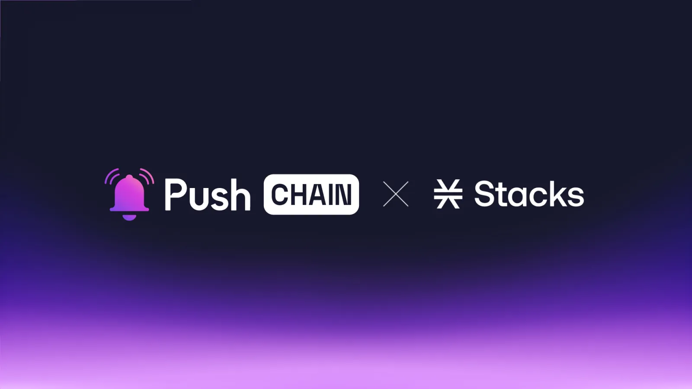

<!--truncate-->

Push Chain is building with Stacks to unlock accessibility to Bitcoin apps from any chain, any app, and any wallet.

Learn what this announcement means for Stacks and Push Chain users, the use cases it unlocks, and how the collaboration benefits the greater Web3 ecosystem.

## What is Stacks?

Built on top of Bitcoin, Stacks is a Layer 2 blockchain that brings general-purpose programmability to Bitcoin, enabling developers to create censorship-resistant apps while leveraging Bitcoin as a foundational settlement layer.

With its native language - ‘Clarity’ Stacks brings smart contracts to Bitcoin without altering its core, ensuring txns remain as secure & irreversible as on BTC.

## What is Push Chain?

Push Chain is a shared state blockchain for universal apps. It is a Proof of Stake (PoS) chain built to allow developers to create universal apps and act as a shared settlement layer for multiple L1s, L2s, and L3s enabling transactions from any chain - any app and any user.

[Explore more about Push Chain here](https://push.org/)

## Bringing Stacks to Push Chain

### 👥 What does this mean for Stacks and Push Chain Users?

**Explore EVM and Non-EVM ecosystems without leaving Bitcoin**

With Push Chain, Stacks native users can explore and access applications across any blockchain ecosystem without learning new complex wallet systems, all while maintaining their Bitcoin-native experience on Stacks.

**Tap into the Trillion Dollar Bitcoin economy**

Push Chain's integration with Stacks opens up Bitcoin's massive liquidity and market presence for users from any blockchain ecosystem. Users can now participate in Bitcoin-native applications, access BTC-denominated assets, and engage with Stacks' growing ecosystem via their preferred blockchain and wallet.

### 👷‍♂️ What does this mean for builders?

**Build Universal Bitcoin native Apps**

Apps deployed on Stacks and Push Chain can accept transactions from users belonging from any wallet belonging to any chain!

**Build *Superfast* Unified Apps**

Push Chain’s flexible architecture and its ability to allow transactions from any chain with sub-zero finality opens up a plethora of possibilities to build - Consumer, Financial, and Mixed Financial Applications.

[Learn more about Push Chain’s Innovations here](https://push.org/blog/innovations-by-push-chain/).

### 🔓 Usecase Unlock:

**Universal NFT Marketplaces**

NFT Marketplaces like [Gamma](https://gamma.io/) can open their gates for EVM and other Non-EVM NFT patrons enabling instant access, trade, and settlement!

**Borderless On-chain gaming**

Access Stacks’s rich gaming ecosystem including [ForcePrime](https://forceprime.io/) and [Skullco](https://www.skullco.in/) via any EVM/Non-EVM chains - using Push’s Shared Settlement and Consumer Txns!

**Shared State DEX:**

DEXs like [ALEX](https://app.alexlab.co/) can leverage Push Chain to provide access to Stacks and Bitcoin’s liquidity from users from any chain via their preferred wallets.

## 🌌 What does this mean for Web3?

**Unifying experiences by bringing users together.**

Push Chain isn’t here to replace networks or compete with any; instead, it aims to eliminate the fragmented state of Web3 by unifying settlement across all chains under one universal shared state, unlocking a seamless, interconnected Web3 experience.

## Next Steps

1. Follow [@PushChain on X](https://x.com/PushChain) to get the latest updates about Push Chain
2. Check out the [Push Chain Whitepaper](https://whitepaper.push.org/)\* for a detailed overview of the vision and the underlying technicalities.
3. Visit the [Push Chain Website](https://push.org/chain) to find a one-pager explanation of the vision.
4. [Push Chain Devnet](https://scan.push.org/) is running live on Proof-of-Stake network validators, storage and archival nodes. The network already supports consumer transactions as well.
5. [Push Chain Simulate Tx](https://simulate.push.org/) already provides a way for everyone to send tx from any chain using wallet abstraction.
6. For more questions join [Push Discord](https://discord.com/invite/pushprotocol). Our team would be glad to help you!
