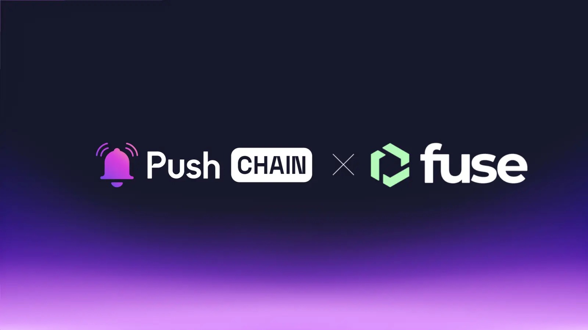

<!--truncate-->

Wondering how businesses can unlock Universal On-chain experiences?

Look no further!
Push Chain is joining forces with the Fuse Network to transform the way enterprises and users transact, operate, and flourish in the ever-expanding web3 economy.

Learn what this announcement means for Fuse and Push Chain users, the use cases it unlocks, and how the collaboration benefits the greater Web3 ecosystem.

## What is Fuse Network?

[Fuse](https://www.fuse.io/) is an Ethereum compatible public blockchain built for businesses and developers to access  web3 tech and secure, verifiable global payments.

Focusing on UX, ease of operation, accessibility and scalability, Fuse is built to onboard all types of enterprise users, from Web2 companies that want to integrate blockchain functionality into their apps, to Web3-native projects. 

## What is Push Chain?

Push Chain is a shared state blockchain for universal apps. It is a Proof of Stake (PoS) chain built to allow developers to create universal apps and act as a shared settlement layer for multiple L1s, L2s, and L3s enabling transactions from any chain - any app and any user.

[Explore more about Push Chain here](https://push.org/)

## Bringing Fuse to Push Chain

## 👥 What does this mean for Fuse and Push Chain Users?

**Borderless On-chain Business Txns**

Enabling on-chain transactions, whether monetary or non-monetary - between businesses from entirely different blockchain ecosystems is a complex process, burdened by communication overhead, intricate bridging, and settlement challenges.

Push Chain abstracts this burden away by unifying the settlements of any EVM and non-evm chains - providing Fuse users a super smooth and quick any-chain transaction experience without leaving the Fuse ethos.

**Unified Invoicing and Accounting**

Enterprise apps on Fuse Chain can leverage Push Chain’s universal identity solution, Push ID, to track and monitor spending and invoicing across addresses in a unified manner by linking them to Push ID.

[Learn more about Push Chain’s Innovations here](https://push.org/blog/innovations-by-push-chain/).

## 👷‍♂️ What does this mean for builders?

**Build Universally Abstracted Enterprise Apps**

With shared settlement capabilities of Push Chain  - devs can build enterprise apps with powerful chain, fee and wallet abstraction capabilities - allowing transactions from any chain with near instant finality.

**Attract Universal Users**

Fuse apps deployed on Push Chain can seamlessly open their doors to users from other EVM, and non-EVM chains and foster true shared experiences with Push Chain’s key innovations like - Shared State and Universal Smart Contracts.

## 🔓 Usecase unlock

**Universal Growth Tools**

Tools like [Midle](https://midle.io/) can leverage Push Chain to create comprehensive growth campaigns combining both on-chain and off-chain tasks, verifiable and accessible from any blockchain. Users can participate using their preferred wallets, complete tasks on any chain, and receive instant rewards on their chosen network.

**Universal B2B / B2C Threat Monitoring Services** 

Security monitoring solutions like [Ironblocks](https://www.ironblocks.com/) and utilize Push Chain for powering a universal security monitoring system that protects assets and transactions across all blockchain ecosystems simultaneously. For instance, if a security threat is detected for a cross-chain wallet on one chain, the system could instantly broadcast alerts and implement protective measures across all connected chains creating a unified security perimeter where threats are identified, tracked, and mitigated instantly.

**Universal AI Trading Agents**

AI agents can analyse and execute trades across both Fuse and other chains unifying liquidity for optimal arbitrage, yield and trading strategies.

## 🌌 What does this mean for Web3?

**Unifying experiences by bringing users together.**

Push Chain isn’t here to replace networks or compete with any; instead, it aims to eliminate the fragmented state of Web3 by unifying settlement across all chains under one universal shared state, unlocking a seamless, interconnected Web3 experience.

## Next Steps

1. Follow [@PushChain on X](https://x.com/PushChain) to get the latest updates about Push Chain
2. Check out the [Push Chain Whitepaper](https://whitepaper.push.org/) for a detailed overview of the vision and the underlying technicalities.
3. Visit the [Push Chain Website](https://push.org/chain) to find a one-pager explanation of the vision.
4. [Push Chain Devnet](https://scan.push.org/) is running live on Proof-of-Stake network validators, storage and archival nodes. The network already supports consumer transactions as well.
5. [Push Chain Simulate Tx](https://simulate.push.org/) already provides a way for everyone to send tx from any chain using wallet abstraction.
6. For more questions join [Push Discord](https://discord.com/invite/pushprotocol). Our team would be glad to help you!
