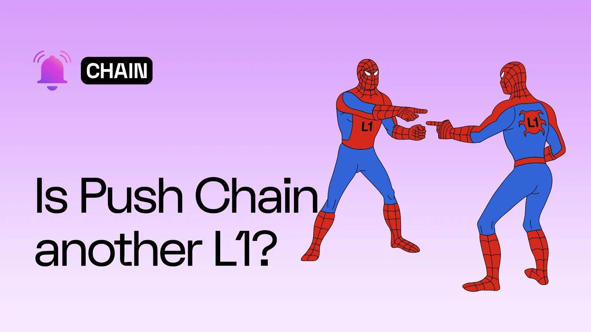

<!--truncate-->

### The Curious

At crypto conferences I'm often asked how our approach at Push differs from other L1 projects. And at normie gatherings I'm asked which crypto is best for starters. Until now I used to think of these as two distinct questions coming from two distinct audiences, i.e. technical and non-technical. My responses were conditioned by this assumption. At the former I used to talk about our '[shared state](https://push.org/blog/innovations-by-push-chain/)' approach and how it is distinguishable from interoperability (more on that below and in subsequent articles). And to the normies I used to suggest that starting-points can be subjective because different projects are trying to do different things. Some for instance are building reliable forms of decentralised cash, while others are trying to democratise the financial system. Still others are trying to get social media out of the hands of big tech, and a lot of them are just having fun.

The problem with my approach was that it left out the real audience: the 'web3 curious'. This is a huge category which cannot be ignored, and I'm going to define it rather broadly as those people who have heard of crypto and played around with it a bit [without digging deeper](https://push.org/blog/why-push-chain/). You could say the real reason why they got into the whole thing was quick money. But in order for that to happen I feel they must _at some level believe_ in the larger crypto project. To put it differently, _even if_ they thought they were playing around with 'magic internet money', some part of them must have known that the magic was real (or had the potential of _becoming_ real). That's the part of the collective psyche we need to reach.

### Ecosystem Abstraction

To return to the earlier point, I now feel that both audiences were asking me the same thing in different ways, i.e. _which ecosystem?_ It's often said that a few years in crypto equals decades in the real world. To me this was never a throwaway sentiment but a profound ground-truth about our industry. When crypto was just starting out people used to debate whether it had 'inherent value' and whether it could ever become 'money'. Those questions have more or less disappeared today because most people have concluded that it does. Thanks to the SEC, the critical regulatory question today seems to be whether a particular crypto is a [security](https://www.forbes.com/sites/digital-assets/2023/08/14/how-the-secs-charge-that-cryptos-are-securities-could-face-an-uphill-battle/) or not. But of course it took humanity more than a thousand years to get from money to finance.

The lesson we can draw from this is that the forms of '[crypto tribalism](https://medium.com/@adamnite/a-history-of-crypto-tribalism-11f9f9c5cbaf)' we see today are comparable to [historical tribes](https://www.wideopenspaces.com/native-american-totem-animals-origins-totem-poles-meaning/) who hitched their identity to particular totems and money-objects. We took a giant leap when we adopted the human-first-tribe-later perspective. This allowed us to _abstract away particular ecosystems_ and develop a more global outlook. Of course I am not suggesting that our particular cultural attributes disappeared with modernity, but rather that they were preserved within a more ['universal' wrapper](https://www.notion.so/Is-Push-Chain-another-L1-188188aea7f4801a8e5dc22d0c20e0f3?pvs=21).

### Cities & Bridges

Simply put, ‘ecosystem abstraction’ is my general response to both questions posed above. I see it as [an ongoing process](https://thenetworkstate.com/) that Push aims to accelerate -- comparable perhaps to globalisation which aims to overcome national boundaries -- rather than as a quantifiable end state. What this means in concrete terms is that we are building a non-competitive L1 that does not distinguish between normies and crypto-natives.

Why, you wonder? Because it’s the [final ecosystem barrier](https://push.org/blog/what-is-consumer-crypto-and-why-does-it-matter/) standing between us and mass adoption. Moreover, it allows us to approach technical problems with a fresh perspective. Consider interoperability. By and large it means two things in crypto: unifying different chains via bridges and developing common standards. The first is a necessary, but more importantly, _organic_ approach because bridges between two parts of a city aren't built unless there is significant traffic between them. The trouble right now is that the two sides are run by different municipal authorities, and every time you have to cross between them you must take fresh authorisation from an agent who operates a toll booth.

Now if this were a real city the citizens would petition the Mayor and get things changed. They would most likely ask for a monthly ticket and some sort of [‘fast tag’](https://en.wikipedia.org/wiki/FASTag) on their cars which could automatically calculate and deduct the toll-fees from their wallets. But crypto is decentralised and there is no Mayor to petition. So for us the only solution is to get both municipal authorities to agree on a system for quick and trustworthy communication. Moreover, if both sides have different ticketing systems then they would need to develop a common ticketing standard which is mutually recognised.

### Necessity-led invention

In crypto, the reason why interoperability is an especially difficult problem to crack is because it requires unbroken coordination and synchronicity between different ecosystems. With every new chain that is added to the mix, the patchwork expands and becomes more unwieldy. It is therefore legitimate for people to wonder whether we are ‘another L1’ which is ultimately going to increase this messiness.

The short answer is no: Push is not building its own separate municipality in its own corner of the city. Instead we are building systems (such as [solver networks and fees quotas](https://whitepaper.push.org/)) through which bridge-operators can communicate and coordinate. Imagine if a [tourist](https://www.notion.so/189188aea7f480faaba5f80052406759?pvs=21) was visiting the city and wanted to pass through three different bridges in a single drive. The bridge-operators would need to reach consensus on various things including: (a) does he have enough money for all the tolls? (2) is he a legitimate (non-malicious) actor, and (c) has he received necessary permissions from the respective Mayors of the source and destination cities, etc.

In the context of crypto these steps are reducible to verifiable cross-chain communications, and because Push has been working on this problem from its origin, it is uniquely positioned to create such a system. In other words, the move towards Push Chain was driven by the realisation that we had to do our bit to move the needle on interoperability, not in order to create our own fragmented ecosystem.

Personally, what is most exciting for me is thinking about the new use-cases that such a cross-chain-communication-grid unlocks. Imagine if an _Aurory_ or _Star Atlas_ player is able to leverage Uniswap or Polymarket through in-game intent solvers, or if an artist is able to launch NFTs of their work simultanously across Opensea, Magic Eden and Jpg.store. Here's how my friend and colleague Zee put it in a recent conversation: "we're trying to build systems where people can use their favourite apps on their favourite chains without friction or second thought."

Yes it's an ambitious road, but we're determined.

LFPush!
