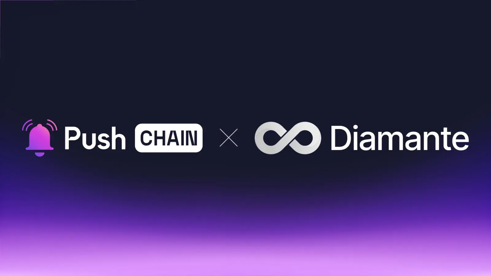

<!--truncate-->

Push Chain 🤝 Diamante

Push is proud to partner with Diamante - A high-speed, quantum-attack-resistant L1 to forge a unified shared app experience for both, retail and institutional users!

## **What is Diamante?**

[Diamante](https://www.diamante.io/) is a hybrid Layer1 blockchain that connects institutional and retail applications under one ecosystem with blazing-fast execution, quantum-proof security, and super smooth UX.

With extra emphasis on its chain’s security - Diamante employs quantum-resistant algorithms to fortify its network against quantum threats!

## What is Push Chain?

Push Chain is a shared state blockchain for universal apps, powered by **Chain Abstraction**. It is a Proof of Stake (PoS) chain that allows developers to create universal apps and act as a shared settlement layer for multiple L1s, L2s, and L3s enabling transactions from any chain - any app and any user.

[Explore more about Push Chain here](https://push.org/)

## Bringing Diamante to Push Chain

## 👥 What does this mean for Diamante and Push Chain Users?

**Universally accessible on-chain institutions**

Institutions thriving on Diamante can unlock a chain-less business experience that helps them to transact, and operate with its customers/clients in a chain-abstracted manner. 

Thus, removing the need for any complex compliance measures for cross-chain transactions. All without leaving the ecosystem comfort offered by the Diamante chain.

**Unified web3 experiences**

As a universal settlement layer - Push Chain users belong to multiple L1, L2s and L3s - be it EVM or non-EVMs like Aptos and Solana.

With Push Chain - users from these wide varieties of chains can explore the rich Diamante Ecosystem and send transactions to any Diamante Apps without navigating multiple networks or managing multiple wallets - with zero or minimal learning curve!

## 👷‍♂️ What does this mean for builders?

**Build super abstracted - shared settlement institutional and consumer DApps**

With shared settlement capabilities of Push Chain and Diamante - devs can build apps with powerful chain, fee and wallet abstraction capabilities - allowing transactions from any chain with near-instant finality.

**Build universally compliant consumer and mixed financial apps**

Push Chain introduces a new transaction type: **‘consumer transactions’**, where transaction ordering is not essential.

Why consumer tx? 

Two major challenges hinder the scalability of consumer web3 apps:

- **Chain Fragmentation-** User bases are over-diversified across hundreds of chains, impeding user growth, UX and retention.
- **Scalability constraints-** Most chains process transactions in a strictly ordered manner, which imposes unnecessary constraints on apps that don’t rely on transaction ordering.

This is where Push Chain’s Consumer Tx feature enables non-financial and consumer applications to operate with lightning-fast speed and hyper-scalability. Push Chain enables these apps to manage millions of users seamlessly across any chain environment.

[Learn more about Push Chain’s Innovations here](https://push.org/blog/innovations-by-push-chain/).

## **🔓 Use case unlock:**

**Unified Compliance Solutions-** Crypto KYC Services like [HyperSign](https://www.notion.so/17c188aea7f480fca231d69da721208d?pvs=21) can unlock wider distribution by providing their Crypto KYC services across any app belonging form any chain (evm or non-evm) by using Push’s Shared Settlement and Consumer Txn support.

**Universal GameFi-** - Game Studios and Launchpads like [Mon Protocol](https://www.notion.so/17c188aea7f480fca231d69da721208d?pvs=21) and [Isotopic](https://isotopic.io/) can leverage Push Chain to build **Universally Playable On-chain Games (UPOGs)**, supporting users from any chain with the power of Universal Smart Contracts and Any chain Consumer Transactions - providing sub-second finality and any chain compatibility.

## 🌌 What does this mean for Web3?

**Unifying experiences by bringing users together.**

Push Chain isn’t here to replace networks or compete with any; instead, it aims to eliminate the fragmented state of Web3 by unifying settlement across all chains under one universal shared state, unlocking a seamless, interconnected Web3 experience.

## Next Steps

1. Follow  [@PushChain on X](https://x.com/PushChain) to get the latest updates about Push Chain
2. Want to build on Push Chain? Explore the docs and example snippets here → [Push Chain Docs](https://push.org/docs/chain/)
3. Visit the [Push Chain Website](https://push.org/chain?utm_source=pushblog&utm_medium=referral&utm_campaign=pcgov) to find a one-pager explanation of the vision.
4. Check out the [Push Chain Whitepaper](https://whitepaper.push.org/?utm_source=pushblog&utm_medium=referral&utm_campaign=pcgov) for a detailed overview of the vision and the underlying technicalities.
5. [Push Chain Devnet](https://scan.push.org/?utm_source=pushblog&utm_medium=referral&utm_campaign=pcgov) is running live on Proof-of-Stake network validators, storage and archival nodes. The network already supports consumer transactions as well.
6. [Push Chain Simulate Tx](https://simulate.push.org/?utm_source=pushblog&utm_medium=referral&utm_campaign=pcgov) already provides a way for everyone to send tx from any chain using wallet abstraction.